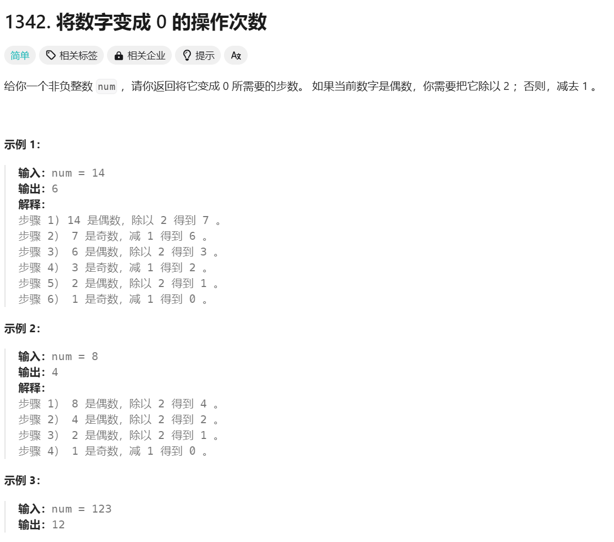
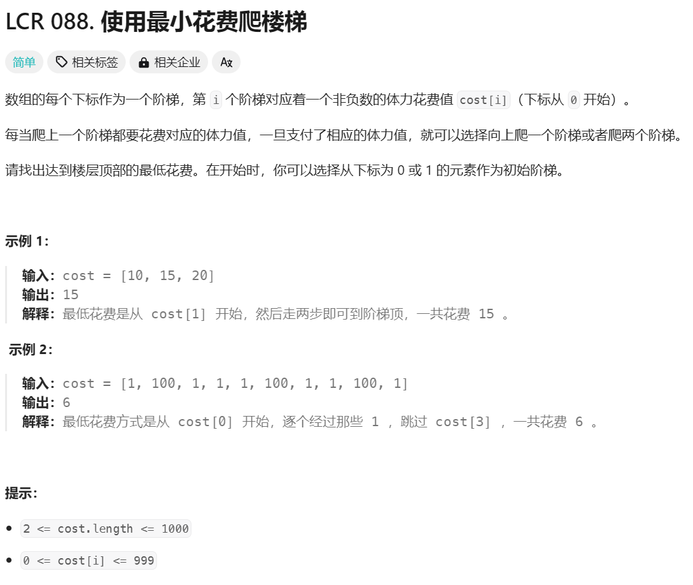
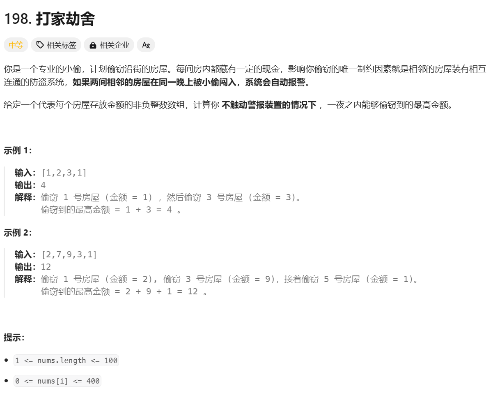

# 动态规划

!!! info "参考视频"
    https://www.bilibili.com/video/BV1aa411f7uT/

## 一般流程
1. **定义子问题**: 将原问题分解为相互重叠的子问题，设计出各种状态
2. **写出子问题的递推关系**: 找出子问题之间的关系，并写出递推公式。
3. **确定边界条件**: 找出最小子问题的解，并作为递推的起点。
4. **自底向上求解**: 从边界条件开始，逐步求解更大的子问题，直到得到原问题的解。

总结，有点像数逻中学过的有限状态机。

## 题目

### 阶乘

如何用动态规划计算阶乘？
??? tip "解"
    ```cpp
    int f[11]//假设要算到11
    void init(){
        memset(f,-1,sizeof(f));
    }
    int fact(int n){
        if(f[n] == -1){
            f[n]=n>0? n*f[n-1]:1;
        }
        return f[n];
    }
    ```

### 走方格

在一个n*n的方格中，小明站在左上角，他只能向右走一步或者向下走一步。问走到第(i,j)位置有几种走法？

??? tip "解"
    定义f为存储了走法种数的二维数组。f[i][j]=f[i-1][j]+f[i][j-1].f[0][0]=0.
    ```cpp
    #include <iostream>
    #include <vector>
    
    using namespace std;
    
    // 计算从左上角到达(i, j)位置的走法数
    int countPaths(int n) {
        // 创建一个二维数组来存储走法数
        vector<vector<int>> f(n, vector<int>(n, 0));
    
        // 初始化第一行和第一列
        for (int i = 0; i < n; ++i) {
            f[i][0] = 1;
            f[0][i] = 1;
        }
    
        // 填充数组
        for (int i = 1; i < n; ++i) {
            for (int j = 1; j < n; ++j) {
                f[i][j] = f[i-1][j] + f[i][j-1];
            }
        }
    
        // 返回到达右下角的走法数
        return f[n-1][n-1];
    }
    
    int main() {
        int n;
        cout << "请输入方格的大小 n: ";
        cin >> n;
    
        int result = countPaths(n);
        cout << "从左上角到右下角的走法数是: " << result << endl;
    
        return 0;
    }
    ```
### 爬台阶


??? tip "解析"
    很简单的题。
    ```cpp
    class Solution {
    public:
        int climbStairs(int n) {
            int f[46];
            f[0]=1;
            f[1]=1;
            if (n==1)
                return 1;
            for (int i=2;i<=n;i++){
                f[i]=f[i-1]+f[i-2];
            }
            return f[n];
        }
    };
    ```

### 将数字变成0的操作次数



??? general "解析"
    也是很简单的思路。
    ```cpp
    class Solution {
        int f[1000001];

    public:
        int numberOfSteps(int num) {
            f[0] = 0;
            f[1] = 1;
            if (num == 0)
                return 0;
            else if (num == 1)
                return 1;
            else {
                for (int i = 2; i <= num; i++) {
                    if (i % 2 == 0) {
                        f[i] = f[i / 2] + 1;
                    } else {
                        f[i] = f[i - 1] + 1;
                    }
                }
                return f[num];
            }
        }
    };
    ```
    其实还有更优思路，比如根据题意可以推算出，最终步数应该为num的二进制最后一位的数+（其他每一位的数+1）。

    + 以14为例子，二进制为1110，结果1+1 + 1+1 + 1+1 + 0 = 6。
    
    + 以8为例子，二进制为1000，结果1+1 + 0+1 + 0+1 + 0 = 4。

### 爬楼梯的最小花费



??? general "解析"
    也是很直接的一道题。任何一个台阶可以从它下面一级台阶和下面两级台阶跳上来，比较一下即可。

    ```cpp
    class Solution {
        int mincost[1001];
    public:
        int minCostClimbingStairs(vector<int>& cost) {
                mincost[0]=0;
                mincost[1]=0;
                int k=cost.size();
                for(int i=2;i<=k;i++){
                    mincost[i]=min(mincost[i-1]+cost[i-1],mincost[i-2]+cost[i-2]);
                }
            
            return mincost[k];
        }
    };
    ```

### 打家劫舍



??? general "解析"
    第一个房子:最大值必然是nums[0];

    第二个房子：最大值必然是nums[0],nums[1]中的较大者。

    第i个房子：最大值要么来自于抢第i个房子，值为f[i-2]+nums[i]，要么不抢第i-1个房子，值为f[i-1].

    ```cpp
    class Solution {
        int f[101];//到第i个房子的时候能获得的最大价值
    public:
        int rob(vector<int>& nums) {
            f[0]=nums[0];
            int k=nums.size();
            for (int i=1;i<k;i++){
                if(i==1){
                    f[1]=max(nums[0],nums[1]);
                }
                else{
                    f[i]=max(f[i-2]+nums[i],f[i-1]);
                }
            }
            return f[k-1];
        }
    };
    ```

### 打家劫舍II


??? general "解析"
    我的思路很简单。既然头和尾不能都选，那我就算两种情况下的最大值:去头和去尾。在每种情况内部，是和上面那道题一样的。最后比较大小即可。
    ```cpp
    class Solution {
        int f1[101];
        int f2[101];
    public:
        int rob(vector<int>& nums) {
            f1[0]=nums[0];
            int k=nums.size();
            if(k>1)
                f2[0]=nums[1];
            else
                return nums[0];
            for (int i=1;i < k-1;i++){
                if(i==1){
                    f1[1]=max(nums[0],nums[1]);
                }
                else{
                    f1[i]=max(f1[i-2]+nums[i],f1[i-1]);
                    }
                }
            for (int i=2;i < k;i++){
                if(i == 2){
                    f2[1]= max(nums[1],nums[2]);
                }
                else{
                    f2[i-1]=max(f2[i-3]+nums[i],f2[i-2]);
                    }
                }
            return max(f1[k-2],f2[k-2]);
        }
    };
    ```