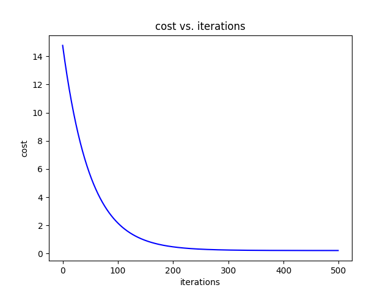
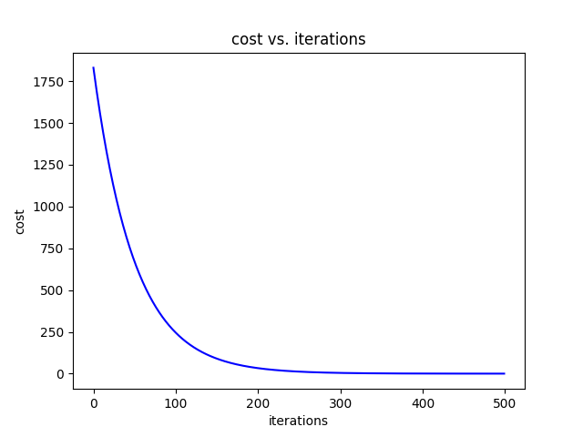
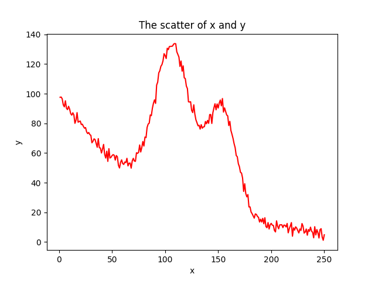
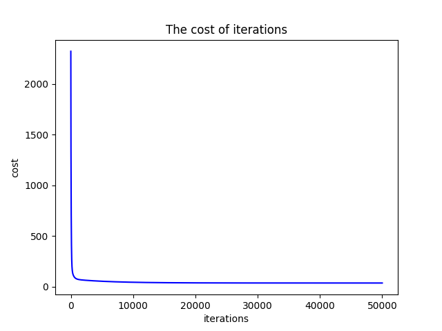
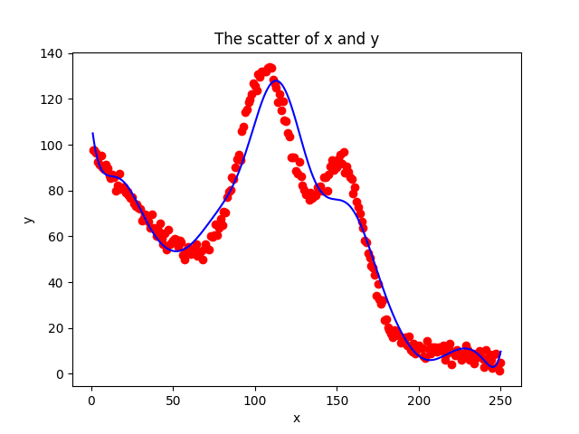

<link rel="stylesheet" type="text/css" href="../../../css/styles.css">

# Machine Learning

!!! info "参考"
    https://www.bilibili.com/video/BV1PN4y1V7d9/

抛去无意义的话，直接进入正题。

## 引入

假设我需要向银行借钱，银行根据我的年龄($x_1$),工资($x_2$),来决定贷款的额度(h)。

这相当于在一个空间直角坐标系中，拟合出一个最合适的平面。

记拟合的平面为$h_{\theta}(x) = \theta_0 +\theta_1 x_2+\theta_2 x_2$

记$\mathbf{x} = \begin{bmatrix}
1 \\
x_1 \\
x_2
\end{bmatrix}$,$\mathbf{\theta} = \begin{bmatrix}
\theta_0 \\
\theta_1 \\
\theta_2
\end{bmatrix}$,则$h_{\theta}(x)=\theta^T x$

此外，我们还需要定义一个误差项$\epsilon$,因此现在对于每一个我们已知的样本点，如果用y来表示实际值，$y^{(i)}=\theta^T x^{(i)} + \epsilon^{(i)}$ 

对于误差$\epsilon^{(i)}$, 有如下性质：

1. **独立**：张三和李四都来贷款，他们俩能借到多少钱相互之间无关 -- 数据之间独立

2. **同分布**：他俩都得去同一家银行 -- 数据服从相同的概率分布，即每个误差项$\epsilon^{(i)}$都来自相同的分布。

3. **标准正态分布**：误差服从均值为0且方差为$\sigma^2$的正态分布，可以表示为：
   $
   x \sim \mathcal{N}(0, \theta^2)
   $

## 似然函数

对于上面的案例，由于误差服从正态分布，其密度函数为$f(\epsilon^{(i)})=\frac{1}{\sqrt{2 \pi \sigma^2}} \exp\left(- \frac{(\epsilon^{(i)})^2}{2 \sigma^2}\right)$

我们用$y, x$来表示$\epsilon$，于是得到$f(y^{(i)}|x^{(i)}, \theta)= \frac{1}{\sqrt{2 \pi \sigma^2}} \exp\left(- \frac{(y^{(i)} - \theta^T x^{(i)})^2}{2 \sigma^2}\right)$

### 似然函数定义
似然函数表示为所有观测值的联合概率密度函数

$$L(\theta) = \prod_{i=1}^{n} f(y^{(i)}|x^{(i)}, \theta) = \prod_{i=1}^{n} \frac{1}{\sqrt{2 \pi \sigma^2}} \exp\left(- \frac{(y^{(i)} - \theta^T x^{(i)})^2}{2 \sigma^2}\right)$$

### 对数似然函数
有时为了简化计算，我们会取一个对数。

$$\ell(\theta) = \log L(\theta) = \sum_{i=1}^{n} \log \left( \frac{1}{\sqrt{2 \pi \sigma^2}} \exp\left(- \frac{(y^{(i)} - \theta^T x^{(i)})^2}{2 \sigma^2}\right) \right)$$

进一步简化对数似然函数：

$$\ell(\theta) = n \log{\frac{1}{\sqrt{2 \pi} \sigma}} - \frac{1}{2\sigma ^2} \sum_{i=1}^n((y^{(i)} - \theta^T x^{(i)})^2)$$

现在再回过头来思考一下，我们的目的是什么呢？就是让似然函数越大越好。考虑上式中的变量，我们只需要让$\frac{1}{2}\sum_{i=1}^n((y^{(i)} - \theta^T x^{(i)})^2)$越小越好.

不妨记$J(\theta) = \frac{1}{2}\sum_{i=1}^n((y^{(i)} - \theta^T x^{(i)})^2)$

$$J(\theta) = \frac{1}{2} \sum_{i=1}^{m} (h_\theta(x^{(i)}) - y^{(i)})^2 = \frac{1}{2} (X\theta - y)^T (X\theta - y)$$

对$\theta$ 求偏导： 

$$\nabla_\theta J(\theta) = \nabla_\theta \left( \frac{1}{2} (X\theta - y)^T (X\theta - y) \right) $$

$$= \nabla_\theta \left( \frac{1}{2} (\theta^T X^T X \theta - \theta^T X^T y - y^T X \theta + y^T y) \right)$$

$$= \frac{1}{2} \nabla_\theta \left( \theta^T X^T X \theta - \theta^T X^T y - y^T X \theta + y^T y \right)$$

$$= X^T X \theta - X^T y$$

要求极值点，因此偏导为0

$$\therefore \theta = (X^T X)^{-1} X^T y$$

## 梯度下降

上面的似然函数推导听上去很美好，X，Y都是已知的，我们只需要
代进去就能得出$\theta$，然而,$X^T X$并不总是可逆的，这就意味着
我们不能直接得出$\theta$的值。因此，需要引入梯度下降的概念。

### 概念
机器学习的主要目的是通过迭代地调整模型参数，以最小化损失函数。因为有许多目标函数是不可解的，因此，需要梯度下降的思想。

### 做法

梯度在数学的学习中都已经接触过，是一个多元函数在某点处变化最快的方向和速率，是一个向量，也是我们常说的方向导数。

假设现在我们的目标函数是$J(\theta)= \frac{1}{2m} \sum^m_{i=1}(y^i - h_{\theta}(x^i))^2$，初始先随机取$\theta$的值，为了不断更新$\theta$来让预测值和真实值更接近，有如下方法

#### 批量梯度下降 (Batch Gradient Descent)
批量梯度下降使用整个训练集来计算梯度更新。

公式：

$$\frac{\partial J(\theta)}{\partial \theta_j} = -\frac{1}{m} \sum_{i=1}^{m} (y^i - h_{\theta}(x^i) )x^i_j$$

$$\theta^{\prime}_j= \theta_j - \alpha \frac{1}{m} \sum_{i=1}^{m} (h_{\theta}(x^i) - y^i)x^i_j$$

解释：

- $\theta$：参数向量
- $\alpha$：学习率
- $m$：训练样本的数量
- $h_{\theta}(x^i)$：模型的预测值
- $y^i$：某个真实值
- $x^i$：某个输入特征向量
- $x^i_j$:某个输入向量与参数$\theta_j$相匹配的

#### 随机梯度下降 (Stochastic Gradient Descent)
随机梯度下降每次只使用一个训练样本来更新参数。

公式：

$$\theta^{\prime}_j= \theta_j - \alpha (h_{\theta}(x^i) - y^i)x^i_j$$

解释：

- $\theta$：参数向量
- $\alpha$：学习率
- $h_{\theta}(x^i)$：模型的预测值
- $y^i$：某个真实值
- $x^i$：某个输入特征向量
- $x^i_j$:某个输入向量与参数$\theta_j$相匹配的

#### 小批量梯度下降 (Mini-batch Gradient Descent)
小批量梯度下降使用一小部分训练样本（称为小批量）来计算梯度更新。

公式：

$$\theta^{\prime}_j= \theta_j - \alpha \frac{1}{b} \sum_{i=1}^{b} (h_{\theta}(x^i) - y^i)x^i_j$$

解释：

- $\theta$：参数向量
- $\alpha$：学习率
- $b$：小批量的样本数量
- $h_{\theta}(x^i)$：模型的预测值
- $y^i$：某个真实值
- $x^i$：某个输入特征向量
- $x^i_j$:某个输入向量与参数$\theta_j$相匹配的


需要说明一下的是，学习率相当于是每次参数更新的步长大小，因为我们算出来的梯度只是在某一点的方向导数，并不能代表全部，所以更新的学习率需要仔细考虑。


---


## 线性回归模型实战

### Normalize

Normalize就是将数据进行像正态分布一样的处理。

标准化的数学公式如下：

$$
z = \frac{x - \mu}{\sigma}
$$

其中：

- \(x\) 为原始数据，

- \(\mu\) 为数据的均值，

- \(\sigma\) 为数据的标准差。

标准化通过减去均值并除以标准差，将数据转换为均值为0，标准差为1的正态分布。

```python title="Normalize"
import numpy as np


def normalize(features):

    features_normalized = np.copy(features).astype(float)

    # 计算均值
    features_mean = np.mean(features, 0)

    # 计算标准差
    features_deviation = np.std(features, 0)

    # 标准化操作
    if features.shape[0] > 1:
        features_normalized -= features_mean

    # 防止除以0
    features_deviation[features_deviation == 0] = 1
    features_normalized /= features_deviation

    return features_normalized, features_mean, features_deviation
```

### Sinusoids

生成正弦波特征

```python title="sinusoids"
import numpy as np


def generate_sinusoids(dataset, sinusoid_degree):
    """
    生成正弦波特征。
    """
    # 获取数据集中的样本数量
    num_examples = dataset.shape[0]
    # 初始化一个空数组，用于存储生成的正弦特征
    sinusoids = np.empty((num_examples, 0))

    # 生成指定次数的正弦特征
    for degree in range(1, sinusoid_degree + 1):
        # 计算正弦值
        sinusoid_features = np.sin(degree * dataset)
        # 将新生成的正弦特征连接到 sinusoids 数组的列方向上
        sinusoids = np.concatenate((sinusoids, sinusoid_features), axis=1)
        
    # 返回生成的正弦特征数组
    return sinusoids
```

### Polynomial

处理多项式特征。

```python title="Polynomials"
"""Add polynomial features to the features set"""

import numpy as np
from .normalize import normalize


def generate_polynomials(dataset, polynomial_degree, normalize_data=False):
    """变换方法：
    x1, x2, x1^2, x2^2, x1*x2, x1*x2^2, etc.
    """

    # 将数据集按列分割成两个子集
    features_split = np.array_split(dataset, 2, axis=1)
    dataset_1 = features_split[0]
    dataset_2 = features_split[1]

    # 获取每个子集的样本数量和特征数量
    (num_examples_1, num_features_1) = dataset_1.shape
    (num_examples_2, num_features_2) = dataset_2.shape

    # 检查两个子集的样本数量是否相同
    if num_examples_1 != num_examples_2:
        raise ValueError('Can not generate polynomials for two sets with different number of rows')
    # 检查两个子集是否都有特征列
    if num_features_1 == 0 and num_features_2 == 0:
        raise ValueError('Can not generate polynomials for two sets with no columns')

    # 如果第一个子集没有特征列，使用第二个子集；反之亦然
    if num_features_1 == 0:
        dataset_1 = dataset_2
    elif num_features_2 == 0:
        dataset_2 = dataset_1

    #重新更新,获取最新的样本数量和特征数量
    (num_examples_1, num_features_1) = dataset_1.shape
    (num_examples_2, num_features_2) = dataset_2.shape


    # 确定要使用的特征数量，选择较小的特征数
    num_features = num_features_1 if num_features_1 < num_features_2 else num_features_2
    dataset_1 = dataset_1[:, :num_features]
    dataset_2 = dataset_2[:, :num_features]

    # 初始化一个空数组，用于存储生成的多项式特征
    polynomials = np.empty((num_examples_1, 0))

    # 生成多项式特征
    for i in range(1, polynomial_degree + 1):
        for j in range(i + 1):
            # 计算每个多项式特征
            polynomial_feature = (dataset_1 ** (i - j)) * (dataset_2 ** j)
            # 将新特征按列方向连接到 polynomials 数组中
            polynomials = np.concatenate((polynomials, polynomial_feature), axis=1)

    # 如果需要，进行标准化处理
    if normalize_data:
        polynomials = normalize(polynomials)[0]

    # 返回生成的多项式特征数组
    return polynomials
```

### 数据预处理模块

使用上面写的模块对数据进行预处理。

```python title="Prepare for training"
"""Prepares the dataset for training"""

import numpy as np
from .normalize import normalize
from .generate_sinusoids import generate_sinusoids
from .generate_polynomials import generate_polynomials


def prepare_for_training(data, polynomial_degree=0, sinusoid_degree=0, normalize_data=True):

    # 计算样本总数
    num_examples = data.shape[0]

    data_processed = np.copy(data)

    # 预处理
    features_mean = 0
    features_deviation = 0
    data_normalized = data_processed
    if normalize_data:
        (
            data_normalized,
            features_mean,
            features_deviation
        ) = normalize(data_processed)

        data_processed = data_normalized

    # 特征变换sinusoidal
    if sinusoid_degree > 0:
        sinusoids = generate_sinusoids(data_normalized, sinusoid_degree)
        data_processed = np.concatenate((data_processed, sinusoids), axis=1)

    # 特征变换polynomial
    if polynomial_degree > 0:
        polynomials = generate_polynomials(data_normalized, polynomial_degree, normalize_data)
        data_processed = np.concatenate((data_processed, polynomials), axis=1)

    # 加一列1，为了计算常数项($$\theta_0$$)
    data_processed = np.hstack((np.ones((num_examples, 1)), data_processed))

    return data_processed, features_mean, features_deviation
```


---

### 类：LinearRegression 用于线性模型的机器学习

#### init初始化

```python 
import numpy as np

from linearstudy.utils.features import prepare_for_training

class LinearRegression:
    def __init__(self, data, labels, polynomial_degree=0, sinusoid_degree=0, normalize_data=True):
        # 准备训练数据，包括多项式特征、正弦特征和数据归一化
        (data_processed, features_mean, features_deviation) = prepare_for_training(data, polynomial_degree, sinusoid_degree, normalize_data)
        
        self.data = data_processed  # 处理后的数据
        self.labels = labels  # 标签,即真实值
        self.features_mean = features_mean  # 特征均值
        self.features_deviation = features_deviation  # 特征标准差
        self.polynomial_degree = polynomial_degree  # 多项式特征的度数
        self.sinusoid_degree = sinusoid_degree  # 正弦特征的度数
        self.normalize_data = normalize_data  # 是否归一化数据
        
        number = self.data.shape[1]  # 特征数量
        
        self.theta = np.zeros((number, 1))  # 初始化参数为零向量
```

#### 预测函数(Hypothesis)

hypothesis函数主要是根据实际的x值与参数\(\theta\)y值

```python
# 计算预测值
    def hypothesis(data, theta):
        predictions = np.dot(data, theta)  # 线性回归的预测值
        return predictions
```

#### 使用全部样本数据更新$\theta$(Compute_gradient)


数学公式如下(正如我们在[这里](#批量梯度下降-batch-gradient-descent)提到的)：

$$
\theta = \theta - \alpha \cdot \frac{1}{m} \cdot X^T (X\theta - y)
$$

其中：

- \(\theta\) 为参数向量，

- \(\alpha\) 为学习率，

- \(m\) 为样本数量，

- \(X\) 为数据矩阵，

- \(y\) 为标签向量。

在代码中，`compute_gradient` 函数通过以下步骤实现梯度下降：

1. **计算预测值**：
    ```python
    predictions = LinearRegression.hypothesis(self.data, self.theta)
    ```
    使用当前参数 \(\theta\) 计算预测值。

2. **计算预测误差**：
    ```python
    delta = predictions - self.labels
    ```
    预测值与实际标签之间的差异。

3. **更新参数**：
    ```python
    theta = theta - alpha * (1.0 / num_examples) * np.dot(delta.T, self.data).T
    self.theta = theta
    ```
    根据梯度下降公式更新参数 \(\theta\)。

```python title="汇总"
# 梯度下降的计算，使用矩阵一次性使用所有样本的数据
def compute_gradient(self, alpha):
    num_examples = self.data.shape[0]  # 样本数量
    predictions = LinearRegression.hypothesis(self.data, self.theta)  # 预测值
    delta = predictions - self.labels  # 预测误差
    theta = self.theta
    theta = theta - alpha * (1.0 / num_examples) * np.dot(delta.T, self.data).T  # 更新参数
     self.theta = theta
```
#### 损失函数的计算(Compute_cost)

通过计算损失函数并绘图可以帮助我们可视化训练的过程

```python
def compute_cost(self, data, labels):
    num_examples = data.shape[0]  # 样本数量
    predictions = LinearRegression.hypothesis(data, self.theta)  # 预测值
    cost = (1.0 / (2 * num_examples)) * np.sum(np.square(predictions - labels))  # 均方误差
    return cost
```

#### 使用梯度下降法并记录损失值(Gradient_descent)

```python
def gradient_descent(self, alpha, iterations):
    # 梯度下降法
    loss = []
    for _ in range(iterations):
        self.compute_gradient(alpha)  # 计算梯度并更新参数
        loss.append(self.compute_cost(self.data, self.labels))  # 记录损失值
    return loss
```

#### Train


```python
 def train(self, alpha, iterations=500):
    # 训练模型，使用梯度下降法
    cost_history = self.gradient_descent(alpha, iterations)
    return cost_history, self.theta
```

#### Get_cost

```python

def get_cost(self, data, labels):
    # 获取给定数据的损失值
    data_processed, _, _ = prepare_for_training(data, self.polynomial_degree, self.sinusoid_degree, self.normalize_data)
    return self.compute_cost(data_processed, labels)
```

#### Predict

```python
def predict(self, data):
    # 预测给定数据的结果
    data_processed, _, _ = prepare_for_training(data, self.polynomial_degree, self.sinusoid_degree, self.normalize_data)
    return LinearRegression.hypothesis(data_processed, self.theta)
```

### 使用实际数据集实战

#### 实战一：只对一个自变量进行预测(Economy..GDP.per.Capita.)

```python
import numpy as np
import pandas as pd
import matplotlib.pyplot as plt

from linear import LinearRegression

data =pd.read_csv('linearstudy/data/world-happiness-report-2017.csv')

train_data =  data.sample(frac=0.8, random_state=200)
# 得到测试数据，drop方法是删除指定行的数据，这里是删除训练数据，得到测试数据
test_data = data.drop(train_data.index)

x_train = train_data[['Economy..GDP.per.Capita.']].values


y_train = train_data[['Happiness.Score']].values

x_test = test_data[['Economy..GDP.per.Capita.']].values

y_test = test_data[['Happiness.Score']].values

num_iterations = 500

alpha = 0.01

linear_regression = LinearRegression(x_train, y_train, polynomial_degree=1, normalize_data=True)

(cost,theta) = linear_regression.train(alpha, num_iterations)

print(f"开始时的损失值：{cost[0]}")

print(f"结束时的损失值：{cost[-1]}")

plt.plot(range(num_iterations), cost, color='blue')

plt.xlabel('iterations')

plt.ylabel('cost')

plt.title('cost vs. iterations')

plt.show()

predictions_nums = 100

x_predictions = np.linspace(x_test.min(), x_test.max(), predictions_nums).reshape(-1, 1)

y_predictions = linear_regression.predict(x_predictions)

plt.scatter(x_test, y_test, color='blue')

plt.scatter(x_train, y_train, color='red')

plt.plot(x_predictions, y_predictions, color='green')

plt.xlabel('Economy..GDP.per.Capita.')

plt.ylabel('Happiness.Score')

plt.title('Economy..GDP.per.Capita. vs. Happiness.Score')

plt.show()

```

!!! info "Loss"
    
    
    从一开始14.766786065652582到最后0.2202886718845709

---

#### 实战二：对两个自变量同时进行预测

其实在我们一开始写的文件中就已经处理了多个自变量的情况。
比如在[init](#init初始化)中，

>number = self.data.shape[1]  # 特征数量

>self.theta = np.zeros((number, 1))  # 初始化参数为零向量>

因此我们只要多取一列数据即可

```python
import numpy as np
import pandas as pd
import matplotlib.pyplot as plt
from linear import LinearRegression
data =pd.read_csv('linearstudy/data/world-happiness-report-2017.csv')

train_data =  data.sample(frac=0.8, random_state=200)
# 得到测试数据，drop方法是删除指定行的数据，这里是删除训练数据，得到测试数据
test_data = data.drop(train_data.index)

x_train = train_data[['Economy..GDP.per.Capita.','Freedom']].values

y_train = train_data['Happiness.Score'].values

x_test = test_data[['Economy..GDP.per.Capita.','Freedom']].values

y_test = test_data['Happiness.Score'].values


num_iterations = 500

alpha = 0.01

linear_regression = LinearRegression(x_train, y_train, polynomial_degree=1, normalize_data=True)

(cost,theta) = linear_regression.train(alpha, num_iterations)

print(f"开始时的损失值：{cost[0]}")

print(f"结束时的损失值：{cost[-1]}")

plt.plot(range(num_iterations), cost, color='blue')

plt.xlabel('iterations')

plt.ylabel('cost')

plt.title('cost vs. iterations')

plt.show()


```

!!! info "Loss"
    

    从一开始的1830.5394689767786到最后0.08063123386406645

所以我们可以看到，用两个自变量是比一个自变量训练效果好的

---

## 非线性回归

在上面的联系中，我们在训练\(\theta\)时都是默认x的次数是一次，也就是因变量与自变量的关系是线性的。下面是当我们假设因变量和自变量关系是非线性的情况。

### 读取数据

```python
import numpy as np

import pandas as pd

import matplotlib.pyplot as plt

from linear import LinearRegression

data = pd.read_csv('linearstudy/data/non-linear-regression-x-y.csv')

x=data['x'].values.reshape(data.shape[0],1)

y=data['y'].values.reshape(data.shape[0],1)

plt.plot(x, y,'r')

plt.xlabel('x')

plt.ylabel('y')

plt.title('The scatter of x and y')

plt.show()

```

!!! info "数据图"
    


### 做非线性处理

```python
iterations = 50000

alpha = 0.01

polynomial_degree = 15

normalize_data = True

sinusoid_degree = 15

linear_regression = LinearRegression(x, y, polynomial_degree, sinusoid_degree,normalize_data )
```

在上述代码中：

+ 多项式次数 (polynomial_degree = 15)：将原始特征扩展为15次多项式，有助于捕捉数据中的高次非线性关系.

+ 正弦波次数 (sinusoid_degree = 15)：引入15个不同频率的正弦函数，增强模型对周期性模式的识别能力。

### 训练

```python
(cost_history,theta) = linear_regression.train(alpha, iterations)

print(f'开始损失值: {cost_history[0]}')

print(f'结束损失值: {cost_history[-1]}')

plt.plot(range(iterations), cost_history, 'b')

plt.xlabel('iterations')

plt.ylabel('cost')

plt.title('The cost of iterations')

plt.show()

predicton_nums = 1000

x_pred = np.linspace(x.min(), x.max(), predicton_nums).reshape(predicton_nums, 1)

y_pred = linear_regression.predict(x_pred)

plt.scatter(x, y, c='r')

plt.plot(x_pred, y_pred, 'b')

plt.xlabel('x')

plt.ylabel('y')

plt.title('The scatter of x and y')

plt.show()


```

!!! info "结果"
    === "Loss图"
        

        损失从一开始的2322.5164294103674降到最后35.110714989706445
    
    === "拟合图"
        

## 模型评估

### Sklearn

Sklearn库是一个功能强大的机器学习库，提供了丰富的算法和工具用于数据预处理、特征选择、模型训练和评估。

#### 安装

可以使用以下命令通过pip安装scikit-learn：

```shell
pip install scikit-learn
```

#### 常用模块

+ linear_model: 线性回归、逻辑回归等模型

+ tree: 决策树

+ ensemble: 集成方法，如随机森林、梯度提升

+ preprocessing: 数据预处理工具

+ model_selection: 模型选择与验证

#### 示例：线性回归

```python
from sklearn.linear_model import LinearRegression
import numpy as np

# 准备数据
X = np.array([[1], [2], [3], [4], [5]])
y = np.array([2, 4, 6, 8, 10])

# 创建模型
model = LinearRegression()

# 训练模型
model.fit(X, y)

# 进行预测
predictions = model.predict([[6]])
print(predictions)  # 输出: [12.]
```