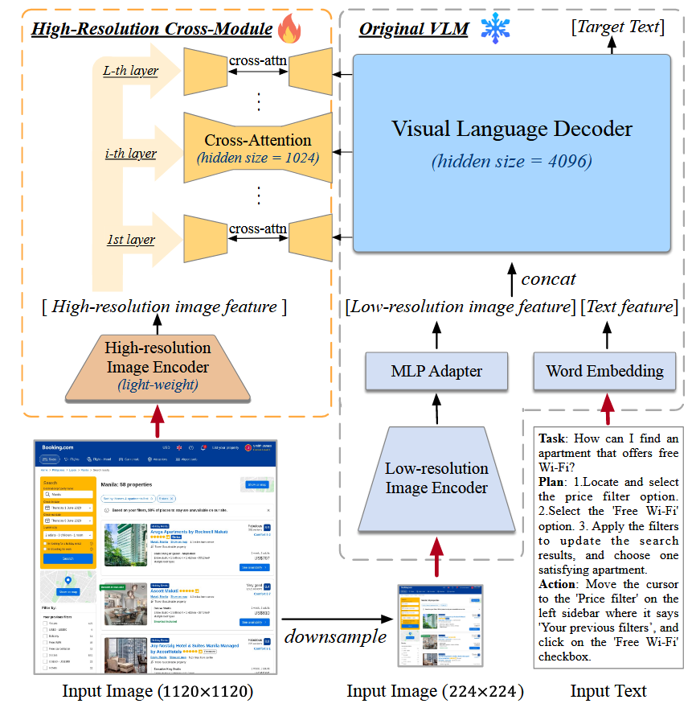

---
comments : true
---

# [CogAgent  A Visual Language Model for GUI Agents](https://arxiv.org/pdf/2312.08914)

!!! info "突破点"
    突破点有二:

    - 解决了数据集问题，以往的训练都使用包含自然图片，如LAION之类的，但这篇文章的作者建立起了一个"large-scale annotated dataset about GUIs and OCR for continual pre-training"

    - 维持了图片分辨率与计算速度的平衡。如果图片分辨率太低可能无法识别出"tiny icons and text"，如果分辨率太高则数据量会很大，占据过多token。

## CogAgent架构

从中不难看出，这个架构的关键在于**"High-Resolution Cross-Module"**

## High-Resolution Cross-Module

有两个经验：

+ 在 224 × 224 这样的中等分辨率下，图像可以有效地描绘大多数对象和布局，但这种分辨率却无法清晰地呈现文本。因此，高分辨率模块应强调与文本相关的特征。

+ 一般领域的预训练 VLM 通常需要较大的隐藏大小（如 PALI-X 和 CogVLM 中的 4096 大小，LLaVA 中的 5120 大小），而为文档 OCR 等以文本为中心的任务定制的 VLM 则需要较小的隐藏大小才能达到令人满意的性能（如 Kosmos-2.5 和 Pix2Struct 中的 1,536 大小）。这表明，使用较小的隐藏尺寸可以有效捕捉与文本相关的特征。

通过设置编码器和解码器的算法与QKV矩阵的得出，作者成功用Cross Attention实现了对高分辨率图像的注意，使得原始的LLM能够捕捉到图片的更多信息。

## 复杂度优化

根据作者的计算，使用Cross Attention相比于直接使用高分辨率图片作为输入，会加速$\frac{6400+L_T}{256+L_T}$倍，其中$L_T$是输入文本序列的长度，比如一个问题的长度。

## 预训练

!!! info "预训练关注的点"

    + the capability to recognize texts of various sizes, orientations, and fonts in high-resolution images

    + the grounding ability of text and objects in the image
    + a specialized understanding capability for GUI imagery such as web page
因此，使用的训练数据集由以下三部分构成：

## Text Recognition

在文本识别中，包括如下的数据：

1. 语言预训练数据集中的文本合成效果图。文本的字体、大小、颜色和方向各不相同，图像背景则来自 LAION-2B。  Synthetic renderings with text from language pre-training dataset
2. 自然图像的光学字符识别（OCR）。Optical Character Recognition (OCR) of natural images.
3. Academic documents.

## Visual grounding(视觉定位)

数据集包含了4,000万张图像，每张图像都有对应的图像-文本描述对。这些文本描述来自LAION-115M数据集，且与图像中的对象位置通过边界框（bounding boxes）关联。

## GUI imagery
图形用户界面图像具有独特的元素，如输入字段、超链接、图标和独特的布局特征，因此需要专门处理。
作责开创了两个图形界面基础任务：

1. GUI Referring Expression Generation (REG):根据截图中的指定区域为 DOM（文档对象模型）元素生成 HTML 代码

2. GUI Referring Expression Comprehension (REC):为给定的 DOM 元素创建边界框

作者为此搜集了大量数据集，形成了CCS400K数据集。这个庞大的数据集是通过从最新的通用抓取数据中提取 URL，然后截取 400,000 张网页截图形成的。

除截图外，还使用 Playwright 编译了所有可见的 DOM 元素及其相应的渲染框，并补充了 1.4 亿个 REC 和 REG 问答对。

此外，为了防止过拟合，采用了多种屏幕分辨率进行渲染，这些分辨率是从各种设备的常用分辨率列表中随机选取的。

此外，为了防止 HTML 代码变得过于冗长和笨重，作者按通过删除 DOM 元素中的冗余属性来进行必要的数据清理。

## 随意一句

**and convert them into a natural language question-and-answer format using GPT-4**这里也使用了其他的AI来生成数据集。

本页总访问量次
本页总访客数  人