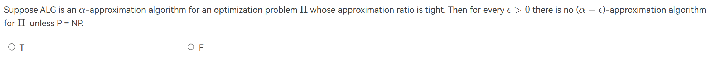
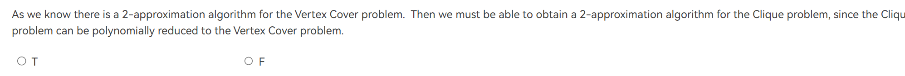
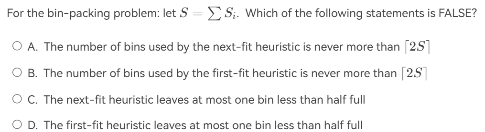
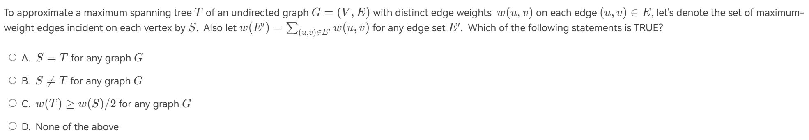
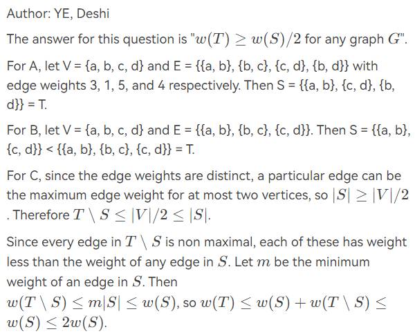
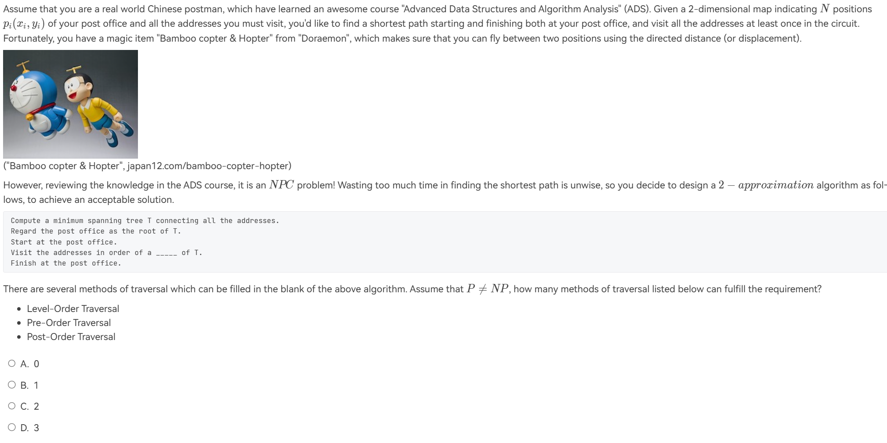

<link rel="stylesheet" type="text/css" href="../../../css/styles.css">

# 近似算法

!!! link "from wiki"
    https://zh.wikipedia.org/wiki/%E8%BF%91%E4%BC%BC%E7%AE%97%E6%B3%95

在上节课中提到，当今的学界倾向于$P \neq NP$, 即NP问题不可能在多项式时间内解决。因此，我们需要寻找一种近似算法来解决NP问题。近似算法是一种在多项式时间内求解NP问题的方法，它不一定能够得到问题的最优解，但是可以得到一个**接近最优解**的解。

!!! definition "Approximation ratio"
    近似比$\rho(n)$是一个常数，对于一个最优化问题的近似算法，我们假设$f(n,x)$是对输入x的最坏情况的一种量化。$x$为近似解,$x^*$为准确解，那么$\rho(n)$定义为：

    $$\rho(n) = \max\left\{ \frac{f(n,x)}{f(n,x^*)}, \frac{f(n,x^*)}{f(n,x)} \right\}$$

## 近似范式(Approximation Scheme)

近似范式是对于某一族问题的一种近似算法，它可以在多项式时间内得到一个接近最优解的解。近似范式的近似比$\rho(n)$是一个常数，且$\rho(n)$可以随着输入规模$n$的增大而减小。

> 可以把范式想成是一种输出为算法的函数，输入是$\epsilon$,对于特定的$\epsilon > 0$，范式会给出一个近似比为$1+\epsilon$的算法。

而此时，这种算法的时间复杂度可以看成是$O(f(n,\epsilon))$，其中$f(n,\epsilon)$是一个关于$n$和$\epsilon$的函数。

**PTAS(Polynomial Time Approximation Scheme)**是在$\epsilon$确定的情况下，$f(n,\epsilon)$关于$n$是多项式的范式。

## Approximate Bin Packing

### 问题描述

给定$n$个物品，每个物品的大小为$s_i \in (0,1]$，每个箱子的容量为1。我们需要将这些物品放入尽可能少的箱子中。

!!! example "🌰"
    给定 7 个 item，size 分别为$0.2,0.5,0.4,0.7,0.1,0.3,0.8$则最少需要 3 个 bin（准确解）：

    - bin1: 0.2, 0.8
    - bin2: 0.5, 0.4,0.1
    - bin3: 0.7, 0.3

这是一个NPH问题(?)，下面我们将考虑如下的算法。注意:online算法意味着在处理$ith$个item时，我们不知道后面的item的大小。而offline算法则是在处理$ith$个item时，我们已经知道所有item的大小。

### Next Fit Algorithm(online)

Next Fit Algorithm在处理每个item时，都会尝试将item放入最后一个箱子中，如果放不下，则会尝试放入下一个箱子中。

如果用M表示算法的准确解，则Next Fit使用箱子的个数不超过$2M-1$。

??? note "证明"
    我们将问题转换为若Next Fit使用了$2M$个箱子，则最优解至少需要$M+1$个箱子。

    设 \(S(B_i)\) 为第 \(i\) 个箱子的已经放下的item的size。那么我们必定有：

    \[
    \begin{align*}
    S(B_1) + S(B_2) &> 1, \\
    S(B_3) + S(B_4) &> 1, \\
    &\vdots \\
    S(B_{2M-1}) + S(B_{2M}) &> 1.
    \end{align*}
    \]

    这意味着：

    \[
    \sum_{i=1}^{2M} S(B_i) > M.
    \]

    最优解至少需要 \(\left\lceil \frac{\text{所有物品的总大小}}{1} \right\rceil\) 个箱子，这可以表示为：

    \[
    \left\lceil \sum_{i=1}^{2M} S(B_i) \right\rceil \geq M + 1.
    \]

    因此，Next Fit算法的箱子个数不会超过$2M-1$。

### First Fit Algorithm(online)

First Fit Algorithm在处理每个item时，都会尝试将item放入第一个箱子中，如果放不下，则会尝试放入下一个箱子中。也即，将item放在第一个能容纳的箱子里，不然就新开一个箱子。

如果用M表示算法的准确解，则First Fit使用箱子的个数不超过$1.7M$。

### Best Fit Algorithm(online)

Best Fit Algorithm在处理每个item时，都会尝试将item放入剩余空间最小且能容纳的箱子中。

如果用M表示算法的准确解，则Best Fit使用箱子的个数不超过$1.7M$。

---

### online算法的结论(近似比)

There are inputs that force any on-line bin-packing algorithm to use at least 5/3 the optimal number of bins.

也即，对于任何online算法，其近似比$\rho(n) \geq \frac{5}{3}$。

---

### First Fit Decreasing(offline) 

First Fit Decreasing Algorithm是First Fit Algorithm的一个变种，它首先将所有item按照大小降序排列，然后再使用First Fit Algorithm。

如果用M表示算法的准确解，则First Fit Decreasing使用箱子的个数不超过

$$\frac{11M}{9} + \frac{6}{9}$$

---

## The Knapsack Problem(背包问题)

### 问题描述

给定$n$个物品，每个物品的大小为$w_i$，价值为$p_i$，背包的容量为$M$。我们需要将这些物品放入背包中，使得背包中物品的总价值最大。

### Fractional Version

假设我们记$x_i$是第i个item的放入百分比(假设item是连续可分的)，则获得的利润为$p_i x_i$,占据的空间为$w_i x_i$

那么我们就是要在$\sum w_i x_i \leq M$的约束条件下，求出最大的$\sum p_i x_i$.

很显然，这时候我们只需要考虑"性价比":$\frac{p_i}{w_i}$最大的物品，将它们放入即可。这种情况下得到的解已经是准确解了。

### 0-1 Version

0-1 Version要求对于一件item，我们要么放，要么不放。

现在，问题变成了一个NPC问题。

#### 贪心做法

贪心的策略是总是选择贪心策略可以是总是选可以放得下的、还没放入中的，利润最大的或$
\frac{p_i}{w_i}$最大的。这些做法的近似比都是 2。

!!! proof "贪心算法的2-近似度证明"

    - $p_\text{max}$: 所有物品中单个物品的最大利润
    - $P_\text{optimal}$: 最优解的总利润
    - $P_\text{greedy}$: 贪心算法得到的解的总利润

    近似比 $\rho$ 定义为:
    $$
    \rho = \max(\frac{P_\text{optimal}}{P_\text{greedy}}, \frac{P_\text{greedy}}{P_\text{optimal}})
    $$

    1. 首先我们有两个重要的不等式:

        $$
        \begin{cases}
        p_\text{max} \leq P_\text{greedy} & (1) \\
        P_\text{optimal} \leq P_\text{greedy} + p_\text{max} & (2)
        \end{cases}
        $$

    2. 从不等式(1)得到:

        $$
        \frac{p_\text{max}}{P_\text{greedy}} \leq 1 \quad (3)
        $$

    3. 将不等式(2)除以 $P_\text{greedy}$ 并结合(3):

        $$
        \frac{P_\text{optimal}}{P_\text{greedy}} \leq 1 + \frac{p_\text{max}}{P_\text{greedy}} \leq 2
        $$

#### 动态规划做法

设 $W_{i, p}$ 表示从集合 $\{1, \ldots, i\}$ 中选取元素，使得总利润恰好为 $p$ 时的最小重量。

1. **选择第 $i$ 项:** $W_{i,p} = w_i + W_{i-1,p-p_i}$
2. **跳过第 $i$ 项:** $W_{i,p} = W_{i-1,p}$
3. **无法达到利润 $p$:** $W_{i,p} = \infty$

$W_{i, p}$ 的递推公式可以定义为：

\[
W_{i, p} = 
\begin{cases} 
\infty & \text{如果 } i = 0 \\
W_{i-1, p} & \text{如果 } p_i > p \\
\min\{W_{i-1, p}, w_i + W_{i-1, p-p_i}\} & \text{其他情况}
\end{cases}
\]

其中 $i = 1, \ldots, n$ 且 $p = 1, \ldots, n p_{\max}$，时间复杂度为 $O(n^2 p_{\max})$。

> $p_{\text{max}}$就是上面提到的所有物品中单个物品的最大利润

## The K-center Problem(K中心问题)

K 中心问题指：给定平面上的一系列 site（即点），在平面中找出 $k$ 个不同的 center，记 $site_i$ 到离它最近的 center 的距离为 $dis_i$，求 $\max \{dis_i\}$ 的最小值。

\[
\text{dist}(s_i, C) = \min_{c \in C} \text{dist}(s_i, c)
\]

即从 $s_i$ 到最近中心的距离

\[
r(C) = \max_i \text{dist}(s_i, C) = \text{最小覆盖半径}
\]

找到一个中心集合 $C$，使得 $r(C)$ 最小，条件是 $|C| = K$。

### 简单贪心

!!! definition
    Put the first center at the best possible location for a single center, and then keep adding centers so as to reduce the covering radius each time by as much as possible.

    这个做法说着简单，其实有很大的bug。比如如果一开始所有点形成了两个几种的点云，那么第一个点就会选择两个点云的中间，这显然是不合理的。

### 2r-greedy

假设最优解对应的中心集为 $C^*$，满足 $\forall C_x$，如果 $r(C_x) \geq r(C^*)$，则必定存在覆盖方案。反之，如果能够验证 $C_x$ 能覆盖所有点，则可约束最优解的半径 $r(C^*) \leq r(C_x)$。

!!! info "解释"

    设 $C_x$ 为选定的中心，$S_x$ 为尚未被覆盖的点集，$r_x$ 为当前待判断的半径，$S$ 为所有点的集合，算法步骤如下：

    1. 初始化 $C_x = \emptyset$；
    2. 当 $S_x \neq \emptyset$ 时，重复以下操作：
        1. 随机选择一个点 $s_i \in S_x$，加入 $C_x$ 作为中心，并从 $S_x$ 中移除 $s_i$；
        2. 从 $S_x$ 中移除所有距离 $s_i$ 不超过 $2r_x$ 的点，即删除所有满足 $dis(s_i, s_j) \leq 2r_x$ 的点 $s_j$；
    3. 所有点被覆盖后：
        1. 若 $|C_x| \leq k$，则返回 **是**；
        2. 否则返回 **否**。

    - 如果返回 **是**，下一个 $r_x$ 应取更小的值；
    - 如果返回 **否**，下一个 $r_x$ 应取更大的值。

1. 当算法成功时，说明 $2r_x \geq r(C^*)$，即可以用 $k$ 个半径为 $2r_x$ 的圆覆盖所有点；
2. 当算法失败时，不能确定 $2r_x \geq r(C^*)$，但可以确定 $r_x \leq r(C^*)$，因为该方法并非最优。

**引理**：假设存在半径为 $r$，以 $c$ 为圆心的圆 $C$ 覆盖了所有点集 $S$。对于任意固定半径 $r'$，如果以 $S$ 中任意点 $s_i$ 为圆心的圆 $C_i$ 能覆盖所有点，则必须满足 $r' \geq 2r$。

> 引理的证明关键在于考虑两个分布在直径两端的点的情况。

该引理的附加结论为：

最优覆盖半径为 $r$ 的圆，必然能被半径为 $2r$、任意点为圆心的圆所覆盖。极端情况就是选取的点刚好在原来最优覆盖半径为$r$的圆的边界上。

---

当返回**是**的时候，我们缩小$r_x$，不然，扩大$r_x$。最终，我们会得到一个$r_x$满足$r_x\leq r(C^*) \leq 2r_x$

最终的答案就是$2r_x$

其近似比为2.

### A smarter solution

上面那个做法总是随机的选取新的 $c_i$，但是对于 center 的选取，我们其实可以总是选择距离已有的 center 最远的点，此外，当 $|C| > k$ 时，我们也没必要继续做了。

## 最后

+ A :Optimality --quality of a solution(准确解or近似解)

+ B :Efficiency --cost of computations

+ C :All instances

对于一个问题的解法，满足:

+ A+B:Exact and fast algorithms for special cases

+ A+C:Exact algorithms for all instances

+ B+C:Approximation algorithms 

即使我们证明了P = NP,也不一定能保证一个解法同时满足上面三个特点。

---

## 例题

!!! note "例题"
    === "T1"
        
        ??? general "解析"
            F.$\alpha$是tight只能说明对于这一种算法的近似比是最优的，但是不能说明这个算法是最优的。可能还有其他算法的近似比更好。
    
    === "T2"
        
        ??? general "解析"
            F.

            $$
            \rho_1=\frac{C_2}{C_2^*}=\frac{T}{T^*}=2,\quad
            \rho_2=\frac{C_1^*}{C_1}=\frac{|V|-T^*}{|V|-T}=1+\frac{1}{\dfrac{|V|}{T^*}-2}
            $$

            因此，clique的$\rho_2$不一定是2
        
    === "T3"
        
        ??? general "解析"
            C.试试看0.2,0.9,0.2,0.9的item.

            对于D，如果有两个bin的剩余容量大于一般，根据First Fit的原则，无论后一个bin里有几个item,都必然在选择是会选择前一个bin放进去。
                
    === "T4"
        
        ??? general "解析"
             

                
            

    === "T5"

        
        ??? general "解析"
            看不懂???
