<link rel="stylesheet" type="text/css" href="../../../css/styles.css">


<script defer src="https://vercount.one/js"></script>

# Leftist Heaps and Skew Heaps

## Leftist Heaps

!!! info "相关资料"
    wiki:https://zh.wikipedia.org/wiki/%E5%B7%A6%E5%81%8F%E6%A0%91

### 概念

左偏堆的特点在于它相对于普通的二叉堆，加速了两个堆之间的合并操作。普通的二叉堆合并的时间复杂度为$O(n)$,而左偏堆可加速至$O(\log{n})$。

!!! definition "定义一：Null Path Length or dist"

    The null path length, Npl(X), of any node X is the length of the shortest path from X to a node without two children.  Define Npl(NULL) = –1.

    当且仅当节点 i 的左子树或右子树为空时，节点被称作外节点（实际上保存在二叉树中的节点都是内节点，外节点是逻辑上存在而无需保存。把一颗二叉树补上全部的外节点，则称为extended binary tree）。节点i的距离是节点 i 到它的后代中的最近的外节点所经过的边数。特别的，如果节点 i 本身是外节点，则它的距离为0;而空节点的距离规定为 -1。

    $\text{dist}_i = \min(\text{dist}_{\text{leftchild}}, \text{dist}_{\text{rightchild}}) + 1$

!!! definition "左偏堆"
    左偏堆首先应当满足大顶堆或小顶堆的性质。其次，还需要满足如下性质：

    + 节点的左子节点的距离不小于右子节点的距离。
    
    由此，左偏堆有如下性质：
    !!! properties "性质"

        + 节点的距离等于它的右子节点的距离加1

        + 一棵N个节点的左偏树root节点的距离最多为$\log{(N+1)}-1$

        + 如果$\text{dist}_i=k$,那么以i为根的子树在前k+1层必然是完美二叉树，即满的

### 相关操作

左偏堆最重要的操作在于合并，因此先介绍merge。

#### merge
!!! example "例子"
    === "合并前"
        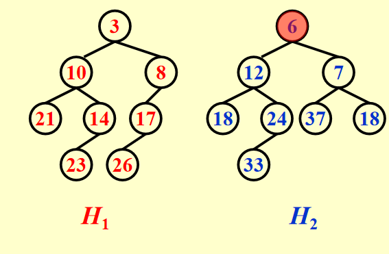
    === "合并后"
        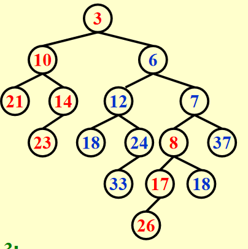
        !!! warning
            这里是还没有swap的。


##### 递归版本

我们先假设现在的左偏堆是小顶堆。那么合并的思想就在于不断比较两个堆顶元素的大小，保持较小的堆顶的左子树不变，右子树为**右子树与另一个堆合并的结果**。在合并的递归过程中，直到叶子节点，然后从叶子节点向根节点检查，确保左右子树满足以下条件：

> 左偏堆首先应当满足大顶堆或小顶堆的性质。其次，还需要满足如下性质：
>
>   + 节点的左子节点的距离不小于右子节点的距离。

如果不满足，则调换左右子树，并更新根的dist值。

---
###### 代码

```c title="recursive"

typedef struct LeftistNode {
    int key;
    struct LeftistNode *left;
    struct LeftistNode *right;
    int dist;
} LeftistNode;

LeftistNode* createNode(int key) {
    LeftistNode* node = (LeftistNode*)malloc(sizeof(LeftistNode));
    node->key = key;
    node->left = NULL;
    node->right = NULL;
    node->dist = 0;
    return node;
}

LeftistNode* merge(LeftistNode* h1, LeftistNode* h2) {
    if (h1 == NULL) return h2;
    if (h2 == NULL) return h1;
    if (h1->key > h2->key) {
        LeftistNode* temp = h1;
        h1 = h2;
        h2 = temp;
    }
    h1->right = merge(h1->right, h2);
    if (h1->left == NULL || h1->left->dist < h1->right->dist) {
        LeftistNode* temp = h1->left;
        h1->left = h1->right;
        h1->right = temp;
    }
    h1->dist = (h1->right == NULL) ? 0 : h1->right->dist + 1;
    return h1;
}
```

---

##### 循环版本
介绍左偏堆合并的迭代版本。与递归版本不同，迭代版本通过显式的栈来模拟递归调用，从而避免了递归调用带来的栈空间开销。

迭代版本的基本思想如下：

1. 首先比较两个堆顶元素的大小，选择较小的作为新的根节点。
2. 使用一个栈来保存需要处理的右子树指针。
3. 在循环中不断比较两个堆的当前节点，选择较小的节点并将其右子树指针压入栈中。
4. 当其中一个堆处理完毕后，将另一个堆的剩余部分直接连接到当前节点的右子树。
5. 最后，从栈中弹出节点，调整左右子树以满足左偏堆的性质。
###### 代码

```c title="iterative"
#include <stdio.h>
#include <stdlib.h>

typedef struct LeftistNode {
    int key;
    struct LeftistNode *left;
    struct LeftistNode *right;
    int dist;
} LeftistNode;

LeftistNode* createNode(int key) {
    LeftistNode* node = (LeftistNode*)malloc(sizeof(LeftistNode));
    node->key = key;
    node->left = NULL;
    node->right = NULL;
    node->dist = 0;
    return node;
}

LeftistNode* mergeIterative(LeftistNode* h1, LeftistNode* h2) {
    if (h1 == NULL) return h2;
    if (h2 == NULL) return h1;

    LeftistNode* root = NULL;
    LeftistNode** stack[64];
    int top = -1;

    if (h1->key < h2->key) {
        root = h1;
        stack[++top] = &h1->right;
        h1 = h1->right;
    } else {
        root = h2;
        stack[++top] = &h2->right;
        h2 = h2->right;
    }

    while (h1 != NULL && h2 != NULL) {
        if (h1->key < h2->key) {
            *stack[top] = h1;
            stack[++top] = &h1->right;
            h1 = h1->right;
        } else {
            *stack[top] = h2;
            stack[++top] = &h2->right;
            h2 = h2->right;
        }
    }

    *stack[top] = (h1 == NULL) ? h2 : h1;

    while (top >= 0) {
        LeftistNode** node = stack[top--];
        if ((*node)->left == NULL || (*node)->left->dist < (*node)->right->dist) {
            LeftistNode* temp = (*node)->left;
            (*node)->left = (*node)->right;
            (*node)->right = temp;
        }
        (*node)->dist = ((*node)->right == NULL) ? 0 : (*node)->right->dist + 1;
    }

    return root;
}

void inorderTraversal(LeftistNode* root) {
    if (root != NULL) {
        inorderTraversal(root->left);
        printf("%d ", root->key);
        inorderTraversal(root->right);
    }
}

int main() {
    LeftistNode* h1 = createNode(3);
    h1->left = createNode(10);
    h1->right = createNode(8);

    LeftistNode* h2 = createNode(7);
    h2->left = createNode(12);
    h2->right = createNode(9);

    LeftistNode* mergedHeap = mergeIterative(h1, h2);

    printf("Inorder traversal of merged heap: ");
    inorderTraversal(mergedHeap);
    printf("\n");

    return 0;
}
```

#### 插入元素

堆的合并中有一个堆只有一个根节点的情况

#### 删除
删除堆顶，合并左右子树即可


---
### 例题

!!! info "例题"
    === "T1"
        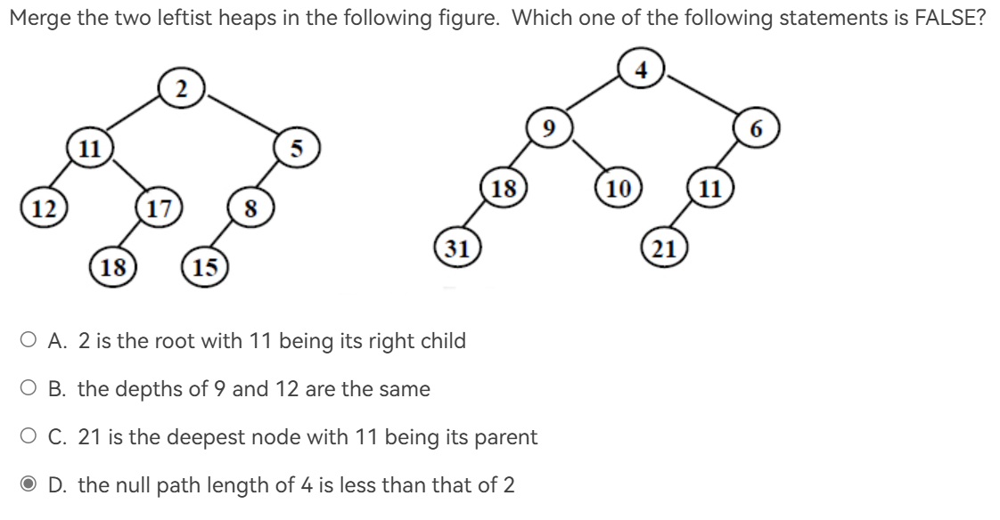
        ??? tip "解析"
            插入完的树如图：

            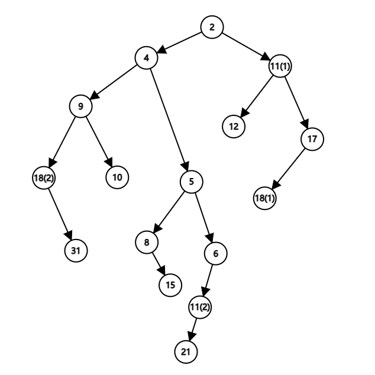

            因此可以看出D是错的，Npl都是2
    === "T2"
        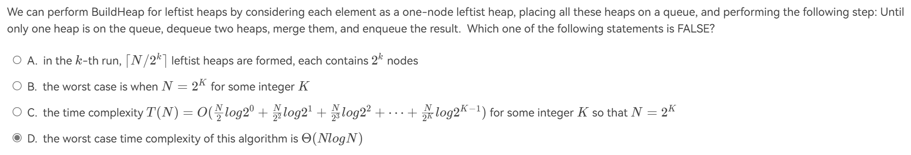

        ??? tip "解析"
            通过特殊值法与感受法可以看出A与C是对的，由C可以推出D是错的，按照我自己的计算，应该为$O(N)$

    === "T3"
        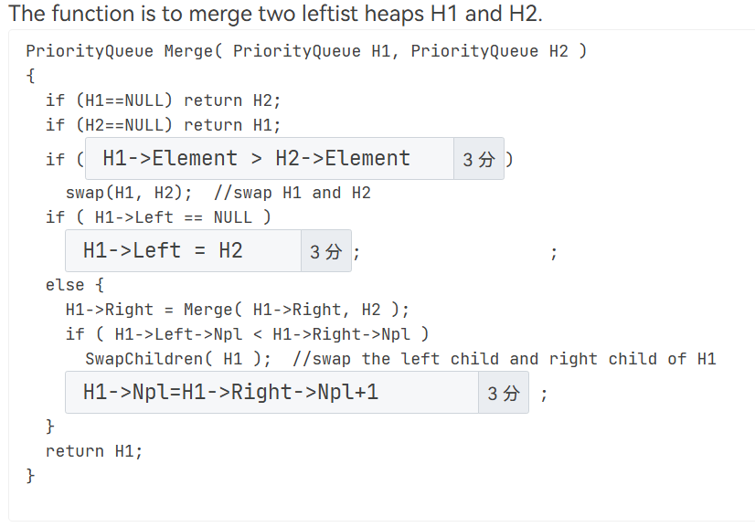
        ??? general "解析"
            [见代码](Leandsk.md#递归版本)

--- 

## Skew Heaps

!!! info "资料"

    wiki:https://zh.wikipedia.org/wiki/%E6%96%9C%E5%A0%86

### 概念
斜堆是一般化的左偏堆，左偏堆是特殊的斜堆。斜堆的一般性在于它不记录dist值，而是在合并时，无条件进行左右子树交换的操作。

### 递归
递归合并的操作有三步：

1. 比较两个堆； 设p是具有更小的root的键值的堆，q是另一个堆。

2. p的右子树为原来p的左子树

3. p的左子树是原来p的右子树与q合并的结果。

!!! example "example from wiki"
    === "合并前"
        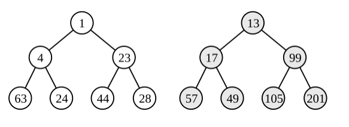
    === "合并后"
        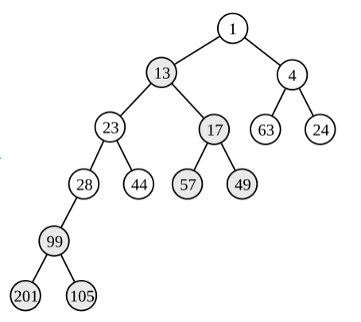

!!! tip "疑惑"
    在递归的代码中，当一个堆与NULL合并的时候，似乎直接返回根节点就可以了，但这样的结果与实际不符。在非常疑惑的情况下，我觉得需要为merge打一个补丁：
    **当一个堆与一个空堆合并时，需要交换它的左右子树**

---

### 循环

iterative版本就不写了，放一个[wiki链接](https://zh.wikipedia.org/wiki/%E6%96%9C%E5%A0%86#%E9%9D%9E%E9%80%92%E5%BD%92%E5%90%88%E5%B9%B6%E5%AE%9E%E7%8E%B0)


---


### 均摊分析

#### 定义
采用势能法对斜堆操作的时间复杂度进行分析。由于斜堆主要的操作是merge，所以我们对merge进行分析，希望证明它是$O(\log{n})$.

!!! definition "势能函数"
    $\Phi(D_i)=$the number of heavy nodes in heap
    !!! definition "heavy node"
        from PPT:A node p is heavy if the number of descendants of p’s right subtree is at least half of the number of descendants of p, and light otherwise. Note that the number of descendants of a node includes the node itself.
        
        总的来说，就是右子树中节点个数超过总的一半的节点。

        反之可定义light node.

!!! properties "一些性质"
    1. 只有原先最右侧路径上的节点的轻重状态有可能发生变化。

    2. 只有原先最右侧路径上的节点会被访问，作相关操作。

    3. 如果一个节点是 light node，并且在其右子树发生了合并（包括翻转），那么它**可能**变为一个 heavy node

    4. 如果一个节点是 heavy node，并且在其右子树发生了合并（包括翻转），那么它**一定**变为一个 light node

列出势能法的式子：

$\hat{c_i}=c_i+\Phi(D_i)-\Phi(D_{i-1})$

#### 分析

记:

+ $l_1$：1号堆最右侧路径上light node的个数

+ $h_1$: 1号堆最右侧路径上heavy node的个数

+ $l_2$: 2号堆最右侧路径上light node的个数

+ $h_2$: 2号堆最右侧路径上heavy node的个数

+ h: 两个堆不在最右侧路径上heavy node的个数，这些节点始终为heavy node

---

因此：

+ $c_i$在最坏情况下为$l_1+h_1+l_2+h_2$，即两个堆右侧节点全部被访问

+ $\Phi(D_{i-1}) = h + h_1 + h_2$

+ $\Phi(D_i) <= h + l_1 + l_2$,因为最右侧路径上的heavy node必然会变成light node(见性质4)

    >  如果一个节点是 heavy node，并且在其右子树发生了合并（包括翻转），那么它**一定**变为一个 light node

    而合并完后，如果要让势能最大，我们只能假设所有的light node全部变成了heavy node。

    >  如果一个节点是 light node，并且在其右子树发生了合并（包括翻转），那么它**可能**变为一个 heavy node

    因此得到$\Phi(D_i) <= h + l_1 + l_2$

#### 综上所述

$\hat{c_i}=c_i+\Phi(D_i)-\Phi(D_{i-1}) <=2(l_1 + l_2)$

考虑上界的话，我们需要让$l_1 + l_2$尽可能大，那什么时候尽可能大呢？

回想light node的定义：一个节点，它右子树的节点少于这颗子树全部节点的一半。

那light node尽可能多是多少呢...一个树右路径上的节点受限，联想到之前的左倾树，一颗树有N个节点，最右侧路径上最多有多少节点呢？

<center><span style="font-size: 2em;">**$\log(N)$**</span></center>

至此，我们推出Skew heap merge操作的时间复杂度是$O(\log(N))$,由于其他操作都可以看成是特殊的merge，因此结束推理，Q.E.D

### 例题

!!! info "例题"
    === "T1"
        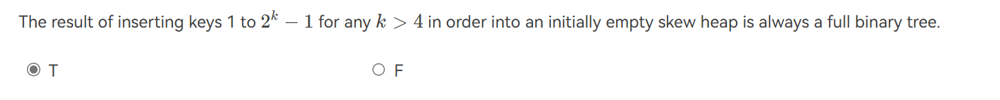
        ??? tip "解析"
            emmm,好像就是这样的，画了几个简单情况符合。
    === "T2"
        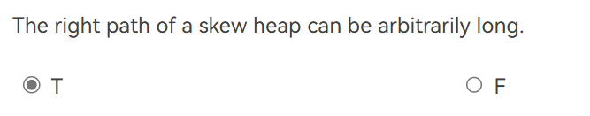
        ??? tip "解析"
            好像是没有什么规定？
    === "T3"
        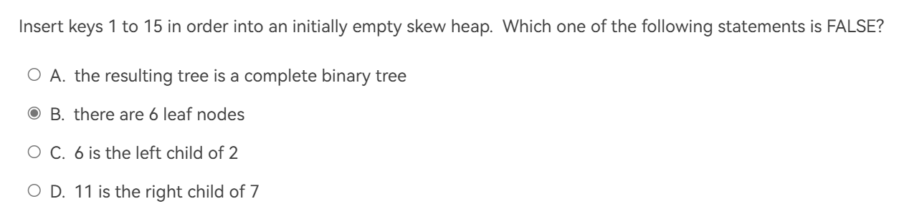
        ??? tip "解析"
            和上面的判断题一样，应该是个满二叉树。
    === "T4"
        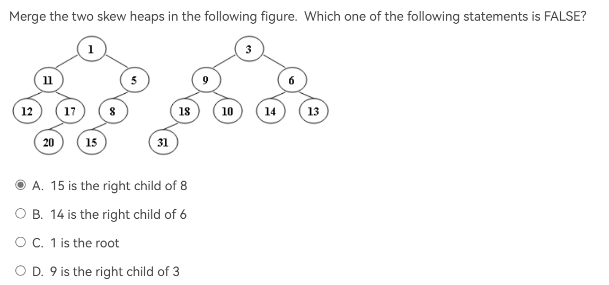
        ??? tip "解析"
            结果如图：

            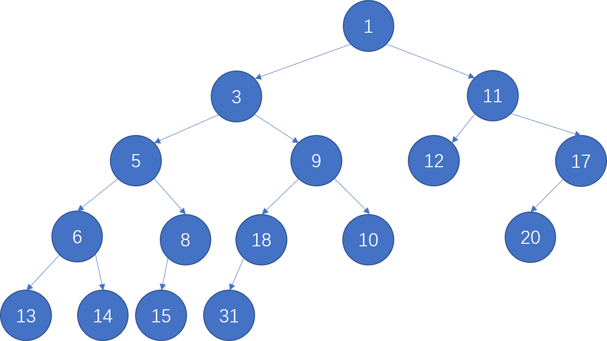
<!--<span id="busuanzi_container_page_pv">本页总访问量<span id="busuanzi_value_page_pv"></span>次</span>
<span id="busuanzi_container_page_uv">本页总访客数 <span id="busuanzi_value_page_uv"></span> 人</span>-->