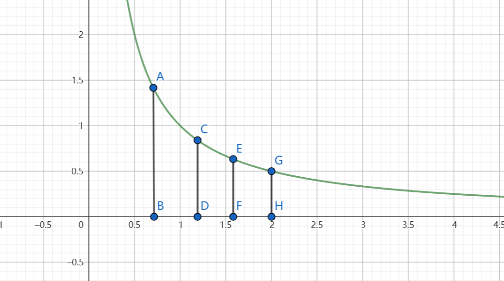
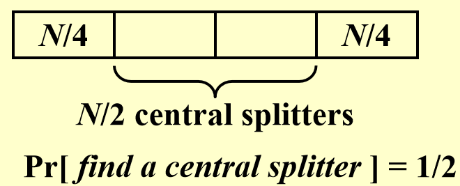
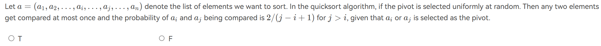
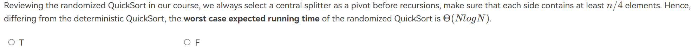
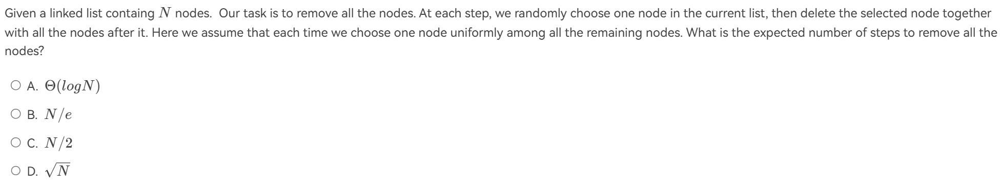
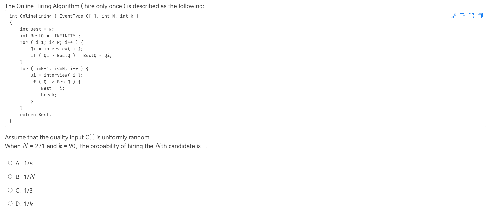

# 随机算法

在概率论与数理统计中我们学过:

$$
E(X) = \sum_{i=1}^{n} x_i \cdot P(X=x_i)
$$

而随机算法也与期望有关。在算法分析中，我们通常关心的是算法的平均性能，即期望。在随机算法中，我们通常关心的是算法的期望性能，即算法在随机输入上的期望性能。

## Hiring Problem

!!! info "wiki"
    [Hiring problem](https://zh.wikipedia.org/wiki/%E7%A7%98%E6%9B%B8%E5%95%8F%E9%A1%8C)

现在你需要雇佣一个秘书，你有 $n$ 个应聘者，你可以按照任意顺序面试他们，但是你不能拒绝一个应聘者，一旦拒绝就不能再次考虑。你的目标是雇佣一个最优秀的应聘者，即使你不知道他们的相对顺序。

在这里，我们假设面试与雇佣都有相应的成本。当你选择雇佣一个人后，即使你第二天就找到一个更好地把他开除，仍然需要支付雇佣的成本。我们的目标是找到一个算法，使得期望成本最小。

### Naive Solution

每一个人都面试，然后选择最优秀的。在最差的情况下，假设后一个人始终比前一个人优秀，那么期望成本为:

$$
N C_h
$$

### Randomized Solution

令$X = \text{number of hires}$,我们用$X_i$表示第$i$个人被雇佣的情况:

$$
X_i = \begin{cases}
1 & \text{if } i \text{ is hired} \\
0 & \text{otherwise}
\end{cases}
$$

那么$E(X_i) = \frac{1}{i}$

这是因为$P(X_i = 1) = \frac{1}{i}$,可以这么考虑:第i个人被雇佣<=>前i个人中最优秀的出现在第i个。

则:

$$
\begin{aligned}
E(X) & = E(X_1 + X_2 + \cdots + X_n) \\
& = E(X_1) + E(X_2) + \cdots + E(X_n) \\
& = \frac{1}{1} + \frac{1}{2} + \cdots + \frac{1}{n} \\
& = \sum_{i=1}^{n} \frac{1}{i} \\
& = \ln n + O(1)
\end{aligned}
$$

在这种情况下，期望成本为:

$$
C_h \ln n + N C_i
$$

实现这种成本的关键在于随机性，即我们需要随机地选择一个人。

### Online Hiring Problem

正如近似算法中提到的，online的意思是我们不能提前知道所有的应聘者，而是在面试的过程中逐个得到应聘者的信息。在这种情况下，我们不能使用上面的随机算法，因为我们无法做到随机抽取一个人，也即不相信数据的随机性。

正如维基百科中所说，在这里我们使用一个截断准则，即在前 $k$ 个人中选择一个最优秀的，然后在后面的人中选择一个比前 $k$ 个人更优秀的，那么我们就选择这个人。

```c title="Online Hiring Problem"
int OnlineHiring ( EventType C[ ], int N, int k)
{
    int Best = N;
    int BestQ = - infinity ;
    for ( i=1; i<=k; i++ ) {
        Qi = interview( i );
        if ( Qi > BestQ )   BestQ = Qi;
    }
    for ( i=k+1; i<=N; i++ ) {
        Qi = interview( i );
        if ( Qi > BestQ ) {
            Best = i;
            break;
        }
    }
    return Best;
}
```

现在我们要思考一个问题，即如何选择 $k$，使得我们找到最优秀的人的概率最大。

令事件$S_i$表示第$i$个人是最优秀的且被pick，那么,要使$S_i$发生，必须如下两个事件发生:

1. A: 第$i$个人是最优秀的

2. B: 前$k+1 \sim i-1$个人中没有被雇佣

并且，这两个事件是独立的。

那么:

$$
P(S_i) = P(A \cap B)=P(A) \cdot P(B) = \frac{1}{N} \cdot \frac{k}{i-1} = \frac{k}{N(i-1)}
$$

!!! tip "为什么是$k/(i-1)$"
    这里的思想是看作事件为前i-1个人当中，最优秀的人出现在前k个人当中。而最优秀的人出现在任何一个位置的概率是相同的，即$1/N$。

既然我们已经知道最优秀的人出现在每一个位置的概率，那么我们可以计算出用上一个算法找到最优秀的人的概率:

$$
P(\text{find the best}) = \sum_{i=k+1}^{N} P(S_i) = \sum_{i=k+1}^{N} \frac{k}{N(i-1)} = \sum_{i = k}^{N-1} \frac{k}{N} \frac{1}{i}
$$

!!! tip "引理"
    $$
    \int_{k}^{N} \frac{1}{x} \mathrm{d} x \leq \sum_{i=k}^{N-1} \frac{1}{i} \leq \int_{k-1}^{N-1} \frac{1}{x} \mathrm{d} x
    $$

    ??? general "证明"
        <strike>证明略</strike>

        我们回归微积分原始的概念，即计算曲线下的面积。
        <div align="center">
        
        </div>

        这里作一些简化:用C G 两点的曲线与坐标轴围成的面积表示$\int_{k}^{N} \frac{1}{x} \mathrm{d} x$，用A E 两点的曲线与坐标轴围成的面积表示$\int_{k-1}^{N-1} \frac{1}{x} \mathrm{d} x$，而$\sum_{i=k}^{N-1} \frac{1}{i} = \sum_{i=k}^{N-1} \frac{1}{i} \times 1$,则:

        + 相比于$\int_{k}^{N} \frac{1}{x} \mathrm{d} x$，$\sum_{i=k}^{N-1} \frac{1}{i}$相当于每次用长边(比如CDFE中的CD)作为矩形的高，因此比实际面积大。

        + 相比于$\int_{k-1}^{N-1} \frac{1}{x} \mathrm{d} x$，$\sum_{i=k}^{N-1} \frac{1}{i}$相当于每次用短边(比如ABCD中的CD)作为矩形的高，因此比实际面积小。

有了上面那个引理，我们可以得到:

$$
\sum_{i = k}^{N-1} \frac{k}{N} \frac{1}{i} \geq \int_{k}^{N} \frac{k}{N} \frac{1}{x} \mathrm{d} x = \frac{k}{N} \ln \frac{N}{k}
$$

求导得到最大值，我们可以得到$k = \frac{N}{e}$时，概率最大。

## Quick Sort

众所周知，普通的快排在最坏情况下的时间复杂度为$O(n^2)$，而在平均情况下的时间复杂度为$O(n \log n)$。为了解决最坏情况下快排退化的问题，我们作如下定义:

!!! definition

    + Central splitter :一个枢纽，使得枢纽两边的部分都至少包含原数组的$\frac{1}{4}$

    + Modified Quicksort :在递归前总是选择一个central splitter作为枢纽。

现在我们来思考，如果每次随机取一个点作为枢纽，选择次数的期望是多少呢?

!!! prove
    <div align="center">
    
    </div>

    从图中可以看出，随机选择一个点作为枢纽，这个点是Central splitter的概率是$\frac{1}{2}$.

    令$X = \text{number of selections}$,则:

    $$P(X = 1) = \frac{1}{2}\\$$

    $$P(X = 2) = \frac{1}{2} \times \frac{1}{2} = \frac{1}{4}\\$$

    $$P(X = 3) = \frac{1}{2} \times \frac{1}{2} \times \frac{1}{2} = \frac{1}{8}\\$$

    $$
    \cdots\\
    $$

    很显然，从上面可以看出:

    \begin{align}
        E(X) &= 1 \times \frac{1}{2} + 2 \times \frac{1}{4} + 3 \times \frac{1}{8} + \cdots\\
        &= \sum_{i=1}^{\infty} i \times \frac{i}{2^i}\\
        &= \sum_{i=1}^{\infty} \frac{i+1}{2^{i-1}} - \frac{i+2}{2^{i}}\\
        &= \frac{1+1}{2^0} - \lim_{i \to \infty} \frac{i+2}{2^i}\\
        &= 2
    \end{align}

    **因此，我们证明了选取次数的期望是2.**

!!! definition
    **Type j**:如果一个子问题S的大小|S| = 数组中元素个数满足:

    $$
    N (\frac{3}{4})^{j+1} \leq |S| \leq N (\frac{3}{4})^{j}
    $$

    我们称这个子问题是type j的。

    这是很显然的，因为按照Central Splitter的划分，每次递归，问题的规模至少缩小为原来的$\frac{3}{4}$

并且，我们可以说type j的子问题个数不可能超过$(\frac{4}{3})^{j+1}$个。这是因为type j的子问题最小大小是$N (\frac{3}{4})^{j+1}$，如果超过这个个数，那么子问题大小之和比原问题还大了，这是不合理的。

因此对于所有type j的子问题:

$$
E(T_{type j}) = O(N (\frac{3}{4})^{j}) \times (\frac{4}{3})^{j+1} = O(N)
$$

而总共有多少个j可以取呢？我们可以知道，当|S|=1时循环终止，因此$N (\frac{3}{4})^{j} \geq 1$

故一共$\log_{\frac{4}{3}} N$个j

所以这种快排算法的时间复杂度就是:

\begin{align}
T_{\text{type j}} \times \text{number of j} &= O(N) \times O(\log N)\\
&= O(N \log N)
\end{align}

至此，我们证明了优化快排的时间复杂度是$O(N \log N)$,并且几乎不会退化。

## 例题

!!! note "例题"
    === "T1"
        
        ??? general "解析"
            F.

            举反例如下：\{3, 4, 1, 2\}。如果第一次选3或者2作为pivot，那么1和4会被分开，不会被比较。
    
            如果第一次就选中1或4，它们才会被比较。因此它们被比较的概率是1/2。
            
            按照 $\dfrac{2}{j-i+1}$ 计算，应该是1。所以错误。

            实际上，这个结论在原序列已经有序的情况下才成立。因为这时候:

            + 取任何i,j以外的元素作为枢纽，i,j还是在同一组

            + 若取i,j之间的元素作为枢纽,i,j就会被分到不同组中，因此不会被比较。

            + 只有取i或者j，作为枢纽，才会比较。

    === "T2"
        
        ??? general "解析"
            T.因为不会退化。

    === "T3"
        
        ??? general "解析"
            A.
            思考递推式:对于任何大小的N，其必然有删除一个点这一步。在删除任何一个点后，剩下点的个数从1到N-1不等。

            因此，如果用$T(N)$表示删除步数的期望,我们有:

            $$
            T(N) = \frac{1}{N}\sum_{i=1}^{N-1}T(i)+1
            $$

            感受得到A。
    
    === "T4"
        
        ??? general "解析"
            选择最后一个可能是什么情况呢?

            1. 最优秀的在前k个: $P = \frac{k}{N}$

            2. 最优秀的在最后一个并且前N-1个候选人中最优秀的在前k个中（这是为了保证不会pick最后一个之前的人）:
            $P = \frac{1}{N} \times \frac{k}{N-1}$

            相加，和$\frac{1}{3}$差不多，故选C。