<link rel="stylesheet" type="text/css" href="../../../css/styles.css">


# Kinds of Trees：AVL,Splay,B+ and Red Black

## AVL
### AVL树的特点与性质

AVL树是一种自平衡二叉搜索树，其中所有节点的左右子树高度差不能超过一。这确保了树保持大致平衡，从而提供高效的操作。

#### 特点：
1. **自平衡**：通过插入和删除期间的旋转自动保持平衡。
2. **二叉搜索树**：遵循二叉搜索树的性质，即左子节点小于父节点，右子节点大于父节点。
3. **高度平衡**：任何节点的左右子树高度差最多为一。

!!! info "高度公式"
    公式：记高度为h的AVL树的最少节点数为$n_h$,我们有$n_h=n_{h-1}+n_{h-2}+1$,且$n_0=0,n_1=1$

#### 性质：
1. **高度**：具有`n`个节点的AVL树的高度为O(log n)，确保高效的搜索、插入和删除操作。
2. **旋转**：使用单旋转和双旋转（左旋、右旋、左右旋、右左旋）来保持平衡。
3. **时间复杂度**：
    - **搜索**：O(log n)
    - **插入**：O(log n)
    - **删除**：O(log n)
4. **平衡因子**：每个节点都有一个平衡因子，计算为其左右子树高度差，可以是-1、0或1。

#### 优点：
- 提供比不平衡二叉搜索树更快的查找、插入和删除操作。
- 确保基本操作的时间复杂度为O(log n)。

#### 缺点：
- 由于需要旋转，实现起来稍微复杂一些。
- 与其他自平衡树（如红黑树）相比，可能需要更多的旋转，导致时间复杂度中的常数因子较高。

!!! note "四种旋转操作"
    **图片来自网络与上课PPT**
    === "LL"
        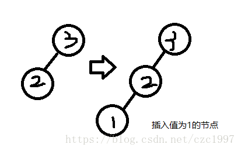
        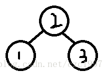
    === "RR"
        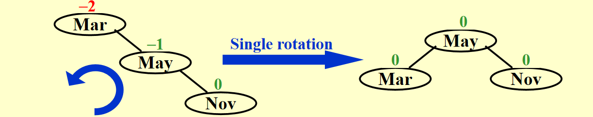
    === "RL"
        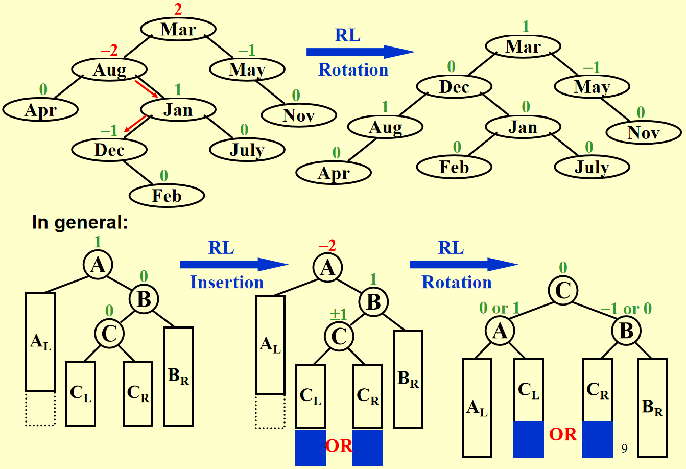
    === "LR"
        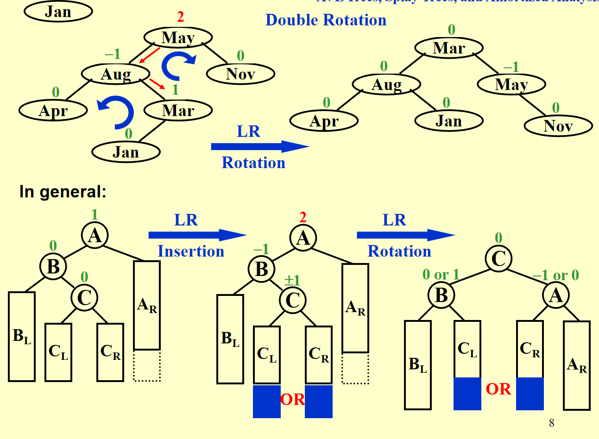

!!! info "旋转的理解"
    按我个人来看，这四种旋转都是需要先找到"Trouble Maker",即从插入的节点出发，一直向上走第一个不平衡的节点。然后，对这个节点做操作，具体可以看下面的代码实现。另外，LR与RL其实是由LL与RR组成的。

常规的维护写法：

```c title="AVL Tree"

struct avltree
{
    int data;
    struct avltree *left;
    struct avltree *right;
    int height;
};
typedef struct avltree* node;
int height(node N) {
    if (N == NULL)
        return 0;
    return N->height;
}

int max(int a, int b) {
    return (a > b) ? a : b;
}

node createnode(int key) {
    node n = (node)malloc(sizeof(struct avltree));
    n->data = key;
    n->left = NULL;
    n->right = NULL;
    n->height = 1;
    return n;
}

node rr(node y) {
    node x = y->left;
    node T2 = x->right;

    x->right = y;
    y->left = T2;

    y->height = max(height(y->left), height(y->right)) + 1;
    x->height = max(height(x->left), height(x->right)) + 1;

    return x;
}

node lr(node x) {
    node y = x->right;
    node T2 = y->left;

    y->left = x;
    x->right = T2;

    x->height = max(height(x->left), height(x->right)) + 1;
    y->height = max(height(y->left), height(y->right)) + 1;

    return y;
}

int bf(node N) {
    if (N == NULL)
        return 0;
    return height(N->left) - height(N->right);
}

node insert(node n, int key) {
    if (n == NULL)
        return createnode(key);

    if (key < n->data)
        n->left = insert(n->left, key);
    else if (key > n->data)
        n->right = insert(n->right, key);
    else
        return n;

    n->height = 1 + max(height(n->left), height(n->right));

    int bl = bf(n);

    if (bl > 1 && key < n->left->data)
        return rr(n);

    if (bl < -1 && key > n->right->data)
        return lr(n);

    if (bl > 1 && key > n->left->data) {
        n->left = lr(n->left);
        return rr(n);
    }

    if (bl < -1 && key < n->right->data) {
        n->right = rr(n->right);
        return lr(n);
    }

    return n;
}


```

---

## Splay Tree(伸展树)

### 性质
Splay树是一种自调整二叉搜索树，通过在每次访问节点后将其旋转到根节点来保持较短的访问路径。以下是Splay树的主要性质：

1. **自调整**：每次访问节点后，通过旋转操作将该节点移动到根节点，从而使得频繁访问的节点更接近根节点。
2. **二叉搜索树**：遵循二叉搜索树的性质，即左子节点小于父节点，右子节点大于父节点。
3. **旋转操作**：主要使用三种旋转操作：Zig、Zig-Zig和Zig-Zag。

#### 旋转操作：
1. **Zig**：当访问节点是根节点的左子节点或右子节点时，进行一次单旋转。
2. **Zig-Zig**：当访问节点是其父节点的左子节点，且其父节点是其祖父节点的左子节点时，进行两次单旋转。
3. **Zig-Zag**：当访问节点是其父节点的右子节点，且其父节点是其祖父节点的左子节点时，进行一次双旋转。

#### 时间复杂度：
- **摊还时间复杂度**：所有基本操作（插入、删除、查找）的摊还时间复杂度为O(log n)，其中n是树中的节点数。
- **最坏情况时间复杂度**：单次操作的最坏情况时间复杂度为O(n)，但这种情况很少发生。

!!! note "三种操作"
    访问`X`
    === "zig"
        根据左右节点的情况分别进行一次左旋和右旋即可。
    === "zig-zig"
        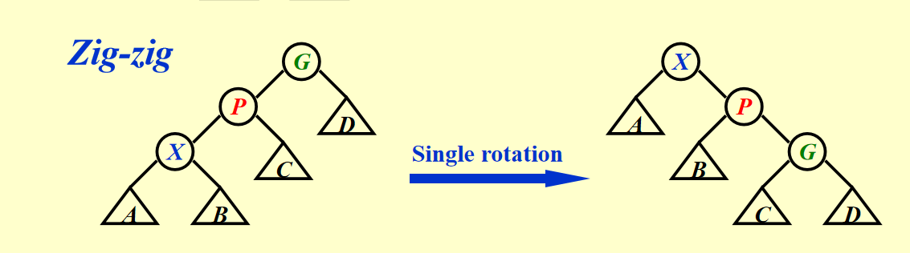
    === "zig-zag"
        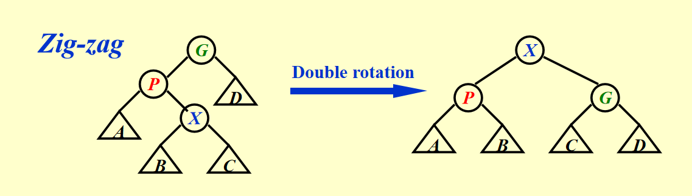

!!! warning "可能的误区"
    由于我在一开始学习zig-zig时犯过错误，所以在这里记录一下。zig-zig时先对x.grandparent作操作，再对x.parent做操作。在一开始我误以为先对x.parent作操作，再对x.grandparent作操作，延续了之前双旋转的思想，于是出问题了。
```c title="Splay Tree"

struct splaytree {
    int data;
    struct splaytree *left;
    struct splaytree *right;
};
typedef struct splaytree* node;

node rightRotate(node x) {
    node y = x->left;
    x->left = y->right;
    y->right = x;
    return y;
}

node leftRotate(node x) {
    node y = x->right;
    x->right = y->left;
    y->left = x;
    return y;
}

node splay(node root, int key) {
    if (root == NULL || root->data == key)
        return root;

    if (root->data > key) {
        if (root->left == NULL) return root;

        if (root->left->data > key) {
            root->left->left = splay(root->left->left, key);
            root = rightRotate(root);
        } else if (root->left->data < key) {
            root->left->right = splay(root->left->right, key);
            if (root->left->right != NULL)
                root->left = leftRotate(root->left);
        }
        return (root->left == NULL) ? root : rightRotate(root);
    } else {
        if (root->right == NULL) return root;

        if (root->right->data > key) {
            root->right->left = splay(root->right->left, key);
            if (root->right->left != NULL)
                root->right = rightRotate(root->right);
        } else if (root->right->data < key) {
            root->right->right = splay(root->right->right, key);
            root = leftRotate(root);
        }
        return (root->right == NULL) ? root : leftRotate(root);
    }
}

node insert(node root, int key) {
    if (root == NULL) return createnode(key);
    root = splay(root, key);
    if (root->data == key) return root;

    node newnode = createnode(key);
    if (root->data > key) {
        newnode->right = root;
        newnode->left = root->left;
        root->left = NULL;
    } else {
        newnode->left = root;
        newnode->right = root->right;
        root->right = NULL;
    }
    return newnode;
}
```

---

## 红黑树

### 红黑树的性质

- **节点颜色**：每个节点不是红色就是黑色。
- **根节点**：根节点必须是黑色。
- **叶节点**：所有叶节点（NIL节点，NIL代指NULL）都是黑色。
- **红色节点**：红色节点的子节点必须是黑色（即红色节点不能连续）。
- **黑色高度**：从任一节点到其每个叶节点的所有路径都包含相同数量的黑色节点。
- **自平衡**：通过插入和删除期间的旋转和重新着色操作保持平衡。
- **时间复杂度**：
    - **搜索**：O(log n)
    - **插入**：O(log n)
    - **删除**：O(log n)

!!! info "红黑树的叶子"
    红黑树的叶子只指NIL节点，而非常规意义上的叶子。且从红黑树的性质中可以得出，一个有N个内部节点（非NIL节点）的红黑树，其高度不超过$2\log_2(N+1)$，由以下两条推出(bh指黑高，即从根节点到NIL的一条路径上黑色结点的个数)：

    * $N \geq 2^{bh} - 1$
    * $2bh(Tree)-1 \geq h(Tree)$

---
红黑树的插入与删除都有点恶心，我将以这两个B站视频为主记录做法:

+ [插入](https://www.bilibili.com/video/BV1Xm421x7Lg)

+ [删除](https://www.bilibili.com/video/BV16m421u7Tb)

但其实插入与删除的规则都可以从保持红黑树的性质这一目的出发推测，下面在给出结论的同时附上一些个人粗浅的分析过程。

### 插入

!!! tip
    新节点插入按照二叉查找树的规则来，且默认为红色节点。且有一个隐形前提：**若发生问题，插入节点的父亲一定是红色的，插入节点的爷爷一定是黑色的**,因为红黑树中不可能出现连续的红色节点，而插入出线问题必然是违反了这个原则。

直接说结论：

+ 插入的节点为根节点->直接变黑

+ 插入节点的**叔叔**为红色->叔叔，父亲和爷爷都变色（黑变红，红变黑），并且将爷爷视为新的插入节点进行进一步操作。

+ 插入节点的**叔叔**为黑色-根据爷爷，父亲和插入节点的位置关系进行相应的LL,RR,LR,RL旋转操作，并将**最后一步**旋转时作操作的两个节点变色

--- 

**俺的图图呢？？？**

!!! info "红黑树插入图解"
    === "根节点"
        无需多言，直接变黑
        === "原来"
            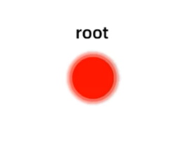
        === "后来"
            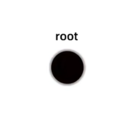
    === "黑叔叔"
        其实黑叔叔这种情况我感觉只有一种可能，就是叔叔是NIL节点。这时候我们要解决冲突问题，就要考虑把插入节点和插入节点的父亲这个两个红色节点转一个上去，并且和插入节点的爷爷一起变色。<strike>胡说八道</strike>
        === "LL"    
            === "原来"
                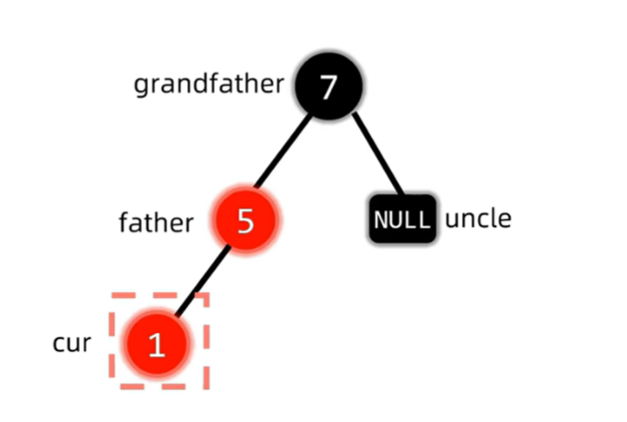
            === "后来"
                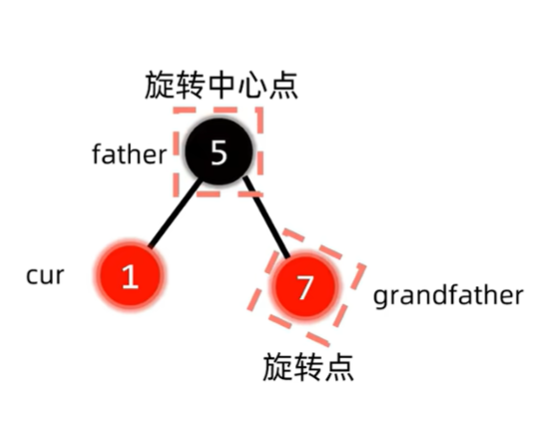
        === "RR"
            === "原来"
                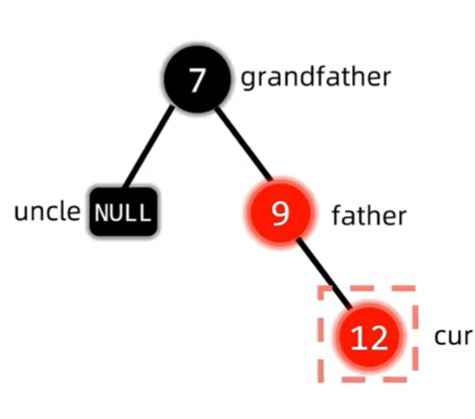
            === "后来"
                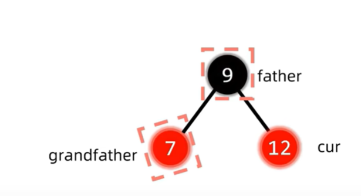
        === "LR"
            === "原来"
                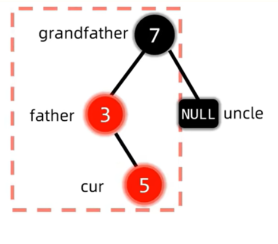
            === "后来"
                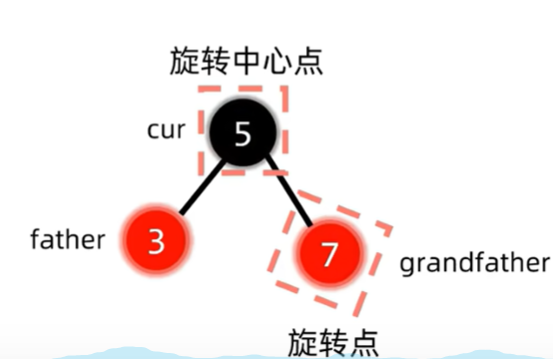
        === "RL"
            === "原来"
                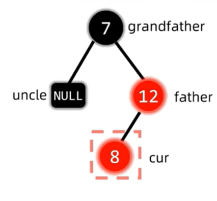
            === "后来"
                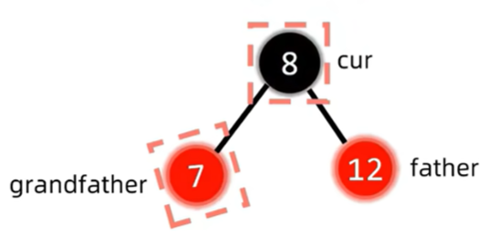
    === "红叔叔"
        这是的结构是红父亲，红叔叔，黑爷爷，为了解决插入节点与红父亲产生的双红冲突，同时保持红黑树NIL节点到顶经过黑色节点数相同的性质，我们发现，把叔父爷三者都变色，刚好解决了以上所有问题。此时我们只要继续判断变色后的红爷爷有没有出现冲突即可，这也就是上面说的将爷爷视为新的插入节点。
        === "原来"
            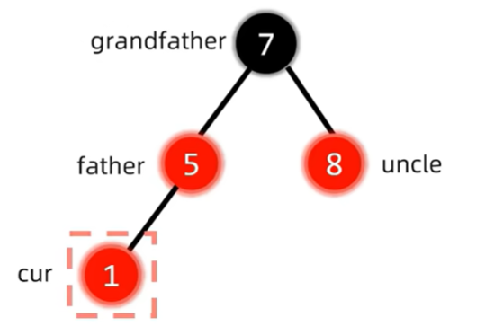
        === "后来"
            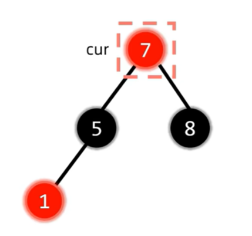

---

### 删除

来到了最最最复杂的删除。

先来回顾二叉搜索树的删除：

1. 若该节点为叶节点->直接删除

2. 若该节点有一个儿子->删除后把儿子提上来。

3. 若该节点有左儿子和右儿子->将该节点的值变为左子树里的最大值或右子树里最小值，再删除子树里的这个点。

!!! tip "发现"
    不难发现第三种情况最终可以转换为第一种或者第二种情况。因此在红黑树的删除中我们只讨论第一和第二种情况。**此外，若插入节点只有一个儿子，则其必然是黑父亲，红儿子的结构，不然无法满足路径黑节点个数相同的特性。**

---

可能反直觉的是，红黑树删除的第二中情况反而比第一种情况简单，展开讨论：

+ 若该节点只有一个儿子->用儿子替代后将儿子变黑

+ 若该节点的两个孩子都是NIL节点：
    + 若该节点为红色节点->直接删除

    + 若该节点为黑节点，先将其直接删除，但为了暂时保持红黑树的性质，我们暂时将这个节点定义为**双黑节点**，因此我们接下来的目的就是把它变回普通的单黑节点。
        + 兄弟是黑色
            + 兄弟至少有一个红色孩子：我们将兄弟，红孩子和父亲分别记为s,r,p
                + p,s,r三者为RR或LL类型->s的颜色给r，p的颜色给s，p变黑，进行相应旋转,双黑变回单黑。
                + p,s,r为RL或LR类型->p的颜色给r，p变黑，进行相应旋转,双黑变回单黑。
                + 若兄弟两个儿子都为红色，归为LL或RR一类。
            + 兄弟无红孩子，也即孩子都是NIL节点->兄弟变红，将双黑节点上移。若双黑节点遇到根节点或红色节点，直接变单黑结束，不然，重复判断。
        + 兄弟是红色->兄父变黑，父亲向双黑节点移动。此时双黑仍保持，继续作判断。

---

太复杂了，上图！

!!! info "红黑树删除图解(两个孩子都是NIL节点)"
    === "该节点为红色"
        太ez了，无图。删除之后对红黑树的性质没有任何影响。
    === "该节点为黑色"
        这时候删除就会影响红黑树的性质了。
        === "兄弟是黑色"
            兄弟是黑色的情况下，删除了原节点会导致路径黑色节点数量不一。
            === "兄弟至少有一个红色孩子"
                `d`是已经删除完的双黑节点
                === "LL"
                    === "原来"
                        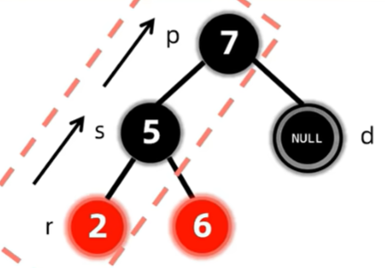
                    === "后来"
                        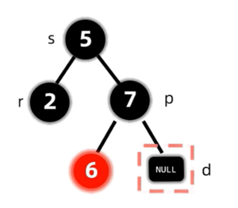
                === "RR"
                    === "原来"
                        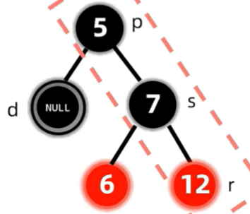
                    === "后来"
                        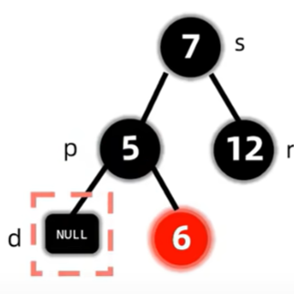
                === "LR"
                    === "原来"
                        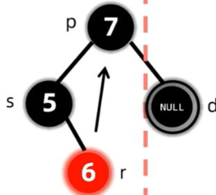
                    === "后来"
                        
                === "RL"
                    === "原来"
                        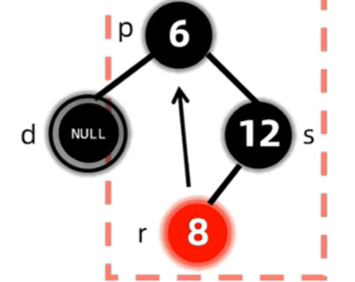
                    === "后来"
                        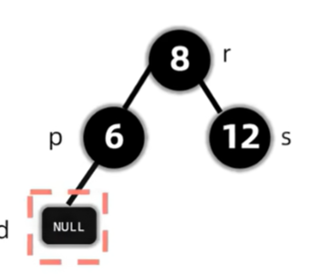
            === "兄弟两个儿子都是NIL节点"
                删除了节点后，会导致过删除节点的路径上的黑色节点个数都少一个，因此考虑先将兄弟变红，但这样只保证了这两条路径的合法性，对于整棵树来说，还是违反了路径黑色节点个数相同的原则，因此将双黑节点上移至父亲，再作修正。
                === "原来"
                    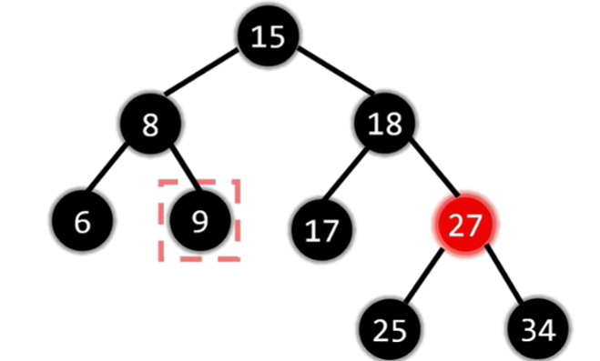
                === "兄弟变红"
                    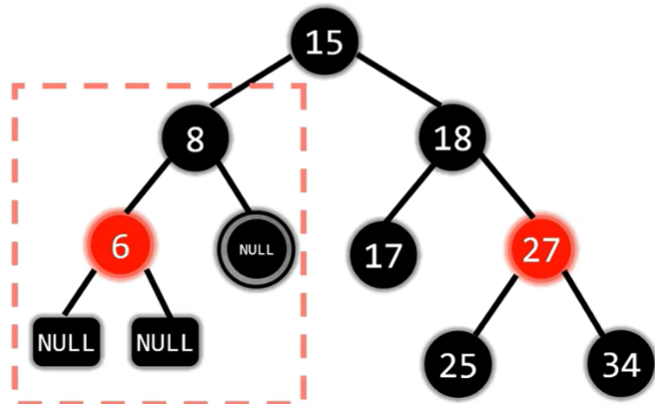
                === "双黑上移"
                    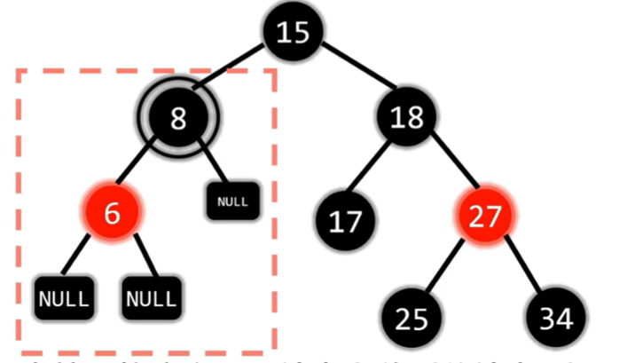
                === "继续调整至完毕"
                    现在的双黑节点在8，符合兄弟至少有一个红孩子的情况，因此调整。
                    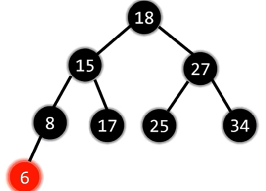
            === "兄弟是红色节点"
                此时兄弟必定有两个黑色非NIL节点的儿子。
                === "原来"
                    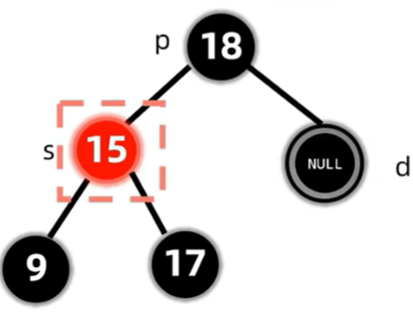
                === "兄父变色"
                    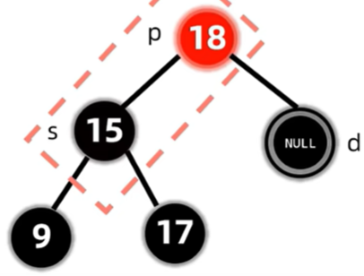
                === "向双黑节点旋转"
                    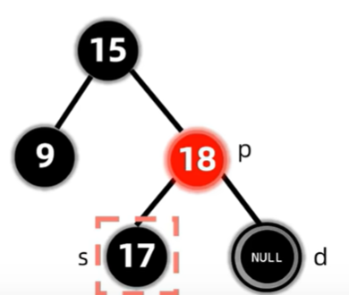
                === "继续调整至双黑消除"
                    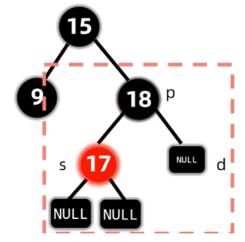

至此，我们讲完了红黑树的删除操作，怎么记？<strike>自求多福</strike>

---

### B+树

### B+树的性质

!!! note "oi  wiki"
    https://oi-wiki.org/ds/bplus-tree/

B+树的主要性质：

1. **所有叶子节点在同一层**：B+树是一种平衡树，所有叶子节点都在同一层。
2. **内部节点只存储键**：内部节点(即非叶子节点)只存储键值，不存储实际数据。实际数据存储在叶子节点中。
3. **叶子节点存储数据和指针**：叶子节点存储实际数据，并且通过指针相互连接，形成一个链表，便于范围查询。
4. **多路搜索树**：B+树是多路搜索树，每个节点可以有多个子节点。具体的子节点数量取决于树的阶（通常用m表示）。有 n 棵子树的节点中含有 n-1 个关键字（即将区间分为 n 个子区间，每个子区间对应一棵子树）。第i个关键字是第i+1棵子树里key的最小值。
5. **键值有序**：所有节点中的键值按顺序排列(一般从小到大)，便于范围查询和顺序访问。
6. **根节点特殊情况**：根节点至少有两个子节点，除非整棵树只有一个节点。
7. **节点分裂和合并**：在插入和删除操作中，节点可能会分裂或合并，以保持树的平衡性。
8. **时间复杂度**：B+树的搜索、插入和删除操作的时间复杂度均为O(log n)，其中n是树中的键值数量。

!!! info "B+树的阶"
    B+树的阶（m）决定了每个节点的最小和最大子节点数量：
    - 根节点要么是叶子，要么有[2,m]个子节点

    - 每个内部节点(除了根节点)最多有m个子节点，至少有⌈m/2⌉个子节点。同样需要删除和合并

    - 每个叶子节点最多存储m个键值，至少存储⌈m/2⌉个键值。超过m个键值需要分裂，少于[m/2]个键值需要合并

---

!!! info "B+树示例"
    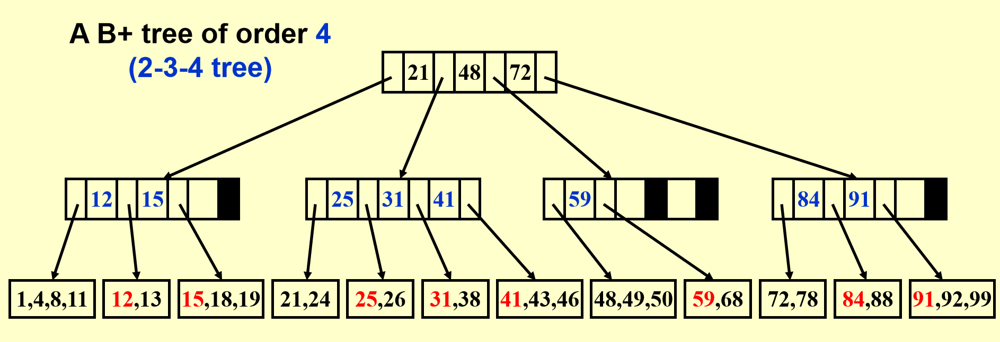

---

还是上图解，有图有真相。

!!! info "B+树操作图解"
    === "查找"
        === "Step 0"
            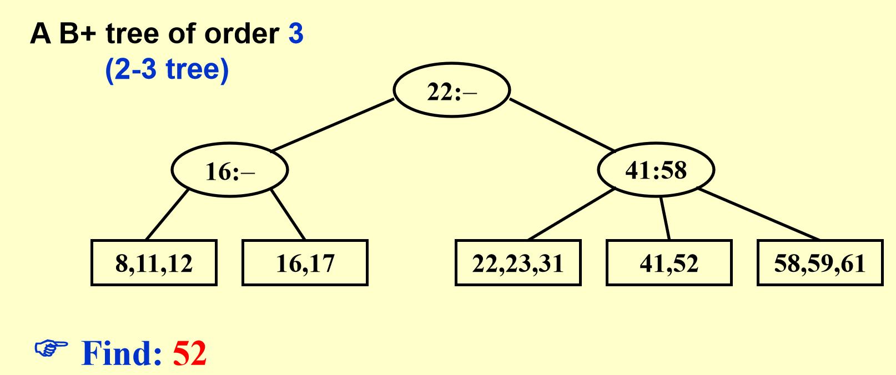
        === "Step 1"
            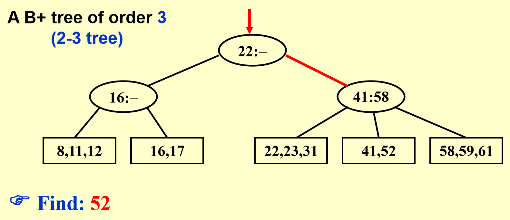
        === "Step 2"
            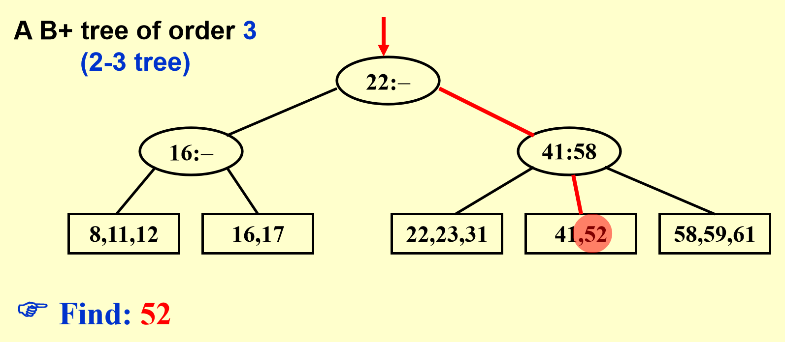
    === "插入(无分裂)"
        === "Step 0"
            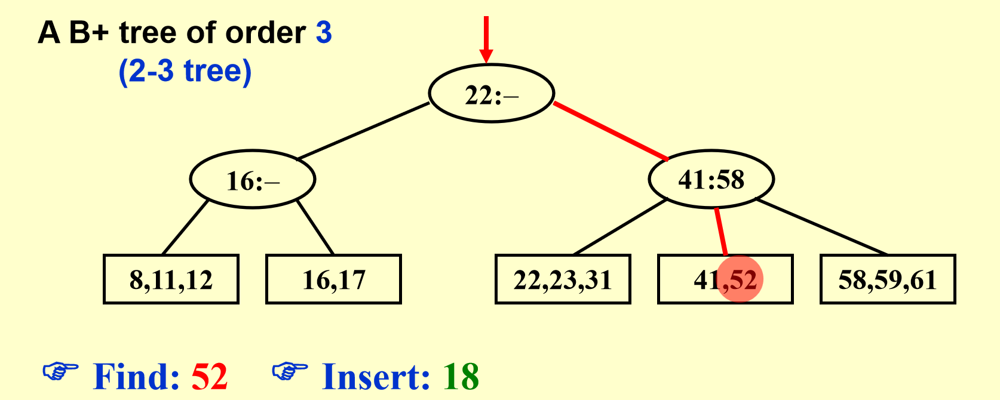
        === "Step 1"
            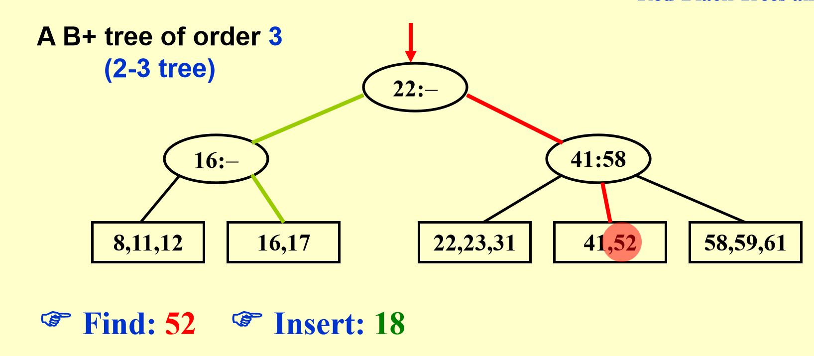
        === "Step 2"
            
    === "插入(有分裂)"
        === "Step 0"
            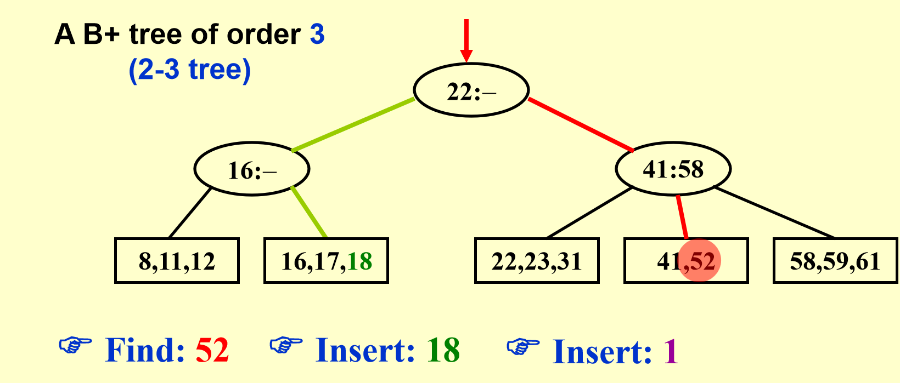
        === "Step 1"
            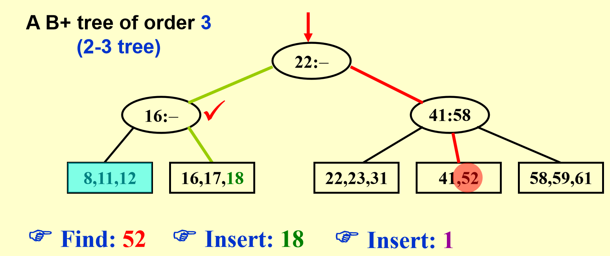
        === "Step 2"
            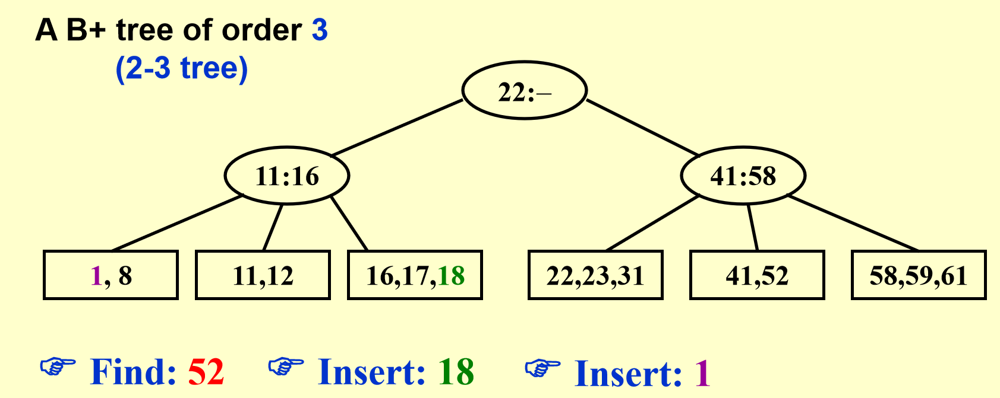

删除同理，只需要考虑合并，也即分裂的相反操作即可。
    