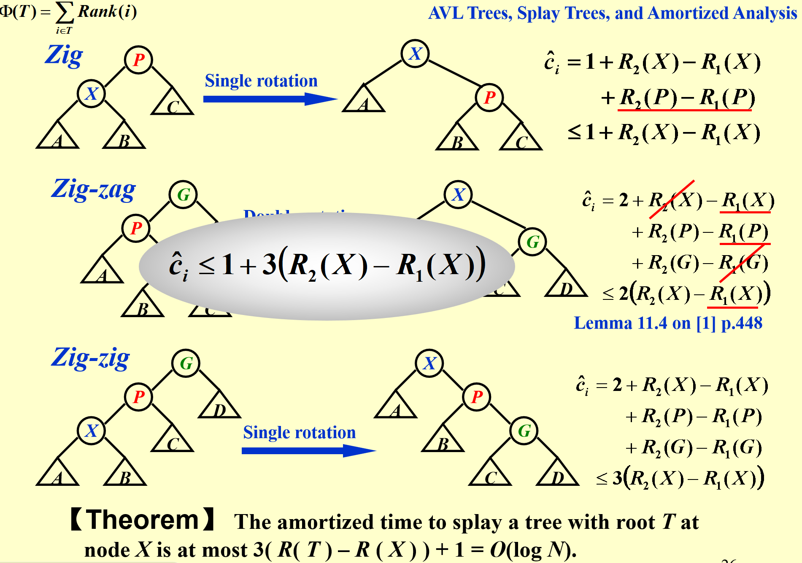
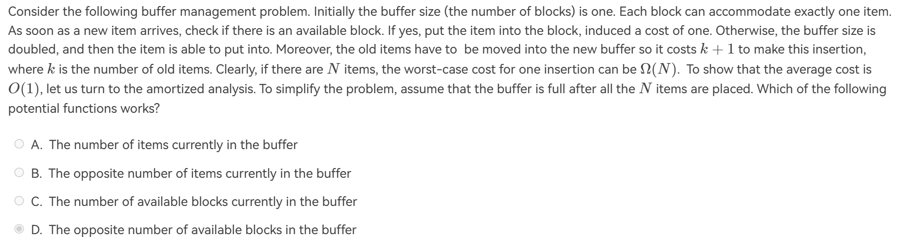

# 均摊分析
!!! info "参考资料"
    本篇目参考资料:

    + https://zh.wikipedia.org/wiki/%E5%B9%B3%E6%91%8A%E5%88%86%E6%9E%90

    + https://note.isshikih.top/cour_note/D2CX_AdvancedDataStructure/Ex01/

    + https://www.yuque.com/xianyuxuan/saltfish_shop/weekly002_amortized_analysis#KmnY6
均摊分析（Amortized Analysis）是一种分析算法复杂度的方法，旨在计算在一系列操作中每个操作的平均代价。这种分析方法特别适用于那些在最坏情况下单个操作代价很高，但在一系列操作中代价较低的算法。

 * 均摊分析的常用方法包括：
    1. 聚合分析（Aggregate Analysis）：计算一系列操作的总代价，然后除以操作次数。
    2. 记账法(Accounting method) : 执行花费较低的operations时先存credit未雨绸缪, 供未来花费较高的operations使用。对每个操作定义一个合法的平摊成本(amortized cost) .假设$c_i$为第i个操作的actual cost,$\hat{c_i}$为第i个操作的amortized cost.若 $c_i < \hat{c_i}$，则credit=$\hat{c_i}-c_i$,我们把credit存起来(deposited)，未来可以提取(withdraw) 。反之就是提取credit.总之，最后的credit需要$\geq 0$，也即$\sum_{i=1}^{n} \hat{c_i}  \geq \sum_{i=1}^{n} c_i$
    3. 势能法（Potential Method）：引入一个势能函数来表示数据结构的潜在能量变化，通过势能变化来分析操作代价。
 * 数学公式：
    * 聚合分析：T(n) = O(f(n))，其中T(n)是n次操作的总代价，f(n)是一个函数。
    * 均摊代价法：$c_i \leq  \hat{c_i}$，其中$c_i$是第i次操作的均摊代价。
    * 势能法：$c_i + Φ(D_i) - Φ(D_{i-1}) =  \hat{c_i}$，其中$c_i$是第i次操作的实际代价，Φ是势能函数，$D_i$是第i次操作后的数据结构状态。因此$\sum_{i=1}^{n}\hat{c_i} = \sum_{i=1}^{n} c_i +\Phi(D_n)-\Phi(D_{1})$
在这里我们主要介绍势能法。

---

## 势能法

!!! note "一言以蔽之"
    势能函数的核心就两句话：

    + 尽量使初始状态的势能最小

    + 对于实际开销大的步骤，要通过势能函数使$\hat{c_i}$小下来

### 例子

#### 栈
假设我们现在有一个栈，可以进行如下操作：

+ push一个元素，代价1

+ pop一个元素，代价1

+ Multipop`k`个元素，代价`k`

现在我们来思考一个势能函数，能够满足上面的要求。

> 势能函数的核心就两句话：
>
> + 尽量使初始状态的势能最小
>
> + 对于实际开销大的步骤，要通过势能函数使$\hat{c_i}$小下来

开销最大的步骤明显是Multipop,那么要使它的$\hat{c_i}$降下来，我们必须考虑一个势能函数使得$\Phi(D_i)<<\Phi(D_{i-1})$,同时还要满足初始时整个结构的势能最小。**欸**，我们想到，可以定义$\Phi(D_i)=sizeof(D_i),sizeof(D_i)$指$D_i$下栈的元素个数。分析如下：

+ push:$\hat{c_i}=c_i+\Phi(D_i)-\Phi(D_{i-1})=1+1=2$

+ pop:$\hat{c_i}=c_i+\Phi(D_i)-\Phi(D_{i-1})=1 - 1=0$

+ Multipop:$\hat{c_i}=c_i+\Phi(D_i)-\Phi(D_{i-1})=k-k=0$

则$\sum_{i=1}^n \hat{c_i}=\sum_{i=1}^n O(1)=O(n) \geq \sum_{i=1}^{n} c_i,故T_{amortized}=\frac{O(n)}{n}=O(1)$

#### Splay Tree

Splay Tree的三个操作分析起来有点复杂，并且包含了一些数学放缩，因此在这里不涉及了，放一张PPT上的图。

!!! info "Splay Tree"
    

### 例题

!!! info "题目"
    === "T1"
        
        ??? note "解析"
            先分析所有操作：

            + Available Block insert:开销1

            + Inadequate Block insert and move:开销k+1
            再次，牢记势能函数的核心：
            > 势能函数的核心就两句话：
            >
            > + 尽量使初始状态的势能最小
            >
            > + 对于实际开销大的步骤，要通过势能函数使$\hat{c_i}$小下来.

            先来看第一条原则
            > 尽量使初始状态的势能最小
            
            可以直接排除掉B选项，C我感觉也可以排，但是说不清，先留着。然后再看这个结构开销最大的操作是Inadequate Block insert and move，因此我们的势能函数需要满足的特点是:在扩容后$\Phi(D_i)$大大减少，这时就可以看出D选项的合理性了。再来具体分析。应用D选项的势能函数后:

            + Available Block insert:$\hat{c_i}=c_i+\Phi(D_i)-\Phi(D_{i-1})=1+1=2$

            + Inadequate Block insert and move:$\hat{c_i}=c_i+\Phi(D_i)-\Phi(D_{i-1})=k+1 - k+1=2$

            则 

            $$\sum_{i=1}^n \hat(c_i)=\sum_{i=1}^n O(1)=O(n) \geq \sum_{i=1}^{n} c_i$$

            故
            
            $$T_{amortized}=\frac{O(n)}{n}=O(1)$$
<!--本页总访问量次
本页总访客数  人-->
