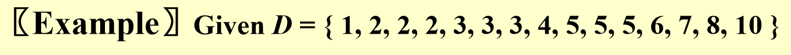
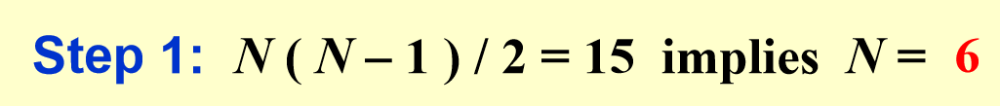
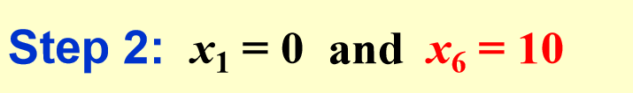
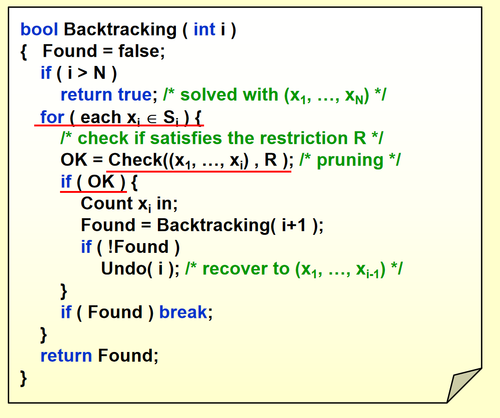
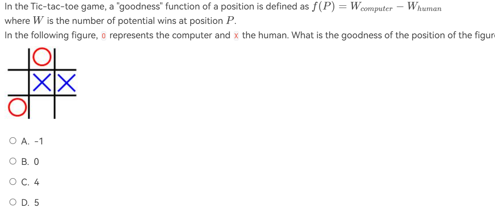
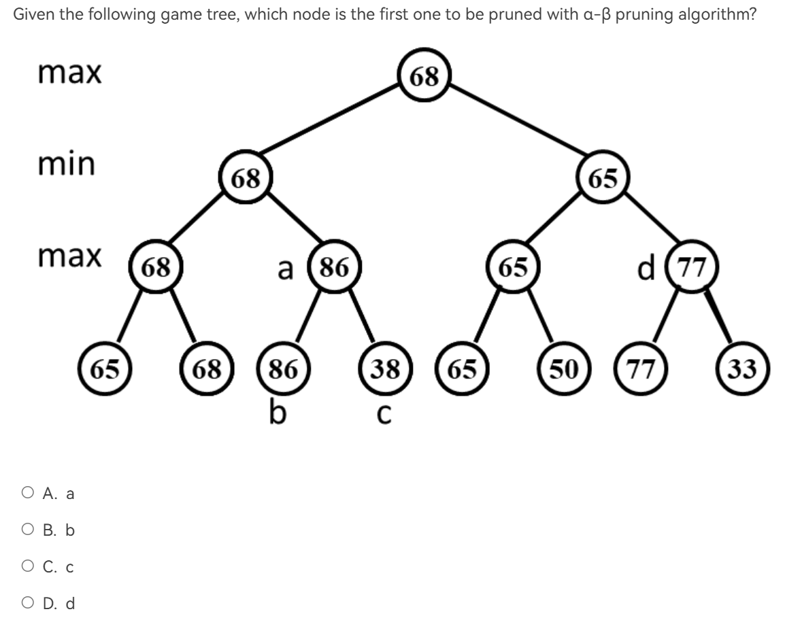
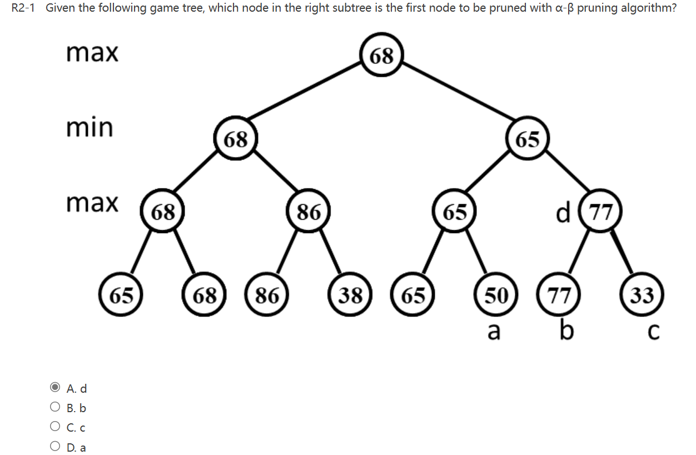

<link rel="stylesheet" type="text/css" href="../../../css/styles.css">

# Backtracking

!!! info "参考资料"
    wiki : https://zh.wikipedia.org/wiki/%E5%9B%9E%E6%BA%AF%E6%B3%95

## 简要的介绍 from PPT

The basic idea is that suppose we have a partial solution ( $x_1$, ... , $x_i$ ) where each $x_k \in S_k$ for  $1 \leq k \leq i < n$.   First we add  $x_{i+1} \in S_{i+1}$ and check if ( $x_1$, ... , $x_i$, $x_{i+1}$ ) satisfies the constrains.  If the answer is “yes” we continue to add the next x, else we delete $x_i$ and backtrack to the previous partial solution ( $x_1$, ... , $x_{i-1}$ ).

## 八皇后问题

八皇后问题是一个以国际象棋为背景的问题：如何能够在8×8的国际象棋棋盘上放置八个皇后，使得任何一个皇后都无法直接吃掉其他的皇后？为了达到此目的，任两个皇后都不能处于同一条横行、纵行或斜线上。

为减少答案表示的复杂度，我们作如下规定：

!!! note "答案表示"
    令答案$S_i = {x_1,x_2,x_3,x_4,x_5,x_6,x_7,x_8}$,其中$x_i$表示第i行皇后所在的列数。这很显然是正确的，因为必然每一行都有且仅有一个皇后。

现在，我们来思考这个问题有哪些约束。

!!! note "constrains"

    1. $S_i$有8位，每一位数字都是1-8之间的一个。这将答案个数缩减到$8^8$

    2. $x_i \neq x_j $ if $i \neq j$.这是显然的，因为不可能有两个皇后在同一列。答案缩减到$8!$

    3. $\frac{x_i-x_j}{i-j} \neq \pm 1$,这是为了确保对角线上不会攻击。

---

然后，我们就可以使用深度优先搜索的思想，来遍历所有可能，找到答案。

```c title="code in c for n queens puzzles"
#include <stdio.h>

#define QUEENS       8 /* 皇后数量 */
#define IS_OUTPUT    1 /* (IS_OUTPUT=0 or 1)，Output用于选择是否输出具体解,为1输出，为0不输出 */

/* 定义辅助数组和变量 */
int A[QUEENS + 1], B[QUEENS * 3 + 1], C[QUEENS * 3 + 1], k[QUEENS + 1][QUEENS + 1];
int inc, *a = A, *b = B + QUEENS, *c = C;
/*  a[j] 记录第 j 列是否有皇后。如果 a[j] 为 1，表示第 j 列已经有皇后；如果为 0，表示第 j 列没有皇后。
b[j - i] 记录从左上到右下的对角线是否有皇后。对角线的索引是 j - i，如果 b[j - i] 为 1，表示该对角线上已经有皇后；如果为 0，表示该对角线上没有皇后。
c[j + i] 记录从右上到左下的对角线是否有皇后。对角线的索引是 j + i，如果 c[j + i] 为 1，表示该对角线上已经有皇后；如果为 0，表示该对角线上没有皇后。
 */
/* 递归函数，用于在第i行放置皇后 */
void lay(int i) {
  int j = 0, t, u;

  /* 尝试在第i行的每一列放置皇后 */
  while (++j <= QUEENS)
    /* 检查当前位置是否安全（没有冲突） */
    if (a[j] + b[j - i] + c[j + i] == 0) {
      /* 放置皇后，并标记相关数组 */
      k[i][j] = a[j] = b[j - i] = c[j + i] = 1;
      /* 如果还没有放置完所有皇后，递归调用lay函数 */
      if (i < QUEENS) lay(i + 1);
      else {
        /* 如果已经放置了所有皇后，增加解的数量 */
        ++inc;
        /* 如果IS_OUTPUT为1，输出当前解 */
        if (IS_OUTPUT) {
          for (printf("(%d)\n", inc), u = QUEENS + 1; --u; printf("\n"))
            for (t = QUEENS + 1; --t; ) k[t][u] ? printf("Q ") : printf("+ ");
          printf("\n\n\n");
        }
      }
      /* 回溯，撤销当前皇后的放置 */
      a[j] = b[j - i] = c[j + i] = k[i][j] = 0;
    }
}

/* 主函数 */
int main(void) {
  /* 从第一行开始放置皇后 */
  lay(1);
  /* 输出总共找到的解的数量 */
  printf("%d皇后共计%d个解\n", QUEENS, inc);
  return 0;
}
```


---

## The Turnpike Reconstruction Problem

公路重建问题（The Turnpike Reconstruction Problem）是一个经典的组合优化问题。其目标是根据给定的一组点之间的距离，重建这些点的原始位置。

### 问题描述

假设有 $n$ 个点 $x_1, x_2, ..., x_n$，它们在一条直线上。已知这些点之间的所有两两距离 $d_{ij} = |x_i - x_j|$，其中 $1 \leq i < j \leq n$。（很显然，有 $\frac{N(N-1)}{2}$ 个距离）公路重建问题要求根据这些距离重建点的原始位置。

### 数学描述

给定一个距离集合 $D = \{d_{ij} | 1 \leq i < j \leq n\}$，重建点集 $X = \{x_1, x_2, ..., x_n\}$，使得对于任意的 $i, j$，$d_{ij} = |x_i - x_j|$。我们假设离起点最近的点为$x_1$,在坐标$x=0$处。

### 解题思路

!!! example "例子"
    === "Step 0"
        假设我们现在有一个距离集合
        
    === "Step 1"
        由距离得到点的个数
        
    === "Step 2"
        发现起始点和最远的点。
        
    === "Step 3"
        找到第二大的距离开始尝试。在本例中，第二大距离是8，有两种可能：
        
        1. 第二远的点$x_5$距离$x_1$为8
        
        2. 第二近的点距离$x_6$为8
        
        
        由此画出一棵树。
        
        
        
        之后不断尝试，检查距离是否满足条件即可。

### 代码实现

```cpp title="cpp实现"
#include <iostream>
#include <vector>
#include <unordered_set>
#include <cmath>
#include <algorithm>

using namespace std;

int Find_Max(const unordered_set<int>& D) {
    return *max_element(D.begin(), D.end());
}

bool Check(int value, const vector<int>& X, int N, int left, int right) {
    for (int i = 1; i < left; i++) {
        if (D.find(abs(value - X[i])) == D.end()) {
            return false;
        }
    }
    for (int i = right + 1; i <= N; i++) {
        if (D.find(abs(value - X[i])) == D.end()) {
            return false;
        }
    }
    return true;
}
/* X[1]...X[left-1] and X[right+1]...X[N] are solved */
bool Reconstruct(vector<int>& X, unordered_set<int>& D, int N, int left, int right) {
    if (D.empty()) {
        return true;
    }

    int D_max = Find_Max(D);
    bool Found = false;

    // Option 1: X[right] = D_max
    if (Check(D_max, X, N, left, right)) {
        X[right] = D_max;
        for (int i = 1; i < left; i++) {
            D.erase(abs(X[right] - X[i]));
        }
        for (int i = right + 1; i <= N; i++) {
            D.erase(abs(X[right] - X[i]));
        }
        Found = Reconstruct(X, D, N, left, right - 1);
        if (!Found) {
            for (int i = 1; i < left; i++) {
                D.insert(abs(X[right] - X[i]));
            }
            for (int i = right + 1; i <= N; i++) {
                D.insert(abs(X[right] - X[i]));
            }
        }
    }

    // Option 2: X[left] = X[N] - D_max
    if (!Found) {
        if (Check(X[N] - D_max, X, N, left, right)) {
            X[left] = X[N] - D_max;
            for (int i = 1; i < left; i++) {
                D.erase(abs(X[left] - X[i]));
            }
            for (int i = right + 1; i <= N; i++) {
                D.erase(abs(X[left] - X[i]));
            }
            Found = Reconstruct(X, D, N, left + 1, right);
            if (!Found) {
                for (int i = 1; i < left; i++) {
                    D.insert(abs(X[left] - X[i]));
                }
                for (int i = right + 1; i <= N; i++) {
                    D.insert(abs(X[left] - X[i]));
                }
            }
        }
    }

    return Found;
}

int main() {
    int n;
    cout << "输入点的数量: ";
    cin >> n;

    int dist_count = n * (n - 1) / 2;
    unordered_set<int> distances;
    cout << "输入所有两两距离: ";
    for (int i = 0; i < dist_count; i++) {
        int d;
        cin >> d;
        distances.insert(d);
    }

    vector<int> points(n + 1);
    points[1] = 0;
    points[n] = *distances.rbegin();

    if (Reconstruct(points, distances, n, 2, n - 1)) {
        cout << "重建的点位置: ";
        for (int i = 1; i <= n; i++) {
            cout << points[i] << " ";
        }
        cout << endl;
    } else {
        cout << "无法重建点位置" << endl;
    }

    return 0;
}
```

---

## 总结

回溯算法的总体套路。





## $\alpha - \beta$剪枝

我认为讲得很清楚的[一篇帖子](https://zhuanlan.zhihu.com/p/658351019)，还有[oiwiki](https://oi-wiki.org/search/alpha-beta/#alpha-beta-%E5%89%AA%E6%9E%9D)，有空<strike>(大概率不会)</strike>再码

## 例题

!!! example "例题"
    === "T1"
        
        ??? general "解析"
            3-3=0，选B
    === "T2"
        
        ??? general "解析"
            按照深度优先搜索的顺序，我们访问到a的父亲，此时a的父亲的$\beta$为68，而a的$\alpha$为86（先访问了b），此时$\alpha > \beta$，已经不会有意义了，所以不再需要访问c，也就是c被剪枝了。选C

    === "T3"
        
        ??? general "解析"
            和上一道题一样，a肯定是有必要访问的，不然我们都不知道a的父亲会是多少。在访问了a之后，我们确定a的父亲是65，因此a的爷爷会取的值必然$\leq 65$。我们之后访问到b是77，那么d必然$geq 77$，但它的父亲又$\leq 65$，因此剩下的c就没必要访问了。选C。