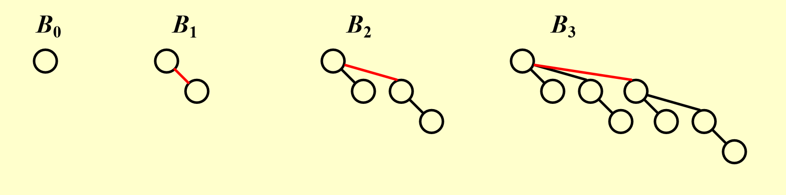
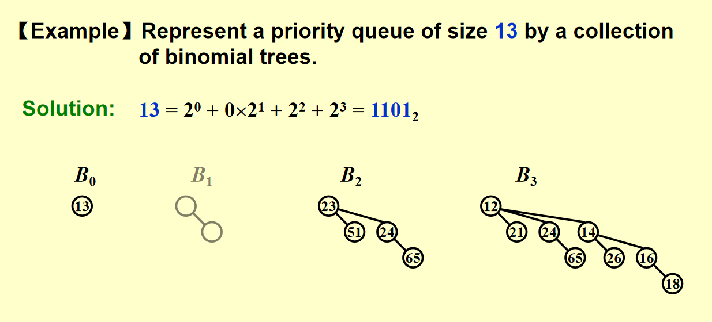
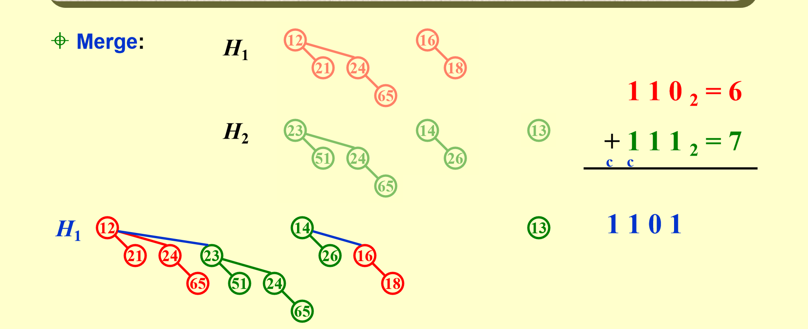

<link rel="stylesheet" type="text/css" href="../../../css/styles.css">


<script defer src="https://vercount.one/js"></script>

# Binomial Queue

!!! link "资料"
    wiki:https://zh.wikipedia.org/wiki/%E4%BA%8C%E9%A1%B9%E5%A0%86

## 二项树定义与性质

+ 度数为0的二项树只包含一个节点
+ 度数为k的二项树是由一颗度数为$k-1$的二项树直接插到另一颗度数为$k-1$的二项树根下，含有k个节点，共ingk层
+ 度数为k的二项树有k个孩子，分别为度数为0，1，...,k-1的二项树
+ 度数为k的二项树在第d层有$C_{k}^{d}$个节点

!!! example "例子"
    
    可以看出上述所有性质，比如度为3的二项树各层节点数为1，3，3，1，可以联想到杨辉三角的第三层。

## 二项队列

### 概念
二项队列就是有一堆二项树组成，每个二项树满足堆的性质(大顶堆/小顶堆)。
!!! example "例子"
    例如，如果一个二项队列有13个元素，$13=(1101)_2$,即由一颗度为0，一颗度为2，一颗度为3的二项树组成
    

### 操作

#### FindMin

可以用一个指针标记最值。因此时间复杂度可以是$O(1)$。如果没有标记，遍历根的话，是$O(\log(N))$

#### Merge

两个二项队列的合并就是把度相同的二项树合并。

其实也可以看成是二进制数相加

```plaintext

       110

    +  111

    ------

      1101

```
因此就有三棵树，度分别为3，2，0，由此我们也可以推出合并的时间复杂度是$O(\log(N))$,因为二进制有$\log(N)$位
!!! example "例子"
    


#### Insert
特殊的merge.我们想使用均摊分析法，证明N个连续的Insert可以是$O(N)$的时间复杂度

##### 聚合分析法

!!! info "发现"
    如果我们把二项队列看成一个二进制数...

    + n=....0,cost=1
    + n=....01,cost=2
    + n=....011,cost=3
    + n=....0111,cost=4
    我们发现，开销实际上就是根据低位连续的1的个数来决定。那么N步插入，每种情况各出现多少次呢？
    ??? tip "发现"

        + 对于n=....0的情况，有一半的插入情况是这样

        + 对于n=....01的情况，有$\frac{1}{2} * \frac{1}{2}=\frac{1}{4}$

        + ...

        因此，总开销为$\frac{n}{2}*1+\frac{n}{4}*2+...=2N$

        均摊下来就是常数时间。


##### 势能法
我们不妨思考，哪一步的开销最大？显然是当发生进位，也即我们需要删除树并合并树的情况，不然，直接创造树即可。根据均摊分析的原则，让开销大的步骤尽可能小下来，我们作如下规定：

!!! info "前提"
    + $\hat{c_i}=c_i+\Phi(D_i)-\Phi(D_{i-1})$

    + $\Phi(D_i)=$number of trees after the ith insertion
    
如果某步Insertion$c_i$的cost为k，那么必然是除了一次创建以外，合并了k-1次，也即树的个数减少了$k-2$(第一步合并后$\Phi(D_i)=\Phi(D_{i-1})$)

因此$\hat{c_i}=c_i+\Phi(D_i)-\Phi(D_{i-1})=k-(k-2)=2$

$\therefore T_{\text{amortized}}=\frac{2N}{N}=2$


#### DeleteMin
以下步骤：

1. FindMin:$O(\log(N))$

2. remove(移除最小值作为根的树):$O(1)$

3. 移除根，原来的树被拆分：$O(\log(N))$

4. merge:$O(\log(N))$

### code

#### 数据结构定义

```c title="数据结构"
typedef int ElementType
typedef struct BinNode *Position;
typedef struct Collection *BinQueue;
typedef struct BinNode *BinTree;  /* missing from p.176 */

struct BinNode 
{ 
	ElementType	    Element;
	Position	    LeftChild;
	Position 	    NextSibling;
} ;

struct Collection 
{ 
	int	    	CurrentSize;  /* total number of nodes */
	BinTree	TheTrees[ MaxTrees ];
} ;

```

#### Merge

```c title="同大小的树合并"
BinTree CombineTrees( BinTree T1, BinTree T2 )
{  /* merge equal-sized T1 and T2 */
	if ( T1->Element > T2->Element )
		/* attach the larger one to the smaller one */
		return CombineTrees( T2, T1 );
	/* insert T2 to the front of the children list of T1 */
	T2->NextSibling = T1->LeftChild;
	T1->LeftChild = T2;
	return T1;
}

```

```c title="总的合并"
BinQueue  Merge( BinQueue H1, BinQueue H2 )
{	BinTree T1, T2, Carry = NULL; 	
	int i, j;
	if ( H1->CurrentSize + H2-> CurrentSize > Capacity )  ErrorMessage();
	H1->CurrentSize += H2-> CurrentSize;
	for ( i=0, j=1; j<= H1->CurrentSize; i++, j*=2 ) {
	    T1 = H1->TheTrees[i]; T2 = H2->TheTrees[i]; /*current trees */
	    switch( 4*!!Carry + 2*!!T2 + !!T1 ) { 
		case 0: /* 000 */
	 	case 1: /* 001 */  break;	
		case 2: /* 010 */  H1->TheTrees[i] = T2; H2->TheTrees[i] = NULL; break;
		case 4: /* 100 */  H1->TheTrees[i] = Carry; Carry = NULL; break;
		case 3: /* 011 */  Carry = CombineTrees( T1, T2 );
			            H1->TheTrees[i] = H2->TheTrees[i] = NULL; break;
		case 5: /* 101 */  Carry = CombineTrees( T1, Carry );
			            H1->TheTrees[i] = NULL; break;
		case 6: /* 110 */  Carry = CombineTrees( T2, Carry );
			            H2->TheTrees[i] = NULL; break;
		case 7: /* 111 */  H1->TheTrees[i] = Carry; 
			            Carry = CombineTrees( T1, T2 ); 
			            H2->TheTrees[i] = NULL; break;
	    } /* end switch */
	} /* end for-loop */
	return H1;
}

```

#### DeleteMin

```c title="DeleteMin"
ElementType  DeleteMin( BinQueue H )
{	BinQueue DeletedQueue; 
	Position DeletedTree, OldRoot;
	ElementType MinItem = Infinity;  /* the minimum item to be returned */	
	int i, j, MinTree; /* MinTree is the index of the tree with the minimum item */

	if ( IsEmpty( H ) )  {  PrintErrorMessage();  return –Infinity; }

	for ( i = 0; i < MaxTrees; i++) {  /* Step 1: find the minimum item */
	    if( H->TheTrees[i] && H->TheTrees[i]->Element < MinItem ) { 
		MinItem = H->TheTrees[i]->Element;  MinTree = i;    } /* end if */
	} /* end for-i-loop */
	DeletedTree = H->TheTrees[ MinTree ];  
	H->TheTrees[ MinTree ] = NULL;   /* Step 2: remove the MinTree from H => H’ */ 
	OldRoot = DeletedTree;   /* Step 3.1: remove the root */ 
	DeletedTree = DeletedTree->LeftChild;   free(OldRoot);
	DeletedQueue = Initialize();   /* Step 3.2: create H” */ 
	DeletedQueue->CurrentSize = ( 1<<MinTree ) – 1;  /* 2MinTree – 1 */
	for ( j = MinTree – 1; j >= 0; j – – ) {  
	    DeletedQueue->TheTrees[j] = DeletedTree;
	    DeletedTree = DeletedTree->NextSibling;
	    DeletedQueue->TheTrees[j]->NextSibling = NULL;
	} /* end for-j-loop */
	H->CurrentSize  – = DeletedQueue->CurrentSize + 1;
	H = Merge( H, DeletedQueue ); /* Step 4: merge H’ and H” */ 
	return MinItem;
}
```
<span id="busuanzi_container_page_pv">本页总访问量<span id="busuanzi_value_page_pv"></span>次</span>
<span id="busuanzi_container_page_uv">本页总访客数 <span id="busuanzi_value_page_uv"></span> 人</span>