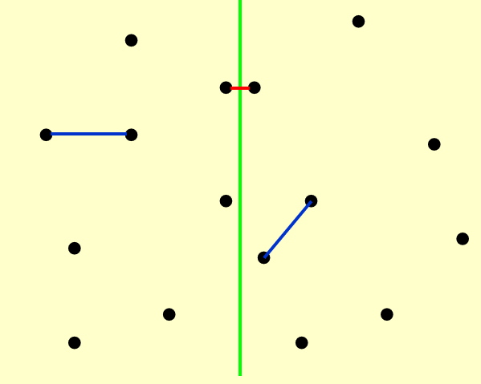

# 分治法

!!! info "wiki"
    https://zh.wikipedia.org/wiki/%E5%88%86%E6%B2%BB%E6%B3%95

## 概念

分治法的基本思想是:

1. 把一个复杂问题分解为几个小问题

2. 递归解决这些子问题，得到解

3. 组合解，得到总体的解。

## 最近点问题

一个平面上有N个点。现想要找到距离最近的一对点。

### 最简单想法

遍历每一个组合，共$\frac{N(N-1)}{2}$对，时间复杂度为$O(N^2)$

### 分治思想

!!! tip "划分"
    取一条线将这些点分割，于是我们需要计算:

    1. 右半部分的最短距离

    2. 左半部分的最短距离

    3. 中间交叉部分的最短距离

    然后比较这三者的大小。

    

#### 复杂度思考

如果计算交叉部分的最短距离的时间复杂度是线性的话，

$$T(N) = 2T\left(\frac{N}{2}\right) + cN$$

$$= 2 \left[ 2T\left(\frac{N}{2^2}\right) + \frac{cN}{2} \right] + cN$$

$$= 2^2 T\left(\frac{N}{2^2}\right) + 2cN$$

$$= \dots$$

$$= 2^k T\left(\frac{N}{2^k}\right) + kcN$$

$$= N + c N\log N = O(N \log N)(\exists k,N \approx 2^k)$$

然而，如果时间复杂度是平方的话：

$$T(N) = 2T\left(\frac{N}{2}\right) + cN^2 \\$$

$$= 2 \left[ 2T\left(\frac{N}{2^2}\right) + \frac{cN^2}{2^2} \right] + cN^2 \\$$

$$= 2^2 T\left(\frac{N}{2^2}\right) + cN^2 \left(1 + \frac{1}{2}\right) \\$$

$$= \dots \\$$

$$= 2^k T\left(\frac{N}{2^k}\right) + cN^2 \left(1 + \frac{1}{2} + \dots + \frac{1}{2^{k-1}} \right) \\$$

$$= O(N^2)$$

因此，我们现在需要重点关注的就是计算交叉部分距离的时间复杂度。

假设在第一二步中，我们得到的最短距离为$\delta$，那么在计算中间交叉处的最小值时，不妨先在水平方向上作出约束。因为在这个情况下待求解的点对，必然是分居两侧的。倘若它们的水平距离已经大于$\delta$,那必然不是我们需要的最短距离。因此作如下划分:

    

考虑了水平方向上的限制，为什么我们不考虑竖直方向上的限制呢？加上竖直方向上距离的限制，我们会发现，对于任一点$p_i$，与它距离可能小于$\delta$的点只会出现在一个$\delta \times 2\delta$的 矩形中。更进一步，矩形的左侧与右侧的点还必须满足距离大于等于$\delta$的限制(因为在同一边的点相互之间最短的距离为$\delta$)。在这样的矩形中，最多有8个这样的点(考虑重叠):

    

这就意味着，对于每一个待查询点的点，我们查询的次数是常数级的，而所有的带查询点最多也不过是$O(N)$量级的，因此我们论证了中间部分的计算是线性时间复杂度，因此根据[上面](#复杂度思考)的推导，解决这个问题的时间复杂度是$O(N\log(N))$

## 递归复杂度分析

对于分析如下形式的式子的时间复杂度时

$$T(N) = aT(\frac{N}{b}) + f(N)$$

我们有三种方法。

> 有以下两点要注意

>1. 忽略$\frac{N}{b}$ 是否为整数
>2. 认为对于很小的N来说，$T(N)= \Theta(1)$

### Substitution method(替代法)

替代法的思路很简单，我们先通过直觉或者其他什么方法看出可能的时间复杂度是多少，再通过归纳法的手段证明。

!!! example "例子"
    === "正确例子"
        $$ T(N) = 2T(\lfloor N/2 \rfloor) + N $$

        **我们猜测**  
        $$ T(N) = O(N \log N) $$

        **证明:** 假设对 $\forall m,m < N $成立, 特别是 $ m = \lfloor N/2 \rfloor $.

        因此存在常数 $ c > 0 $ 使得  
        $$ T(\lfloor N/2 \rfloor) \leq c \lfloor N/2 \rfloor \log \lfloor N/2 \rfloor $$.

        代入得：

        $$
        T(N) = 2T(\lfloor N/2 \rfloor) + N
        $$

        $$
        \leq 2c \lfloor N/2 \rfloor \log \lfloor N/2 \rfloor + N
        $$

        $$
        \leq cN(\log N - \log 2) +N
        $$

        因此只要c够大，我们就有上式$ \leq cN\log N$,i.e. $T(N) = O(N \ log N)$