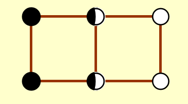
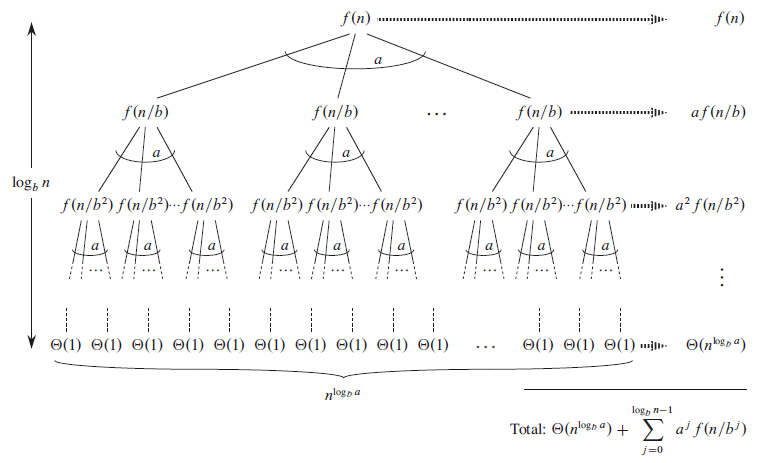

# 分治法

!!! info "wiki"
    https://zh.wikipedia.org/wiki/%E5%88%86%E6%B2%BB%E6%B3%95

## 概念

分治法的基本思想是:

1. 把一个复杂问题分解为几个小问题

2. 递归解决这些子问题，得到解

3. 组合解，得到总体的解。

## 最近点问题

一个平面上有N个点。现想要找到距离最近的一对点。

### 最简单想法

遍历每一个组合，共$\frac{N(N-1)}{2}$对，时间复杂度为$O(N^2)$

### 分治思想

!!! tip "划分"
    取一条线将这些点分割，于是我们需要计算:

    1. 右半部分的最短距离

    2. 左半部分的最短距离

    3. 中间交叉部分的最短距离

    然后比较这三者的大小。

    

---

#### 复杂度思考

如果计算交叉部分的最短距离的时间复杂度是线性的话，

$$T(N) = 2T\left(\frac{N}{2}\right) + cN$$

$$= 2 \left[ 2T\left(\frac{N}{2^2}\right) + \frac{cN}{2} \right] + cN$$

$$= 2^2 T\left(\frac{N}{2^2}\right) + 2cN$$

$$= \dots$$

$$= 2^k T\left(\frac{N}{2^k}\right) + kcN$$

$$= N + c N\log N = O(N \log N)(\exists k,N \approx 2^k)$$

然而，如果时间复杂度是平方的话：

$$T(N) = 2T\left(\frac{N}{2}\right) + cN^2 \\$$

$$= 2 \left[ 2T\left(\frac{N}{2^2}\right) + \frac{cN^2}{2^2} \right] + cN^2 \\$$

$$= 2^2 T\left(\frac{N}{2^2}\right) + cN^2 \left(1 + \frac{1}{2}\right) \\$$

$$= \dots \\$$

$$= 2^k T\left(\frac{N}{2^k}\right) + cN^2 \left(1 + \frac{1}{2} + \dots + \frac{1}{2^{k-1}} \right) \\$$

$$= O(N^2)$$

因此，我们现在需要重点关注的就是计算交叉部分距离的时间复杂度。

假设在第一二步中，我们得到的最短距离为$\delta$，那么在计算中间交叉处的最小值时，不妨先在水平方向上作出约束。因为在这个情况下待求解的点对，必然是分居两侧的。倘若它们的水平距离已经大于$\delta$,那必然不是我们需要的最短距离。因此作如下划分:

    

考虑了水平方向上的限制，为什么我们不考虑竖直方向上的限制呢？加上竖直方向上距离的限制，我们会发现，对于任一点$p_i$，与它距离可能小于$\delta$的点只会出现在一个$\delta \times 2\delta$的 矩形中。更进一步，矩形的左侧与右侧的点还必须满足距离大于等于$\delta$的限制(因为在同一边的点相互之间最短的距离为$\delta$)。在这样的矩形中，最多有8个这样的点(考虑重叠):

    

这就意味着，对于每一个待查询点的点，我们查询的次数是常数级的，而所有的带查询点最多也不过是$O(N)$量级的，因此我们论证了中间部分的计算是线性时间复杂度，因此根据[上面](#复杂度思考)的推导，解决这个问题的时间复杂度是$O(N\log(N))$

---

## 递归复杂度分析

对于分析如下形式的式子的时间复杂度时

$$T(N) = aT(\frac{N}{b}) + f(N)$$

我们有三种方法。

> 有以下两点要注意

>1. 忽略$\frac{N}{b}$ 是否为整数
>2. 认为对于很小的N来说，$T(N)= \Theta(1)$

---

### Substitution method(替代法)

替代法的思路很简单，我们先通过直觉或者其他什么方法看出可能的时间复杂度是多少，再通过归纳法的手段证明。

!!! example "例子"
    以下面这个递推式为例：$$ T(N) = 2T(\lfloor N/2 \rfloor) + N $$
    === "正确做法"
        $$ T(N) = 2T(\lfloor N/2 \rfloor) + N $$

        **我们猜测**  
        $$ T(N) = O(N \log N) $$

        **证明:** 假设对 $\forall m,m < N $成立, 特别是 $ m = \lfloor N/2 \rfloor $.

        因此存在常数 $ c > 0 $ 使得  
        $$ T(\lfloor N/2 \rfloor) \leq c \lfloor N/2 \rfloor \log \lfloor N/2 \rfloor $$.

        代入得：

        $$
        T(N) = 2T(\lfloor N/2 \rfloor) + N
        $$

        $$
        \leq 2c \lfloor N/2 \rfloor \log \lfloor N/2 \rfloor + N
        $$

        $$
        \leq cN(\log N - \log 2) +N
        $$

        因此只要c够大，我们就有上式$ \leq cN\log N$,i.e. $T(N) = O(N \ log N)$
    
    === "错误做法"
         **我们猜测**  
        $$ T(N) = O(N ) $$

        **证明:** 假设对 $\forall m,m < N $成立, 特别是 $ m = \lfloor N/2 \rfloor $.

        因此存在常数 $ c > 0 $ 使得  
        $$ T(\lfloor N/2 \rfloor) \leq c \lfloor N/2 \rfloor$$.

        代入得：

        $$
        T(N) = 2T(\lfloor N/2 \rfloor) + N
        $$

        $$
        \leq 2c \lfloor N/2 \rfloor + N
        $$

        $$
        \leq cN +N = O(N)
        $$

        ??? general "错在哪里"
            假如在 $T(N) = 2T(\lfloor N/2 \rfloor) + N$处不直接放缩，而是再往下写一步，得到

            $$T(N)=2(2T(\frac{N}{4})+\frac{N}{2})+N$$

            $$=4T(\frac{N}{4})+2N$$

            $$\leq cN + 2N$$
            
            这说明了什么？倘若我们一直写下去，就会得到$T(N) = cN + N \log N$,与猜测是矛盾的。

----

### Recursion-tree method(递归树法)

递归树法的思路在于将分割为子问题的过程画成一颗树的情况，更加形象地分析时间复杂度。

!!! tip "数学技巧"
    在使用递归树法之前，我们必须要知道一个数学等式：

    $$a^{\log_b^n} = n^{\log_b^a}$$

    ??? general "证明"

        $$a^{\log_b^N} = \exp^{\log_b^N \ln a}$$

        $$= \exp ^{\frac{\ln(a) \ln(N)}{\ln(b)}}$$

        $$= \exp^{\ln(N) \frac{\ln a}{\ln b}}$$

        $$= N^{\log_b^a}$$

至于如何使用，以PPT上的一个例子来说明

!!! example
    

    解释：

    + 我们认为$T(1) = \Theta(1)$

    + 有$3^{\log_4^N}$个$T(1)$

----

### Master method(主方法)

我愿称之为背公式大法。

!!! definition

    设 $a \geq 1$ 且 $b > 1$ 为常数，设 $f(N)$ 为一个函数，并且 $T(N)$ 在非负整数上由递推关系 $T(N) = aT(N/b) + f(N)$ 定义。那么我们可以根据$f(N)$的情况直接得出$T(N)$的时间复杂度。

---

#### 形式一

!!! info
    1. 若 $f(N)=O(N^{(\log_b{a})-\varepsilon}), \text{ 对于某些 }\varepsilon>0$，那么 $T(N)=\Theta(N^{\log_b{a}})$；
    2. 若 $f(N)=\Theta(N^{\log_b{a}})$，那么 $T(N)=\Theta(N^{\log_b{a}}\log{N})$；
    3. 若 $f(N)=\Omega(N^{(\log_b{a})+\varepsilon}), \text{ 对于某些 }\varepsilon>0$ 且 $af(\frac{N}{b})<cf(N), \text{ 对于 } c<1 \text{ 与 } \forall N > N_0$，那么 $T(N)=\Theta(f(N))$；

##### 证明

首先，使用递归树证明，得到如下图：

    

所以我们得到 

$$T(N)=\Theta(n^{\log_b^a})+\sum_{j=0}^{\log_b^n -1} a^jf(\frac{n}{b^j})$$

下面对三种情况展开证明

!!! tip "证明"
    === "情况一"
        我们直接考虑$\sum_{j=0}^{\log_b^n -1} a^jf(\frac{n}{b^j})$
        由于$f(N)=O(N^{(\log_b{a})-\varepsilon})$，于是

        $$
        \begin{aligned}
        \sum_{j=0}^{\log _{b} N-1} a^{j} f\left(N / b^{j}\right) & =O\left(\sum_{j=0}^{\log _{b} N-1} a^{j}\left(\frac{N}{b^{j}}\right)^{\log _{b} a-\varepsilon}\right)\\
        & =O\left(N^{\log _{b} a-\varepsilon} \sum_{j=0}^{\log _{b} N-1}\left(\frac{a b^{\varepsilon}}{b^{\log _{b} a}}\right)^{j}\right) \\
        & =O\left(N^{\log _{b} a-\varepsilon} \sum_{j=0}^{\log _{b} N-1}\left(b^{\varepsilon}\right)^{j}\right)\\
        & =O\left(N^{\log _{b} a-\varepsilon} \frac{b^{\varepsilon \log _{b} N}-1}{b^{\varepsilon}-1}\right) \\
        & =O\left(N^{\log _{b} a-\varepsilon} N^{\varepsilon}\right)\\
        & =O\left(N^{\log _{b} a}\right) \\
        T(N) & =\Theta\left(N^{\log _{b} a}\right)+O\left(N^{\log _{b} a}\right)=\Theta\left(N^{\log _{b} a}\right)
        \end{aligned}
        $$

    === "情况二"

        已知$f(N)=\Theta(N^{\log_b{a}})$。
        则

        \begin{aligned}
        T(N)
        &= \Theta(N^{\log_b{a}}) + \sum_{j=0}^{(\log_b{N})-1}a^j\Theta\left(\left(\frac{N}{b^j}\right)^{\log_b{a}}\right) \\
        &= \Theta(N^{\log_b{a}}) + \Theta\left(
            N^{\log_b{a}} \times
            \sum_{j=0}^{(\log_b{N})-1}\left(\frac{a}{b^{\log_b{a}}}\right)^j
        \right) \\
        &= \Theta(N^{\log_b{a}}) + \Theta\left(
            N^{\log_b{a}} \times
            \log_b{N}
        \right) \\
        &= \Theta(N^{\log_b{a}}\log{N})
        \end{aligned}

    === "情况三"
        $f(N)=\Omega(N^{(\log_b{a})+\varepsilon}), \text{ 对于某些 }\varepsilon>0$ 且 $af(\frac{N}{b})<cf(N), \text{ 对于 } c<1 \text{ 与 } \forall N > N_0$

        ??? tip "引理"

            $$
            a^jf(\frac{N}{b^j}) < c\times a^{j-1}f(\frac{N}{b^{j-1}}) < ... < c^j f(N)
            $$

        应用引理，我们有：

        $$
        \begin{aligned}
            T(N) 
            &< \Theta(N^{\log_b{a}}) + \sum_{j=0}^{(\log_b{N})-1}c^j f(N) \\
            &= \Theta(N^{\log_b{a}}) + f(N) \sum_{j=0}^{(\log_b{N})-1}c^j \\
            &= \Theta(N^{\log_b{a}}) + f(N) \times \frac{1-c^{\log_b{N}}}{1-c} \\
            &= \Theta(N^{\log_b{a}}) + f(N) \times \frac{1-N^{\log_b{c}}}{1-c}
        \end{aligned}        
        $$

        而由于 $c<1$，所以 $\log_b{c} < 0$；而 $N > 0,\text{而且通常也大于}1$，所以 $N^{\log_b{c}} \in (0,1)$。因此，对于确定的 $c$，我们有 $\frac{1-N^{\log_b{c}}}{1-c} \in \left(0, \frac{1}{1-c}\right)$；

        因此，上式便能改变为：

        $$
        \begin{aligned}
            T(N) 
            &< \Theta(N^{\log_b{a}}) + f(N) \times \frac{1-N^{\log_b{c}}}{1-c} \\
            &< \Theta(N^{\log_b{a}}) + f(N) \times \frac{1}{1-c}
        \end{aligned}
        $$

        回想$f(N)=\Omega(N^{(\log_b{a})+\varepsilon})$,因此我们可以看出$T(N) = O(f(N))$

        另外有

        $$
        \begin{aligned}
        T(N)
        &= \Theta(N^{\log_b{a}}) + \sum_{j = 0}^{(\log_b{N})-1} a^j f(\frac{N}{b^j})
        &\geq \sum_{j = 0}^{(\log_b{N})-1} a^j f(\frac{N}{b^j})
        &\geq f(N)
        \end{aligned}
        $$

        由此得到 $T(N) = \Omega(f(N))$，最终证得 $T(N) = \Theta(f(N))$

#### 形式二

!!! info
    1. 若 $af(\frac{N}{b}) = \kappa f(N) \text{ 对于确定的 } \kappa < 1$，那么 $T(N) = \Theta(f(N))$
    2. 若 $af(\frac{N}{b}) = K f(N) \text{ 对于确定的 } K > 1$，那么 $T(N) = \Theta(N^{\log_b{a}})$
    3. 若 $af(\frac{N}{b}) = f(N)$，那么 $T(N) = \Theta(f(N) \log_b N)$

#### 形式三

!!! info
    特别的，若$T(N)$满足

    $$
    \begin{aligned}
    & T(N) = a T(\frac{n}{b}) + \Theta(N^k \log^p{N})
    &  a \geq 1,\; b > 1,\; p \geq 0
    \end{aligned}
    $$

    其复杂度的结论为：

    $$
    T(N) = \left\{
    \begin{aligned}
        & O(N^{\log_b{a}}) & \text{若 } a > b^{k} \\
        & O(N^k \log^{p+1}{N}) & \text{若 } a = b^{k} \\
        & O(N^k \log^{p}{N}) & \text{若 } a < b^{k}
    \end{aligned}
    \right.
    $$

## 例题

!!! note "例题"
    === "T1"
        
        ??? general "解析"
            a=8,b=3,$f(N) = O(N^2 \log N)$,$a \lt b^k$，所以可以得出选A。
    === "T2"
        
        考虑主方法
        ??? general "解析"
            A，$T(N)=2T(N/3)+O(N)$，则 $N^{\log_ba}=N^{\log_32}<N$，$T=O(N)$

            B，$T(N)=2T(N/3)+O(N\log N)$，则 $N^{\log_ba}=N^{\log_32}<N<N\log N$，$T=O(N\log N)$

            C，$T(N)=3T(N/2)+O(N)$，则 $N^{\log_ba}=N^{\log_23}>N$，$T=O(N^{\log_23})$

            D，$T(N)=3T(N/3)+O(N\log N)$，则 $N^{\log_ba}=N$，$T=O(N\log^2 N)$

            故选C。
    
    === "T3"
        
        ??? general "解析"
            $a=3,b=3,f(N)=N$,由主函数形式一可知，$T(N)=\Theta(N^{\log_b^a}\log N)=\Theta(N\log N)$
    
    === "T4"
        
        ??? general "解析"

            $$T(n)=2^k T(n^{\frac{1}{2^k}})+k \log n$$

            不妨考虑$n^{\frac{1}{2^k}}$是某一常数，则$k = \log \log n$

            则$T(n) = O(\log n + \log \log n \log n)=O(\log \log n \log n)$