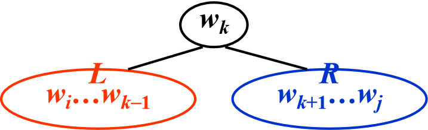

<link rel="stylesheet" type="text/css" href="../../../css/styles.css">


# 动态规划

## 定义

动态规划（Dynamic Programming，简称DP）是一种通过把原问题分解为相对简单的子问题的方式求解复杂问题的方法。它的核心思想是：如果一个问题可以通过更小规模的子问题求解，且子问题会重复出现，那么可以通过存储子问题的解来避免重复计算。

## 一般做法

1. 确定状态和状态变量
    - 思考问题的最后一步
    - 定义子问题

2. 确定状态转移方程
    - 找出状态之间的关系
    - 写出递推式

3. 确定初始条件和边界条件
    - 设定初始状态的值
    - 考虑特殊情况

4. 确定计算顺序
    - 一般从小到大
    - 确保计算某状态时所依赖的状态已经求出

5. 空间优化（可选）
    - 观察状态转移是否可以优化
    - 考虑使用滚动数组等技巧

在[这里](../../article/out/DP.md)有一些题。


---

## 矩阵乘法的顺序

!!! info
    对于两个矩阵相乘，$M_{n \times p} \times M_{p \times r}$,时间花费为$n \times p \times r$

    证明是显然的。目标矩阵有$n \times r$个元素，每个元素是由p对元素相乘得到。

假设我们要相乘4个矩阵：

\( M_1 \, [10 \times 20] \times M_2 \, [20 \times 50] \times M_3 \, [50 \times 1] \times M_4 \, [1 \times 100] \)

如果按照以下顺序相乘：

\[
M_1 \, [10 \times 20] \times (M_2 \, [20 \times 50] \times (M_3 \, [50 \times 1] \times M_4 \, [1 \times 100]))
\]

则计算时间为：

\[
50 \times 1 \times 100 + 20 \times 50 \times 100 + 10 \times 20 \times 100 = 125,000
\]

如果按照以下顺序相乘：

\[
((M_1 \, [10 \times 20] \times (M_2 \, [20 \times 50] \times M_3 \, [50 \times 1])) \times M_4 \, [1 \times 100])
\]

则计算时间为：

\[
20 \times 50 \times 1 + 10 \times 20 \times 1 + 10 \times 1 \times 100 = 2,200
\]

**问题**：按照哪种顺序计算 \( n \) 个矩阵的乘积能够使计算时间最小？

### 思路

令 \( b_n \) 表示计算 \( M_1 \cdot M_2 \cdots M_n \) 的不同方法的数量。则我们有：
\( b_2 = 1, b_3 = 2, b_4 = 5, \cdots \)

令 \( M_{ij} = M_i \cdots M_j \)。那么 \( M_{1n} = M_1 \cdots M_n = M_{1i} \cdot M_{i+1 \, n} \)

因此，
$$
b_n = \sum_{i=1}^{n-1} b_i b_{n-i} \quad \text{当} \, n > 1 \, \text{且} \, b_1 = 1
$$

\[
b_n = O\left( \frac{4^n}{n^{3/2}} \right) \quad \text{** Catalan 数 **}
\]

假设我们要相乘 \( n \) 个矩阵 \( M_1 * \cdots * M_n \)，其中 \( M_i \) 是一个 \( r_{i-1} \times r_i \) 的矩阵。令 \( m_{ij} \) 表示计算 \( M_i * \cdots * M_j \) 的最优方式的代价。

则我们有以下递推关系：

\[
m_{ij} = 
\begin{cases} 
0 & \text{如果} \, i = j \\
\min\{ m_{il} + m_{l+1 \, j} + r_{i-1} r_l r_j \} & \text{如果} \, j > i \, \text{且} \, i \leq l < j 
\end{cases}
\]

!!! info
    这里最后要加上$r_{i-1} r_l r_j$是因为在计算完$m_{il} + m_{l+1 \, j}$后，我们剩下要做的是$M_{r-1 \times l} \times M_{l \times j}$,由上面的引理可知。

```c
#include <limits.h>

#define Infinity LONG_MAX
typedef long TwoDimArray[][/* size */];

void OptMatrix(const long r[], int N, TwoDimArray M) 
{
    int i, j, k, L;
    long ThisM;
    for(i = 1; i <= N; i++)
        M[i][i] = 0;
    for(k = 1; k < N; k++) /* k = j - i */
        for(i = 1; i <= N - k; i++) { /* For each position */
            j = i + k;
            M[i][j] = Infinity;//M[i][j]代表了从M_i乘到M_j的最小开销
            for(L = i; L < j; L++) {
                ThisM = M[i][L] + M[L+1][j] + r[i-1] * r[L] * r[j];
                if(ThisM < M[i][j]) /* Update min */
                    M[i][j] = ThisM;
            } /* end for-L */
        } /* end for-k */
}

```

---

## 最佳二叉搜索树

**目标：** 最佳二叉搜索树适用于高效的静态查找（即不涉及插入和删除操作）。给定一个按照顺序排列的单词列表 \( w_1 < w_2 < \dots < w_N \)，其中每个单词 \( w_i \) 的查找概率为 \( p_i \)。我们的目标是将这些单词排列成一棵二叉搜索树，以使期望的总访问时间最小化。

**优化目标：** 最小化期望的总访问时间 \( T(N) \)，定义如下：
\[
T(N) = \sum_{i=1}^{N} p_i \cdot (1 + d_i)
\]
其中，\( d_i \) 表示单词 \( w_i \) 在二叉搜索树中的深度。

### 示例

给定下表中的单词及其查找概率：

| 单词       | break | case | char | do  | return | switch | void |
|------------|-------|------|------|-----|--------|--------|------|
| 概率       | 0.22  | 0.18 | 0.20 | 0.05 | 0.25   | 0.02   | 0.08 |

问题是将这些单词以最佳方式构建成一棵二叉搜索树，使得根据给定的概率，期望的总访问时间最小。

### 思路

#### 定义

- \( T_{i j} ::= \) OBST for \( w_{i},\ldots\ldots, w_{j} \) (i < j)

- \( c_{i j} ::= \) cost of \( T_{i j} \) $(c_{i i} = 0 if j < i)$

- \( r_{i j} ::= \) root of \( T_{i j} \)

- \( w_{i j} ::= \) weight of \( T_{i j} = \sum_{k=i}^{j} p_{k} \) $(w_{i i} = p_{i})$

#### 权重和成本计算

<div style="text-align: center;">
    
</div>

$$
\begin{align*}
c_{i j} &= p_{k} + \text{cost}(L) + \text{cost}(R) + \text{weight}(L) + \text{weight}(R) \\
        &= p_k + c_{i, k-1} + c_{k+1, j} + w_{i, k-1} + w_{k+1, j} \\
        &= w_{i j} + c_{i, k-1} + c_{k+1, j}
\end{align*}
$$

??? general "为什么这里要加上weight(L)和weight(R)"
    因为在计算cost(L)与cost(R)的时候，子树的高度是减少1的。

    回想计算公式:
    > \[
    > T(N) = \sum_{i=1}^{N} p_i \cdot (1 + d_i)
    > \]

    我们需要把减少的加回来，因此要加上weight(L)和weight(R)

#### 最优子树条件

- \( T_{i j} \) is optimal \( \Rightarrow r_{i j} = k \) is such that

  $ c_{i j} = \min_{i<l\leq j}\left\{ w_{i j} + c_{i, l-1} + c_{l+1, j} \right\} $

  $ i < l \leq j $

## All-Pairs Shortest Path

如何找到一个图中任意两点之间的最短路径？


使用[弗洛伊德-沃舍尔算法](https://zh.wikipedia.org/wiki/Floyd-Warshall%E7%AE%97%E6%B3%95)

也是动态规划。
