# 外部排序

时间匆忙，参考[这里](https://note.isshikih.top/cour_note/D2CX_AdvancedDataStructure/Lec15/)。

<!-- 当数据量很大时，我们无法把所有的数据都放到内存中进行排序，但是如果数据被存储在硬盘上，会有什么影响?

正如计算机组成已经学过的，在硬盘上读取数据需要先找到盘片，然后找到磁道，然后等待磁头旋转到对应的扇区下，这个过程是非常耗时的。所以，如果我们要对硬盘上的数据进行排序，我们不能简单地把所有数据读取到内存中进行排序，而是需要一种特殊的排序方法，这就是外部排序。

假设内存同时一共可以处理三个数据，而现有的待排序数据如下:

    

---

我们每次读三个数据排序，交替写入硬盘T2与T3中，结果如下:

    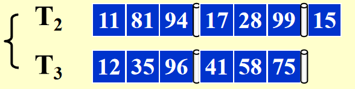

这个时候一组有序序列包含三个数据。

---

??? question "为什么排完的数据不写回T1?"
    因为T1也是一个硬盘，当我们排序完一组数据后，磁头已经移动到下一组数据的扇区了，如果我们要写回T1，就需要等待磁头移动到T1的扇区，这样会浪费很多时间。所以我们选择了交替写入T2和T3。

然后，对T2与T3中的数据归并，交替放在T1与T4中，结果如下:

    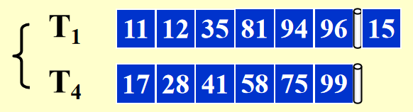

    
这个时候一组有序序列包含六个数据。

---

最后，再对T1与T4中的数据归并，交替放在T2与T3中，结果如下:

    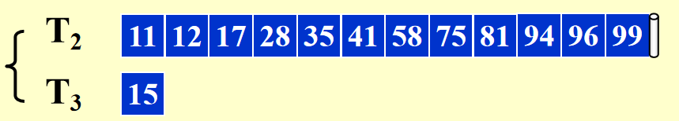

这个时候一组有序序列包含十二个数据。

---

此时Number of Passes为:

$$
1 + \lceil\log_2 {N/M}\rceil
$$

为了减少Passes的数目，我们考虑增大对数的底数，也就是K-way merge sort。

总的过程如下:

1. 

    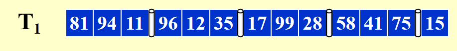

2. 

    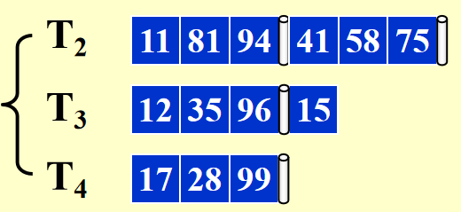

3. 

    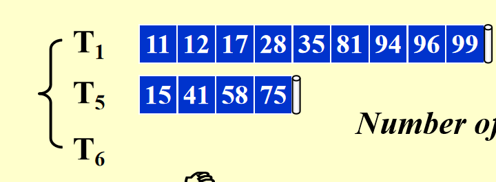

此时，Number of Passes为:

$$
1 + \lceil\log_K {N/M}\rceil
$$

是快了很多，但是这需要2k个硬盘！！！

---

## 使用更少的磁盘

### 为2-way merge sort使用两个磁盘

最聪明的做法是设计斐波那契数。

!!! "runs"
    runs可以理解为排好序的一组数据

!!! success "Smart Spilt"
    通过尝试将每个硬盘里的runs个数设为斐波那契数，可以使得最后的Passes数目最少。
    === "Step1"
        
    === "Step2"
        
    === "Step3"
        
    === "Step4"
        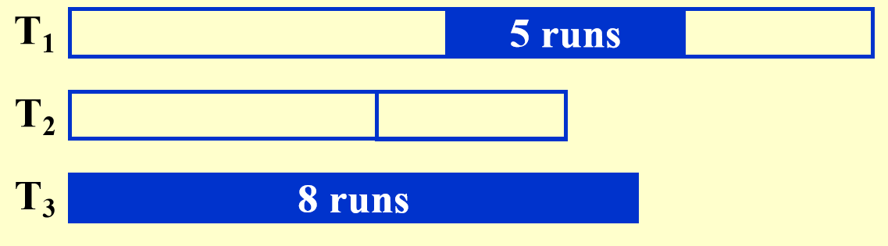
    === "Step5"
        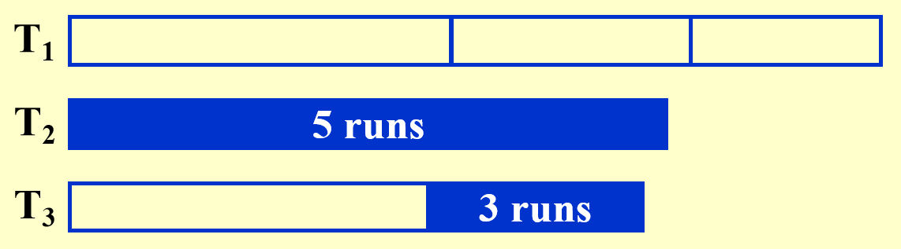
    === "Step6"
        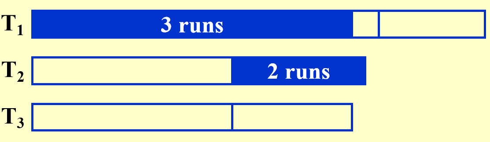
    === "Step7"
        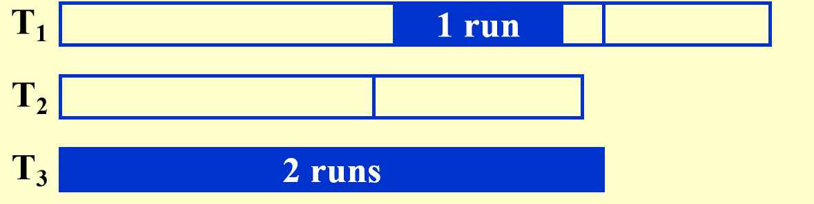
    === "Step8"
        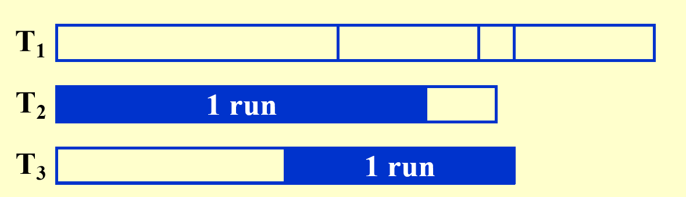
    === "Step9"
        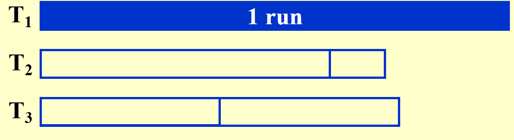

---

我们得出结论:

对于`k`-way merge sort，最好的方法是把runs的数目分别分割为`k`阶斐波那契数。

!!! definition "k阶斐波那契数"
    $$
    F_N^k = F_{N-1}^k + F_{N-2}^k + \cdots + F_{N-k}^k

    F_N^k = \begin{cases}
    0 & N = 1, 2, \cdots, k-2 \\
    1 & N = k-1 \\
    F_{N-1}^k + F_{N-2}^k + \cdots + F_{N-k}^k & N > k
    \end{cases}

    也不难发现我们平常说的斐波那契数就是2阶斐波那契数。

在这样的情况下，只需要`k`+1个硬盘。

---

## How to handle the buffers for parallel operation?

给出结论:对于k-way merge sort，我们需要2k个input buffers和2个output buffer。

k的增大也不一定是好事，它会导致seek time的增加，所以我们需要权衡。

    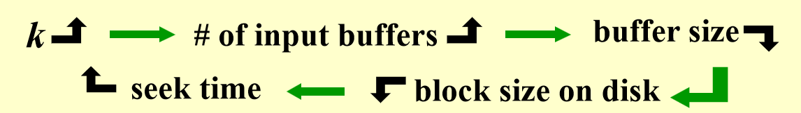

## Replacement selection

思考，runs的个数是不是一定受内存限制?

如果使用 -->

## 例题

!!! example "例题"
    === "T1"
        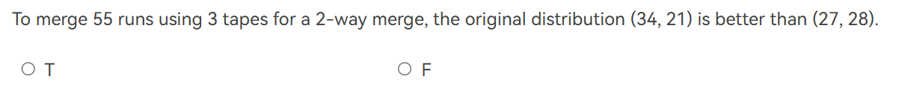
        ??? general "解答"
            T.正如课上所讲的，以斐波那契数分割runs的方法，可以使得最后的Passes数目最少。

    === "T2"
        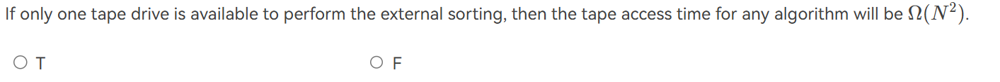
        ??? general "解答"
            T.由于只有一个磁带机，寻道时间会变长。

    === "T3"
        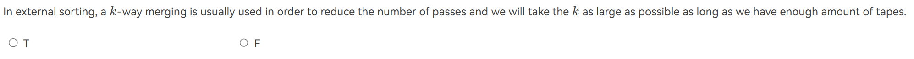
        ??? general "解答"
            F.K不能越大越好

    === "T4"
        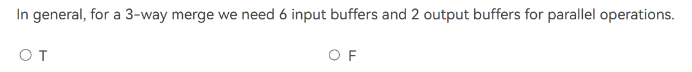
        ??? general "解答"
            T.需要2k个input buffers和2个output buffer。

    === "T5"
        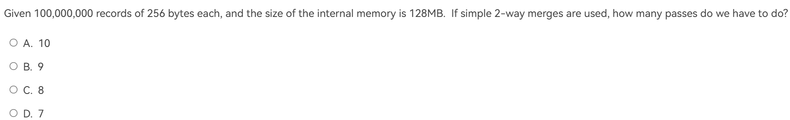
        ??? general "解答"
            B。根据公式:

            $$
            \text{Number of Passes} = 1 + \lceil\log_K {N/M}\rceil = 1 + \lceil\log_2 {2^8 * 10^8/2^{27}}\rceil = 1 + 8 = 9
            $$
    
    === "T6"
        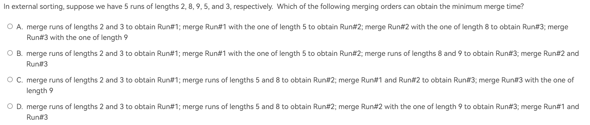
        ??? general "解答"
            B。根据构建哈夫曼树的原则，不断合并最小的两个节点。

    === "T7"
        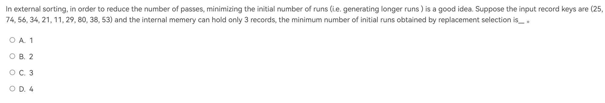
        ??? general "解答"
            B。最后得到的两个序列为:
            
            $$
            \begin{matrix}
                25 & 34 & 56 & 74\\
                11 & 21 & 29 & 38 & 53 & 80
            \end{matrix}
            $$
            
    === "T8"
        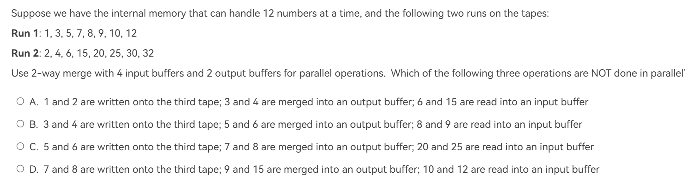
        ??? general "解答"
            D。我们把内存分为6个buffer，包括4个input buffer和2个output buffer，每个buffer可以存放两个数据，依次记为B1, B2, B3, B4, B5, B6。

            1. 读取数据到B1和B2
            
                | B1  | B2  | B3 | B4 | B5 | B6 |
                |-----|-----|----|----|----|----|
                | 1,3 | 2,4 | -  | -  | -  | -  |

            2. 读取数据到B3，再将B1和B2中的数据merge到B5
            
                | B1  | B2  | B3 | B4 | B5 | B6 |
                |-----|-----|----|----|-----|----|
                | 3 | 4 | 5,7  | -  | 1,2 | -  |

            3. 读取数据到B4，同时输出B5数据，再将B1和B2中的数据merge到B6
            
                | B1  | B2  | B3 | B4 | B5 | B6 |
                |-----|-----|----|----|----|----|
                | - | - |5,7 | 6,15 | --| 3,4 |

            4. 读取数据到B1，同时输出B6数据，再将B3和B4中的数据merge到B5
            
                | B1  | B2  | B3 | B4 | B5 | B6 |
                |-----|-----|----|----|----|----|
                | 8,9 | - | 7 | 15 | 5,6 | - |

            5. 读取数据到B2，同时输出B5数据，再将B1和B3中的数据merge到B6

                | B1  | B2  | B3 | B4 | B5 | B6 |
                |-----|-----|----|----|----|----|
                | 9 | 20,25 | - | 15 | - | 7,8 |

            6. 读取数据到B3，同时输出B6数据，再将B2和B4中的数据merge到B5

                | B1  | B2  | B3 | B4 | B5 | B6 |
                |-----|-----|----|----|----|----|
                | - | 20,25 | 12 | 15 | 9,10 | - |

            D 选项强错误在没有等10,12读入完毕再merge。

    === "T9"
        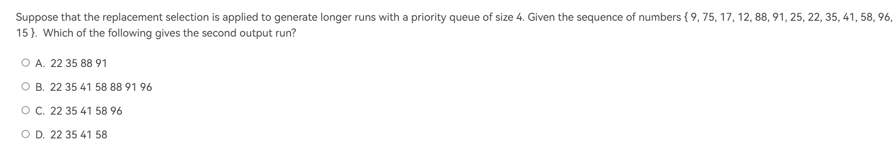
        ??? general "解答"
            C。
            最后的结果为:

            $$
            \begin{matrix}
            9 & 12 & 17 & 25 & 75 & 88 & 91\\
            22 & 35 & 41 & 58 & 96 \\
            15 
            \end{matrix}
            $$