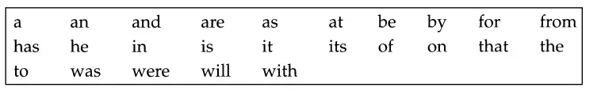

<script defer src="https://vercount.one/js"></script>
---
hide :
    -feedback
comments : true
---

# Inverted File Index

当我们使用网页搜索时，搜索引擎会快速地从大量网页中找到与查询相关的内容。这是如何做到的呢？

1. 搜索每一个网页，查找内容，这显然是不合理的

2. Term-Document Incidence Matrix

    Term-Document Incidence Matrix 是一种简单的表示方法，其中行表示文档，列表示词语。如果某个词语出现在某个文档中，则矩阵中的相应位置为1，否则为0。例如：

    |       | term1 | term2 | term3 |
    |-------|-------|-------|-------|
    | doc1  |   1   |   0   |   1   |
    | doc2  |   0   |   1   |   1   |
    | doc3  |   1   |   1   |   0   |

    这种方法虽然直观，但在处理大规模数据时效率较低。并且，这种做法存在不合理之处。例如，the这个词在几乎每篇文章都会出现，但没有特别的意义，一些冷门词出现频率极低，非常降低效率。

    为了优化这种方法，我们可以使用词代模型，例如TF（词频）、DF（文档频率）和IR（信息检索）。这些模型可以帮助我们更有效地衡量词语的重要性，从而提高搜索效率。

3. 倒排索引技术。倒排索引是一种索引数据结构，它存储了文档中每个词的位置，使得搜索引擎能够高效地查找包含特定词的所有文档。

## 倒排索引示例

!!! info "倒排索引"
    

## 倒排索引改进

### 停用词(Stop words)

影响倒排索引的一个因素就是停止词的存在。某些情况下，一些常见词在文档和用户需求进行匹配时价值并不大，需要彻底从词汇表中去除。这些词称为停用词（stop word）。
!!! info "常见的停用词"
    
然而，有时去除停用词也不是一个好选择。例如，短语查询President of the United States显然比"President" and "United States"搜索更加准确。

### 词条化

词条化是将文本分解为单独的词语或词组的过程。这个过程对于构建倒排索引至关重要，因为它决定了索引的粒度和准确性。

!!! example "词条化示例"
    假设我们有以下文本：
    
    ```
    The quick brown fox jumps over the lazy dog.
    ```
    
    经过词条化处理后，我们得到以下词条：
    
    ```
    [The, quick, brown, fox, jumps, over, the, lazy, dog]
    ```

在词条化过程中，我们需要考虑以下几个方面：

1. **大小写规范化**：将所有词语转换为小写，以确保索引的一致性。
2. **去除标点符号**：忽略标点符号，以避免不必要的词条。
3. **处理复合词**：根据具体需求，决定是否将复合词（如"New York"）作为单个词条处理。
4. **词形还原**：把单复数，时态等引起的词形变化还原，例如,"apples"->"apple"
!!! tip "词条化工具"
    有许多现成的工具和库可以帮助实现词条化，例如NLTK（Natural Language Toolkit）和SpaCy。这些工具提供了丰富的功能，可以根据不同的需求进行定制。

## More
暂时没什么要写了，等以后想到吧。

<span id="busuanzi_container_page_pv">本页总访问量<span id="busuanzi_value_page_pv"></span>次</span>
<span id="busuanzi_container_page_uv">本页总访客数 <span id="busuanzi_value_page_uv"></span> 人</span>