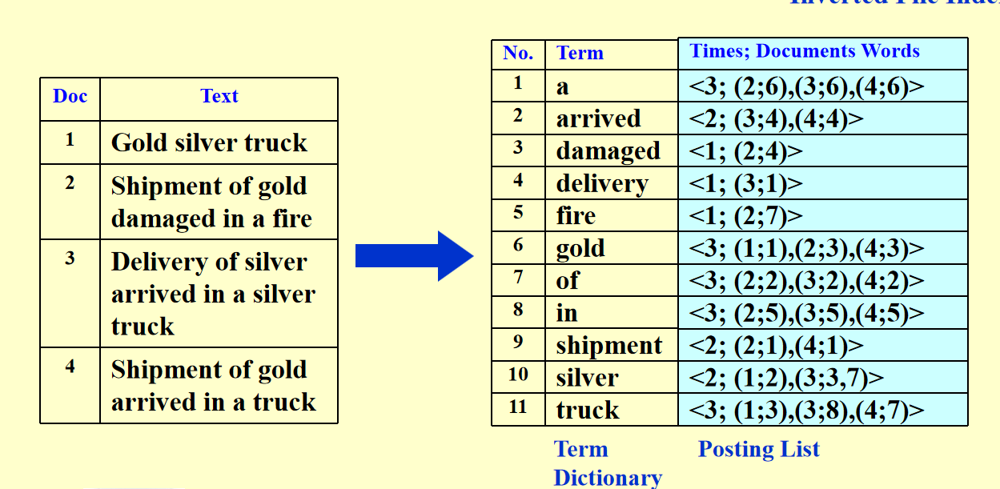

---
hide :
    -feedback
comments : true
---

# Inverted File Index

当我们使用网页搜索时，搜索引擎会快速地从大量网页中找到与查询相关的内容。这是如何做到的呢？

1. 搜索每一个网页，查找内容，这显然是不合理的

2. Term-Document Incidence Matrix

    Term-Document Incidence Matrix 是一种简单的表示方法，其中行表示文档，列表示词语。如果某个词语出现在某个文档中，则矩阵中的相应位置为1，否则为0。例如：

    |       | term1 | term2 | term3 |
    |-------|-------|-------|-------|
    | doc1  |   1   |   0   |   1   |
    | doc2  |   0   |   1   |   1   |
    | doc3  |   1   |   1   |   0   |

    这种方法虽然直观，但在处理大规模数据时效率较低。并且，这种做法存在不合理之处。例如，the这个词在几乎每篇文章都会出现，但没有特别的意义，一些冷门词出现频率极低，非常降低效率。

    为了优化这种方法，我们可以使用词代模型，例如TF（词频）、DF（文档频率）和IR（信息检索）。这些模型可以帮助我们更有效地衡量词语的重要性，从而提高搜索效率。

3. 倒排索引技术。倒排索引是一种索引数据结构，它存储了文档中每个词的位置，使得搜索引擎能够高效地查找包含特定词的所有文档。

## 示例

!!! info "倒排索引"
    

