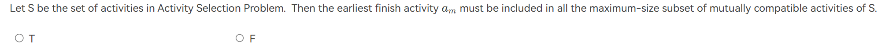
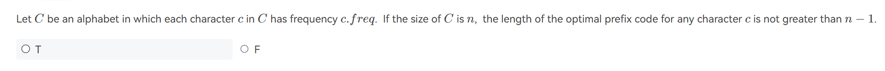
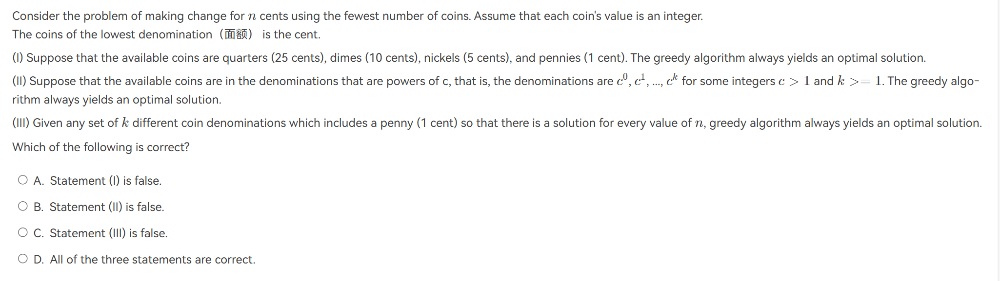

<link rel="stylesheet" type="text/css" href="../../../css/styles.css">

# 贪心算法

贪心算法是一种在每一步选择中都采取在当前状态下最好或最优的选择，从而希望导致全局最优解的算法。它不从整体上考虑问题，只做出局部最优解，从而希望最终结果是全局最优解。

!!! info "from PPT - the Greedy Method"
    Make the best decision at each stage, under some greedy criterion.  A decision made in one stage is not changed in a later stage, so each decision should assure feasibility.

然而，需要注意的是贪心法并不总是能最终求得最优解，用PPT上的话来说，就是

_Greedy algorithm does not guarantee optimal solutions.  However, it generally produces solutions that are very close in value (heuristics) to the optimal, and hence is intuitively appealing when finding the optimal solution takes too much time._.

---

## Activity Selection Problem

给定一组活动 \( S = \{ a_1, a_2, \ldots, a_n \} \)，这些活动希望使用一个资源（例如教室）。每个活动 \( a_i \) 在时间区间 \([s_i, f_i]\) 内进行。当 \( s_i \geq f_j \) 或者 \( s_j \geq f_i \) 时，活动 \( a_i \) 和 \( a_j \) 是兼容的（即它们的时间区间不重叠）。如何选择一个最大的相互兼容活动子集?

### DP的尝试

这个问题是可以使用动态规划解决的。

1. **活动排序**  
   将所有活动按照结束时间 \( f_i \) 升序排序。这样可以及时空出时间。

2. **定义子问题**  
   设 \( dp[i] \) 表示前 \( i \) 个活动中可以选择的最大兼容活动数。

3. **状态转移方程**  
   对于每个活动 \( a_i \)，找到最后一个与之兼容的活动 \( a_j \)（即 \( f_j \leq s_i \)）。则有：
   
$$
dp[i] = \max(dp[i-1], dp[j] + 1)
$$

其中：

- \( dp[i-1] \) 表示不选择活动 \( a_i \) 时的最大兼容活动数。

- \( dp[j] + 1 \) 表示选择活动 \( a_i \) 并加上与之兼容的活动 \( a_j \) 的最大兼容活动数。

4. **初始化**  
   \( dp[0] = 1 \)（选择第一个活动）

5. **计算结果**  
   最终答案为 \( dp[n] \)，其中 \( n \) 是活动的总数。

---

那我们思考，这个问题是否能通过贪心的思想解决呢？

通过<strike>直觉</strike>,我们认为每次取结束时间最早的活动，可以得到最优解。

## 例题

!!! example
    === "T1"
        
        ??? general "解析"
            不一定。局部最优解和最终最优解不一定一样。F

    === "T2"
        
        ??? general "解析"
            考虑一颗哈夫曼树。从根到叶子的路径长度(也就是深度)肯定不会超过$n-1$.等于的时候嘛...我感觉是$n=2$的时候.T

    === "T3"
        
        ??? general "解析"
            1. **(I) 可用的硬币面额为25美分、10美分、5美分和1美分时，贪心算法总是能得到最优解。**
            
                **解析：**
                
                较大的硬币面额是较小面额的整数倍（例如，10 = 2 × 5，25 = 2.5 × 10）。贪心算法每次选择当前最大的可用硬币时，剩余金额可以通过较小面额的硬币精确表示。因此，无论需要找零的总金额n是多少，贪心算法都能找到最少硬币数的最优解。
                
                *示例：* 需要找零41美分。

                1. 选择1个25美分，剩余16美分。

                2. 选择1个10美分，剩余6美分。

                3. 选择1个5美分，剩余1美分。

                4. 选择1个1美分。
                
                总共使用4个硬币，这是最优解。
            
            2. **(II) 可用的硬币面额是c的幂次方，即c⁰, c¹, ..., cᵏ（c > 1，k ≥ 1），贪心算法总是能得到最优解。**
            
                **解析：**
                
                当硬币面额为c的幂次方时，每个更高面额都是前一面额的c倍（如c=2时，面额为1, 2, 4, 8, ...）。这种递增关系确保了贪心算法的选择总是最优的，因为每次选择最大的面额时，剩余金额也能通过较小面额的组合精确表示。
                
                *示例：* 采用2的幂次方面额（1, 2, 4, 8）。
                需要找零11美分。

                1. 选择1个8美分，剩余3美分。

                2. 选择1个2美分，剩余1美分。

                3. 选择1个1美分。
                
                总共使用3个硬币，这是最优解。
            
            3. **(III) 任何包含1美分的k种不同硬币面额的集合，只要每个n都有解，贪心算法总能得到最优解。**
            
                **解析：**
                
                错误。虽然包含1美分可以确保任何金额n都有解，但并不保证贪心算法总是能够得到最优解。存在一些硬币面额的组合，包含1美分，但贪心算法无法找到最少硬币数的最优解。
                
                *示例：* 硬币面额为1美分、3美分和4美分。
                需要找零6美分。

                - **贪心算法选择：**

                    1. 选择1个4美分，剩余2美分。

                    2. 选择2个1美分。
                
                    总共使用3个硬币。

                - **最优解：**:2个3美分。
                
                    因此，贪心算法未能找到最优解           
            选C
            