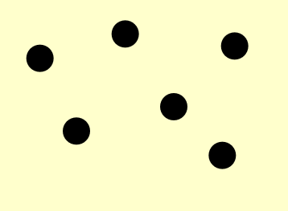
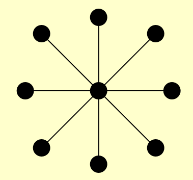
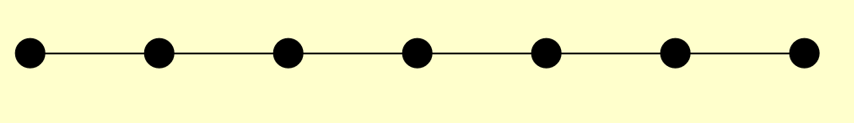
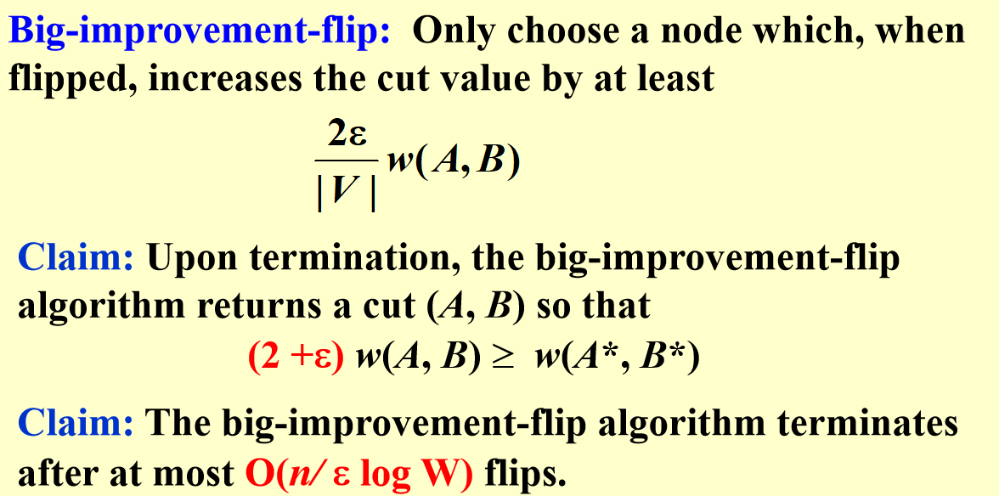
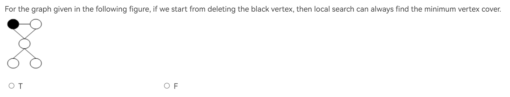
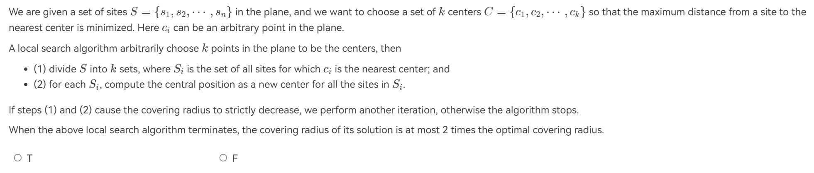
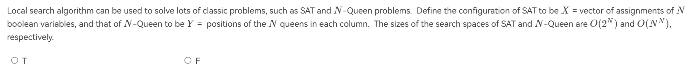
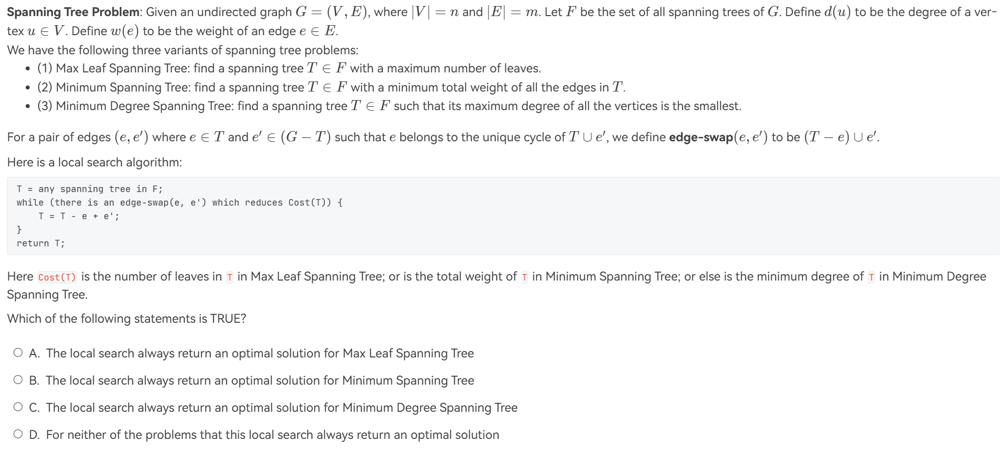
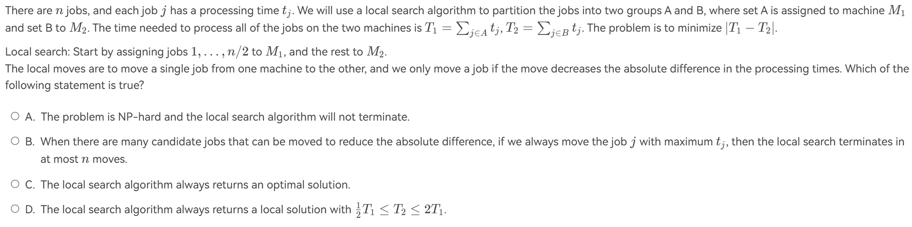
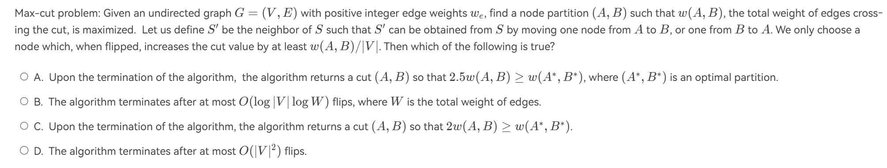

# Local Search

Local Search是一种启发式算法，它从一个初始解开始，通过不断地在解空间中移动，直到找到一个局部最优解。Local Search的优点是它可以在大规模问题上找到一个较好的解，但是它的缺点是它可能会陷入局部最优解，而无法找到全局最优解。

!!! info "from wiki"
    [Local Searh](https://zh.wikipedia.org/wiki/%E5%B1%80%E9%83%A8%E6%90%9C%E7%B4%A2)

**Local**:我们定义neighborhood为一个解的集合，这个集合包含了所有与当前解相邻的解。local的含义是我们只考虑neighborhood中的解，而不考虑全局的解。

**Search**:我们定义一个评价函数，这个函数可以评价一个解的好坏。我们从一个初始解开始，然后不断地在neighborhood中搜索，直到找到一个局部最优解。


---


## Vertex Cover

定义在NP的[部分](../ADS/np.md/#vertex-cover-problem)已经介绍过。不过在这里，我们讨论的是如何找到一个包含最少点的vertex cover。

在这个问题中:

+ **初始解**:所有点

+ **评价函数(cost)**:cost(S) = |S|

+ **Search**:每次删除/**增加**一个点，检查剩下的图是否仍为一个顶点覆盖。

但是，局部搜索并不是一个确定性算法，它可能会陷入局部最优解。

!!! example
    === "1"
        

        这里局部搜索是生效的，最后是一个空集。

    === "2"
        

        这里局部搜索是无效的，取决于我们会不会删除中间那个点。

    === "3"
        

        这里局部搜索是无效的，取决于我们会不会删除两端那个点。

按我个人感觉来看，单纯的局部搜索会不会陷入局部最优解，取决于解里面每个元素是不是同等地位的，如果不是的话，那删除的选择就会影响最后的结果。所以，我们不仅有删除点的操作，还有添加点的操作，来跳出局部最优解。

## The Metropolis Algorithm

Metropolis Algorithm是一种模拟退火算法，它是一种局部搜索算法的变种。它的基本思想是，我们在搜索的过程中，有一定的概率接受一个比当前解更差的解，这样可以避免陷入局部最优解。

``` plaintext title="伪代码 from PPT"
SolutionType Metropolis()
{   Define constants k and T;
    Start from a feasible solution S  FS ;
    MinCost = cost(S);
    while (1) {
        S’ = Randomly chosen from N(S); 
        CurrentCost = cost(S’);
        if ( CurrentCost < MinCost ) {
            MinCost = CurrentCost;    S = S’;
        }
        else {
            With a probability    $e^{- \Delta \text{cost} / KT}$ , let S = S’;
            else  break;
        }
    }
    return S;
}
```

---


## Hopfield Neural Networks

给定一个图G(V,E)，它的边的权值是整数，但可以是负数。对于边(u,v)，我们定义一个权值$w_{uv}$。若$w_{uv} < 0$，则u,v希望是一样的状态($\pm 1$);若$w_{uv} > 0$，则u,v希望是不一样的状态。用数学来描述，就是

$$
w_e S_u S_v < 0
$$

其中$S_u$是u的状态，$S_v$是v的状态。

输出为一个全图所有点状态，使得所有的边都满足上述条件。然而，这样的要求很有可能做不到，例如一个三角形环，每条边都是正数。为此，我们定义边的权值的绝对值是*the strength of the requirement*，即我们希望这个边的要求是强的还是弱的。

!!! definition
    
    + 好边：$w_{u,v} S_u S_v < 0$

    + 坏边：$w_{u,v} S_u S_v > 0$

    + 点被满足(satisfied):包含该点的所有边加起来，好边权重大于等于坏边权重

        $$\sum_{v \in N(u)} w_{u,v} S_u S_v \leq 0$$

    + Stable configuration:所有点都被满足

### State-flipping Algorithm

``` plaintext title="伪代码 from PPT"

ConfigType State_flipping()
{
    Start from an arbitrary configuration S;
    while ( ! IsStable(S) ) {
        u = GetUnsatisfied(S);
        s_u = - s_u;
    }
    return S;
}
```

---

问题来了，我们是否总能找到一个stable configuration呢？

答案是可以。首先我们可以发现，State-flipping Algorithm必然会导致好边的权重增加，然而，总权重是有上限的，因此在调整必然会terminate，而且是在有限步内，也就是说，我们总能找到一个stable configuration，并且最多花费$\sum_{w \in E} |w|$步。

然而，解法的时间复杂度也不是多项式级别的。

---

## The Maximum Cut Problem.

给定一个图 G(V, E)，我们希望将顶点集 V 分成两个子集 A 和 B，使得连接 A 和 B 的边的权重总和最大。

这个问题也可以转换为一个Hopfield Neural Networks问题。

+ 定义所有边的权值大于0.

+ 集合A内的点状态均为-1.

+ 集合B内的点状态均为1。

这样，我们就可以将这个问题转换为一个Hopfield Neural Networks问题。集合内的边都是坏边，集合间的边都是好边。而我们的调整，就是将一个不满足的点从一个集合移动到另一个集合，也就是上面的State-flipping Algorithm。这样会让好边的权重增加，坏边的权重减少，最终找到一个最大值。

### How good is this local optimum?

结论：

设 (A, B) 是一个局部最优划分，设 $w(A^*, B^*)$ 是一个全局最优划分。那么 $w(A, B) \geq \frac{1}{2}w(A^*, B^*)$。

!!! info "Big-improvement flip"
    

### Try a better local?

当局部搜索时，邻域应该足够丰富，以避免陷入不理想的局部最优；但邻域不宜过大，因为我们希望能够高效地搜索可能的局部调整。


## 例题

!!! info "例题"
    === "T1"
        
        ??? general "解析"
            T.删除了图中这个黑色的点后，很显然只能删掉最下面两个点，保留了中间的点，因此是最优的。
    === "T2"
        
        ??? general "解析"
            F.反例见[此](https://zhoutimemachine.github.io/note/courses/ads-hw-review/#hw12)
    === "T3"
        
        ??? general "解析"
            T.search space与neighborhood不同，search space指的是所有可能的解，而neighborhood指的是与当前解相邻的解。SAT问题中，N个变量，每个可以取0或1，那么search space就有$2^N$个解.N-Queens问题中，每个皇后可以放在N个位置，那么search space就有$N^N$个解。
    === "T4"
        
        ??? general "解析"
            B.没有太看懂，但是我感觉Max Leaf Spanning Tree和Max Degree Spanning Tree的cost[T]定义的是不是有问题?题目里说的是向cost[T]减小的方向走。

    === "T5"
        
        ??? general "解析"
            A:每次操作都会导致dif减小，然而dif最小是0，因此肯定会终止，故错误。

            B:正确，移过去的不会再移回来，因此最多n次。

            C：考虑{1,2,3,4,5}={1,2,3}+{4,5}.理论最优解是{1,2,5}+{3,4},dif=1.然而局部搜索移动时，完全动不了，因为不管移哪个都违背了"we only move a job if the move decreases the absolute difference"，也就是说，局部搜索太短视了，看不到暂时的牺牲为了长远的利益。

            D：错误。考虑{1,2,100}={1,2}+{100}
    
    === "T6"
        
        ??? general "解析"
            见[上图](#how-good-is-this-local-optimum)结论

            