# NP Completeness

!!! info "P与NP"
    P的意思是“Polynomial”，多项式时间可解决，

    NP是“Nondeterministic Polynomial time”的缩写，指的是在非确定性多项式时间内可以验证解的问题集合。

## Halting problem

!!! warning 
    Is it possible to have your C compiler detect all infinite loops?

答案是**否**

假设我们有这样的一个函数H(P,I),可以判断函数P在输入I是是否为死循环，如果是，返回1，不然返回0.

根据H我们可以构造一个U(P):

``` plaintext

U(P){
    if(H(P,P))//如果是死循环
        break;
    else//如果不是死循环
        infinite_loop();//让函数陷入死循环
}
```

考虑U(U)的调用结果:

!!! tip
    如果是死循环，则H(U,U)为1，进入break，我们在U(U)是死循环的基础上推出U(U)不是死循环。

    不然，则进入死循环，我们在U(U)不是死循环的基础上推出U(U)是死循环。

    综上所述，不存在这样的H,不然，我们总可以构造出一个U造成矛盾。

## 图灵机

### Deterministic Turing Machine

确定性图灵机指的是机器根据指令前往一个特定的地方。

!!! tip "from PPT"
    A Deterministic Turing Machine executes one instruction at each point in time.  Then depending on the instruction, it goes to the next unique instruction.

### Nondeterministic Turing Machine

非确定型图灵机中，机器可以自由选择下一步做什么，并总是选择正确答案。

!!! tip "from PPT"
    A Nondeterministic Turing Machine is free to choose its next step from a finite set.  And if one of these steps leads to a solution, it will always choose the correct one.

###  True NP!

一个问题是NP的，意味着虽然我们不知道能不能在多项式时间内找到它的解，但对于任何一个可能的解，我们可以在多项式时间内验证它是否是正确的。


!!! warning
    Not all decidable problems are in NP.  For example, consider the problem of determining whether a graph does not have a Hamiltonian cycle.


显然,

$$
P \subset NP
$$

## NP完全

NPC问题是NP问题里最**"难"**的问题。

!!! definition "polynomial reduce"
    问题的难度:如果我们能在多项式时间的复杂度内，将问题 A 转化为问题 B，则称问题 A 可以多项式时间归约(polynomial reduce)为 B，记为 $A \leq_p B $，表示 A 不会比 B 难。

那么，如果我们能证明任何一个NPC问题可以在多项式复杂度内解决，那么所有的NP问题都可以在多项式复杂度内解决，那么就有

$$
P=NP
$$

## Traveling salesman problem

!!! definition
    === "Hamiltonian cycle problem"
        Given a graph G=(V, E), is there a simple cycle that visits all vertices?
    
    === "Traveling salesman problem"
        Given a complete graph G=(V, E), with edge costs, and an integer K, is there a simple cycle that visits all vertices and has total cost $\leq$ K?

如何证明TSP是一个NPC问题?

假设我们已经知道Hamiltonian cycle problem是一个NPC问题。

首先，TSP问题显然是一个NP问题，因为任何一个它的可能解，都可以在$O(N)$的时间范围内得到验证。

其次，对于任何一个回路是否有Hamiltonian cycle,我们可以作如下思考

!!! tip "Hamiltonian cycle与TSP的转换"
    === "Graph for Hamiltonian cycle"
        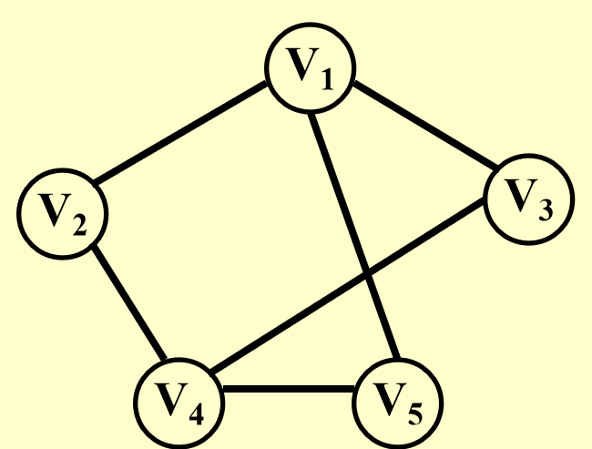
    === "Extended Graph for TSP"
        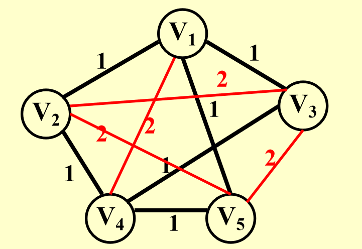

我们在把一个图拓展为完全图时，将图原来就有的边权值定义为1，新添加的边权值定义为2，那么对于原来的图是否有Hamiltonian cycle，就可以转换为拓展后的完全图在TSP问题上是否有解的问题(令K = |v|)。

由于完全图的边数为$\frac{n(n+1)}{2}$,因此这个转换过程是多项式时间复杂度的。综上，我们从Hamiltonian cycle是NPC问题推出了TSP是NPC问题。

??? tip "第一个NPC问题从何而来"
    The first problem that was proven to be NP-complete was the Satisfiability problem (Circuit-SAT): Input a boolean expression and ask if it has an assignment to the variables that gives the expression a value of 1.
    
    Cook showed in 1971 that all the problems in NP could be polynomially transformed to Satisfiability.  He proved it by solving this problem on a nondeterministic Turing machine in polynomial time.

## Formal-language Theory

### 字母表

- **字母表（$\Sigma$）**：一个有限的符号集合。

### 语言

- **语言（$L$）**：由字母表 $\Sigma$ 中符号组成的字符串集合。
- **空字符串**：用 $\varepsilon$ 表示。
- **空语言**：用 $\emptyset$ 表示。
- **所有字符串的语言**：用 $\Sigma^*$ 表示。
- **补集**：$L$ 的补集表示为 $ \Sigma ^* - L$。

### 语言的运算

- **连接**：
    - 两个语言 $L_1$ 和 $L_2$ 的连接是：
        - $L = \{ x_1x_2 \mid x_1 \in L_1 \text{ 且 } x_2 \in L_2 \}$。

- **闭包（克林星闭包，Kleene star）**：
    - 语言 $L$ 的闭包表示为 $L^*$，定义为：
        - $L^* = \{\varepsilon\} \cup L \cup L^2 \cup L^3 \cup \dots$，
        - 其中 $L^k$ 是通过将 $L$ 自身连接 $k$ 次得到的语言。

### 算法与语言的决定

- **Accept**:**算法 $A$ 接受字符串 $x \in \{0, 1\}^*$ 当且仅当 $A(x) = 1$**。
- **Reject**:**算法 $A$ 拒绝字符串 $x$ 当且仅当 $A(x) = 0$**。
- **Decide**:**如果每一个属于语言 $L$ 的二进制字符串都被算法 $A$ 接受，并且每一个不属于 $L$ 的二进制字符串都被算法 $A$ 拒绝，那么算法 $A$ 决定了语言 $L$**。
- **为了接受一个语言，算法只需要处理属于 $L$ 的字符串；但要决定一个语言，算法必须正确地接受或拒绝 $\{0, 1\}^*$ 中的每一个字符串**。

### NP 类的语言

- **定义**：一个语言 $L$ 属于 NP，当且仅当存在一个双输入的多项式时间算法 $A$ 和一个常数 $c$，满足
    $$
    L = \{ x \in \{0, 1\}^* \mid \exists y \text{，且 } |y| = O(|x|^c) \text{ 且 } A(x, y) = 1 \}。
    $$
    换句话说，算法 $A$ 在多项式时间内验证语言 $L$。


### 语言的多项式约化


!!! definition "L1 is polynomial-time reducible to a language L2 ( $L1 \leq_P L2$ ) "
    语言 $L_1$ 可以多项式约化到语言 $L_2$，当且仅当存在一个多项式时间算法 $A$，使得对于所有的字符串 $x$，$x \in L_1$ 当且仅当 $A(x) \in L_2$。

##  Clique problem与Vertex cover problem

### Clique problem

**定义**：给定一个无向图 $G$ 和一个整数 $k$，判断 $G$ 中是否存在一个包含 $k$ 个顶点的完全子图（clique）。

### Vertex cover problem

**定义**：给定一个无向图 $G$ 和一个整数 $k$，判断 $G$ 中是否存在一个包含至多$k$个顶点的子图，并且$G$中的每条边都至少有一个端点在这个子图中。

### NPC证明

假设我们现在已经知道Clique problem是一个NPC问题，我们来证明Vertex cover problem也是一个NPC问题。

!!! proof
    === "Vertex cover problem $\in$ NP"

        首先，检查一个解$V^{'}$的顶点数。然后，对于每一条边(u,v)，检查是否满足$u \in V^{'} \text{or }  v \in V^{'}$.时间复杂度为$O(N^2)$

    === "CLIQUE $\leq_p$ VERTEX-COVER "
        考虑这样的$G$与$\bar G$
        === "G"
            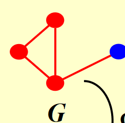
        === "$\bar G$"
            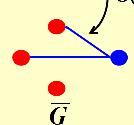
        若$\bar G$有size为$\left| V \right| - K$的点覆盖，则G有size为K的clique

        === "=>"
            若 $G$ 有一个大小为 $K$ 的团 $V' \subseteq V$,设 $(u, v)$ 为 $\bar E$ 中的任意一条边(E是G中边的集合,$\bar E$就是完全图减去原来有的边的集合,也就是$\bar G$中边的集合)。

            则:

            + 至少 $u$ 或 $v$ 中的一个不属于 $V'$

            + 至少 $u$ 或 $v$ 中的一个属于 $V - V'$

            所以$\bar G$ 的每一条边都被 $V - V'$ 中的一个顶点覆盖

            因此，集合 $V - V'$，其大小为 $|V| - K$，构成了 $\bar G$ 的一个顶点覆盖。
        === "<="
            若 $\bar G$ 有一个大小为 $|V| - K$ 的顶点覆盖 $V' \subseteq V$

            对于所有 $u, v \in V$，如果 $(u, v) \notin E$，则 $u \in V'$ 或 $v \in V'$ 或两者都属。

            对于所有 $u, v \in V$，如果 $u \notin V'$ 且 $v \notin V'$，则 $(u, v) \in E$。
            
            因此，$V - V'$ 是一个团，并且它有大小 $|V| - |V'| = K$。
    
    最后，由于G到$\bar G$的转变是$O(N^2)$复杂度的，所以我们有CLIQUE $\leq_p$ VERTEX-COVER。

综上，我们证明了Vertex cover problem 也是NPC问题。


---


## 例题

!!! note "例题"
    === "T1"
        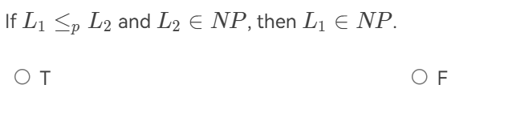
        ??? general "解析"
            T.这里使用多项式规约的比较，证明 $L_1 \leq_P L_2$。那么如果 $L_2$ 是 NP 问题，那么 $L_1$ 也是 NP 问题。

    === "T2"
        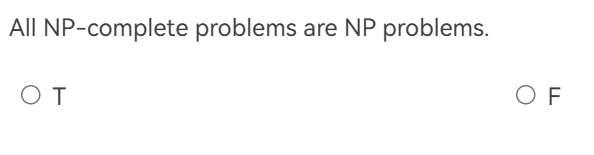
        ??? general "解析"
            T.NPC问题是 NP 问题的最难问题。

    === "T3"
        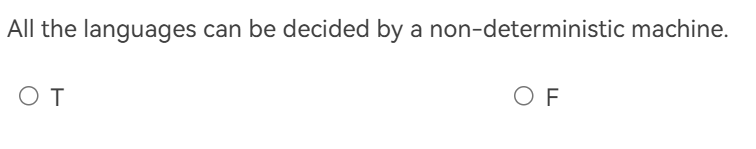
        ??? general "解析"
            F.不是所有的语言都可以被非决定性图灵机决定，只有递归可判定的语言才能被图灵机（包括非确定性图灵机）决定.

    === "T4"
        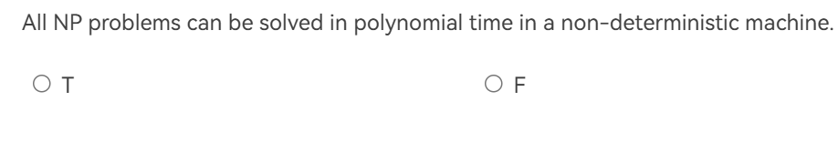
        ??? general "解析"
            T.这就是NP问题的定义:由非确定性图灵机可以在多项式时间内解决。

    === "T5"
        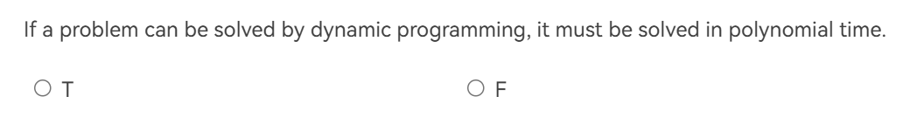
        ??? general "解析"
            F.例如背包问题。

    === "T6"
        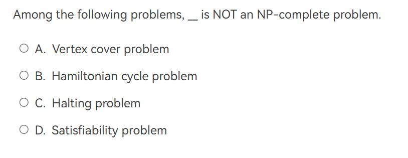
        ??? general "解析"
            B.停机问题是不可判定的，不是P或者NP问题。

    === "T7"
        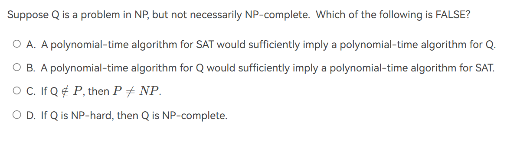
        ??? general "解析"
            B。SAT问题是一个NPC问题。因此一个可以用多项式时间解决SAT问题的算法必然可以解决Q问题。反之，由于Q不一定是NPC问题，因此能在多项式时间内解决Q问题的算法不一定能解决SAT问题。