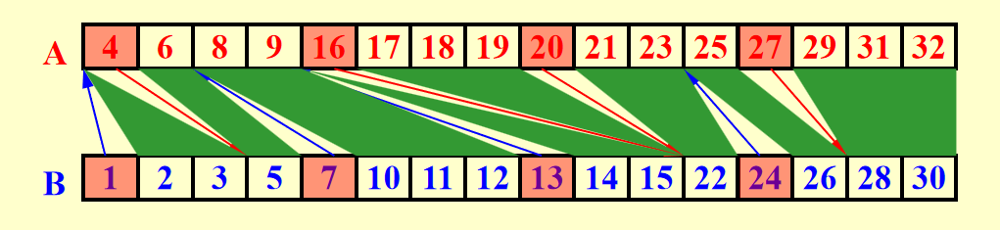

!!! warning
    这部分写得非常混乱，可以移步[Bruce的笔记](https://brucejqs.github.io/MyNotebook/blog/Computer%20Science/ADS/Chapter%2014/#work-depth)

# 并发计算

并发计算有两种类型:

+ 指令集的并发(Machine parallelism)：处理器的多核心，流水线等

+ 并发算法(Parallel algorithms)：多个线程同时执行

这里我们主要讨论并发算法。并发算法又有两种方式描述：

+ PRAM: 并行随机访问机器(Parallel Random Access Machine)

+ WD: 工作深度(Work Depth)

## PRAM

假设我们有$P_1,P_2,\cdots,P_n$个处理器，在这里我们讲的都是共享内存的PRAM，为方便讨论，我们认为读/写/计算都是花费一个单位时间的。

例如，如果我们想把B数组里的内容写到A数组里，在n个处理器的情况下只需要$O(1)$的时间，因为每个处理器只需要写一个元素。

但是，对于多个处理器同时访问内存，难免不会出现内存冲突的情况，为解决这些冲突，有如下方法:

!!! definition
    1. EREW(Exclusive Read Exclusive Write): 任意两个处理器不能同时读写同一个地址

    1. CREW(Concurrent Read Exclusive Write): 任意两个处理器可以同时读，但不能同时写

    1. CRCW(Concurrent Read Concurrent Write): 任意两个处理器可以同时读写
        1. Common Rule:如果所有处理器写入的值相同，允许同时写入

        1. riority Rule:给处理器编号，编号小的优先写入

        1. Arbitrary Rule:随机选择一个写入

## The summation problem

最常见的问题，输入$A(1), A(2), \cdots, A(n)$,输出$A(1)+A(2)+\cdots+A(n)$

正常来说，这个问题的时间复杂度是$O(n)$，但是我们可以通过PRAM来优化。

考虑二维数组$B[i,j]$，代表了第i步的第j个处理器的值，那么一开始，我们可以在O(1)的时间内使用多个处理器将A数组的值写道B的第一行。

然后，我们可以在O(logn)的时间内将B的每一行的值相加，最后得到结果。

<div align="center">
    
</div>

$B(h, i) = B(h-1, 2i-1) + B(h-1, 2i)$

### PRAM

!!! info "from PPT"
    

    这里的pardo指的是并行执行，即多个处理器同时执行。

    这样的时间复杂度是$O(\log n +2)$

## WD

上面的PRAM做法有一个问腿，它的可移植性非常差，因为处理器的数目不同会导致时间复杂度不同。

为此，我们引入了WD的概念，即工作深度。

<div align="center">
    
</div>

<strike>我也不知道这一部分具体在说什么</strike>

## 性能的度量

传统算法从时间复杂度来度量性能，但是并发算法不同，因为并发算法的时间复杂度和处理器数量有关。

因此，我们使用时间复杂度与工作复杂度(Work Load)两个值来衡量。

我们的目标是，既要马儿跑得快，又要马儿跑得快。

在有了这两个值之后，我们用如下方法衡量性能:

<div style="text-align: center; font-size:1.8em; font-weight: bold;">
若处理器的数目为p，则性能为$\frac{W(n)}{p} + T(n)$
</div>

也即是:

!!! definition "WD-presentation Sufficiency Theorem"
    An algorithm in the WD mode can be implemented by any P(n) processors within
    O(W(n)/P(n) + T(n)) time, using the same concurrent-write convention as in the WD presentation.


例如，对于上面的问题，若采用PRAM的方法，性能为:

$$T(n) = \log n +2$$

\begin{align}
W(n) = n +n/2 + \cdots + n/2^k(2^k=n) +1= 2n
\end{align}

## Prefix-Sums

Prefix-Sums问题是这样的，给定一个数组$A(1), A(2), \cdots, A(n)$，求$B(1), B(2), \cdots, B(n)$，其中$B(i) = A(1)+A(2)+\cdots+A(i)$

首先，建立如下的平衡二叉树:

<div align="center">
    
</div>

然后，我们定义:

$$C(h,i)= \sum_{k=1}^\alpha A(k)$$

其中$\alpha$是(h,i)这个节点最右边的叶子节点的编号。

我们可看出:

<div align="center">
    
</div>

```c
if(i==1)
    C(h,i) = B(h,i)
else if(i%2==0)
    C(h,i) = C(h+1,i/2)
else
    C(h,i) = C(h+1,(i-1)/2) + B(h,i)

```

也可以看出C应该是自顶向下计算的。

```plaintext
for Pi , 1 <= i <= n pardo
  B(0, i) := A(i)
for h = 1 to log n
  for i , 1 <= i <= n/2^h pardo
    B(h, i) := B(h - 1, 2i - 1) + B(h - 1, 2i)
for h = log n to 0
  for i even, 1 <= i <= n/2^h pardo
    C(h, i) := C(h + 1, i/2)
  for i = 1 pardo
    C(h, 1) := B(h, 1)
  for i odd, 3 <= i <= n/2^h pardo
    C(h, i) := C(h + 1, (i - 1)/2) + B(h, i)
for Pi , 1 <= i <= n pardo
  Output C(0, i)
```

这样的做法下,$T(n) = O(\log n)$,$W(n) = O(n)$

## Merging

Merging问题是这样的，给定两个已经排好序(升序)的数组$A(1), A(2), \cdots, A(n)$和$B(1), B(2), \cdots, B(n)$，求合并后的数组$C(1), C(2), \cdots, C(2n)$

!!! definition "分割样例"
    - **分割** - 将输入划分为大量的、彼此独立的小任务，例如 p 个，使得最大的一个小任务的大小大致为 n/p

    - **实际工作** - 并发地执行这些小任务，每个任务使用一个独立的（可能是串行的）算法

在这里，我们核心的目标是找到原来的元素在合并后的数组中的位置。

设想，对于一个B数组中的元素，我们只需要知道一共有几个元素比它小，就可以知道它在合并后的数组中的位置。

B中比这个元素小的个数很简单，就是它的编号，而在A中我们需要去找有几个元素比它小。

因此我们定义一个RANK函数如下，用于寻找B中第j个元素在A中能排第几:

+ $RANK( j, A) = i,   if A(i) < B(j) < A(i + 1), 1 \leq i < n$

+ $RANK( j, A) = 0,  if B(j) < A(1) $

+ $RANK( j, A) = n,  if B(j) > A(n)$

因此总的任务就是跑完RANK(j,A)与RANK(i,B)。

如果我们得到了所有RANK的值，那么我们就可以在O(1)的时间内得到合并后的数组。

+ **for Pi , $1 \leq i \leq n$  pardo**

    **C(i + RANK(i, B)) := A(i)**

+ **for Pi , $1 \leq i \leq n$  pardo**

    **C(i + RANK(i, A)) := B(i)**

结果示例:

<div align="center">
    
</div>

如果我们使用二分查找来寻找RANK的值，那么时间复杂度为$O(\log n)$是很小的，而且由于我们可以并行处理，因此总的时间复杂度也是$O(\log n)$

但是这样的功率是很大的。每一个处理器都干了$\log n$的活，这样的话，总的工作量就是$n\log n$。

因此，我们把原来的数据分割为$p=n/\log n$块，每块的头一个元素寻找RANK值，每块内部使用串行算法,形成至多2p个区域。

<div align="center">
    
</div>

这样每块的大小为$\log n$，总的工作量为$p \log n = n$，时间复杂度为$O(\log n)$

## Maximum Finding

Maximum Finding问题是这样的，给定一个数组$A(1), A(2), \cdots, A(n)$，求最大的元素。

给出一种算法:
```c
for Pi , 1 <= i <= n  pardo
    B(i) := 0
for i and j, 1 <= i, j <= n  pardo
    if ( (A(i) < A(j)) || ((A(i) = A(j)) && (i < j)) )
        B(i) = 1
    else B(j) = 1

for Pi , 1 <= i <= n  pardo
    if B(i) == 0
       A(i) is a maximum in A
```

这种算法跑一边，$T(n) = O(1)$，$W(n) = O(n^2)$

如果我们以$\sqrt{n}$分割，每块内部用普通的串行算法寻找最大值，合并时用上面的算法寻找最大值，结果如下 ：

<div align="center">
    
</div>

还有一种分割方法如下:

<div align="center">
    
</div>

## 例题

!!! note "例题"
    === "T1"
        
        ??? general "解析"
            F.还需要考虑T(n)的值
    === "T2"
        
        ??? general "解析"
            T.C是自顶向下算的。
    === "T3"
        
        ??? general "解析"
            T.B是自底向上算的。
    === "T4"
        
        ??? general "解析"
            F。采用 Random Sampling，就可以在O(n)的开销下。
    === "T5"
        
        ??? general "解析"
            T.见定义
    === "T6"
        
        ??? general "解析"
            C.这其实就是把Summation问题的"+"换成了"min"
    === "T7"
        
        ??? general "解析"
            D.见定义。
    === "T8"
        
        ??? general "解析"
            A.按我的理解，递归深度有$\log n$层，使用Parallel Ranking可以让每层的$T(n)=O(\log n)$,$W(n)=O(n)$

    === "T9"
        
        ??? general "解析"
            D.见Parallel Ranking。