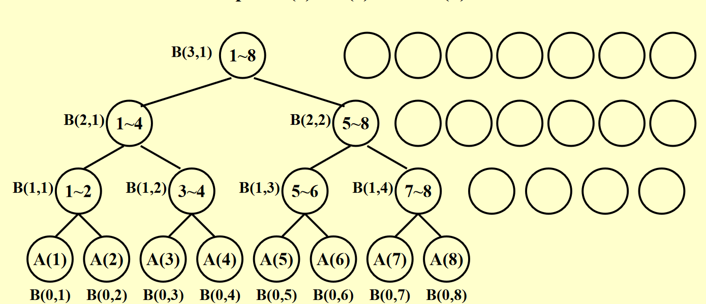
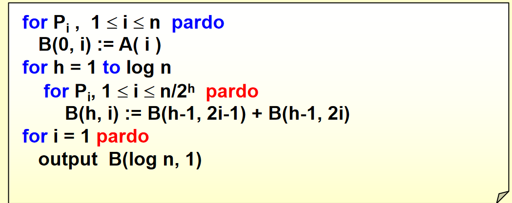
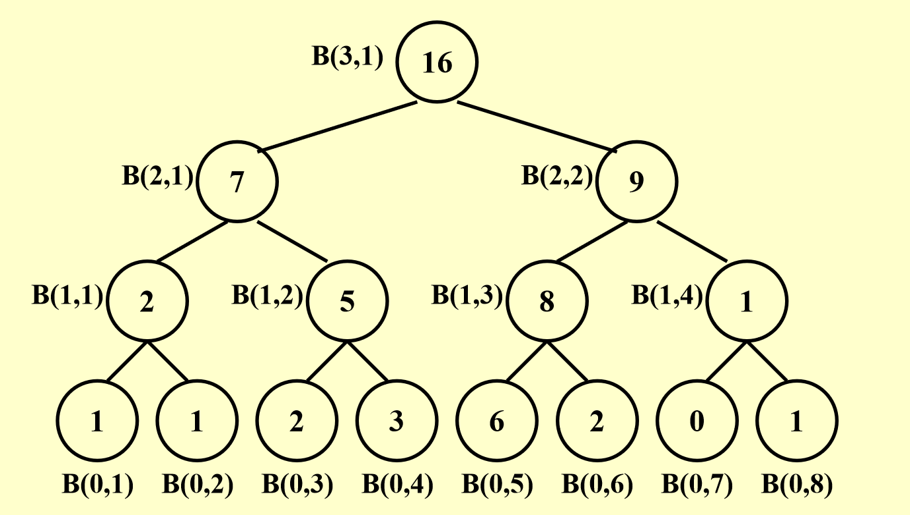
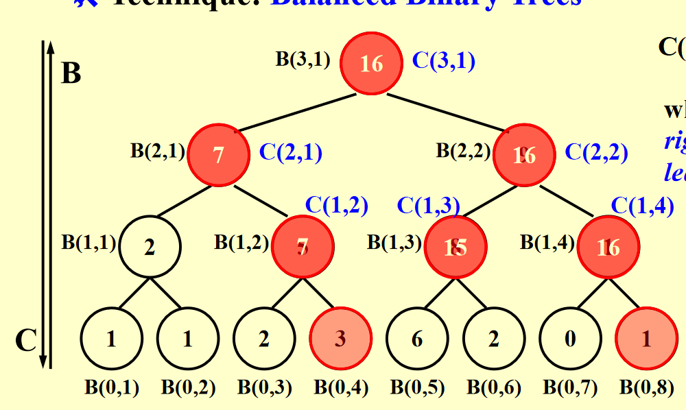
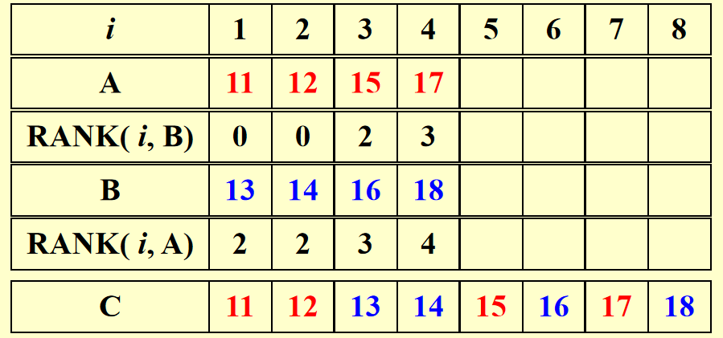
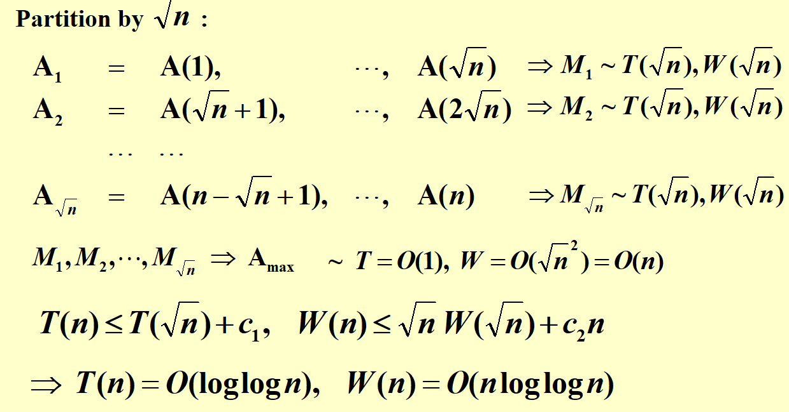
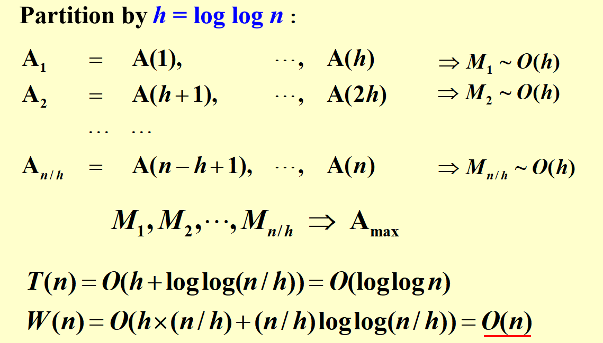

!!! warning
    这部分写得略混乱，可以移步[Bruce的笔记](https://brucejqs.github.io/MyNotebook/blog/Computer%20Science/ADS/Chapter%2014/#work-depth)

# 并发计算

并发计算有两种类型:

+ 指令集的并发(Machine parallelism)：处理器的多核心，流水线等

+ 并发算法(Parallel algorithms)：多个线程同时执行

这里我们主要讨论并发算法。并发算法又有两种方式描述：

+ PRAM: 并行随机访问机器(Parallel Random Access Machine)

+ WD: 工作深度(Work Depth)

## PRAM

假设我们有$P_1,P_2,\cdots,P_n$个处理器，所有的处理器共享一块内存。为方便讨论，我们认为读/写/计算都是花费一个单位时间的。

例如，如果我们想把B数组里的内容写到A数组里，在n个处理器的情况下只需要$O(1)$的时间，因为每个处理器只负责写一个元素。

但是，对于多个处理器同时访问内存，难免不会出现内存冲突的情况，为解决这些冲突，有如下方法:

!!! definition
    1. EREW(Exclusive Read Exclusive Write): 任意两个处理器不能同时读写同一个地址

    1. CREW(Concurrent Read Exclusive Write): 任意两个处理器可以同时读，但不能同时写

    1. CRCW(Concurrent Read Concurrent Write): 任意两个处理器可以同时读写，但是仍可能发生写入冲突的情况，不同的解决方法有如下几种：
        1. Common Rule:如果所有处理器写入的值相同，允许同时写入

        1. Priority Rule:给处理器编号，编号小的优先写入

        1. Arbitrary Rule:随机选择一个写入

## The Summation Problem

最常见的问题，输入$A(1), A(2), \cdots, A(n)$,输出$A(1)+A(2)+\cdots+A(n)$

正常来说，这个问题的时间复杂度是$O(n)$，但是我们可以通过PRAM来优化。

考虑二维数组$B[i,j]$，代表了第i步的第j个处理器的值，那么一开始，我们可以在O(1)的时间内使用多个处理器将A数组的值写到B的第一行。

然后，我们可以在O(1)的时间内将B的每一行的值相加，最后得到结果。

<figure align="center">
    
    <figcaption>图中空白圆圈代表闲置的处理器。</figcaption>
</figure>

于是我们得到:

$$B(h, i) = B(h-1, 2i-1) + B(h-1, 2i)$$

### PRAM

!!! info "from PPT"
    

    这里的pardo指的是并行执行，即多个处理器同时执行。

    这样的时间复杂度是$O(\log n +2)$


!!! failure "PRAM的缺陷"
    + 该模型无法揭示算法和实际使用的处理器个数之间的关系
    
        + 对于上面的例子，假如有 100 个处理器，但实际上只用了 8 个处理器，所以更多的处理器并不能使执行速度进一步加快
    
    + 该模型需要指定哪个处理器处理哪部分的指令，这些详细信息其实是非并行算法所不需要的

### WD


为此，我们引入了WD的概念，即工作深度。

<div align="center">
    
</div>


## 性能的度量

传统算法从时间复杂度来度量性能，但是并发算法不同，因为并发算法的时间复杂度和处理器数量有关。处理器多了，跑得当然快了，但与此同时，工作量也增加了。

因此，我们使用时间复杂度与工作复杂度(Work Load)两个值来衡量。

我们的目标是，既要马儿跑得快，又要马儿跑得快。

!!! definition "T(n)与W(n)"

    + $T(n)$: 干活最多的那个处理器，干的时间

    + $W(n)$: 所有处理器工作量总和

    ??? success "借用上面的例子说明"

        在[求和问题](#the-summation-problem)中，WD性能为:

        $$T(n) = \log n +2$$

         这个看上面的图就可以理解，有一个处理器是在树的每一层都要干活的，加上一开始读取数据和最后的输出，所以是$\log n +2$

        \begin{align}
        W(n) = n +n/2 + \cdots + n/2^k(2^k=n) +1= 2n
        \end{align}

        这里是因为，在树的最底层，n个处理器都干活了，所以是n，然后上一层是n/2，一直到树的顶层，只有一个处理器在干活，所以是1。

        其实还有最开始的读取和最后的输出，分别需要n和1的工作量，不过不影响最后工作量的量级。

---

对于PRAM来说:

+ 当使用处理器数量$P(n) =\frac{W(n)}{T(n)}$时，操作的最差时间复杂度是$O(T(n))$

+ 当使用处理器数量$P(n) \leq \frac{W(n)}{T(n)}$时，操作的最差时间复杂度是$\frac{W(n)}{P(n)}$(也就是处理器不足的情况)

+ 对于任意数量的P(n)，操作的最差时间复杂度是$\frac{W(n)}{P(n)} + T(n)$

实际上，这三种评估方式是渐进等价(Asymptotically Equivalent)，也即，当n趋近于无穷大时，这三种评估方式是同一复杂度。

---

而对于WD来说，有以下定理:

!!! definition "WD-presentation Sufficiency Theorem"
    一个 WD 模式下的算法可以由任意 P(n) 个处理器在
    O(W(n)/P(n) + T(n)) 时间内实现，使用并发写入。

---

## Prefix-Sums

Prefix-Sums问题是这样的，给定一个数组$A(1), A(2), \cdots, A(n)$，求$B(1), B(2), \cdots, B(n)$，其中$B(i) = A(1)+A(2)+\cdots+A(i)$

首先，建立如下的平衡二叉树:

<div align="center">
    
</div>

可以看到，这里还是先计算了求和问题，为之后前缀和问题的解决打下基础。

然后，我们定义:

$$C(h,i)= \sum_{k=1}^\alpha A(k)$$

其中$\alpha$是(h,i)这个节点最右边的叶子节点的编号。

于是就有这样一张图:

<div align="center">
    
</div>
我们可看出:

当i为1时:

```c
if(i==1)
    C(h,i) = B(h,i)
```

当i为偶数时:
```c
else if(i%2==0)
    C(h,i) = C(h+1,i/2)
```

当i为奇数时:
```c
else
    C(h,i) = C(h+1,(i-1)/2) + B(h,i)

```

因此，我们先自底向上计算求和问题，然后根据求和问题的结果自顶向下计算前缀和问题

```plaintext title="Prefix-Sums"
for Pi , 1 <= i <= n pardo
  B(0, i) := A(i)
for h = 1 to log n
  for i , 1 <= i <= n/2^h pardo
    B(h, i) := B(h - 1, 2i - 1) + B(h - 1, 2i)
for h = log n to 0
  for i even, 1 <= i <= n/2^h pardo
    C(h, i) := C(h + 1, i/2)
  for i = 1 pardo
    C(h, 1) := B(h, 1)
  for i odd, 3 <= i <= n/2^h pardo
    C(h, i) := C(h + 1, (i - 1)/2) + B(h, i)
for Pi , 1 <= i <= n pardo
  Output C(0, i)
```

这样的做法下,$T(n) = O(\log n)$,$W(n) = O(n)$

这是很显然的，可以看作是求和问题的两倍，因为自底向上算$B(h,i)$的时候是一遍，自顶向下算$C(h,i)$的时候又是一遍。

!!! tip
    如果要求前缀最大值(最小值)，只需要把求和问题的"+"换成"max"(或"min")即可,T(n)与W(n)不变。

---

## Merging

Merging问题是这样的，给定两个已经排好序(升序)的数组$A(1), A(2), \cdots, A(n)$和$B(1), B(2), \cdots, B(n)$，求合并后的数组$C(1), C(2), \cdots, C(2n)$

我们约定:

+ A,B内元素两两不相等

+ $n = m$

+ $\log n ,\frac{n}{\log n}$都是整数

!!! definition "分割样例"
    - **分割** - 将输入划分为大量的、彼此独立的小任务，例如 p 个，使得最大的一个小任务的大小大致为 n/p

    - **实际工作** - 并发地执行这些小任务，每个任务使用一个独立的（可能是串行的）算法

在这里，我们核心的目标是找到原来的元素在合并后的数组中的位置。

设想，对于一个B数组中的元素，我们只需要知道A,B中一共有几个元素比它小，就可以知道它在合并后的数组中的位置。

B中比这个元素小的个数很简单，就是它的编号，而在A中我们需要去找有几个元素比它小。

因此我们定义一个RANK函数如下，用于寻找B中第j个元素在A中能排第几:

+ $RANK( j, A) = i,   if A(i) < B(j) < A(i + 1), 1 \leq i < n$

+ $RANK( j, A) = 0,  if B(j) < A(1) $

+ $RANK( j, A) = n,  if B(j) > A(n)$

因此总的任务就是跑完RANK(j,A)与RANK(i,B)。

如果我们得到了所有RANK的值，那么我们就可以在O(1)的时间内得到合并后的数组。因为有这样的并发算法使用n个处理器:

```c
for Pi , 1 <= i <= n  pardo
    C(i + RANK(i, B)) := A(i)
for Pi , 1 <= i <= n(也即是m) pardo
    C(i + RANK(i, A)) := B(i)
```

结果示例:

<div align="center">
    
</div>

---

!!! question 
    那么我们要如何计算RANK的值呢？

我们先来看两个朴素的算法:

!!! example "朴素算法"
    === "Serial Ranking"
        ```c
        i = j = 0; 
        while ( i <= n || j <= m ) {
            if ( A(i+1) < B(j+1) )
                RANK(++i, B) = j;
            else RANK(++j, A) = i;
        }
        ```

        此时，$T(n) = O(n+m)$,$W(n) = O(n+m)$

    === "Binary Search"
        ```c
        for Pi , 1 <= i <= n  pardo
            RANK(i, B) := BS(A(i), B)
            RANK(i, A) := BS(B(i), A)
        ```

        此时，时间复杂度为$O(\log n)$是很小的，而且由于我们可以并行处理，因此总的时间复杂度也是$O(\log n)$

        但是这样的工作量是很大的。每一个处理器都干了$2\log n$的活，这样的话，总的工作量就是$O(n\log n)$。

因此，我们把原来的数据分割为$p=\frac{n}{\log n}$块，每块的头一个元素寻找RANK值，形成了图中的箭头。这里相当于是p个二分查找并行，因为我们要为p个元素找到RANK值，因此$T(n) = O(\log n)$，$W(n) = p \log n = O(n)$

箭头划分出至多2p个区域。每一块区域并行处理，区域内部使用朴素的串行算法。

<div align="center">
    
</div>

这样每块的大小为$\log n$，总的工作量为$p \log n = O(n)$，时间复杂度为$O(\log n)$

综上，我们得到了一个时间复杂度为$O(\log n)$，工作量为$O(n)$的算法。

---

## Maximum Finding

Maximum Finding问题是这样的，给定一个数组$A(1), A(2), \cdots, A(n)$，求最大的元素。

### 朴素的想法

> 如果要求前缀最大值(最小值)，只需要把求和问题的"+"换成"max"(或"min")即可,T(n)与W(n)不变。

---
### Compare all pairs

另给出一种算法:
```c title="Compare all pairs"
for Pi , 1 <= i <= n  pardo
    B(i) := 0
for i and j, 1 <= i, j <= n  pardo
    if ( (A(i) < A(j)) || ((A(i) = A(j)) && (i < j)) )
        B(i) = 1
    else B(j) = 1

for Pi , 1 <= i <= n  pardo
    if B(i) == 0
       A(i) is a maximum in A
```

这种算法跑一遍，$T(n) = O(1)$，$W(n) = O(n^2)$

---

### 分割

如果我们以$\sqrt{n}$分割，每块内部用普通的串行算法寻找最大值，合并时用上面的算法寻找最大值，结果如下 ：

<div align="center">
    
</div>

还有一种分割方法如下:

<div align="center">
    
</div>

---

### Random Sampling

<strike>没想到吧，还有一种做法</strike>


1. 把数组A中随机挑$n^{\frac{7}{8}}$个元素出来，形成数组B

2. 将数组B划分为$n^{\frac{3}{4}}$个大小为$n^{\frac{1}{8}}$的小块,小块内部使用Compare all pairs算法求出最大值，得到$n^{\frac{3}{4}}$个最大值,$T(n) = O(1),W(n) = n^{\frac{3}{4}} * (n^{\frac{1}{8}})^2 = O(n)$

3. 接下来将这些最大值划分为 $n^{\frac{1}{2}}​$ 个大小为 $n^{\frac{1}{4}}$ 的小块，然后对每个小块求出最大值，得到$n^{\frac{1}{2}}​$个最大值.（使用 Compare All Pairs 方法计算）$T(n) = O(1),W(n) = n^{\frac{1}{2}} * (n^{\frac{1}{4}})^2 = O(n)$

4. 再使用$n^{\frac{1}{2}}​$个最大值求出所有 $n^{\frac{7}{8}}​$ 个元素的最大值（使用 Compare All Pairs 方法计算）$T(n) = O(1),W(n) = (n^{\frac{1}{2}})^2 = O(n)$

总的来说，时间复杂度是$O(1)$，工作量是$O(n)$。但是这个算法不能保证找到最大值，只能说有很大的概率找到最大值。

## 例题

!!! note "例题"
    === "T1"
        
        ??? general "解析"
            F.还需要考虑T(n)的值
    === "T2"
        
        ??? general "解析"
            T.C是自顶向下算的。
    === "T3"
        
        ??? general "解析"
            T.B是自底向上算的。
    === "T4"
        
        ??? general "解析"
            F。采用 Random Sampling，就可以在O(n)的开销下。
    === "T5"
        
        ??? general "解析"
            T.见定义
    === "T6"
        
        ??? general "解析"
            C.这其实就是把Summation问题的"+"换成了"min"
    === "T7"
        
        ??? general "解析"
            D.见定义。
    === "T8"
        
        ??? general "解析"
            A.按我的理解，递归深度有$\log n$层，使用Parallel Ranking可以让每层的$W(n)=O(n)$，综合起来的工作量是$O(n\log n)$。而对于$T(n)$,最底下那层是$\log 1$，往上一层是$\log 2$,以此类推是$\log 4,\log 8,\cdots,\log n$，不妨设$n=2^l$,那么
            
            $T(n)=\log 1 + \log 2 + \cdots + \log n =(0 + 1 + \cdots +l) \log 2 = \frac{l(l+1)}{2}\log 2 = O(\log^2 n)$

    === "T9"
        
        ??? general "解析"
            D.见Parallel Ranking。