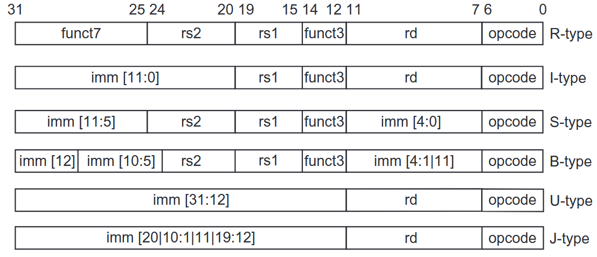
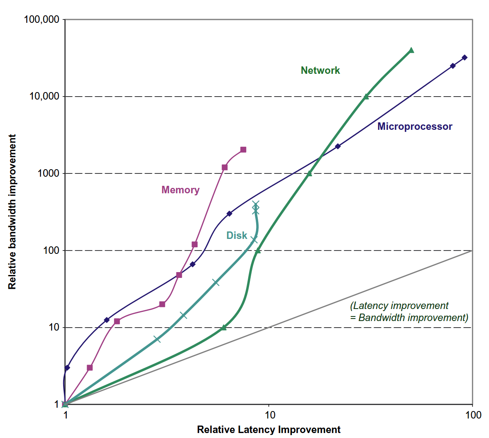

# Introduction

## Class of Computers

### Internet of Things/Embedded Computers

嵌入式计算机是一种专门设计用于执行特定任务的计算机。它们通常是小型的，低功耗的，且价格便宜，通常被嵌入到其他设备中，如家用电器，汽车，医疗设备等。

嵌入式计算机通常运行在实时操作系统上，这些操作系统通常是专门设计用于嵌入式系统的，如FreeRTOS，uC/OS等。

### Personal Mobile Device

个人移动设备包括智能手机，平板电脑，笔记本电脑等。这些设备通常运行在移动操作系统上，如Android，iOS等。它们的功耗是受限的，因为电池与散热的问题。

### Desktop Computing

我们通常说的台式机，性能强大，价格昂贵，通常用于高性能计算，游戏等。

### Server Computing

服务器计算通常是指运行在服务器上的应用程序。服务器通常是高性能的，用于提供服务，如网站，数据库，文件共享等。

### Clusters/Warehouse-Scale Computers

集群计算是指将多台计算机连接在一起，以共同完成一个任务。这种计算方式通常用于高性能计算，如科学计算，数据分析等。

---

## 并发的种类与结构

通常，在应用上有两种并发：

1. Data-level parallelism(DLP): 数据级并发，即多个数据同时处理。

2. Task-level parallelism(TLP): 任务级并发，即多个任务同时处理。

之后，计算机硬件根据这两种并发，设计出了四种主要的并发结构：

1. Instruction-level parallelism：指令并发利用编译器与流水线技术，使得多条指令同时执行。

2. Vector architectures, graphic processor units (GPUs), and multimedia instruction sets：向量处理器，图形处理器，多媒体指令集等。

3. Thread-level parallelism：线程级并发，即多个线程同时执行。

4. Request-level parallelism：请求级并发，即多个请求同时执行。

---

Flynn将计算机分为四类：

1. SISD(Single Instruction, Single Data)：单指令单数据，即传统的计算机。

2. SIMD(Single Instruction, Multiple Data)：单指令多数据，即向量处理器。

3. MISD(Multiple Instruction, Single Data)：多指令单数据，理论上存在，但实际上并没有。

4. MIMD(Multiple Instruction, Multiple Data)：多指令多数据，即多核处理器。每个处理器获得自己的数据并执行自己的指令。

---

## ISA

ISA(Instruction Set Architecture)是指令集架构，是计算机硬件与软件之间的接口。ISA定义了计算机的指令集，寄存器，内存模型等。在计算机组成与本课程中，我们使用的ISA都是RISC-V，这是一个开源的ISA,由伯克利大学开发。

RISC-V是32位的，有32个通用寄存器，使用load/store指令访问内存，指令长度也是32位。

!!! note "指令说明（和计组中的一样）"
    

## Performance

### Bandwidth over Latency

我们使用两个指标来度量性能：

1. Latency(Response Time)：延迟，即完成一个任务所需的时间。

2. Throughput(Bandwidth)：吞吐量，即单位时间内完成的任务数量。

它们的关系如下图所示：

    
    

---

### Scaling of Transistor Performance and Wires

!!! definition "集成电路处理器的特征尺寸"
    特征尺寸(Feature Size)是指晶体管在X和Y方向上的最小尺寸。

特征尺寸越小,，晶体管的数量就越多，性能就越高。

然而,当特征尺寸减小时,线路会变得更短,带来的是更糟糕的电阻与电容

---

## Trends in Power and Energy in Integrated Circuits

当我们比较两个处理器的效率时,不应该比较它们的平均功率,而应该比较它们在同一任务上的能量消耗.因为功率更大的处理器可能在同一任务上更快,从而消耗更少的能量.

### Energy and Power Within a Microprocessor

+ dynamic energy:用来转换晶体管状态的能量

    - 如果脉冲是$0 \rightarrow 1 \rightarrow 0$或者$1 \rightarrow 0 \rightarrow 1$,那么:

        $$
        Energy_{dynamic} \propto Capacitive load \times Voltage^2 
        $$

    - 如果脉冲是$0 \rightarrow 1 \rightarrow 0$或者$1 \rightarrow 0 \rightarrow 1$,那么:

        $$
        Energy_{dynamic} \propto Capacitive load \times Voltage^2 \times \frac{1}{2}
        $$
    
+ power:功率是单位时间内消耗的能量

    $$
    Power_{dynamic} \propto Capacitive load \times Voltage^2 \times \frac{1}{2} \times Switech\text{_}Frequency
    $$

    对于一个固定的任务,降低时钟频率可以降低功率,但不会减少总的能量消耗.所以,超频有风险.

    但是很显然,降低电压可以显著减少能量与功率,所以近些年的处理器都在努力降低电压.

+ Static Energy:
    能量泄露导致的损耗.

---

为了提高能量效率,同时保持时钟频率与电压稳定,有如下技术:

1. Do nothing well:将不活跃的模块关闭,来节约能量

2. Dynamic voltage-frequency scaling (DVFS): 在低活跃状态下降低时钟频率和电压

3. Design for the typical case: 对于笔记本等经常空闲的设备,设置待机状态

4. Overclocking:超频,让芯片更猛,直到温度太高

### Trends in Cost

#### 时间,产量与商业化的影响

+ 时间:即使工艺没有改进,制造计算机的成本也会随着时间流逝而下降

    + 学习曲线(Learning Curve):制造成本随时间下降的曲线

    + 学习曲线可通过产出(yield)测量

+ 产量:产量的提高会降低成本

    - 减少了走完学习曲线(积累经验)所需的时间，因为学习曲线部分与制造的系统(或芯片)数量成正比

    - 产量的提高会提高购买与制造效率.
    
    - 减少了每台计算机必须摊销的开发成本量，从而使成本和销售价格更加接近并仍然获利。

+ 商业化:供应商的竞争会导致成本降低.

#### Cost of an Integrated Circuit

集成电路的成本计算公式为：

$$
\text{Cost of integrated circuit}=\frac{\text{Cost of die} + \text{Cost of testing die} + \text{Cost of packaging and final test}}{\text{Final test yield}}
​$$

每个晶片(die)的成本为:

$$
\text{Cost of die}=\frac{\text{Cost of wafer}}{\text{Dies per wafer}\times\text{Die yield}}
​$$

而一个晶圆(wafer)上的晶片数目为:

$$
\text{Dies per wafer}=\frac{\pi\times(\frac{\text{Wafer diameter}}{2})^2}{\text{Die area}}−\frac{\pi\times\text{Wafer diameter}}{\sqrt{2\times\text{Die area}}}​
$$

当然,一个晶圆上的晶片并不都是合格的,我们假设缺陷随机分布于晶圆上,且产量与制造过程的复杂性成反比,有如下公式:

$$
\text{Die yield}=\text{Wafer yield}\times\frac{1}{(1+\text{Defects per unit area}\times\text{Die area})^N}​
$$

这里的Die yield指的是好的晶片产出,N是process-complexity factor(过程复杂性因子),衡量制造的困难程度.

## Dependability

见计组[Measure](../Comcompose/Ch6.md#measure)与[Raid](../Comcompose/Ch6.md#raid)章节    

## Measurement

为了衡量计算机的性能,我们引入如下两个概念:

+ Execution Time:执行时间,即完成一个任务所需的时间
    - 最直接的定义方法是`Wall-Clock Time/response time/elapsed time`,指的是完成一项任务所需的时间,包括所有的等待时间,如I/O,内存访问等

    - 另一种定义方法是`CPU Time`,指的是CPU实际执行指令所需的时间,不包括I/O,内存访问等等待时间

        - CPU time = Instruction count × CPI × Clock cycle time

        - CPI = Clock cycles per instruction

        - Clock cycle time = 1 / Clock frequency

        - CPU time = Instruction count / Clock frequency × CPI

    - `Workload`也是一种用来衡量计算机性能的方法,也即在给定一组任务(包括用户任务与系统任务)下的处理时间.

+ Throughput:吞吐量,即单位时间内完成的任务数量

    - 通过`Throughput = 1 / Execution time`来计算

    - 也可以通过`Throughput = Instruction count / CPU time`来计算

    - 也可以通过`Throughput = Instruction count / (Instruction count / Clock frequency × CPI)`来计算

    - 也可以通过`Throughput = Clock frequency / CPI`来计算

## Benchmark

<strike>感觉不会考,不记了</strike>

## SPECRatio

SPECRatio是SPEC基准测试的结果,用于衡量计算机性能.它是通过将计算机的执行时间与参考计算机的执行时间进行比较来计算的.
SPECRatio的计算公式为:
$$
SPECRatio = \frac{Execution time of reference computer}{Execution time of computer under test}
$$

那么在比较两个计算机的性能时,公式如下:
$$
\frac{\text{SPECRatio of computer A}}{\text{SPECRatio of computer B}} = \frac{\text{Execution time of computer B}}{\text{Execution time of computer A}}
$$

由于SPEC是一个比值,在计算平均值时,我们使用几何平均数,而不是算术平均数.所以,我们使用如下公式来计算平均值:
$$
SPECRatio_{geometric} = \sqrt[n]{SPECRatio_1 \times SPECRatio_2 \times ... \times SPECRatio_n}
$$

---

## Quantitative Principles

Amdahl's Law:阿姆达尔定律,用于衡量计算机性能的提升与程序的并行化程度之间的关系.它的公式为:
$$
\text{New Execution Time} = \text{Old Execution Time} \times (1 - P) + \frac{\text{Old Execution Time} \times P}{N}
$$
其中,P是程序中可以并行化的部分,而N是并行化的程度.当P=1时,Speedup=N,即完全并行化.当P=0时,Speedup=1,即完全串行化.

对此的加速比为
$$
Speedup = \frac{1}{(1 - P) + \frac{P}{N}}
$$

因此,如果我们只能加速整个任务中占比为P的部分,加速比最多为
$$
Speedup = \frac{1}{(1 - P)}
$$