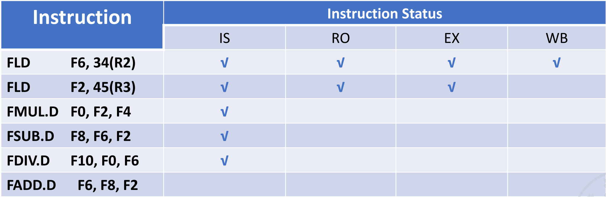
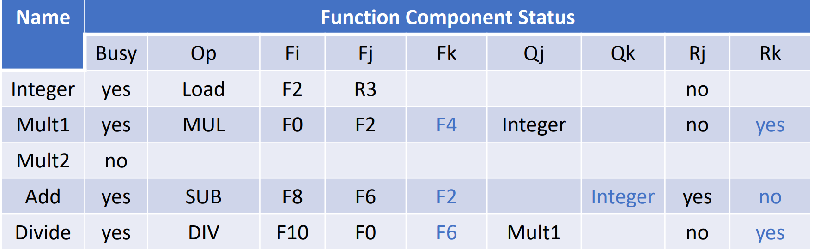
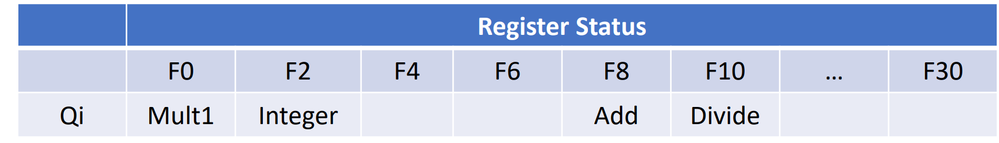

# 指令级并行


- [ ] 比赛预测器

- [x] Tomasulo算法

开头[流水线](../Comcompose/Ch4.md#流水线cpu)在前面学过了...

在计组中我们学习的指令都是整数指令，实际上，对于浮点指令(FP)，流水线需要做一些小改动。

!!! definition "Latency&Interval"
    - Latency:the number of intervening cycles between an instruction that produces a result and an instruction that uses the result(在产生结果的指令和使用结果的指令之间的周期数)

    - Interval: the number of cycles that must elapse between the issue of two consecutive instructions(两条连续指令之间必须经过的周期数)

在处理浮点数时，我们把EX阶段分为多种：

- 处理浮点数加法

- 处理浮点数乘法

- 处理浮点数除法

- 不处理浮点数

在这之中，乘法和加法是可以采取流水线的方式来处理的,也就是说，后一条指令并不需要前一条指令离开EX阶段才能进入EX阶段。

---

!!! tip "Out of order Completion"
    对于如下指令:
    ```assembly
    fdiv.d F0,F2,F4
    fadd.d F10,F10,F8
    fsub.d F12,F12,F14
    ```

    由于除法指令执行需要的时间久，因此加法和减法会在除法做完之前做完，也就是出现了乱序的现象。

    对于乱序，我们可以采取如下做法
    
    1. 如果像上面这样指令之间不存在依赖，那么可以直接忽视

    2. 把后完成的指令的结果存到一个buffer里面，等到前面的指令完成后再写回去。

    3. 记录流水线中的指令与它们的PC值，以便处理异常

    4. 只有当一条指令前面的指令都处理完且没发生异常时，才处理这条指令


---

## ILP exploitation

!!! definition "ILP exploitation"
    ILP exploitation(指令级并行性利用)是指通过编译器和硬件的配合来提高指令级并行性。

    - Compiler-based static parallelism:编译器在编译时分析指令之间的依赖关系，并将可以并行执行的指令进行调度。

    - Hardware-based dynamic parallelism:硬件在运行时动态分析指令之间的依赖关系，并将可以并行执行的指令进行调度。

什么样的指令可以并行呢?

如果两条指令一起执行时不会有stall，不会引起结构冒险，这两条指令就是可以并行的。

不然，我们称这些指令是有依赖的，即Dependant Instructions。

### Dependence

#### Data Dependence(数据依赖)

数据依赖是指两条指令之间存在数据传递关系，即一条指令的输出结果作为另一条指令的输入。典型的数据依赖就是:

- Read After Write (RAW): 也称为真实依赖，表示第二条指令需要读取第一条指令的结果。

``` assembly
add r1, r2, r3
sub r4, r1, r5
```

- 在上面的例子中，第二条指令需要读取第一条指令的结果r1，因此它们之间存在数据依赖关系。

总的来说，如果指令j不与指令i有数据依赖关系，那么下面的情况都不能出现：

- 指令j需要指令i的结果

- 指令j数据依赖指令k，指令k数据依赖指令i

#### Name Dependence(名称依赖)

名称依赖是指两条指令之间存在名称冲突，即它们使用了相同的寄存器或内存地址，但实际上它们之间并没有数据传递关系。

典型的名称依赖有以下两种：

- WAR(Write After Read): 也称为反依赖(Antidependence)，即后一条指令写入了一个寄存器或内存地址，而前一条指令读取了这个寄存器或内存地址。

    ```assembly
    fsd r1, 0(r2)
    addi r2,r2,-1
    ```

    - 这两条指令实际上没有数据依赖关系,但是它们执行的顺序不能交换，因为第二条指令会覆盖第一条指令的结果。

- WAW(Write After Write): 也称为输出依赖(Output Dependence)，即两条指令都要写入同一个寄存器或内存地址。

    ``` riscv
    fsd r1, 0(r2)
    fsd r1, 4(r2)
    ```
    
    - 同样,这两条指令没有数据依赖,但不能交换顺序.

要解决名称依赖的问题，我们可以采取如下措施:

- Register Renaming:把寄存器重命名为不同的寄存器,这样就可以避免名称依赖的问题。

#### Control Dependence(控制依赖)

控制依赖是指两条指令之间存在控制关系，即一条指令的执行结果影响了另一条指令的执行。

``` assembly

beq r1, r2, L1

addi r3, r4, 1

L1:
addi r5, r6, 2
```

在上面的例子中，第二条指令的执行结果取决于第一条指令的执行结果，因此它们之间存在控制依赖关系。

这与我们计组学的Control Hazard是一样的。

---

### Static Scheduling(静态调度)

!!! definition "Static Scheduling 解释 from claude"
    静态调度是指在编译时分析指令之间的依赖关系，并将可以并行执行的指令进行调度。

    - 优点:编译器可以根据指令之间的依赖关系进行调度，从而提高指令级并行性。

    - 缺点:编译器无法动态分析指令之间的依赖关系，因此可能会导致一些指令无法并行执行。

    静态调度就像是一个精心设计的交通管制系统，但这个系统是在"道路建设完成"之前就已经规划好的。

    想象编译器是一位交通规划师，它在程序执行前（编译时）就需要规划好所有"车辆"（指令）的行驶路线：

    1. **提前规划路线**：编译器会提前查看整个代码，就像交通规划师查看城市地图，找出哪些指令可以并行执行。

    2. **避开"堵车点"**：编译器会识别指令间的依赖关系（如RAW、WAR、WAW依赖），就像规划师避开可能的交通拥堵点。

    3. **固定的交通灯设置**：一旦编译完成，指令执行的顺序就像被固定的交通灯时序一样，不会根据实际运行情况做出调整。

    **实例分析**：
    ```c
    a = b + c;    // 指令1
    d = e + f;    // 指令2 
    g = a + d;    // 指令3
    ```

    静态调度分析：

    - 指令1和指令2之间没有依赖，可以并行执行

    - 指令3依赖于指令1和指令2的结果，必须等它们完成后才能执行

    编译器会生成调度计划：先并行执行指令1和指令2，再执行指令3。这种规划是基于编译时的"理想情况"做出的最佳安排，但无法应对运行时的意外情况，如缓存未命中或分支预测错误。


静态调度有两种方法:

1. Pipeline Scheduling:流水线调度

2. Loop Unrolling:循环展开

我们以接下来这段程序为例介绍。

```c
for(i=999;i>=0;i--){
    x[i] = x[i] + s;
}
```

它的RISC-V指令如下:

```assembly
Loop: fld f0,0(x1) // load x[i] into f0
      fadd.d f4,f0,f2 // f0 = x[i] + s
      fsd f4,0(x1) // store f0 into x[i]
      addi x1,x1,-8 // i--
      bne x1,x2,Loop // if i != 0, jump to Loop
```

---

#### Pipeline Scheduling(流水线调度)

观察上面的汇编指令，我们发现前三条指令都存在数据依赖关系。

如果就这样执行的话

1. `fld`指令和`fadd.d`指令之间需要一个周期的stall(考虑forwarding)

2. `fadd.d`指令和`fsd`指令之间需要两个周期的stall

这样,跑一个循环就要八个周期.

如果我们把指令顺序调整为

```assembly
Loop: fld f0,0(x1) // load x[i] into f0
      addi x1,x1,-8 // i--
      fadd.d f4,f0,f2 // f0 = x[i] + s
      fsd f 8(x1) // store f0 into x[i]
      bne x1,x2,Loop // if i != 0, jump to Loop
```

在这样的情况下,`fld`和`fadd.d`之间就不用停了,因为这一个周期拿来执行无关的指令了,现在只需要在`fadd.d`和`fsd`之间停两个周期就行了.

跑一个循环从八个周期变成了七个周期,加快了速度.

---

然而,现在还存在一个问题.在一个循环中,真正对数据作操作的就只有`fld`,`fadd.d`和`fsd`三条指令,五条指令只有三条在干活,这不符合我们的设计.

因此,引入了Loop Unrolling(循环展开).

---

#### Loop Unrolling(循环展开)

我们把用于循环的语句开销称为Loop Overhead(循环开销),它包括:

- 计算循环条件的开销

- 更新循环变量的开销

- 跳转的开销

我们的目的就是降低这个开销,也就是提高干活指令的比例.

我们直接把循环展开四次:

```assembly
Loop:   fld f0,0(x1) // load x[i] into f0
        fadd.d f4,f0,f2 // f0 = x[i] + s
        fsd f4,0(x1) // store f0 into x[i]
        fld f6,-8(x1) // load x[i-1] into f6
        fadd.d f8,f6,f2 // f6 = x[i-1] + s
        fsd f8,-8(x1) // store f6 into x[i-1]
        fld f10,-16(x1) // load x[i-2] into f10
        fadd.d f12,f10,f2 // f10 = x[i-2] + s
        fsd f12,-16(x1) // store f10 into x[i-2]
        fld f14,-24(x1) // load x[i-3] into f14
        fadd.d f16,f14,f2 // f14 = x[i-3] + s
        fsd f16,-24(x1) // store f14 into x[i-3]
        addi x1,x1,-32 // i--
        bne x1,x2,Loop // if i != 0, jump to Loop
```

这样,平均每个循环耗时6.5个周期.

> 💡 **性能优化新挑战**  
> 但是还不过瘾！我们想要更进一步，怎么做？

我们可以再进行重排来减少周期数。

```assembly
Loop:   fld f0,0(x1) // load x[i] into f0
        fld f6,-8(x1) // load x[i-1] into f6
        fld f10,-16(x1) // load x[i-2] into f10
        fld f14,-24(x1) // load x[i-3] into f14
        fadd.d f4,f0,f2 // f0 = x[i] + s
        fadd.d f8,f6,f2 // f6 = x[i-1] + s
        fadd.d f12,f10,f2 // f10 = x[i-2] + s
        fadd.d f16,f14,f2 // f14 = x[i-3] + s
        fsd f4,0(x1) // store f0 into x[i]
        fsd f8,-8(x1) // store f6 into x[i-1]
        fsd f12,-16(x1) // store f10 into x[i-2]
        fsd f16,-24(x1) // store f14 into x[i-3]
        addi x1,x1,-32 // i--
        bne x1,x2,Loop // if i != 0, jump to Loop
```

这样,我们用有用的指令代替了stall,所以完全不需要停了.

四个循环一共用了14个周期,平均每个循环3.5个周期,提升可以说非常大了.

---

### Dynamic Branch Prediction(动态分支预测)

#### 1 bit predictor(1位预测器)

用一个位来表示分支是否被预测为taken,如果是,就用1表示,如果不是,就用0表示.

如果当前预测的结果和实际结果相同,就不需要更新,如果不同,就更新.

相当于一个只有两个状态的有限状态机.

这个方法对于“摇摆"的分支预测效果会很糟糕，比如taken和not taken交替出现的情况。

在这个情况下，我们思考2bit预测器的设计。

#### 2 bit predictor(2位预测器)

2bit预测器使用两个位来表示分支的状态，分为四种状态:

- 00: strongly not taken(强不跳转)

- 01: weakly not taken(弱不跳转)

- 10: weakly taken(弱跳转)

- 11: strongly taken(强跳转)

强弱在这里其实没有特别的含义，与1bit预测器的主要区别就是，2bit预测器需要两次错误才能改变预测状态
 
 
<pre>

   
┌───────────┐         ┌─────────────┐
│          │ taken  │            │
│    00    ├────────►│     01     │
│ 强不跳转  │         │  弱不跳转   │
│          │◄────────┤            │
└───────────┘not taken└─────┬───────┘
                          │       ▲ 
                          │taken  |  not taken                                
                          ▼       |
┌───────────┐         ┌─────────────┐
│           │   taken │           │
│    11     │◄────────┤     10     │
│  强跳转    │         │   弱跳转    │
│           ├────────►│            │
└───────────not taken └─────────────┘
  
            
</pre>


#### Branch Target Buffer(BTB)(分支目标缓冲器)

BTB中放置了分支指令的PC地址和目标地址，当我们遇到分支指令时，就可以直接从BTB中找到目标地址。

1. 工作原理

    1. **预存储分支信息**：BTB存储了分支指令的PC地址和对应的目标地址的映射关系
    
    2. **提前获取目标**：处理器遇到分支指令时，不必等到指令解码阶段才知道跳转目标，而是可以直接查询BTB
    
    3. **预取指令**：处理器可以根据BTB中的信息提前从目标地址获取指令，大大减少分支指令带来的流水线停顿

2. BTB的结构

    BTB通常实现为一个缓存结构：

    | 分支指令地址 | 目标地址 | 预测信息 |
    |---|---|---|
    | 0x1000 | 0x2000 | Taken |
    | 0x1200 | 0x1500 | Not Taken |
    | ... | ... | ... |

3. 实际应用过程

    1. **IF阶段**：处理器获取指令并检查该地址是否在BTB中

    2. **命中时**：如果命中且预测为taken，处理器直接从目标地址获取下一条指令

    3. **未命中时**：继续顺序执行，并在确认为分支指令后更新BTB

    4. **预测错误**：如果分支预测错误，处理器清空流水线并从正确的地址重新取指令


#### Tournament Predictor(比赛预测器)

Todo...


## Dynamic Scheduling(动态调度)

- 允许指令乱序**执行**

- 将流水线的`ID`阶段分为两个阶段:
    - `Issue`阶段：指令解码，检查有没有结构冒险

    - `Read Operands`阶段：一直等待，直到没有数据冒险后，读取操作数

    - 因此现在的五级流水线实际上是:
        - IF:取指令

        - ID:指令解码

        - Issue:发射指令

        - Read Operands:读取操作数

        - EX:执行指令

        - WB:写回结果

!!! danger "注意"
    乱序执行只指在`EX`阶段乱序执行,在`IF`取指阶段还是要按顺序取指.

因此我们的调度策略是:

- **一旦有一条指令stall了,把其他可用的指令发射.**

- "可用"指该条指令不依赖任何正在执行的指令或是前面Stall的指令.

为了实现这个调度策略,我们介绍如下两种算法.


---

### Scoreboard Scheduling(记分板调度)


!!! info "示意图"
    

    可视化：https://jasonren0403.github.io/scoreboard/

所谓Scoreboard,就是在寄存器与功能单元（如整数加法器、浮点乘法器等）之间加一个表格,用来各种情况,并发出调度的信号.

它由如下三部分,也可以当作是三个表格组成:

- **Instruction Status Table**:指令状态表,跟踪当前正在处理的每条指令。记录每条指令所处的阶段与要求的功能单元。

- **Functional Unit Status Table**:功能单元状态表

- **Register Result Table**:寄存器结果表,用来记录寄存器的状态

#### 1. Instruction Status Table(指令状态表)

指令状态表声明指令所处的状态,包括:

- `issue`

- `read operands`

- `execution`

- `write back`

> 我们这里忽略了内存访问,是因为在乱序执行中,我们更关注浮点指令的执行,因为它们的用时比整数指令长.而`ld/sd`可以认为是整数指令.

<div align="center">
    
    <br>
    <caption>Instruction Status Table</caption>
</div>

#### 2. Functional Unit Status Table(功能单元状态表)

典型的状态表如下:

<div align="center">
    
    <br>
    <caption>Functional Unit Status Table</caption>
</div>

一个功能单元的状态由如下9个字段表明:

1. `busy`:表示该功能单元是否正在使用

2. `op`:表示该功能单元正在执行的操作,如加法、乘法等

3. `Fj`, `Fk` (源寄存器): 指令的源寄存器。

4. `Fi` (目标寄存器): 指令的目标寄存器。

5. `Qj`, `Qk`: 表示源寄存器的值来自哪个功能单元。

6. `Rj`, `Rk`: 表示源寄存器是否准备好。在`Read Operands`后,`Rj`和`Rk`会被重置为`No`.

#### 3. Register Result Table(寄存器结果表)

<div align="center">
    
    <br>
    <caption>Register Result Table</caption>
</div>

这张表很简单,就是声明某个寄存器会被哪条活跃的指令写入,如果没用到,则设置为空.


#### 工作流程详解

1. 在`Issue`阶段,Scoreboard检查指令需要使用的功能单元是否空闲,如果空闲,就把指令发射,同时,更新上面这三张表:

    - 更新**指令状态表**，将该指令标记为 Issue 阶段。
    - 更新**功能单元状态表**中对应功能单元的条目，标记其为 Busy，并记录操作类型 (Op)、目的寄存器 (Fi) 和源寄存器 (Fj, Fk)。   
    - 更新**寄存器结果状态表**，标记 Fi 寄存器将由该功能单元写入。

2. 在`Read Operands`阶段, 检查是否存在 RAW 冒险（真数据依赖）。即，指令的源操作数是否就绪。操作数就绪的条件是：

    - 操作数已经存在于寄存器中且

    - 没有之前发射但尚未完成的指令会写入该源寄存器（通过检查**寄存器结果状态表**：如果 `RegResult[源寄存器]` 为空，则表示没有正在计算该寄存器值的未完成指令）

3. 在`Execution`阶段, 功能单元执行指令。经过一定周期,完成执行后,进入下一阶段

4. 在`Write Back`阶段, 检查是否存在 `WAR` 或 `WAW` 冒险（假数据依赖）:
    - `WAW` (Write After Write): 检查是否有**更早**发射但**尚未完成写回**的指令，也打算写入当前指令的目的寄存器`Fi`。这可以通过检查**寄存器结果状态表**：如果`RegResult[Fi]`不等于当前指令所在的功能单元，说明有其他单元将写入Fi，并且它的指令是先发射的.

    - `WAR` (Write After Read): 检查是否有 **更早** 发射但 **尚未读取源操作数** 的指令，其源操作数是当前指令将要写入的目的寄存器 `Fi`。Scoreboard需要检查**功能单元状态表**中所有其他之前未完成指令的`Fj/Fk`字段，看是否有等于 `Fi` 的，并且其 `Rj/Rk` 标记仍为`No`。

    - 如果不存在WAR或WAW冒险,指令将结果写回目标寄存器，同时：
        - 更新**指令状态表**。

        - 更新**功能单元状态表**中对应功能单元的条目，标记其为不忙碌 (Busy = No)。

        - 同时，通知所有正在等待这个结果作为源操作数的其他指令，它们的操作数已就绪（在各自的**功能单元状态表**中更新 `Qj/Qk` 并设置 `Rj/Rk` 为 `Yes`）。
!!! example "例子"
    以这篇[知乎文章](https://zhuanlan.zhihu.com/p/496078836)中的例子展开.

    === "Cycle 1"
        

        第一个周期,大家都很空,于是第一条指令顺利发射了:)

        同时更新了计分板信息.

    === "Cycle 2"
        

        第二条指令也是`ld`指令,因为检测到整数单元还在处理第一条指令,所以不能发射,也不更新计分板


    === "Cycle 3"
        

        因为第二条指令阻塞了,所以第三条指令也不能发射.

        但此时,第一条指令完成了`Read Operands`,所以`Rk`被重置为`No`,并且更新了计分板.

    === "Cycle 4"
        

        依然阻塞...但第一条指令现在要写回了,并且由于它是第一条指令,所以写回不会有什么`WAR`和`WAW`冒险.解放了整数单元

    === "Cycle 5"
        

        第二条指令终于可以发射了,并且更新了计分板.

    === "Cycle 6"
        

        乘法单元是空闲的,所以第三条指令可以顺利发射,而第二条指令在`Read Operands`阶段也是没有什么问题的.但Scoreboard检测到第三条指令的`Fj`是和第二条指令的`Fi`相同的,所以第二条指令的`Rj`被设为`No`,它不准进入下一环节.

    === "Cycle 7"
        

        第七个周期,加法单元空闲,所以可以发射第四条指令.第三条指令被卡住,第二条指令顺利执行.

        但可以发现,第四条指令的`Fk`和第二条指令的`Fi`是一样的,所以它也被标记了,卡住!

        周期结束时,第二条指令改写计分板,改写 Rk为`No`

    === "Cycle 8"
        

        第八个周期，因为除法部件空闲，所以第五条指令可以发射.第三、四条指令因为有数据依赖,被卡住,而第二条指令顺利写回.

        然而,第五条指令要用到第三条指令的`Fi`,因此它被标记了.

        在周期的最后,LD 将数据写回寄存器堆,更新:

        - 将寄存器表中的`F2`设为blank

        - 第三、四条指令的`Rj`,`Rk`全部是`Yes`了,它们在下一个周期可以执行.

    === "Cycle 9"
        

        第六条指令要用到加法单元,但它现在被第四条指令占用,所以无法发射.第三、四条指令进入`Read Operands`阶段并完成。
        > Mult1 后面的10和Add后面的2告诉我们从下一周期开始，乘法和加法将要开始各自的计算，其分别需要10个周期、2个周期。

    === "Cycle 10"
        

        第十个周期，第五条除法指令还在等待寄存器值。第三、四条指令继续执行

        后面基本没什么问题，不写了。


### Tomasulo Algorithm(托马斯洛算法)
> 本内容继续参考[知乎](https://zhuanlan.zhihu.com/p/499978902)和前人的[笔记](https://note.hobbitqia.cc/CA/CA4/#tomasulos-approach)


??? question "Why we need Tomasulo Algorithm?"
    为了回答这个问题，我们必须思考，Scoreboard调度的局限性是什么？

    最主要的局限就是，Scoreboard为了解决WAR,WAW这种假的数据冒险时，也通过暂停流水线来避免问题，然而，这会导致性能下降。

    比如

    ```assembly

    ADD R3,R1,R2

    ADD R3,R5,R6

    AND R9,R3,R8
    ```

    这样的WAW冒险，如果我们用Scoreboard调度的话，就会暂停流水线，直到第一个ADD指令完成写回。

    实际上，如果我们把第二条指令以及后面的指令中的`R3`重命名为`R7`，就可以避免这个问题。

    ```assembly

    ADD R3,R1,R2

    ADD R7,R5,R6

    AND R9,R7,R8
    ```

    Tomasulo通过寄存器重命名等方法，让处理器遇到WAW与WAR时不会暂停。

<div align="center">
    
    <br>
    <caption>Tomasulo Algorithm</caption>
</div>

Tomasulo有一些有意思的部件，介绍如下。


---

#### 保留站 (Reservation Stations)

保留站的结构也像一张表格，每一行代表了一个功能部件以及被**发射**出来到这个功能部件的指令。

<div align="center">
    
    <br>
    <caption>保留站</caption>
</div>

上图的结构和Scoreboard里的`Function Unit Status`表格很像，但是还是有许多不同的:

- 在保留站中，`Vj`,`Vk`不同于计分板中的`Fj`,`Fk`，它直接存放了寄存器或是内存中的数据，而非单纯的寄存器编号之类。并且，Tomasulo中存在一条总线，某条指令要读取的数据如果没有准备好，它不会等待去某个特定的寄存器地方读取，而是在保留站中记录这条数据会来自于哪个其他保留站。当这个保留站做完时，它会把数据放在总线上广播。这样，数据读取就独立于寄存器，消除了WAR冒险，因为要读取的数据在一开始就读取好了。

    - 实际上，这也是寄存器重命名的体现 -- 寄存器的名字不再是寄存器的名字，而是保留站的名字。

- 在上图中，似乎有三个加法单元，但实际上，这其实代表了一个加法单元中的三条指令。在计分板中，一个单元只能承担一条被发射的指令，这很容易导致阻塞。所以在Tomasulo中，就采取了这样的设计。相当于保留站为每个单元设置了缓冲区，指令可以在单元忙碌的时候发射到保留站的缓冲区待命。

- `A`:`load`或`store`的地址

#### 寄存器状态表

<div align="center">
    
    <br>
    <caption>寄存器状态表</caption>
</div>

这个和计分板差不多。


#### 公共数据总线 (Common Data Bus - CDB)

- 连接所有功能单元的输出、保留站和寄存器文件。

- 功能单元完成计算后，将结果连同产生该结果的保留站的名称（作为一个标签）一起放到 CDB 上进行广播。

- CDB 是一种高速总线，理论上在一个周期内可以传输多个结果（取决于实现）。


#### 调度过程
> Tomasulo的调度过程没有`Read Operands`阶段,而是直接在`Issue`阶段就读取了操作数.

1. `Issue`阶段

    - 检查对应通路的保留站还有没有位置,如果有,就发射指令到保留站.
    
    - 周期结束时,更新保留站和寄存器状态表.如果指令的操作数可以读取,立刻读取到保留站中.

    - 寄存器结果状态表中总是存有最新的值，即如果后序指令的目的寄存器和前序指令的目的寄存器重合，那就只保留后序指令的写信息。这样就解决了WAW冒险.

    - `fadd.d f6,f0,f8` `fsd f6,0(x1)` `fmul.d f6,f10,f8`,这三条指令连续跑，寄存器`f6`就可以直接认为存`fmul.d`的结果，因为`fsd`看的实际上不是寄存器`f6`，而是前面那个保留站的结果，所以它不会去寄存器里面读值，故无影响。

2. `Execution`阶段

    - 指令不断监听总线,如果获得了自己需要的所有数据,则进入执行阶段.

    - 对于`load`和`store`指令,它们多了一步计算地址的操作,将计算出的地址放在上图中的`load buffer`和`store buffer`中.
    
3. `Write Results`阶段
    
    - 当指令完成计算后,将结果放在公共数据总线中,并且广播保留站的名字.

    - 其他保留站会监听到这个广播,如果它们需要这个结果,就会把它放在自己的`Vj`或`Vk`中.

    - 寄存器文件也会监听到这个广播,如果它们需要这个结果,就会把它放在寄存器文件中.

??? example "from zhihu"
    === "Cycle 1"
        

        第一个周期,LD指令发射！`A`目前还是地址偏移立即数

    === "Cycle 2"
        

        第一条LD指令的A已经计算为$200+34=234$,并且放在了保留站中.由于它还在计算存储地址，所以没有进入下一阶段

        第二条指令也是LD指令,因为保留站一共有两个空位,所以它也顺利发射了.

    === "Cycle 3"
        

        前面都正常进行.

        第三条指令要用到第二条指令`load`出的`F2`,所以它在保留站内标记了`Load2`,并且等待.

    === "Cycle 4"
        
        
        第四个周期,第一条指令来到`Write Results`阶段,它的结果放在了公共数据总线中,并且广播了保留站的名字.

        第二条指令开始取值

        第三条指令依然在等待.

        第四条指令发射,不够它也要等待第二条指令.

        周期结束时，第一条指令清除自己在保留站中的痕迹，Busy位置0，表示这一行不存有指令信息，并消除寄存器结果状态表中的记录，表明F6现在是最新值

    === "Cycle 5"
        

        第二条指令完成了`Write Results`,并且广播了保留站的名字.

        第三条指令通过CDB总线抓取到了源数据，下一个周期就会开始执行，图中Mult1前面的数字10表示这条指令接下来将用十个周期完成执行
        
        同理第四条指令通过CDB总线抓取到了源数据，下一个周期就会开始执行

        第五条指令,保留站有空位,顺利发射,但它需要`F0`的数据,于是`Qj`是`Mult1`,并且等待.

    === "Cycle 6"
        

        第六个周期,第三条指令开始执行.

        第四条指令也开始执行.

        第五条指令等待

        第六条指令发射...

        后面就不讲了(<strike>因为知乎上也没图了</strike>)


---

!!! tip "重点,同样来自知乎"
    - 一条指令能否发射，要看对应配置通路的保留站是否有空余，**只要有空余，就可以发射到保留站中等待执行；发射的同时会把能读取的数据直接拷贝到保留站**，这样做就不用考虑**WAR**，后续的指令只要完成就可以写回，不用顾虑是否会有前序指令需要读取寄存器，换句话说，每一条被发射到保留站中的指令都不再需要读取寄存器堆。

    - 指令在发射的时候会更新寄存器状态表，如果后序指令和前序指令的目的寄存器重合了，就用后序指令的写信息标志寄存器，**表示只会把后序指令的计算结果写进寄存器**，这样可以解决**WAW**；

    - 如果执行单元中有指令正在执行，其他指令就在保留站中等待；**如果指令缺少源数据，就留在保留站中，时刻监听CDB总线**，如果CDB总线广播了需要的数据，就立马拷贝下来，然后准备执行。
    
    - 一条指令在源数据全部准备好之后就可以执行，执行可能是多周期的。

    - 一条指令只要完成计算，就可以写回，写回的数据通过CDB总线直通寄存器堆和各个保留站。**但是要注意的一点是指令的结果未必会写进寄存器堆**，因为寄存器结果状态表中总是存有最新的状态，即如果发生**WAW**冒险，Tomasulo算法会记录下最新的写指令，而抛弃前序的写指令结果，前序写指令的结果不会写回到寄存器堆，这样的做法很符合数据流思维。