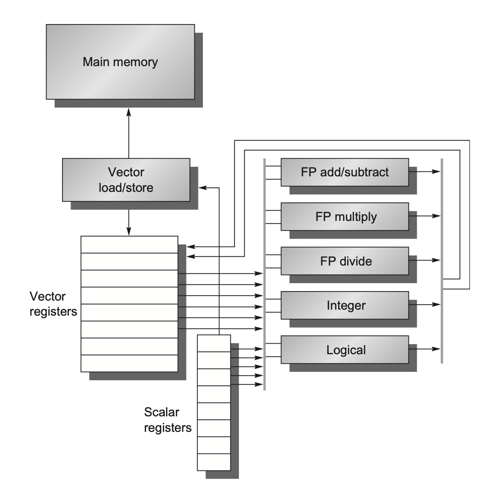
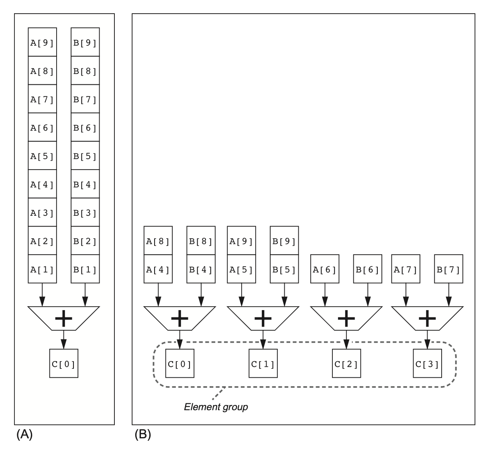
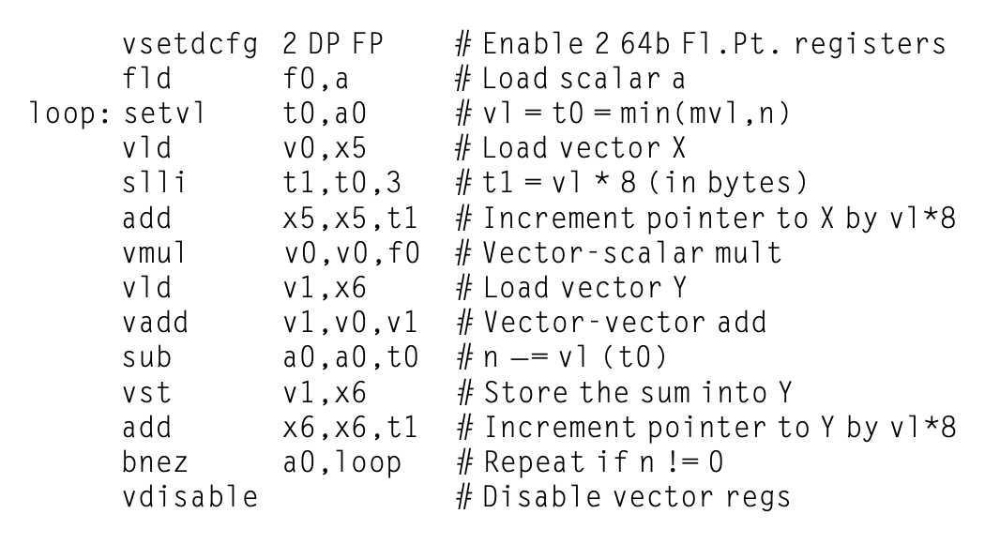
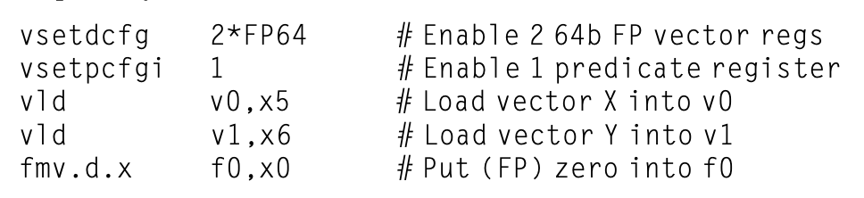
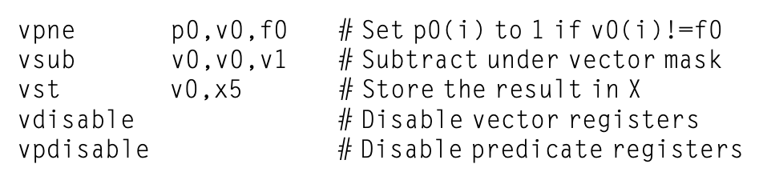
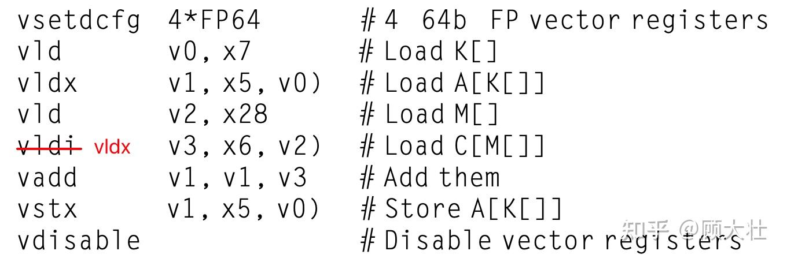
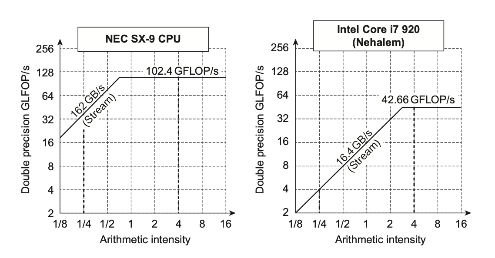
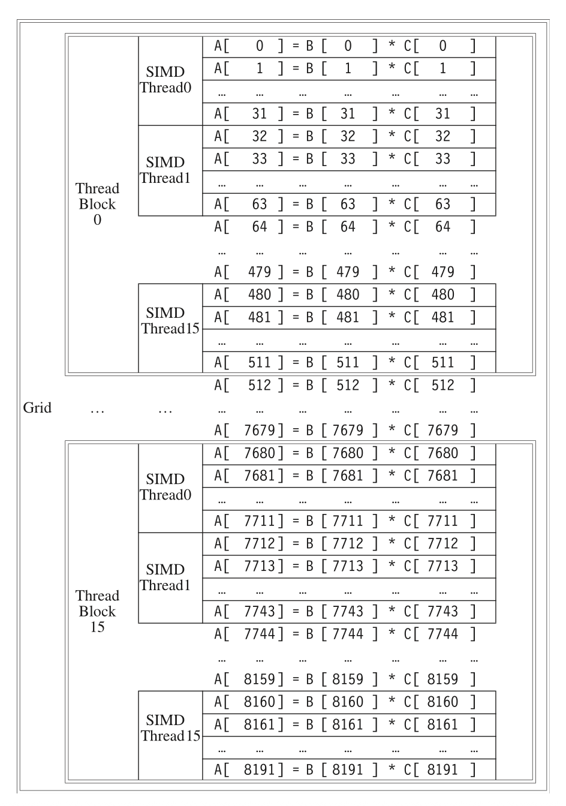
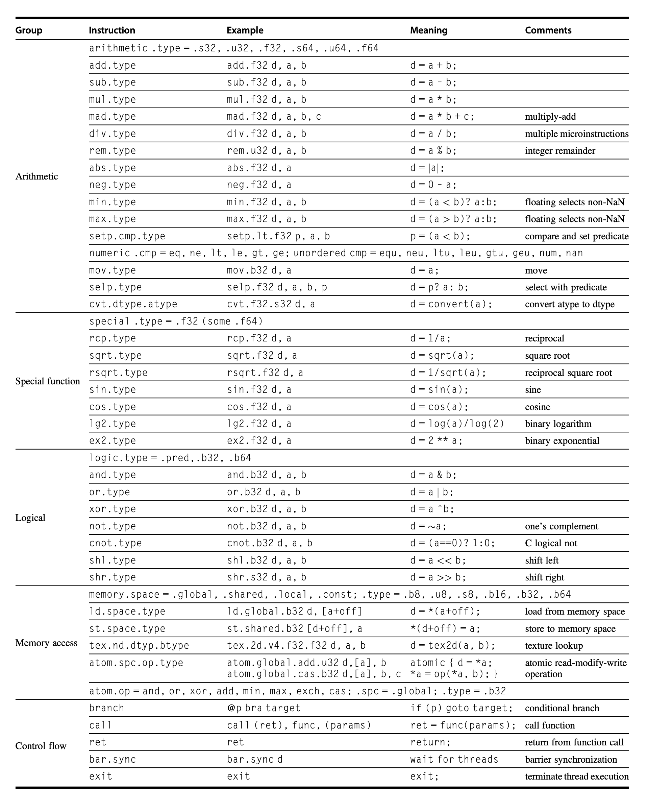
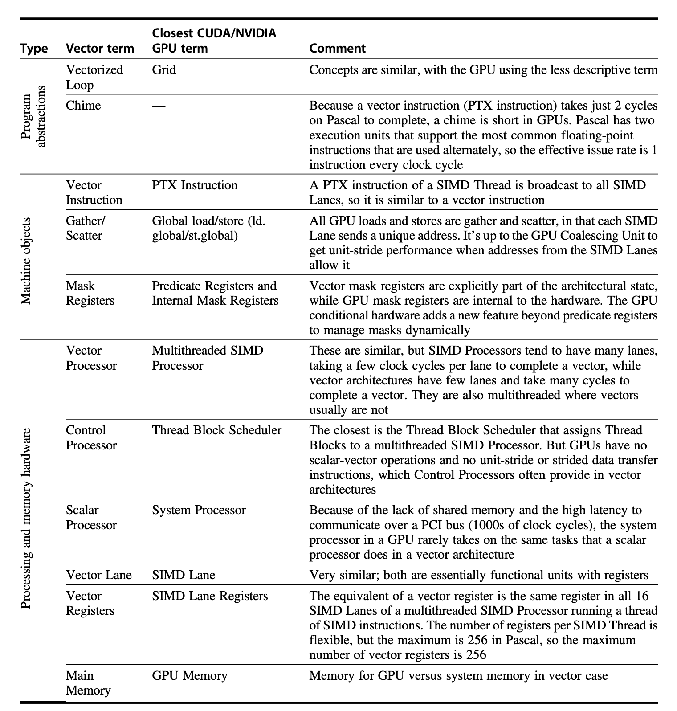

# 数据级并行

## Vector Architecture
> Grab sets of data elements scattered about memory:抓取分散在内存中的一组数据元素
>
> Place them in large sequential reg files
>
> Operate on data in those data files
>
> Disperse the results back to memory:将结果重新分散回内存

也就是说,向量架构的核心思想就是**集中读取**,**统一处理**,**批量写回**.

### RV64V

<div align="center">
    
</div>

上图展示了一种经典的向量处理器,与普通的处理器相比,有如下变化:

1. **Vector load/store**: 向量加载和存储指令,可以从内存中加载向量数据到寄存器中,或者将寄存器中的向量数据存储到内存中.

2. **Vector register file**: 向量寄存器文件,可以存储多个向量数据.

    - 为了支持向量操作,向量寄存器会有许多读写端口

3. **Vector functional units**: 向量功能单元,可以对向量数据进行操作.也即,相比于普通的功能单元,它们的位宽更大了.


??? info "向量指令"
    

    - 向量指令的格式与普通指令类似,但是它们的操作数是向量寄存器,而不是标量寄存器(当然也有一些向量指令的操作数是标量寄存器,比如`vadd.vx`指令).
    
    - 向量指令的操作数可以是任意长度的向量,而不是固定长度的标量.
    
    - `vld` `vst`等指令接受两个操作数,第一个操作数表示向量寄存器的编号,第二个操作数是一个标量寄存器的编号,寄存器内存放着向量数据的内存起始地址.

对于下面的指令,
```assembly
    fld f0,a #load scalar a
    addi x28,x5,256 #last address to load
Loop: fld f1,0(x5) #load x[i]
    fmul.d f1,f1,f0 #multiply x[i] * a
    fld f2,0(x6) # load y[i]
    fadd.d f2,f2,f1 # y[i] = y[i] + x[i] * a
    fsd f2,0(x6) # store y[i]
    addi x5,x5,8 # next address
    addi x6,x6,8 # next address
    bne x5,x28,Loop 
```

我们可以变成
```assembly
vsetdcfg 4*FP64 # set vector length to 4*FP64
vld v0,0(x5) #load x[i]
vld v2,0(x6) # load y[i]
fld f0,a #load scalar a
vmul.vx v1,v0,f0 #multiply x[i] * a
vfadd.vv v3,v1,v2 # y[i] = y[i] + x[i] * a
vst v3,0(x6) # store y[i]
```

这样,就可以把原来标量的大量重复操作变成了向量操作,从而提高了性能.


!!! definition "Chain"
    下面两条指令:

    ```assembly
    VADD V1, A, B    ; V1[i] = A[i] + B[i]
    VMUL V2, V1, C   ; V2[i] = V1[i] * C[i]
    ```
    
    - 这两条指令就形成了一个"Chain",因为`VMUL`依赖于`VADD`的结果.

    - 如果硬件支持 chaining，`VMUL` 不需要等 `VADD` 完整处理完所有元素才开始执行，而是**只**要`VADD`处理完第一个元素，`VMUL`就可以开始用这个结果做乘法。

    ```plain
    时间线（时钟周期）：
    Cycle:      1   2   3   4   5
    VADD:      A1  A2  A3  A4  A5
    VMUL:          M1  M2  M3  M4
    ```

### Execution Time

- **Convoy**: 一组可以并行执行的指令,它们之间没有结构冒险
    - RAW在这里是允许的,因为有"Chain"的存在.

- **Chime(拍)**: 执行一个Convoy需要的时间


---

我们再来看上面的指令:

```assembly
vsetdcfg 4*FP64 # set vector length to 4*FP64
vld v0,0(x5) #load x[i]
vld v2,0(x6) # load y[i]
fld f0,a #load scalar a
vmul.vx v1,v0,f0 #multiply x[i] * a
vfadd.vv v3,v1,v2 # y[i] = y[i] + x[i] * a
vst v3,0(x6) # store y[i]
```

1. 有几个**Convoy**

    - `vld v0,0(x5)` 和 `vmul.vx v1,v0,f0` 形成一个Convoy
    
    - `vld v2,0(x6)` 和 `vfadd.vv v3,v1,v2` 形成一个Convoy
    
    - `vst v3,0(x6)` 形成一个Convoy

    - 所以一共是3个Convoy.

2. 每个FLOP(floating Point Operation)需要多少个时钟周期

    - 假设是32个元素的向量

    - 每个Chime需要32个周期

    - 3个Chime,所以一共需要96个周期

    - 3个Chime执行了两个浮点数操作(vmul和vfadd),所以每个FLOP需要1.5个周期.

!!! tip "Summary"
    - A vector sequence that consists of m convoys executes in m chimes.

    - For a vector sequence of n elements, this sequence takes approxiamtely $m \times n$ clock cycles

### How to optimize

#### Multiple Lanes

- 使用更多的功能单元,比如4个功能单元,可以把一个Chime分成4个Lane,每个Lane执行一个操作.
    <div align="center">
        
    </div>

#### Vector-Length Registers
> 在编译时,向量长度总是未知的
>
> 一段代码可以需要多种向量长度
>
> 比如:
```c
for (int i = 0; i < N; i++) {
    a[i] = b[i] + c[i];
}
```
>
> 这里向量的长度取决于N的值,而N的值在编译时是未知的.

为了解决这个问题,RV64V引入了向量长度寄存器(vl),它可以控制任何向量指令的长度,但不能超过最大向量长度(mvl)

然而,如果N有可能超过mvl的话,我们需要使用Strip Mining技术,也就是把一个大的向量分成多个小的向量,然后分别处理.

具体做法是:

- 将向量操作分为两个loop

- 一个loop处理mvl的倍数个元素

- 另一个loop处理剩下的元素

```cpp title="original"
for (int i = 0; i < 100; ++i)
    A[i] = B[i] + C[i];
```

```cpp title="strip mining"
int VL = 8; // 向量宽度
for (int i = 0; i < 100; i += VL) {        // 外层：按向量宽度分段
    int len = std::min(VL, 100 - i);       // 处理边界
    for (int j = 0; j < len; ++j) {        // 内层：一个 strip 内逐个处理
        A[i + j] = B[i + j] + C[i + j];
    }
}
```

---

!!! tip "setvl"
    我们有一种更优雅的方式来处理.

    ```riscv
    vsetvl t0, a0
    ```

    - `a0`:请求的向量长度

    - `t0`:实际的向量长度

    有了`setvl`,我们就不需要手动处理了,编译器会自动处理.

    ```cpp
    for (int i = 0; i < N; i += VL) {
    int vl = setvl(N - i);  // 设置本次迭代实际向量长度
    vse.v v0, (a + i), vl;  // 向量存储
    }
    ```

    实际上,`setvl`和`min(mvl, N - i)`是等价的,但是`setvl`会更高效,因为它可以在硬件上实现.

    <div align="center">
        
    </div>

    这里就是一个使用`setvl`的例子,它会自动处理向量长度的问题,我们不需要再担心N的大小.

#### Predicate Registers
> 当我们遇到if-else分支时,向量处理就变得很棘手了.因为此时向量的每一位都可能作不一样的操作
>
> 
```c
for (i = 0; i < 64; ++i)
    if (X[i] != 0)
        X[i] -= Y[i];
```

`Predicate`寄存器存储位数与向量长度一致,我们在运行时,先把if-else的条件计算出来,然后把结果存储到`Predicate`寄存器中,所有向量指令仅操作对应项在`Predicate`寄存器里的值为`1`的元素，对应值为 `0`的元素就不会发生改变。

上面的代码最终可以变为:

<div align="center">
    
</div>

<div align="center">
    
</div>

#### Memory Banks
> 内存 bank（内存子块）是内存内部的并行访问单元，多个 bank 允许同时进行多个读写操作，从而提高带宽、避免访存瓶颈。

算数单元的速度会比内存快很多,所以我们需要把内存分成多个bank,这样可以提高内存的带宽.

!!! example
    Cary T90有32个处理器,每个处理器在每个时钟周期要进行4次load和2次store

    处理器周期长度:2.167ns

    SRAM周期长度:15ns

    这样,处理器会比内存快很多,那么,我们需要把内存分为几个区才能让所有处理器跑满带宽?

    ??? general "解答"
        每一个处理器周期,进行$(4+2) \times 32 = 192$次load/store,也就是192次内存访问.

        一个SRAM Cycle相当于7个处理器周期,所以每个SRAM Cycle进行$192 \times 7 = 1344$次内存访问,也就是1344个bank.

#### Stride
> Stride是指在内存中访问数据时的步长,也就是每次访问数据时跳过的元素个数.


```c
for (i = 0; i < 100; ++i)
    for (j = 0; j < 100; ++j) {
        A[i][j] = 0.0;
        for (k = 0; k < 100; ++k) 
            A[i][j] += B[i][k] * D[k][j];
    }
```

C语言是Row-Major的,那么我们在访问`D[k][j]`时,每次会跳过`100`个元素,也就是$100 \times 8 = 800$字节

所以:

1. Unit Stride:访问相邻的元素

2. Non-Unit Stride: 访问不相邻的元素

    - `vlds`(load vector with stride):
        - `vlds`指令可以加载一个向量,但是它的步长不是1,而是stride.
        
        - `vlds`指令的格式为`vlds v0, base, stride, vl   // vector load strided`,表示从内存地址`base`开始，按间隔 `stride`字节，加载`vl`个元素到向量寄存器`v0`。
        
        - `vlds`指令会把加载的向量存储到`v0`寄存器中.
    
    - `vsts`(store vector with stride):
        
        - `vsts`指令的格式为`vsts v0, base, stride, vl`

        ```c
        for i = 0 to vl - 1:
            MEM[ base + i × stride ] ⬅ v0[i]
        ```

如果一个分区有多个访问,冲突就发生了.

当满足下面的条件时,我们认为发生了冲突
> 其实也就是看这次访问这个bank和下次访问的间隔是否足够完成一次访问

$$
\frac{\text{LCM}(\text{stride},\text{number of banks})}{\text{stride}} \leq \text{bank busy time}
$$

- `LCM`:最小公倍数

#### Gather-Scatter

```c
for (i = 0; i < n; ++i)
    A[K[i]] += C[M[i]];
```

- `A`和`C`是稀疏向量

- `K`和`M`是索引向量,它们指明了`A`和`C`的中的非零元素的位置

- `Gather`指令获得索引向量，抓取向量（其向量元素位于基地址与索引向量的偏置量相加的目标地址）。在向量寄存器中会得到一个稠密向量。

- `Scatter`指令将稠密向量的元素分散到稀疏向量中，稀疏向量的元素位置由索引向量指定。

<div align="center">
    
</div>

<div align="center">
    
</div>

## SIMD
> 与vector很像,区别在于它的向量是固定长度的

- 固定长度向量：SIMD指令通常操作的是固定长度的向量。向量的长度由SIMD寄存器的宽度和数据类型决定（例如，一个128位寄存器可以容纳4个32位浮点数或16个8位整数）。如果需要处理的数据量超过了这个固定长度，程序员或编译器需要显式地使用循环（通常称为“Strip Mining”）来分块处理数据。

- 动态长度向量（传统向量架构）：相比之下，一些更传统的向量架构（如Cray向量处理器或RISC-V向量扩展）支持可变长度的向量操作，通常通过一个特殊的向量长度寄存器（vl）来控制。这使得它们能更灵活地处理任意长度的数据序列，而无需显式分块。

### Roofline Visual Performance Model

屋顶线模型(Roofline model)用二维图形表示浮点数性能、内存性能以及算术强度之间的关系。

- **X轴:算术强度**(Arithmetic Intensity):每访问一字节内存所执行的浮点操作数的数量

    - 单位：FLOPs/Byte (浮点运算次数/字节)。

    -  反映了算法的计算密度。算术强度越高，意味着算法在数据传输上的计算量越大，对计算性能的依赖性越高。

    <div align="center">
        
    </div>

- **Y轴:可达到的性能** (Attainable Performance)
    - 单位：GFLOPs/s (每秒十亿次浮点运算)。

    - 表示应用程序在该硬件上实际能够达到的浮点运算性能。

- **屋顶 (Ceilings)**：模型中有两条关键的“屋顶”线，它们限制了应用的可达到性能。
    *   **水平屋顶 (Peak Floating-Point Performance)**：代表了处理器理论上能够达到的最大浮点运算性能（例如，CPU或GPU的峰值GFLOPs/s）。这是一条水平线，因为无论算术强度如何，性能都不会超过这个硬件极限。
    *   **倾斜屋顶 (Peak Memory Bandwidth)**：代表了内存系统能够提供的最大数据传输速率（例如，GB/s）。这条线的斜率等于内存带宽。性能受到内存带宽的限制，计算公式为：`Attainable Performance = Arithmetic Intensity × Memory Bandwidth`。

<div align="center">
    
    <br>
    <caption>
        <b>屋顶线模型</b>
    </caption>
</div>

## GPU <strike>is all you need</strike>

GPU支持多种并行方式,比如multi-threading, SIMD,ILP等


### NVIDIA CUDA

CUDA,即 Compute Unified Device Architecture,是NVIDIA推出的一种并行计算架构和编程模型。它允许开发者利用GPU的强大计算能力来加速计算密集型应用程序。

- **CUDA Threads**: CUDA的基本执行单元是线程。每个线程可以独立执行代码，并且可以访问共享内存和全局内存。

- **CUDA Blocks**: 线程被组织成块（blocks），每个块可以包含多个线程。块内的线程可以共享内存，并且可以通过同步机制进行通信。

- **Function Declaration**: CUDA函数分为两种类型：主机函数（在CPU上执行）和设备函数（在GPU上执行）。
    - `__global__`,`__device__`：用于声明设备函数

    - `__host__`:用于声明主机函数

- `name<<<dimGrid, dimBlock>>>(args)`：用于调用设备函数
    - `dimGrid`:网格的维度

    - `dimBlock`:块的维度

- `blockIdx`和`threadIdx`:用于获取当前线程的索引

!!! example
    === "DAXPY in C"
        ```c
        // Invoke DAXPY
        daxpy(n, 2,0, x, y);
        // DAXPY in C
        void daxpy(int n, double a, double *x, double *y) {
            for (int i = 0; i < n; ++i)
                y[i] = a * x[i] + y[i];
        }
        ``` 
    === "DAXPY in CUDA"
        ```cuda
        // Invoke DAXPY with 256 threads per Thread Block
        __host__
        int nblocks = (n + 255) / 256;
        daxpy<<<nblocks, 256>>>(n, 2,0, x, y);
        // DAXPY in CUDA
        __global__
        void daxpy(int n, double a, double *x, double *y) {
            int i = blockIdx.x * blockDim.x + threadIdx.x;
            if (i < n)
                y[i] += a * x[i];
        }
        ```

---

还有一些GPU术语:

<div align="center">
    
</div>


### GPU Structure

- **Grid**: GPU的最顶层结构,由多个Block组成

- **Block**: Block是GPU的基本执行单元,由多个Warp组成

- **Warp**: 通常是32个线程组成的一个执行单元，是GPU调度的最小单位

- **Thread**: GPU的最小执行单元,每个Thread可以独立执行代码

- **Element**: GPU的最小数据单元,每个Thread可以处理多个Element

比如,对于向量$A = B \times C$,一个8192个元素的乘法

<div align="center">
    
</div>

这个grid有16个block,每个block包含16个thread,每个thread处理32个元素

---

下图是一个简单的多线程SIMD处理器框架

<div align="center">
    
</div>

可以看到,多个函数单元是并行的.

### SIMD Thread Scheduler

一共有两级的GPU调度器:

- **Thread Block Scheduler**:负责调度Block,每个Block可以包含多个Thread.将Block分配到多线程SIMD处理器上执行

- **SIMD Thread Scheduler**:负责调度Thread,每个Thread可以处理多个Element.调度决定一个SIMD处理器中的线程何时运行


### Nvidia GPU ISA

**PTX**:NVIDIA的并行线程执行（Parallel Thread Execution）虚拟机指令集架构（ISA），提供稳定的指令集供编译器使用

??? info "基本的PTX指令"
    


用PTX实现上面的DAXPY就是:

<div align="center">
    
</div>

### Conditional Branch

也使用`Predicate`寄存器,但是它的实现方式与CPU不同.

- **Predicate Register**:每个线程都有一个`Predicate`寄存器,用于存储条件判断的结果

- **Predicate Execution**:每个线程可以根据`Predicate`寄存器的值决定是否执行某条指令

```ptx
// PTX code for conditional execution
.reg .pred p;
setp.ne.b32 p, r1, 0; // Set predicate if r1 is not equal to 0
@p add.f32 r2, r2, r3; // Conditionally execute if p is true
```

### GPU Memory
> 别问我笔记为啥这么少,因为上课几乎就是飞速带过...

<div align="center">
    
    <br>
    <caption>
        <b>GPU Memory Hierarchy</b>
    </caption>
</div>

详细的看[这里](https://note.noughtq.top/system/ca/4#nvinda-gpu-memory-structures)

### GPU vs Vector

??? info "GPU中的术语对标Vector"
    

---

以及架构的对比:

<div align="center">
    
</div>

### GPU vs Multimedia SIMD
> GPU和多媒体SIMD的区别在于,GPU是为通用计算而设计的,而多媒体SIMD是为特定应用而设计的
>
> 然而上课啥也没说,就一张图

<div align="center">
    
</div>