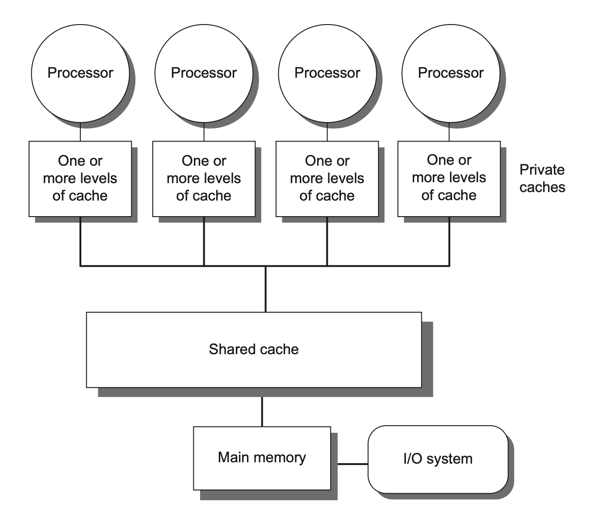

# TLP(Thread-Level Parallelism)

我们在之前学习了两种并行方式:

- **ILP(Instruction-Level Parallelism)**: 指令级并行性
    - 在单个处理器中并行执行多条指令

    - 依赖硬件进行指令调度（流水线、乱序执行、超标量等）。

- **DLP(Data-Level Parallelism)**: 数据级并行性
    - 对多个数据进行同样的操作

    - 比如：对一个数组中的每个元素加1，是完全的数据级并行操作。

    - 通过架构设计（SIMD、Vector等）来实现。

而在这里我们介绍的是**TLP(Thread-Level Parallelism)**: 线程级并行性。

TLP使用**MIMD(Multiple Instruction Multiple Data)**架构，每个处理器抓取不同的指令,并对不同的数据进行操作。

这之中需要用到多处理器(Multiple Processors),主要有两种:

- **多核处理器**: 在单个芯片上集成多个处理器核心。

- **多处理器系统**: 在多个芯片上集成多个处理器。

## Multiprocessor Architecture

根据内存的组织与互联策略,将多处理器架构分为如下两种

- **Symmetric/Centralized Shared Memory (SMP/CSM)**: 对称/集中式共享内存
    - 所有处理器共享同一物理内存。

    - 比较常用

    - 32个核或更少

    - 所有处理器访问内存的延迟是均一的,因此SMP也被称为**Uniform Memory Access (UMA)**。

    <div align="center">
        
    </div>

- **Distributed Shared Memory (DSM)**: 分布式共享内存
    - 每个处理器有自己的本地内存。

    - 通过网络连接实现内存的分布式访问。

    - 本地内存访问快,但是远程内存访问就很慢了,NUMA(non-uniform memory access)架构。

    <div align="center">
        
    </div>

    - DSM需要更复杂的处理器通信,以及更复杂的软件来处理分布内存


### Hundles of Parallel Processing

主要有两个问题:

1. 程序本身并行性不强

2. 多处理器之间的通信开销大

这两个问题会导致多处理器的性能提升不明显。


#### Limited Program Parallelism

!!! example

    要实现`A+B+2`的计算:
    === "before"
        ```riscv
        ld x1,0(x0)
        ld x2,4(x0)
        add x3,x1,x2
        add x4,x3,2
        ```
    === "after"
        ```riscv
        ld x1,0(x0)
        ld x2,4(x0)
        add x3,x1,1
        add x4,x2,1
        add x5,x3,x4
        ```

    后面的并行程度就大于前面的

再回到前面说过的Amdahl's Law:

为了在一百个处理器下达到80倍的加速,串行部分的比例是多少?

$$
x + \frac{1-x}{100} = \frac{1}{80}
$$

$$x = 0.25 \%$$

所以,需要串行部分占如此少,才能在100个处理器下达到80倍的加速。

如果要优化的话,需要:

- 设计能提供更优并行性能的算法

- 设计软件系统,让处理器全负荷运转下的有效执行时间延长

#### Communication Overhead

通信开销包括了并行处理器中远程访问的高延迟

!!! example
    一个app跑在一个32处理器的MP上,处理器访问远程内存需要100ns.

    处理器时钟频率4GHz,基础CPI为0.5

    那么,没有任何通信的情况下,比0.2%指令访问远程内存,快了多少?

    ??? tip
        假设一共N条指令

        - 没有通信情况下,需要$N \times 0.5 = \frac{N}{2}$周期

        - 在需要远程访问的情况下,远程访问一次内存需要$100 \times 10^{-9} \dot 4 \times 10^9 = 400$周期
            - 那么,一共需要$N \times 0.5 + 0.2% \times 400 \times N = 1.3N$周期

        - 因此快了2.6倍

        - 所以,仅仅是占比如此少的远程内存访问就带来了如此大的延迟


要优化的话,需要使用Cache,预取等技术来减少远程访问。

## Centralized Shared Memory

如该图所示:

<div align="center">
    
</div>

每个处理器都有自己的Cache,并且通过总线连接到共享内存。

当这样的设计带来了一个新的问题.为了保证高速,我们肯定是希望每个处理器尽量少通信,多使用自己的Cache,然而,当一个处理器在自己的Cache里修改了数据后,如果它的Cache和其他处理器的Cache之间没有同步,那么其他处理器就会读取到过时的数据。

这就是**Cache Coherence**问题。

我们定义,一个内存系统是一致的(Coherent)的,当对任何数据项的读取都返回这个数据项最近写入的值

有两个容易混淆的概念:Coherence和Consistency

- **Coherence**: 决定了读取操作可以返回什么值

- **Consistency**: 决定写入的值什么时候可以被读操作返回

!!! definition "Coherence Property"
    -  处理器 P 对位置 X 执行写操作后，如果紧接着对 X 执行读操作，且在此期间没有其他处理器对 X 进行写入，那么该读操作必须返回 P 刚才写入的值。

    - 当处理器 A 对位置 X 的读操作发生在处理器 B 对 X 的写操作之后，只要读写操作之间有足够的时间间隔，且期间没有其他对 X 的写操作，那么 A 的读操作应该返回 B 写入的值。

    - **写串行化(write serialization)**: 对同一位置 X 的所有写入操作在任一处理器看来,都是按照它们的时间顺序发生的。比如,如果一个位置先被写1,再被写2,那么处理器看到的不能是先写2再写1。

满足上述三个性质,我们就能确保一致性.然而,对于Consistency,比如A在B写后马上读取,这时是很有可能读到错误的值的,这时就需要锁.

### Cache Coherence Protocols
> Cache Coherence Protocols是用来确保多个处理器的Cache之间数据一致性的协议。

有两种方法:

- **Directory-Based Protocols**: 目录式协议
    - 使用一个中心目录来跟踪每个数据块的状态和所在的Cache。

    - 当处理器需要访问数据时,它会查询目录以获取最新状态。

    - 优点是可以减少通信开销,缺点是需要额外的存储空间来维护目录。

- **Snooping Protocols**: 监听协议
    - 每个处理器的Cache会监听总线上的所有读写操作。

    - 当一个处理器写入数据时,其他处理器可以通过监听到这个操作来更新自己的Cache。

    - 优点是实现简单,缺点是随着处理器数量增加,总线通信开销也会增加。


#### Snooping Protocols

有两种Snooping Protocols:

- **Write-Invalidate**:当一个处理器对某个数据项写之后,它在总线上放一个`invalidate`信号,其他处理器收到这个信号后,就会将自己的Cache中对应的数据项标记为无效。这样,如果尝试访问这个数据项,就会直接Cache Miss,然后从主存中重新加载。
    <div align="center">
        
    </div>

    - 可以看到,在A写了之后,B里面的数据直接没了

    - 如果一个处理器接受到的invalidate信号是它的Cache中的脏数据,那么它必须先将这个脏数据写回到下一级Cache,然后再将当前Cache中的数据标记为无效。

- **Write-Update**:当一个处理器对某个数据项写之后,它会将这个数据项的最新值广播到总线上,其他处理器收到这个信号后,就会更新自己的Cache中对应的数据项。(通信量大，一般较少用)


上面都是概念上的协议.在具体实现中,通常使用有限状态机,下面是一些具体的协议实现:

---

- **MSI Protocol**,数据块有三种状态:

    - **M**odified: 数据项在当前Cache中被修改,且其他Cache中没有这个数据项的副本(或被无效),类似于排他锁

    - **S**hared: 数据项在当前Cache中未被修改,且可能在其他Cache中有副本。通常是多个处理器读取同一数据项时的状态,类似于共享锁

    - **I**nvalid: 数据项在当前Cache中无效。

    <div align="center">
        
        <br>
        <caption>
        <b>不同情况下的处理,来自bus的请求意味着其他处理器要访问本处理器中的数据项
        </b>
        </caption>
    </div>

    - 根据请求来源导致的状态转变,有如下状态机:
        <div align="center">
            
            </div>
    - 汇总:
        <div align="center">
            
        </div>

- **MESI Protocol**,在MSI的基础上增加了一个状态:
    - **E**xclusive: 数据项在当前Cache中未被修改,且其他Cache中没有这个数据项的副本。也即,这个数据项仅在当前CPU的Cache中存在,且不是脏的。

    - 在这个状态下:
        - 如果其他CPU读取了这个数据项,则从Exclusive变为Shared

        - 如果自己修改了这个数据项,则从Exclusive变为Modified

    - 这样,有可能写了一个数据项,但不需要发出invalidate信号,减少开销


- **MOESI Protocol**,在MESI的基础上增加了一个状态:
    - **O**wned: 表示该数据块被当前Cache拥有,且主存中的是过时的

    - 当总线上发来Read Miss信号,也即其他处理器需要读取这个数据项时,当前Cache可以直接将数据项发送给请求的处理器,而不需要先写回主存。此时状态由Modified变为Owned。

    - 这样,相比于之前两个协议,减少了写回内存的次数.只在自己Miss或者Bus传来Write Miss或者Invalidate时才写回内存。