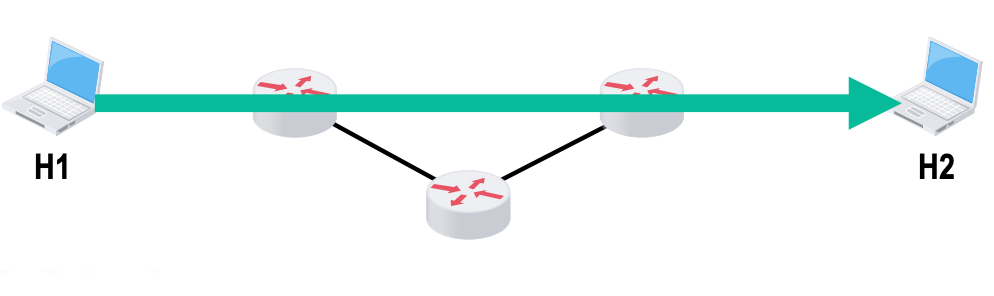
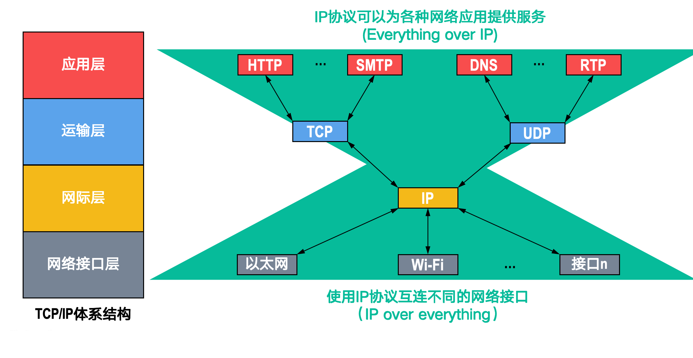

# 概述

!!! info "Internet与internet"
    + Internet: 专有名词,指当前全球最大的互联网,即因特网,采用TCP/IP协议

    + internet: 互联的网络, 例如: 局域网, 城域网, 广域网等

## 电路交换、分组交换和报文交换

### 电路交换

电路交换的一般过程是: 建立连接 -> 数据传输 -> 断开连接

    
    <caption>电路交换</caption>

在进行数据传输前, 两个用户之间必须先建立一条专用的物理通信路径. 该路径在通信过程中一直保持连接状态, 直到通信结束后才断开.

在电路交换中,电路建立后,除源节点和目的节点外,电路上的任何节点都采取“直通方式”  发送数据和接收数据,即不存在存储转发所耗费的时间。在电路交换的整个通信阶段,比特流连续地从源节点直达目的节点,就好像在一个管道中传送。

在这样的设计下,电路交换的优点是:

+ 信时延小。因为通信线路为通信双方专用,数据直达,所以传输速率高。  

+ 有序传输。双方通信时按发送顺序传送数据,不存在失序问题。 

+ 没有冲突。不同的通信双方拥有不同的信道,不会出现争用物理信道的问题。 

+ 实时性强。通信双方之间的物理通路一旦建立,双方就可随时通信。

其缺点也很明显:

+ 资源利用率低。通信线路在通信双方之间是专用的,即使在通信过程中没有数据传输,该线路也不能被其他用户使用,造成资源的浪费。

+ 建立连接时间长。通信双方在进行数据传输前,必须先建立连接,这需要一定的时间。

+ 灵活性差。物理通路中的任何一点出现故障, 就必须重新拨号建立新的连接。

计算机之间的数据传送是突发式的，当使用电路交换来传送计算机数据时，其线路的传输效率一般都会很低，线路上真正用来传送数据的时间往往不到$10\%$甚至$1\%$。

### 报文交换

> 报文是数据交换的基本单位

用户数据加上源地址、目的地址等信息后，封装成报文（Message）。报文交换采用**存储转发**技术：整个报文先传送到相邻节点，全部存储后查找转发表，再转发到下一个节点，如此重复，直到到达目的节点。每个报文都可单独选择到达目的端的路径。

**报文交换的优点：**

1. **无建立连接时延**：通信前无需建立连接，用户可随时发送报文。

2. **灵活分配线路**：交换节点存储整个报文后，选择合适的空闲线路转发。若某条路径故障，可重新选择路径。

3. **线路利用率高**：报文在一段链路上传送时才占用该链路资源。

4. **支持差错控制**：交换节点可对缓存的报文进行差错检验。

**报文交换的缺点：**

1. **转发时延高**：节点需将报文整体接收完后，才能查找转发表并转发到下一个节点。

2. **缓存开销大**：报文大小无限制，要求节点有较大缓存空间。

3. **错误处理低效**：报文较长时，发生错误概率大，重传整个报文代价高。

### 分组交换
> 分组交换也就是在报文交换的基础上,将报文划分为若干个较小的分组(或称为数据包)进行传送.

源主机在发送之前,先把较长的报文划分成若干较小的等长数据段,在每个数据段前面添加一些由必要控制信息(如源地址、目的地址和编号信息等)组成的首部,构成分组(Packet)

    
    <caption>分组结构</caption>

下图展示了分组交换的工作过程.

    
    <caption>分组交换</caption>

分组交换的优点:

1. **存储空间小**：分组较小,对交换节点的缓存要求较低.

2. **传输效率高**: 多个分组之间可以并行传输

缺点:

1. **存在存储转发时延**。尽管分组交换比报文交换的传输时延小,但相对于电路交换仍存在存储转发时延,且其节点交换机必须具有更强的处理能力。

2. **信息量大**。分组交换中每个分组都要携带源地址、目的地址等控制信息,这些控制信息占用了一定的信道资源,降低了信道的有效利用率。

??? info "三种交换对比"
    

## 计算机网络的分类

### 按分布范围分类的计算机网络

计算机网络按照覆盖范围的不同，主要分为以下几类：

1. **广域网（WAN, Wide Area Network）**  
   广域网覆盖范围广泛，通常可达几十公里到几千公里，主要用于实现远距离的数据通信。广域网是互联网的核心部分，各节点之间通常通过高速链路互联，具备较大的通信容量。

2. **城域网（MAN, Metropolitan Area Network）**  
   城域网的覆盖范围一般为5~50公里，可以跨越几个街区甚至整个城市。城域网多采用以太网等技术，有时也被归入局域网的讨论范畴。

3. **局域网（LAN, Local Area Network）**  
   局域网覆盖范围较小，通常在几十米到几千米之间。局域网一般通过高速线路将主机相连，传统上采用广播技术，而广域网则多采用交换技术。

4. **个人区域网（PAN, Personal Area Network）**  
   个人区域网主要用于个人工作或生活空间内的设备互联，如平板电脑、智能手机等，通常采用无线技术连接，也称为无线个人区域网（WPAN）。

### 按传输技术分类的计算机网络

计算机网络根据其传输技术的不同，可以分为以下两类：

1. **广播式网络**  
   广播式网络中，所有联网的计算机共享同一个公共通信信道。当某台计算机通过该信道发送报文分组时，网络中的所有其他计算机都能“收听”到这个分组。每台计算机会检查分组的目的地址，决定是否接收该分组。局域网（LAN）基本上都采用广播式通信技术，广域网中的无线和卫星通信网络也常用此方式。

2. **点对点网络**  
   点对点网络中，每条物理线路仅连接一对计算机。如果通信双方之间没有直接的物理连接，则数据分组需要经过中间节点的存储和转发，最终到达目标主机。广域网（WAN）大多采用点对点的通信方式。

> 此外还有拓扑结构,如: 总线型, 星型, 环型, 树型, 网状型;使用者数, 如: 专用网, 公用网;传输介质, 如: 有线网, 无线网等分类方式.

## 计算机网络的性能指标

### 速率(Speed)

速率是指数据传输的快慢程度，通常用比特每秒（bps, bits per second）或者字节每秒（Bps, bytes per second）来表示。常见的速率单位有：

- 1 Bps = 8 bps

- 1 Kbps = $10^3$ bps = 1,000 bps

- 1 Mbps = $10^6$ bps = 1,000,000 bps

- 1 Gbps = $10^9$ bps = 1,000,000,000 bps

- 1 Tbps = $10^{12}$ bps = 1,000,000,000,000 bps

!!! warning "和数据量的不同"
    数据量中的KB,MB换算关系为:

    - 1 KB = $2^{10}$ B = 1,024 B

    - 1 MB = $2^{20}$ B = 1,048,576 B

    - 1 GB = $2^{30}$ B = 1,073,741,824 B

!!! example "计算例子"
    有一个待发送的数据块，大小为100MB，网卡的发送速率为100Mbps，则网卡发送完该数据块需要多长时间？
    ??? tip "解答"
        100MB = 100 × $2^{20}$ B = 104,857,600 B = 838,860,800 b

        100Mbps = 100 × $10^6$ bps = 100,000,000 bps

        发送时间 = 数据量 / 速率 = 838,860,800 b / 100,000,000 bps = 8.388608 s ≈ 8.39 s

### 带宽(Bandwidth)

带宽原本表示通信线路允许通过的信号频率范围,单位是赫兹(Hz)。但在计算机网络中,带宽表示网络的通信线路所能传送数据的能力,是数字信道所能传送的“最高数据传输速率”的同义语,单位是比特/秒(b/s)。

我们可以说:

$$
\text{数据传送速率} = \min \left\{ \text{主机接口速率},\ \text{线路带宽},\ \text{交换机或路由器的接口速率} \right\}
$$

    
     
    <caption>数据传送速率受限于路径中最慢的环节</caption>

### 吞吐量(Throughput)
> 带宽是高速公路上的车道数, 吞吐量是单位时间内通过的车辆数.

吞吐量是单位时间内通过某个网络(或信道、接口)的实际数据量。吞吐量常用于对实际网络的测量,以便获知到底有多少数据量能够通过网络。

吞吐量受网络带宽的限制。

### 时延(Delay)
> 时延(Delay)。指数据(一个报文或分组)从网络(或链路)的一端传送到另一端所需 的总时间,它由4部分构成:发送时延、传播时延、处理时延和排队时延。

+ **发送时延**(Transmission Delay)  
    发送时延是指将数据从主机的内存送到物理信道所需的时间。发送时延与数据量和信道带宽有关,其计算公式为:

    $$
    \text{发送时延} = \frac{\text{分组长度(比特)}}{\text{发送速率(比特/秒)}}
    $$

    发送速率是$min\{主机接口速率, 信道带宽, 交换机或路由器的接口速率\}$

+ **传播时延**(Propagation Delay)  
  传播时延是指数据在信道上从发送端传播到接收端所需的时间。传播时延与信道的物理长度和信号在信道中的传播速度有关,其计算公式为:

    $$
    \text{传播时延} = \frac{\text{信道长度(米)}}{\text{信号传播速度(米/秒)}}
    $$

+ **处理时延**(Processing Delay)  
    分组在交换节点为存储转发而进行的一些必要处理所花的时间。例如,  分析分组的首部、差错检验或查找合适的路由等。

+ **排队时延**(Queuing Delay)  
    分组在路由器的输入队列或输出队列中排队等待所花的时间。

数据的总延时就是以上之和.

一般计算中,不考虑处理时延和排队时延

    
     
    <caption>数据传输时间示意图</caption>

!!! example "例题"
    === "T1"
        在下图所示的采用“存储-转发”方式的分组交换网中， 所有链路的数据传输速率为100Mbps，分组大小为1000B， 其中分组头大小为20B。若主机H1向主机H2发送一个大小为980 000B的文件，则在不考虑分组拆装时间和传播延迟的情况下，从H1发送开始到H2接收完为止，需要的时间至少是
        
        ??? tip
            共有$\frac{980000}{(1000-20)}=1000$个分组

            由于并行性,最后一个分组传到第一个路由器时,倒数第二个分组正在传到第二个路由器,倒数第三个分组正在传到H2

            因此总用时是:

            $$
            \text{总用时} = 2 \times \text{发送时延} + 1000 \times \text{发送时延} = 1002 \times \frac{1000 \times 8}{100 \times 10^6} s = 80.16 ms
            $$
    === "T2"
        数据块长度为100MB，信道带宽为1Mb/s，传送距离为1000KM，传输介质为光纤，计算发送时延和传播时延。
        ??? tip

            100MB = 100 × $2^{20}$ B = 104,857,600 B = 838,860,800 b

            1Mb/s = $10^6$ bps = 1,000,000 bps

            发送时延 = 数据量 / 速率 = 838,860,800 b / 1,000,000 bps = 838.8608 s ≈ 838.86 s

            光纤中光速约为$2 \times 10^8$ m/s

            传播时延 = 距离 / 速度 = $1000 \times 10^3$ m / $2 \times 10^8$ m/s = 0.005 s = 5 ms
    === "T3"
        数据块长度为1B，信道带宽为1Mb/s，传送距离为1000KM，传输介质为光纤，计算发送时延和传播时延。
        ??? tip
            1B = $2^0$ B = 1 B = 8 b

            1Mbps = $10^6$ bps = 1,000,000 bps

            发送时延 = 数据量 / 速率 = 8 b / 1,000,000 bps = 0.000008 s = 8 μs

            传播时延 = 距离 / 速度 = $1000 \times 10^3$ m / $2 \times 10^8$ m/s = 0.005 s = 5 ms

### 时延带宽积

时延带宽积是指信道的带宽与时延的乘积,可以理解为当发送端的第一个比特到达终点时,发送端已经发送了多少比特的数据.

$$
\text{时延带宽积} = \text{信道带宽} \times \text{传播时延}
$$

### 往返时间(RTT, Round Trip Time)

往返时间是指从发送端发出一个分组,到发送端接收到来自接收端的确认分组所需的时间.

### 利用率

- 链路利用率:某条链路有多少比例的时间有数据通过

- 网络利用率:网络中所有链路利用率的加权平均

利用率并非越高越好,过高的利用率会导致网络拥塞,增加排队时延.

若以$D_0$表示网络空闲时的时延,$D$表示网络当前的时延,$U$表示网络当前的利用率,则有:

$$
D = \frac{D_0}{1-U}
$$

### 丢包率

丢包率的定义是, 在网络传输过程中丢失的分组占发送分组总数的比例. 丢包率通常用百分比表示.

分组的丢失原因主要有以下两种情况:

1. **误码**:分组在传输过程中出现误码,被路由器或者目标主机检测出而丢弃

2. **丢弃策略**:路由器的缓存空间有限,当路由器的输入队列或输出队列满时,新到达的分组只能被丢弃

## 计算机网络的体系结构
> 计算机网络的各层及其协议的集合称为网络的体系结构

在网络分层结构中,第n层的活动元素被称为第n层实体(Entity),实体实际上是任何可以接受或者发送信息的硬件或软件模块.

不同机器上的同一层称为**对等层**,对等层的实体被称为**对等实体**(Peer Entity).

具体地，层次结构的含义包括如下几方面：

1. 第 n 层的实体不仅要使用第 n-1 层的服务来实现自身定义的功能，还要向第 n+1 层提供本层的服务，该服务是第 n 层及其下面各层提供的服务总和。

2. 最低层只提供服务，是整个层次结构的基础；最高层面向用户提供服务。

3. 上一层只能通过相邻层间的接口使用下一层的服务，而不能调用其他层的服务。

4. 通信时，对等层在逻辑上有一个直接信道，表现为能直接将信息传送到对方。

网络协议的每一层都有如下三个概念:

1. 协议数据单元(PDU):对等层之间传送的数据单位.PDU=SDU+PCI,第n层的PDU通常称为n-PDU

2. 服务数据单元(SDU):某一层接受到的来自上一层的数据单元,即该层要传送的数据

3. 协议控制信息(PCI):某一层为实现协议而添加到SDU中的控制信息

总的来说,n-PDU = n-SDU + n-PCI=(n-1)-SDU,也即是,在发送数据时,数据在最顶层生成,然后逐层向下传递,每下降一层,该层就会添加一些控制信息,形成该层的PDU,并将其作为下一层的SDU.

接受数据时,数据在最底层接收,然后逐层向上提取,每上一层,该层就会去掉一些控制信息,提取出该层的SDU,并将其作为上一层的PDU.

!!! definition "协议、接口、服务"
    === "协议(Protocol)"
        协议是指通信双方在通信过程中必须遵守的约定和规则,它定义了通信双方在通信过程中所使用的PDU的格式,以及对等实体之间交换PDU的规则.不对等实体之间没有协议.

        协议由语法,语义,同步三部分组成:

        1. 语法:数据与控制信息的结构,比如PDU的格式,数据字段的长度等

        2. 语义:控制信息的含义,比如某一控制字段的值表示什么含义,以及在什么情况下发送什么控制信息等

        3. 同步:通信双方在通信过程中必须遵守的时间顺序,也即事件实现顺序的说明.比如TCP的三次握手:建立连接必须严格按照“客户端发送SYN -> 服务器回应SYN-ACK -> 客户端再发送ACK”这个时序来进行。
    
    === "接口(Interface)"
        接口是指相邻两层之间的边界,它定义了相邻两层之间交换SDU的规则.接口只存在于相邻两层之间,不对不相邻的层提供接口.

        接口也称为服务访问点(SAP, Service Access Point),它是上一层实体向下一层实体请求服务的一个逻辑点.

    === "服务(Service)"
        服务是指某一层向上一层提供的功能,它定义了某一层为上一层提供的服务内容.
    
    

---

下面介绍一些具体的体系结构

现代计算机网络主要使用TCP/IP协议族, 其体系结构如下图所示.

    
     
    <caption>TCP/IP协议族体系结构</caption>

当然,主要的体系结构有三种,它们的关系如下

    
     
    <caption>三种主要的体系结构</caption>

###  OSI参考模型

    
     
    <caption>OSI参考模型</caption>
    

如图所示,OSI参考模型将计算机网络划分为7层,从下到上依次为:物理层,数据链路层,网络层,传输层,会话层,表示层和应用层.

!!! info "各层介绍"
    === "物理层"
        物理层的功能是在物理介质上为不同设备之间传输比特流,传输的单位是比特.物理层主要研究:

        1. 通信链路上传输的信号的意义与电气特征

        2. 通信链路与通信节点之间连接的接口规格

    === "数据链路层"
        两台主机之间的数据总是在一段一段的链路上传播的,数据链路层的功能就是在相邻节点之间提供可靠的数据传输服务,传输的单位是帧(Frame).

        数据链路层将网络层交来的IP分组封装成帧,并且可靠地传输到相邻节点的网络层,同时负责检查有没有出错（差错控制）和控制传输速度，避免数据堆积（流量控制）。

    === "网络层"
        网络层的主要功能是实现不同网络之间的互联,并为源主机和目的主机之间提供端到端的逻辑通信服务,传输的单位是分组(Packet)或者数据报.

        网络层负责选择数据从源主机到目的主机的最佳路径(路由选择),并将数据分组从源主机传送到目的主机(拥塞控制).

    === "传输层"
        传输层的主要功能是为用户进程之间提供端到端的逻辑通信服务,传输的单位是段(Segment)或者数据报.

        如果说数据链路层的作用是找到下一个节点,网络层的作用是找到目的的主机或者IP地址,那么传输层的作用就是找到目的主机上的某个进程,即端口号.

        例如,我在电脑浏览器上访问b站,网络协议除了确保访问的请求是从我电脑上的ip发送到b站服务器的ip,还要确保这个请求会带上我的浏览器端口号,与b站服务器上的443端口(https)通信.

    === "会话层"
        会话层保证通信会话的建立、管理和终止,主要负责:

        + 会话建立:在通信双方之间建立会话连接,并协商会话参数

        + 会话管理:在会话期间,管理会话的状态,处理会话中的数据传输,并提供同步和检查点功能

        + 会话终止:在通信结束时,终止会话连接,释放资源

    === "表示层"
        表示层的主要功能是处理数据的表示形式,确保不同系统之间的数据能够正确地解释和使用,主要负责:

        + 数据格式转换:将数据从一种格式转换为另一种格式,以便不同系统之间能够理解和处理数据

        + 数据加密与解密:提供数据的加密和解密功能,确保数据在传输过程中的安全性

        + 数据压缩与解压缩:提供数据的压缩和解压缩功能,以减少数据传输的时间和带宽占用

        + 语法与语义处理:处理数据的语法和语义,确保数据在不同系统之间的一致性和正确性

    === "应用层"
        应用层是OSI模型的最高层,它直接为用户的应用程序提供网络服务,传输的单位是报文(Message).

### TCP/IP模型

正之前的图所示,TCP/IP模型将计算机网络划分为4层,从下到上依次为:网络接口层,网际层,运输层和应用层.

+ 网络接口层对应OSI模型的物理层和数据链路层,负责在物理介质上为不同设备之间传输比特流,并在相邻节点之间提供可靠的数据传输服务.

+ 网际层对应OSI模型的网络层,负责实现不同网络之间的互联,并为源主机和目的主机之间提供端到端的逻辑通信服务.但网际层并不保证数据的有序传输和可靠传输.

+ 运输层与OSI模型的传输层类似,负责为用户进程之间提供端到端的逻辑通信服务.但运输层提供两种不同的服务:一种是面向连接的可靠传输服务(TCP),另一种是无连接的不可靠传输服务(UDP).

    
     
    <caption>通信的过程</caption>

