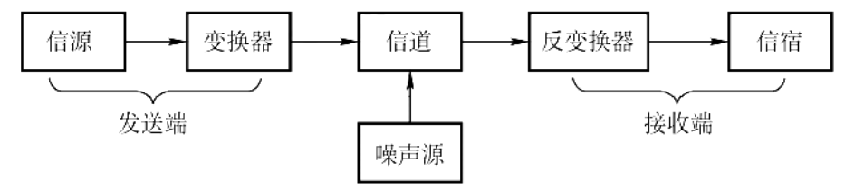
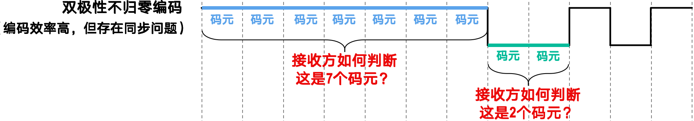
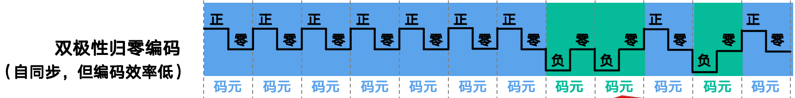
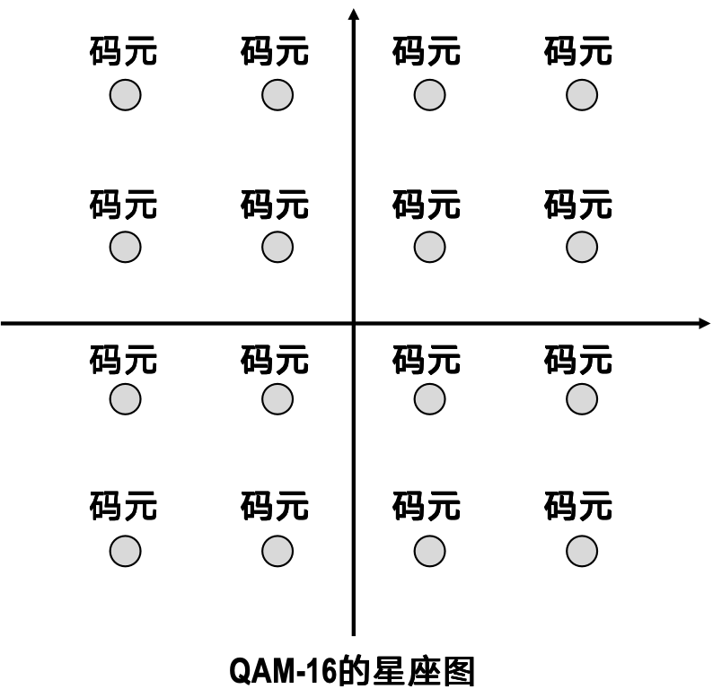
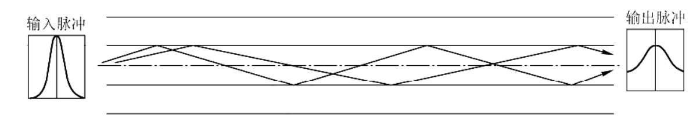
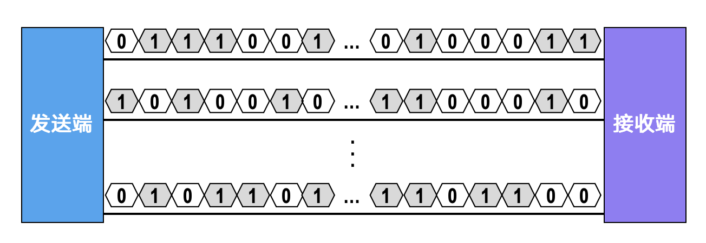
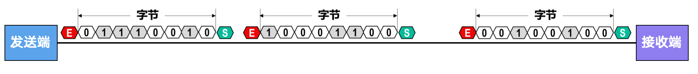
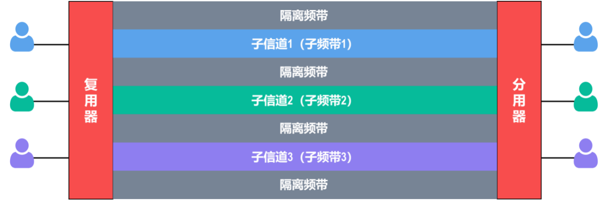
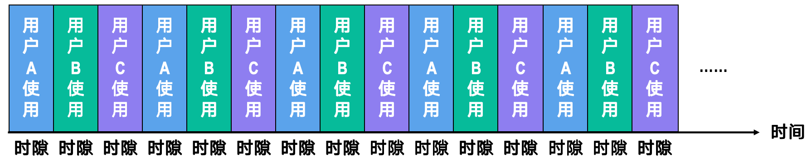
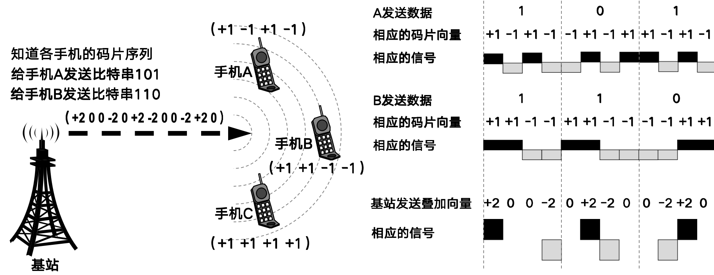

# 物理层

## 通信基础

!!! definition "概念一览"
    === "数据、信号与码元"
        + **数据**：表示客观事物的符号化描述，是信息的载体。

        + **信号**：数据的物理表现形式，是数据在传输介质中的电磁表现。
            - 数据和信号都有模拟和数字之分.模拟数据/信号是连续变化的，而数字数据/信号是离散变化的。

        + **码元**：在通信系统中,常用一个固定时长的信号波形表示一个k进制数,这个时长内的信号称为码 元(可称k进制码元),而该时长称为码元宽度(也称信号周期)。比如，在二进制通信中，一个码元可能是“高电压”（代表1）或“低电压”（代表0），每次发送一个码元就传递1比特。如果是多进制（如4进制），一个码元可能代表2比特的信息，就像一个字母代表多个音节。

            通俗地讲,一个码元能携带多少比特的信息，取决于这个码元有多少种不同的状态.
    === "信源、信道与信宿"
        + **信源**：信息的产生者,如计算机、手机等。

        + **信宿**：信息的接收者,如计算机、手机等。

        + **信道**：信息传输的媒介,如双绞线、光纤、无线电波等。

        

            
             
            <caption>一个单向通信系统的模型</caption>
        

        信道按传输信号形式的不同，可分为两大类：传送模拟信号的模拟信道和传送数字信号的数字信道；按传输介质的不同，可分为无线信道和有线信道。
        
        信道上传送的信号分为基带信号和宽带信号。基带信号是由信源发出的未经过调制的原始电信号，当在信道中直接传送基带信号时，称为基带传输；宽带信号则先将基带信号进行调制，形成频分复用模拟信号，然后送到信道上传输，称为宽带传输。
        
        数据传输方式分为串行传输和并行传输。串行传输是指逐比特地按序依次传输，并行传输是指若干比特通过多个通信信道同时传输。串行传输适用于长距离通信，如计算机网络；并行传输适用于近距离通信，常用于计算机内部，如CPU与主存之间。
        
        从通信双方信息的交互方式看，可分为三种基本方式：
        
        1. **单向通信**：只有单方向的通信，没有反向交互，如无线电广播、电视广播等。

        2. **半双工通信**：通信双方都可以发送或接收信息，但任何一方不能同时发送和接收信息。

        3. **全双工通信**：通信双方可以同时发送和接收信息。
        
        单向通信只需一个信道，而半双工通信或全双工通信都需要两个信道，每个方向一个信道。

    === "速率、波特与带宽"
        + 速率有两种形式:

            - 码元传输速率：指单位时间内传送的码元数，通常以波特（Baud）为单位。

            - 比特率：指单位时间内传送的比特数，通常以bps（bit per second）为单位。

        + 带宽在之前已经讲过,描述信号频率的范围或最高数据传输速率

        !!! tip
            如果一个码元携带n比特的信息,那么码元速率和比特率的关系为:
            
            $$\text{比特率(bps)} = n \times \text{码元速率(波特)}$$

### 信道的极限容量

我们知道,码元的传输速率越高,信号的传输距离越远,噪声越大,信号失真越严重.

!!! definition "码间串扰"
    信道上传输的数字信号，可以看做是多个频率的模拟信号进行多次叠加后形成的方波。

    在传输过程中,许多高频成分会被信道严重衰减,从而使接收端无法准确区分相邻码元,这种现象称为码间串扰(Inter-Symbol Interference, ISI)。

#### 奈奎斯特定理(奈氏准则)

奈奎斯特规定,在理想低通(没有噪声、带宽有限)信道中,为了避免码间串扰,码元传输速率不能超过信道带宽的两倍,即:

$$ \text{码元传输速率(波特)} \leq 2 \times \text{信道带宽(Hz)} $$

如果用V表示码元的离散电平数量(即码元的不同状态数),则在理想低通信道中,比特率的最大值为:

$$ 2 \times \log_2 V \times \text{信道带宽(Hz)} $$

奈氏准则的主要要点如下：

1. **码元传输速率存在极限**：所有信道中，码元传输速率都有上限。如果超过这个上限，就会产生严重的码间串扰，导致接收端无法准确识别码元。

2. **带宽决定传输能力**：信道带宽越大，传输码元的能力就越强。

3. **限制的边界**：奈氏准则限制了码元传输速率，但不限制信息传输速率，也就是说，一个码元能携带的比特数没有上限。

由于码元传输速率受奈氏准则约束，要提升数据传输速率，可以让每个码元承载更多比特信息，这就需要使用多元制的调制技术。

#### 香农定理
> 奈氏定理只适用于理想低通信道,而实际信道中总是存在噪声,因此香农定理给出了在有噪声信道中,信道容量的极限值。

在带宽为B Hz,信噪比为S/N的有噪声信道中,信道容量C的最大值为:

$$ C = B \times \log_2(1 + \frac{S}{N}) $$

其中,S是信号功率,N是噪声功率,S/N是信噪比,C的单位是bps。

信噪比有两种表示方法:

1. **线性表示法**：直接用S/N表示。

2. **对数表示法**：用分贝(dB)表示,即:
    $$ \text{SNR(dB)} = 10 \times \log_{10}(\frac{S}{N}) $$

!!! warning
    在使用香农定理时,必须将信噪比S/N换算成线性表示法。

根据香农定理,我们可以得出以下结论:

1. 信道带宽/信噪比越大,信道容量越大。

2. 若信道带宽和信噪比确定,那么信息传输的最大速率也是确定的

3. 只要信息传输速率低于信道容量,就可以通过适当的编码方法,使误码率任意地小。

### 编码和调制
> 信号是数据的具体表现,将数据转换为信号的过程称为编码,将数据转换为模拟信号的过程称为调制。

数字数据可以通过数字发送器转换为数字信号进行传输，也可以通过调制器转换为模拟信号进行传输；同样，模拟数据可以通过PCM编码器转换为数字信号进行传输，也可以通过放大器或调制器转换为模拟信号进行传输。

#### 数字数据->数字信号

对于二进制数据`111111100101`,我们有几种编码方式

1. **双极性不归零编码**(Bipolar NRZ, NRZ-L):

    - 1用正电压表示,0用负电压表示。

    - 优点:实现简单,编码效率高

    - 缺点:存在同步问题,对于一连串高电平,无法分辨这是1个码元还是多个码元。

    

        
         
        <caption>双极性不归零编码</caption>
    

2. **双极性归零编码**(Bipolar RZ, RZ-L):

    - 1用正电压表示,0用负电压表示,每个码元中间有一个归零电平。

    - 优点:解决了同步问题

    - 缺点:编码效率低,带宽利用率低

    

        
         
        <caption>双极性归零编码</caption>
    

3. **曼彻斯特编码**(Manchester Encoding):

    - 1用高->低电平表示,0用低->高电平表示。

    - 在每个码元的中间时刻采集电平,解决了同步问题。

    

        
         
        <caption>曼彻斯特编码</caption>
    

4. **差分曼彻斯特编码**(Differential Manchester Encoding):

    - 每个码元中间都发生电平跳变,但1和0的区别在于码元开始时是否发生电平跳变。

    - 开始无跳变表示1,开始有跳变表示0。

    - 增强了抗干扰能力

    

        
         
        <caption>差分曼彻斯特编码</caption>
    

#### 数字数据->模拟信号

有三种方式:调幅(AM)、调频(FM)、调相(PM)

    
     
    <caption>调制方式</caption>

+ 调幅(Amplitude Modulation, AM):通过改变载波的振幅来表示数字数据,如1表示有幅度,0表示无幅度。

+ 调频(Frequency Modulation, FM):通过改变载波的频率来表示数字数据,如1表示高频,0表示低频。

+ 调相(Phase Modulation, PM):通过改变载波的相位来表示数字数据,如1表示相位反转,0表示相位不变。

---

上面三种调制方法是基本的带通调制方式,还有如下的混合调制方法

我们将载波的相位和振幅结合起来,形成多种状态,每种状态表示多个比特,从而提高传输效率。

典型的如正交振幅调制(QAM),有12种相位,16种状态

    
     
    <caption>16-QAM</caption>

这样每个码元表示4个比特

## 传输介质
> 传输介质是发送到接收之间的信息通路,可分为导向传输介质和非导向传输介质(无线传播)。

### 导向传输介质

- **双绞线**：由两根相互缠绕的绝缘铜线组成，常用于局域网和电话通信。有STP(屏蔽双绞线)和UTP(非屏蔽双绞线)之分。

- **同轴电缆**：由中心导体、绝缘层、金属屏蔽层和外护套组成，抗干扰能力强，常用于电视信号传输。分为两类:
    - 50欧姆同轴电缆：主要用于传送基带数字信号

    - 75欧姆同轴电缆：主要用于传送宽带模拟信号

- **光纤**：由玻璃或塑料纤维制成，利用光的全反射原理传输信号，带宽大、传输距离远。
    - 单模光纤：纤芯直径较小，适用于长距离传输。
        

            
             
            <caption>单模光纤</caption>
        

    - 多模光纤：纤芯直径较大，适用于短距离传输。
        

            
             
            <caption>多模光纤</caption>
        

### 非导向传输介质
- **无线电波**：通过空气传播的电磁波，常用于无线通信，如手机、Wi-Fi等。

- **微波、红外线和激光**：主要用于高带宽的无线通信。
    - **微波**：频率较高的电磁波，常用于卫星通信和雷达。

    - **红外线**：波长介于可见光和微波之间，常用于短距离无线通信，如遥控器。

    - **激光**：通过激光束传输信号，常用于光通信和激光雷达。

### 物理层接口特性

+ 电气特性：包括电压、电流、阻抗、传输速率、距离限制等参数，决定信号的传输质量和抗干扰能力。

+ 机械特性：包括接线器的形状和尺寸、引脚数量和排列、固定和锁定装置等。

+ 功能特性。指明某条线上出现的某一电平的电压的意义,以及每条线的功能。

+ 规程特性(过程特性)。规定在信号线上传输比特流的一组操作过程，包括各信号间的时序关系

## 传输方式

### 串行传输和并行传输

1. **串行传输**：数据位按顺序逐位传输，适用于长距离通信，线缆成本低，但传输速率较低。

    

        
         
        <caption>串行传输</caption>
    

2. **并行传输**：数据位同时通过多条线路传输，适用于短距离通信，传输速率高，但线缆成本高且易受干扰。
    

        
         
        <caption>并行传输</caption>
    

### 同步传输和异步传输

1. **同步传输**：发送和接收设备使用相同的时钟信号，数据按固定时间间隔传输，适用于高速通信，但需要复杂的时钟同步机制。

    

        
         
        <caption>同步传输</caption>
    

    - 为了实现时钟同步,同步传输通常采用以下两种方式之一:

        1. 在数据流中插入特殊的同步码元,接收端通过检测这些码元来实现时钟同步。

        2. 使用独立的时钟线,发送端和接收端通过这条线传输时钟信号。

2. **异步传输**：发送和接收设备各自使用独立的时钟信号，数据按不固定时间间隔传输，适用于低速通信，结构简单，但传输效率较低。每段数据前后都有起始位和停止位。

    

        
         
        <caption>异步传输</caption>
    

## 复用技术
> 复用就是在同一信道上同时传输多路信号,以提高信道的利用率。

常用的复用技术有以下几种:

1. **频分复用**(Frequency Division Multiplexing, FDM)：将信道的频带划分为多个子频带，每个子频带传输一路信号，适用于模拟信号传输。

    

        
         
        <caption>频分复用</caption>
    

2. **时分复用**(Time Division Multiplexing, TDM)：将信道的时间划分为多个时隙，每个时隙传输一路信号，适用于数字信号传输。

    

        
         
        <caption>时分复用</caption>
    

    - 时分复用的所有用户在不同的时间占用同样的频带

3. **波分复用**(Wavelength Division Multiplexing, WDM)：类似于频分复用，但用于光纤通信，通过不同波长的光信号传输多路信号。

    - 在一根光缆中放入100根速率为2.5Gb/s的光纤，对每根光纤采用40倍的密集波分复用，则这根光缆的总数据速率为
    
    $$
    2.5\,\text{Gb/s} \times 40 \times 100 = 10000\,\text{Gb/s} = 10\,\text{Tb/s}
    $$

4. **码分复用**(Code Division Multiplexing, CDM)：常称为码分多址（Code Division Multiple Access，CDMA）.每个信号使用不同的编码方式在同一频带上同时传输.

    - CDMA允许每个用户在相同的时间和频率上发送信号，但通过不同的编码方式区分不同用户的信号。

    - CDMA将每个比特时间划分为m个更短的时间片，称为码片（Chip）。m的取值通常为64或128。

    !!! example "CDMA工作原理举例"
        为了更好地理解，我们假设码片长度 m=8。

        1.  **分配码片序列**：
            假设某个站点被分配了唯一的8比特码片序列：`01011001`。

        2.  **发送规则**：
            -   若要发送 **比特 `1`**，该站就发送其原始的码片序列 `01011001`。
            -   若要发送 **比特 `0`**，则发送该码片序列的 **反码** `10100110`。

        3.  **向量化表示**：
            在实际处理中，为了方便计算，我们会将码片序列转换为码片向量。规则是：`1` 记为 `+1`，`0` 记为 `-1`。
            
            因此，该站的码片序列 `01011001` 对应的码片向量为：
            $$
            (-1, +1, -1, +1, +1, -1, -1, +1)
            $$

        通过这种方式，接收端可以将收到的信号与特定站点的码片向量进行运算，从而从混合信号中分离出该站点的信息。

    - 为了保证多个站发送的信号互不干扰,CDMA要求不同站点的码片序列必须是不相同且正交的.也即,码片向量之间的点积为0.另外,假设有两个码片向量$A,B$,长度为m,有如下特性:
        - $\frac{1}{m} A \cdot A = 1$

        - $\frac{1}{m} A \cdot B = 0$

        - $\frac{1}{m} A \cdot \bar{A} = -1$

        - $\frac{1}{m} A \cdot \bar{B} = 0$

    - 这样,每个站点只需要用自己的码片向量与收到的叠加后的码片向量，做规格化內积运算,根据结果就能知道发送给自己的是1还是0,并且排除了其他站点信号的干扰

    

      

        
      

      

        
      

    

