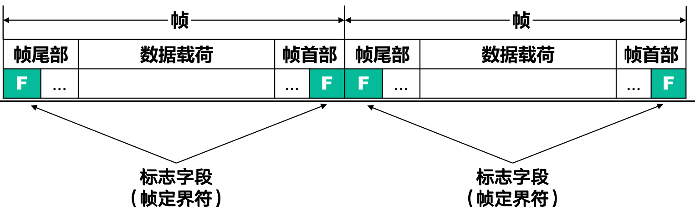
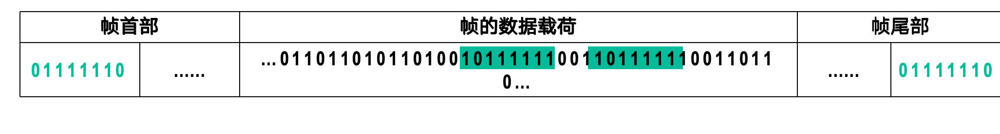
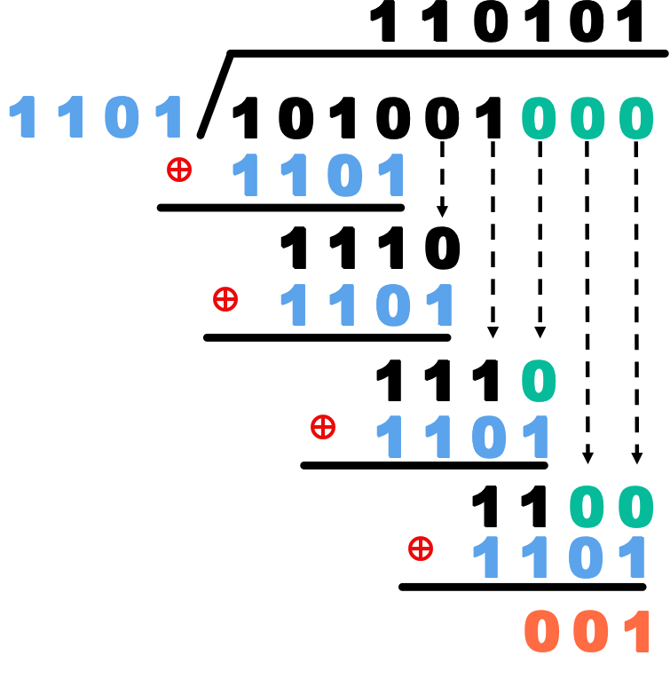

# 数据链路层
> 数据链路层（Data Link Layer）是OSI模型的第二层，主要负责在物理层提供的原始比特流上建立、维护和终止数据链路连接。它确保数据在网络节点之间可靠地传输，并处理错误检测和纠正。

!!! definition "链路、数据链路和帧"
    === "链路(Link)"
        + **链路**：链路是指连接两个网络设备（如计算机、路由器、交换机等）之间的通信路径。链路可以是有线的（如以太网电缆、光纤）或无线的（如Wi-Fi、蓝牙）。链路的主要作用是传输数据帧，确保数据在两个设备之间正确传递。

        + 当真正进行通信时,两个设备之间的传输可能经过了许多链路

    === "数据链路(Data Link)"
        + **数据链路**：数据链路可以说是链路加上一些软硬件.这些软硬件实现了传输数据必需的通信协议.

        + 数据链路层的主要功能包括：

            - 帧的封装和解封装

            - 地址寻址

            - 错误检测和纠正

            - 流量控制

            - 链路管理

    === "帧(Frame)"
        + **帧**：帧是数据链路层传输的基本单位,是数据链路层的PDU(Protocol Data Unit,协议数据单元).帧通常包含以下几个部分:

            - 帧头(Header): 包含控制信息，如源地址、目的地址、类型字段等。

            - 数据部分(Payload): 包含实际传输的数据。

            - 帧尾(Trailer): 通常包含错误检测码，如循环冗余校验(CRC)码。

## 数据链路层的三个重要问题

### 封装成帧和透明传输

当数据链路层接收到来自网络层的数据包时,它需要将数据包封装成帧.封装成帧是指在一段数据的前后分别添加首部和尾部,构成帧.

    
     
    <caption>封装成帧</caption>

以太网的帧格式如下:

| 前同步码 | 帧开始定界符 | 目的MAC地址 | 源MAC地址 | 类型/长度 | 数据 | FCS(帧校验序列) |
|:------:|:------------:|:-----------:|:---------:|:---------:|:----:|:--------------:|
| 7字节  | 1字节        | 6字节       | 6字节     | 2字节     | 46~1500字节 | 4字节         |

- **前导码**：用于接收端同步。

- **帧开始定界符**：标志帧的开始。

- **目的/源MAC地址**：标识收发双方。

- **类型/长度**：指示上层协议类型或数据长度。

- **数据**：实际传输的数据。

- **FCS**：用于差错检测的循环冗余校验码。位于尾部

而PPP的帧格式如下:

| 标志字段 | 地址字段 | 控制字段 | 协议字段 | 信息字段 | FCS(帧校验序列) | 标志字段 |
|:--------:|:--------:|:--------:|:--------:|:--------:|:----------------:|:--------:|
| 1字节    | 1字节    | 1字节    | 2字节    | 0~1500字节 | 2字节           | 1字节    |

- **标志字段**：帧的开始和结束标志，固定为`0x7E`。

- **地址字段**：通常为`0xFF`，表示广播地址。

- **控制字段**：通常为`0x03`，表示无编号信息帧。

- **协议字段**：指示信息字段中封装的数据类型（如IP、LCP等）。

- **信息字段**：实际传输的数据。

- **FCS**：帧校验序列，用于差错检测。位于帧的尾部。

从上面所示，可以发现，并不是每一种数据链路层协议的帧都包含有帧定界标志（即帧头和帧尾），比如以太网帧就没有。这是因为以太网帧采用了**前导码**来实现帧定界。

- **前导码**：由前同步码加上帧开始定界符组成。其作用是让接收方能够识别出帧的开始位置，从而实现帧定界。

- **帧间间隔**：以太网还有帧间间隔的概念，即两帧之间必须有一个最小的时间间隔（发送96比特需要的时间），以确保接收方能够正确识别出帧的边界。

为了提高传输效率，我们总是希望帧的数据载荷越大越好。但实际上，帧的数据载荷是有最大值限制的。这个限制就是**最大传输单元(MTU,Maximum Transmission Unit)**。不同的数据链路层协议有不同的MTU值。

---

另一方节点在接收到帧后，需要进行**解封装**，提取出数据包并交给网络层处理。解封装依靠的是帧头和帧尾中的控制信息。

> 这里存在一个问题：  
> 如果数据部分中恰好包含了和帧头或帧尾相同的比特序列，接收方在解封装时就会误以为数据部分的内容是帧头或帧尾，从而导致解封装错误。

为了解决这个问题，数据链路层需要实现**透明传输**.透明传输是指数据链路层对上层交付下来的协议数据单元PDU没有任何限制，就好像数据链路层不存在一样。

一般使用类似于转义字符的机制来实现透明传输.对于PPP,我们使用**字节填充(Byte Stuffing)**来实现透明传输.

    
     
    <caption>字节填充</caption>

而对于HDLC,我们使用**比特填充(Bit Stuffing)**来实现透明传输.

    
     
    <caption>比特填充</caption>

在这个上图中，帧的开始和结束都使用了一个特殊的比特序列 **01111110**作为标志。

我们使用比特填充规则 (又称“零比特填充法”)：

- 发送端：在扫描整个数据载荷时，只要连续出现5个1，就立即在后面填充一个0。

- 接收端：在接收数据时，只要发现连续的5个1，就检查其后的第6个比特。

- 如果第6个比特是 0，则说明这个0是发送端填充的，将其删除，恢复原始数据。

- 如果第6个比特是 1，则继续向后检查第7个比特。若是0（即01111110），则表明这是一个帧定界符；否则表示出现了错误。

### 差错检测

在传输过程中，数据可能会因为噪声、干扰等原因发生错误。为了保证数据的完整性，数据链路层需要实现差错检测。

错误分为两种类型：

- **位错**：单个比特发生错误，如0变1或1变0。
- **帧错**：帧丢失或帧顺序错误。

---

为了实现差错检测，在帧尾部通常会有纠错码。常见的有以下几种：

- **奇偶校验**：在数据中添加一个额外的比特，使得数据中1的个数为奇数或偶数。接收端通过检查1的个数来检测错误。
    - **奇校验**：使得数据中1的个数为奇数。
    - **偶校验**：使得数据中1的个数为偶数。
    - 很显然，出现偶数位的错误就无法检测。

- **循环冗余校验（CRC）**：将数据视为一个二进制多项式，通过多项式除法计算出一个余数，将余数附加在数据后面作为校验码。接收端通过重新计算余数来检测错误。

!!! example "CRC计算示例"
    设发送的数据为 `101001000`，生成多项式为 `1101`（即 $x^3 + x^2 + 1$）。

    1. 在数据后面添加3个0（生成多项式的最高次幂），得到 `101001000000`。

    2. 使用二进制除法对 `101001000000` 除以 `1101`，得到余数 `001`。

    3.去掉第一步添加的0,将余数附加在数据后面，得到最终发送的帧 `101001000001`。

    接收端收到帧后，对 `101001000001` 除以 `1101`，如果余数为0，则表示没有错误；否则表示有错误。

    需要注意的是:

    1. **多项式必须要有最低次项**

    2. **余数的位数应与生成多项式最高次数相同，如果位数不够，则在余数前补0来凑足位数**

    ??? note "二进制除法"
        二进制除法与十进制除法类似，但只使用0和1进行计算。主要步骤如下：

        1. 将被除数的前几位与除数对齐。

        2. 如果被除数的当前位大于等于除数，则进行异或操作（相当于减法），并将结果写在下一行。

        3. 将下一位下拉，继续与除数对齐，重复步骤2，直到处理完所有位。

        4. 最终剩下的部分即为余数。

        

            
             
            <caption>二进制除法示例</caption>
        

#### 海明码

海明码（Hamming Code）是一种用于错误检测和纠正的编码方法。它通过在数据中添加冗余位来实现错误检测和纠正。海明码能够检测并纠正单个比特错误，适用于需要高可靠性的通信系统。

海明码的基本原理如下：

1. **位置编号**：将数据位和冗余位的位置编号，从1开始。冗余位的位置是2的幂次方（即1, 2, 4, 8, ...）。

2. **冗余位计算**：每个冗余位负责检查特定位置的数据位。具体来说，第i个冗余位检查所有位置编号中第i位为1的位置。例如，第1个冗余位检查位置1, 3, 5, 7, ...，第2个冗余位检查位置2, 3, 6, 7, ...，以此类推。

3. **奇偶校验**：每个冗余位的值通过对其负责检查的数据位进行奇偶校验计算得出。如果数据位中1的个数为奇数，则冗余位设为1；否则设为0。

4. **错误检测和纠正**：接收端通过重新计算冗余位来检测错误。如果某个冗余位的计算结果与接收到的冗余位不符，则说明对应的数据位发生了错误。通过组合所有冗余位的错误信息，可以确定具体哪个数据位出错，并进行纠正。例如,如果第1和第3个冗余位检测到错误，而第2个冗余位没有检测到错误，则说明错误位置为$101_2=5_{10}$.

- [ ] 例子以后再补

---

### 可靠传输

- **可靠传输**: 实现无论发送方发送什么,接收方都能正确无误地接收到.可靠传输通常通过以下方法实现:

    - **确认和重传**：接收方在成功接收到数据后,发送一个确认(ACK)给发送方.如果发送方在超时时间内没有收到确认,则重传数据.

    - **序列号**：为每个数据帧分配一个唯一的序列号,接收方通过序列号来检测丢失或重复的帧.

    - **流量控制**：防止发送方发送数据过快,使接收方来不及处理.常用的方法有滑动窗口协议.

- **不可靠传输**: 直接丢弃有误码的帧,不进行重传.

在实际传输中,可能出现多种差错情况:

- 误码

- 分组丢失

- 分组重复

- 分组失序

其中误码出现在数据链路层及其下层,而分组丢失、分组重复和分组失序主要出现在网络层及其以上层次.

---

使用确认和重传这两种机制的可靠传输协议，通常被称为**自动重传请求（ARQ, Automatic Repeat reQuest）**。这里的“自动”意味着重传是由协议自动处理的，接收方无需显式地向发送方请求重传。

在ARQ协议中，数据帧和确认帧都必须进行编号。这样，接收方才能明确哪个确认帧对应哪个数据帧，发送方也才能知道哪些数据帧尚未被确认。

ARQ协议主要分为以下三种：

1.  **停止-等待协议（Stop-and-Wait）**

2.  **后退N帧协议（Go-Back-N, GBN）**

3.  **选择重传协议（Selective Repeat, SR）**

!!! tip "通用性"
    值得注意的是，这三种可靠传输协议的基本原理并不仅限于数据链路层，它们同样广泛应用于其上各层，尤其是传输层。

#### 停止-等待协议(Stop-and-Wait)

停止-等待协议是最简单的ARQ协议。其工作原理如下：

1. 发送方发送一个数据帧后，停止发送，等待接收方的确认。

2. 接收方收到数据帧后，发送一个确认帧(ACK)给发送方。

3. 发送方收到确认帧后，发送下一个数据帧。

4. 如果发送方在超时时间内没有收到确认帧，或者接受到NAK(否定确认)，则重传该数据帧。
    - 相关的概念有RTO(重传超时时间,Retransmission Timeout),略大于往返时间RTT(Round Trip Time)

    
     
    <caption>停止-等待协议</caption>

由于停止-等待协议“发一帧，等一帧”的特性，我们只需要区分当前帧与上一帧即可。因此，该协议采用1比特的序列号就足够了，这通常被称为**自动重传请求（ARQ）的交替位协议（Alternating-Bit Protocol）**。

- **帧编号**：发送的帧交替使用序列号0和1来标识。

- **确认机制**：确认帧（ACK）同样需要编号，以明确是对哪个数据帧的确认。例如，`ACK0` 表示对序列号为0的数据帧的确认，`ACK1` 则是对序列号为1的数据帧的确认。

通过这种简单的编号机制，协议可以有效处理异常情况：

- **处理重复帧**：如果接收方连续收到两个序列号相同的数据帧，则表明发送方进行了超时重传。此时，接收方会丢弃重复的帧，并重新发送上一个确认帧。

- **处理重复或延迟的确认**：如果发送方在发送 `DATA1` 后，收到了一个 `ACK0`，它就知道这是一个对先前 `DATA0` 的重复或延迟确认，应予以丢弃。

!!! success "缓冲区的作用"
    为了实现超时重传，发送方必须设置一个**发送缓冲区**。
    
    当发送方发送完一个数据帧后，它必须在发送缓存中保留该数据帧的副本。只有在明确收到了对方发来的、对应正确序列号的确认帧（ACK）后，发送方才能清空缓存中的这个副本，准备发送下一帧。

若假设传输数据的时间是`Tt`，往返时间是`RTT`，发送`ACK`的时间忽略不计，则信道利用率为:

$$ U = \frac{Tt}{Tt + RTT} $$

`RTT`考虑了信号从发送方到接收方的传播时间以及确认信号从接收方返回发送方的传播时间。

在`Tt`远小于`RTT`的情况下，信道利用率会非常低。这是停止-等待协议的一个主要缺点。

#### 后退N帧协议(Go-Back-N, GBN)

后退N帧协议是一种改进的ARQ协议。其工作原理如下：

    
     
    <caption>流水线传输</caption>

1. 发送方需要维护一个发送窗口，窗口大小为N。发送方可以连续发送N个数据帧，而不需要等待确认。

2. 在最开始,发送方发送窗口内的N个数据帧.接受方维护一个大小为1的接受窗口,只接受按顺序到达的帧.

3. 在成功接受到一个按序到达的帧后,接收方发送一个确认(ACK)给发送方,并将接受窗口向前滑动一位.

4. 发送方在收到确认后,将发送窗口向前滑动相应的位数,并发送新的数据帧.

5. 如果某个帧出现了误码或者超时,接受方会直接丢弃这个帧,并发送上一个按序到达帧的确认(ACK).发送方在收到这个确认后,会重传从该帧开始的所有未被确认的帧.

!!! info "累计确认"
    **累计确认(Cumulative Acknowledgment)**机制意味着接受方不必对每一个收到的帧都发送一个ACK,而是可以在收到连续的几个正确帧后,只发送一个ACK,确认所有这些帧都已正确收到.
    一个对序号为`n`的帧的确认（`ACK n`）就隐含地确认了在`n`之前的所有帧。

    例如,如果发送方收到了`ACK2`,它就知道序列号为0,1,2的帧都已经被正确接收了.这时,发送窗口可以顺势向后滑动3个位置,并发送新的帧.

!!! example "例子from Gemini"
    假设发送窗口大小为4,接收窗口大小为1.

    

        
         
        <caption>后退N帧协议(GBN)示例</caption>
    

    1.  **发送**: 发送方连续发送帧0, 1, 2, 3, 4.

    2.  **接收与确认**:
        -   接收方正确收到帧0, 发送`ACK0`。(这是一个常见的实现策略,尽管它也可以等待后续帧一起确认)
        -   接着, 接收方正确收到帧1, 发送`ACK1`.
        -   **关键点**: `ACK0`在传输过程中丢失了, 但`ACK1`成功到达发送方.

    3.  **累计确认生效**:
        -   发送方收到`ACK1`. 根据累计确认原则, 这意味着帧0和帧1都已被正确接收.
        -   发送方将发送窗口向前滑动到2 (新的窗口基址是2), 并继续发送帧5, 6.

    4.  **发生错误与重传**:
        -   帧2在传输中丢失.
        -   接收方接下来收到了帧3. 由于它期望收到的是帧2 (其接收窗口基址仍为2), 它发现帧3是失序的, 于是丢弃帧3.
        -   为了告知发送方它仍在等待帧2, 接收方重新发送了对已收到的最后一个按序帧的确认, 即`ACK1`.

    5.  **超时与回退**:
        -   发送方发送完帧6后, 一直没有收到`ACK2`或更高的确认.
        -   最终, 帧2的计时器超时.
        -   发送方执行**后退N(Go-Back-N)**操作, 将发送窗口重置回帧2, 并重传从帧2开始的所有已发送但未确认的帧, 即重传帧2, 3, 4, 5, 6.

??? tip "发送窗口的最大尺寸"
    假设我们用n比特对数据帧进行编号,也即,序列号的取值范围是0到2^n-1.例如,对于n=3
    

        
         
        <caption>序列号取值范围</caption>
    

    
    
    为了避免序列号重复带来的歧义,发送窗口的最大尺寸N必须满足:
    $$ 1 < N \leq 2^{n-1} $$

    这是因为,如果发送窗口的大小N超过了2^(n-1),那么在发送完N个帧后,序列号就会回绕到之前已经使用过的值,从而导致接收方无法区分这些帧是新的还是旧的.

    例如,发送方一次性发送了8个帧(假设n=3,N=8),序列号从0到7.接受方每接受到一个帧,就发送一个确认(ACK).在全部成功接受后,接受方的窗口已经滑动到了8(即0).

    但如果ACK全部在传输的过程中丢失了,发送方在超时后,会重传从0开始的8个帧.此时,接受方无法区分这些帧是新的(8-15)还是旧的(0-7),从而导致错误.

假设发送窗口的大小为$n$,即发送方可以连续发送$n$个帧而不需要等待确认.则分情况讨论信道利用率:

1. $n T_t < T_t +RTT + T_{ack}$

    这种情况下,发送方在发送完$n$个帧后,还没有收到第一个帧的确认(ACK).此时,信道利用率为:

    $$ U = \frac{n T_t}{RTT + T_t + T_{ack}} $$

2. $n T_t \geq T_t +RTT + T_{ack}$

    这种情况下,发送方在发送完$n$个帧前,已经收到了第一个帧的确认(ACK),这时发送窗口已经向后滑动.此时,信道利用率为:

    $$ U = 1 $$

#### 选择重传协议(Selective Repeat, SR)
> 后退N帧协议在出现错误时,需要重传从错误帧开始的所有未被确认的帧,这会导致大量不必要的重传,从而降低传输效率.
>
> 选择重传协议通过只重传那些确实丢失或损坏的帧来提高效率.

SR相比于GBN,最大的不同就是接受窗口现在可以接收多个帧,而不仅仅是一个帧.这意味着接收方可以同时接收并缓存多个帧,从而提高了传输效率.

假设接受方的窗口大小为$W_r$,发送方的窗口大小为$W_s$,一共用n比特对帧进行编号,则必须满足以下条件:

\begin{align}
1 < W_r &\leq W_s \\
W_r + W_s &\leq 2^n
\end{align}

一般我们取$W_r = W_s = 2^{n-1}$.

---

由于SR协议有更大的接受缓存窗口,接受方在接受到一个帧时,如果该帧在接受窗口内,则无论是否按序到达,都将其缓存起来,并发送一个确认(ACK)给发送方.只有当该帧是接受窗口的基址时,接受方才将其交付给上层,并将接受窗口向前滑动.

??? example "SR协议工作流程示例 (窗口大小=4, 序列号范围=8)"

    | 时间 | 事件 | 发送方 (Sender) 动作 / 状态 | 接收方 (Receiver) 动作 / 状态 | 备注 |
    |:----:|:----:|:---------------------------|:-----------------------------|:----|
    | T1 | 发送方发送 | 发送方连续发送其窗口内的所有帧： - 发送 Frame 0 (启动 Timer 0) - 发送 Frame 1 (启动 Timer 1) - 发送 Frame 2 (启动 Timer 2) - 发送 Frame 3 (启动 Timer 3)  **状态**: S\_base=0, S\_next=4, UnACKed={0,1,2,3} | (等待中...) | 发送方把窗口打满了。 |
    | T2 | 网络传输 | (等待 ACK 中...) | (数据在路上...) | **关键事件**:  - Frame 0 正常到达。 - **Frame 1 丢失！** - Frame 2 正常到达。 - Frame 3 正常到达。 |
    | T3 | 接收方处理 | (等待 ACK 中...) | 1. **收到 Frame 0** (是R\_base=0):    - 发送 ACK 0    - 交付 Frame 0 给上层    - 窗口滑动: R\_base=1, 范围={1,2,3,4} 2. **收到 Frame 2** (非R\_base):    - 发送 ACK 2    - 缓冲 Frame 2, Buffer={Frame 2} 3. **收到 Frame 3** (非R\_base):    - 发送 ACK 3    - 缓冲 Frame 3, Buffer={Frame 2, Frame 3} | **SR核心(1)**: 接收方逐个确认收到的帧 (ACK 2, ACK 3)，并缓冲所有乱序但合法的帧。R\_base 保持为 1。 |
    | T4 | 发送方处理 ACKs | 1. **收到 ACK 0**:     - 停止 Timer 0, 标记 Frame 0 已确认    - 窗口滑动: S\_base=1, 范围={1,2,3,4}    - 发送 Frame 4 (启动 Timer 4) 2. **收到 ACK 2**:     - 停止 Timer 2, 标记 Frame 2 已确认 3. **收到 ACK 3**:     - 停止 Timer 3, 标记 Frame 3 已确认  **状态**: S\_base=1, UnACKed={1, 4} | (等待 Frame 1...)  **状态**: R\_base=1, Buffer={Frame 2, Frame 3} | **SR核心(2)**: 发送方窗口的滑动被最早的未确认帧 (Frame 1) 卡住了。即使 2 和 3 都被确认了，窗口也不能滑过 1。 |
    | T5 | 发送方超时 | ... **Timer 1 超时！** ...  1. 检查发现 Frame 1 仍未被确认。 2. **只重传 Frame 1** 3. 重启 Timer 1  **状态**: S\_base=1, UnACKed={1, 4} | (等待 Frame 1...) | **SR核心(3)**: 选择性重传！发送方只重传超时的那一个帧 (Frame 1)，而不是像 GBN 那样重传 1, 2, 3, 4。 |
    | T6 | 接收方最终解决 | (等待 ACK 1 和 ACK 4...) | 1. **收到重传的 Frame 1**:     - 它是 R\_base=1，是期望的帧！    - 发送 ACK 1 2. **处理并交付**:     - 交付 Frame 1    - 检查 Buffer, 按序交付 Frame 2, 3 (假设 Frame 4 也已到并缓冲) 3. **窗口滑动**:     - R\_base 滑动到 5, 范围={5,6,7,0}    - Buffer 清空 | 接收方一旦收到缺失的 Frame 1，就能把缓存中的所有帧按顺序 "解锁" 并交付给上层。 |
    | T7 | 循环继续 | 1. **收到 ACK 1** (来自 T6): 停止 Timer 1 2. (假设也收到了 ACK 4): 停止 Timer 4  - 所有 {1,2,3,4} 均已确认。 - S\_base 滑动到 5。 - 窗口范围 = {5, 6, 7, 0} - 发送 Frame 5, 6, 7, 0 | (等待 Frame 5...) | 协议恢复正常运行。 |

## 点对点协议
> 点对点协议（PPP, Point-to-Point Protocol）是一种用于在两个直接连接的节点之间传输数据的协议。
> 
> PPP是目前**广泛使用**的数据链路层协议，它主要应用于以下两种场景：
> 
> 1.  **用户接入互联网**：当用户通过拨号或宽带连接到互联网服务提供商（ISP）时，其计算机与ISP之间通常使用PPP协议进行通信。
> 2.  **路由器间连接**：在广域网中，连接两个路由器的专用线路也常使用PPP协议。

PPP是数据链路层协议,它提供了封装成帧、差错检测和可靠传输等功能.

!!! info "PPP协议的三个组成部分"
    PPP协议由三个主要部分组成：
    
    1.  **封装方法**：定义了如何将IP数据报等网络层分组封装到串行链路中。IP数据报作为PPP帧的数据部分，其长度受最大传送单元（MTU）的限制。
    
    2.  **链路控制协议（LCP, Link Control Protocol）**：负责建立、配置、测试和终止数据链路连接。LCP还用于协商各种链路参数，如MTU大小、压缩算法等。
    
    3.  **网络控制协议族（NCP, Network Control Protocol）**：PPP支持多种网络层协议（如IP、IPX等）。每种网络层协议都有一个对应的NCP，负责在该网络层协议和PPP链路之间建立和配置逻辑连接。例如，IP控制协议（IPCP）就是用于配置IP地址等参数的。

PPP的格式在上面已经介绍过,形如:

| 标志字段 | 地址字段 | 控制字段 | 协议字段 | 信息字段 | FCS(帧校验序列) | 标志字段 |
|:--------:|:--------:|:--------:|:--------:|:--------:|:----------------:|:--------:|
| 1字节    | 1字节    | 1字节    | 2字节    | 0~1500字节 | 2字节           | 1字节    | 

标志字段组成了帧的边界,为了实现PPP帧的透明传输,有两种做法:

1. 面向字节的异步链路使用字节填充

    - 将数据载荷中的每一个`0x7E`减去`0x20`,变成`0x5E`,并在其前面添加一个转义字符`0x7D`.

    - 若数据载荷中包含转义字符`0x7D`,则同样在其前面添加一个转义字符`0x7D`,并将其变成`0x5D`.

    - 对于所有ASCII值小于`0x20`的控制字符,加上`0x20`,并在其前面添加一个转义字符`0x7D`.

2. 面向比特的同步链路使用比特填充

    - 在数据载荷中每连续出现5个1后,填充一个0.

## 以太网
> 以太网(Ethernet)是一种局域网技术,它定义了数据链路层和物理层的标准.

### 网络适配器
> 就是我们一般说的网卡

网络适配器负责将计算机内部的数据转换成适合在以太网中传输的格式,并将接收到的以太网数据转换回计算机内部的数据格式.因此,它既要与cpu通信,又要与以太网物理介质通信.

实际上实现的是物理层与数据链路层的功能

### MAC地址

如果信号是点对点的传输,也就是说只有两个节点直接连接,那么不需要地址.

但是在以太网这种广播式的网络中,一个节点可能连接着多个节点,因此需要使用地址来区分不同的节点.在数据链路层,我们使用**MAC地址(Media Access Control Address)**来标识网络中的每个节点.

MAC地址位于帧的首部,包含了源MAC地址和目的MAC地址.每个MAC地址都是一个48位的二进制数,通常表示为6个十六进制数,每个十六进制数占8位(即一个字节),用冒号或连字符分隔.

    

---

MAC地址一般固化在网络适配器的只读存储器(ROM)中,因此每个网络适配器都有一个唯一的MAC地址.这种MAC地址被称为**硬件地址**或**物理地址**.

在IEEE 802标准中,MAC地址的格式如下

    
     
    <caption>MAC地址格式</caption>

其中第一字节的最低有效位(LSB,Least Significant Bit)用于区分单播地址和多播地址,0为单播地址,1为多播地址.

第一字节的次低有效位用于区分全局唯一地址和本地管理地址,0为全局唯一地址,1为本地管理地址.

它们排列组合,组成的情况如下表所示:

| 第1字节的 b1位 | 第1字节的 b0位 | MAC地址类型   | 地址占比 | 地址数量      | 含义 |
|:--------------:|:--------------:|:-------------:|:--------:|:-------------:|:----:|
|      0         |      0         | 全局单播地址   | 1/4      | 2^46          | 由IEEE统一分配给网卡制造商的OUI |
|      0         |      1         | 本地单播地址   | 1/4      | 2^46          | 由网络管理员自定义分配 |
|      1         |      0         | 全局多播地址   | 1/4      | 2^46          | 由IEEE分配的标准多播地址 |
|      1         |      1         | 本地多播地址   | 1/4      | 2^46          | 由网络管理员自定义的多播地址 |

在实际中,当网卡收到一个以太网帧时,它会检查目的MAC地址:

1. 若目的MAC地址与本机的MAC地址匹配,则接受该帧.

2. 或者当目的MAC地址是广播地址(即`FF:FF:FF:FF:FF:FF`),则接受该帧.

3. 或者当目的MAC地址是多播地址,且本机加入了该多播组,则接受该帧.

### CSMA/CD介质访问控制协议

随机访问协议的核心思想是让所有用户根据自己的意愿自由地发送信息，不采用集中控制来决定发送顺序。这种方式虽然简单高效，但也带来了一个关键问题：**冲突**。

1.  **工作方式**：

    - **去中心化**：没有中央节点协调，所有用户都能随时发送信息。

    - **信道独占**：用户发送信息时会占用信道的全部速率。

2.  **冲突（碰撞）问题**：
    - 在共享信道（如总线型网络）中，如果两个或多个用户同时发送信息，它们的信号就会在信道上相互干扰，导致**帧冲突**（或称**碰撞**）。

    - 碰撞会使所有参与冲突的用户的发送都失败，数据无法被正确接收。

3.  **解决方法**：
    - 为了解决冲突，每个用户必须遵循一套规则来反复**重传**它发送失败的帧，直到该帧无冲突地成功传输。

    - 这套规则就是**随机访问介质访问控制协议**。其核心思想是“**先争用，后发送**”：胜利者通过争用获得信道的使用权。因此，这类协议也被称为**争用型协议**（Contention-based Protocol）。

---

载波监听多路访问/冲突检测（CSMA/CD, Carrier Sense Multiple Access with Collision Detection就是一种典型的随机访问介质访问控制协议,它的工作原理是:

1. 一条总线上的多个站点,在发送帧之前,首先监听信道,如果总线空闲了96比特时间,则开始发送帧.

2. 在发送过程中,也要持续监听信道,如果检测到冲突,则立即停止发送帧,并发送一个**32比特或48比特的人为干扰信号(Jamming Signal)**来通知其他站点发生了冲突.

!!! remark
    1. 当载波监听到总线空闲时,总线不一定真的空闲,因为信号传播需要时间,可能有其他站点刚刚开始发送,但信号还没有传播到当前站点.所以需要等待总线空闲96比特时间,以确保没有其他站点正在发送.

    2. CSMA/CD只能尽量避免碰撞或是在碰撞发生时尽快检测到碰撞,但无法完全避免碰撞的发生.

    3. 由于一个站点在发送帧的时候必须要监听信道,所以CSMA/CD只能应用在**半双工**的以太网中,而不能应用在**全双工**的以太网中.

---

#### 争用期
> 争用期是指一个站点可以确认是否发生碰撞的时间窗口.如果在这个时间窗口内没有检测到碰撞,则说明帧发送成功.

    
     
    <caption>争用期示意图</caption>

如上图所示,在传播时延为$\tau$的网络中,争用期为$2\tau$.这是因为,当站点A开始发送帧时,信号需要$\tau$时间传播到站点B;如果站点B此时也开始发送帧,则信号需要再$\tau$时间传播回站点A.因此,站点A需要等待$2\tau$时间来确认是否发生碰撞.

总结一下,一个站点从发送帧开始,需要等待$2\tau$时间来确认是否发生碰撞.如果在这段时间内没有检测到碰撞,则说明帧发送成功.

---

10MB/s的以太网中,争用期为51.2微秒,即512比特的发送时间.那么单程传播实验就是$25.6 \mu s$.假设信号传播速度为光速的2/3,即$2*10^8m/s$,则最大电缆长度为:

$$ d = v * t = 2*10^8 * 25.6 * 10^{-6} = 5120 m $$

#### 最小帧长与最大帧长

最小帧长的限制来源于争用期的要求.由于帧在发送完之后,站点就不再监听信道,所以为了确保在争用期内能够检测到碰撞,帧的发送时间必须至少等于争用期.

对于10MB/s的以太网,争用期为512比特的发送时间,因此最小帧长为512比特,即64字节.换句话说,最小帧长也意味着一个帧如果在前64字节内没有发生碰撞,则说明帧发送成功.

由于发送帧的站点边发送帧边检测碰撞，一旦检测到碰撞就立即中止帧的发送，此时已发送的数据量一定小于64B。因此，接收站点收到长度小于64B的帧，就可判定这是一个遭遇了碰撞而异常中止的无效帧，将其丢弃即可。

---

最大帧长的限制来源于以太网的设计规范.以太网规定,一个帧的最大长度为1518字节(包括首部和尾部),其中数据载荷部分最小为46字节,最大为1500字节.

最大帧长的设计主要是为了使得以太网能够高效地传输数据.如果帧太长,则会占用信道较长时间,导致其他站点等待时间过长,从而降低网络效率.

#### 退避算法

当一个站点检测到碰撞时，它会立即停止发送，并等待一段随机时间后再尝试重新发送。这个随机等待时间的选择是通过**截断二进制指数退避算法（Truncated Binary Exponential Backoff, TBEB）**来实现的。

该算法的核心思想是，随着连续碰撞次数的增加，动态地增大随机等待时间的取值范围，从而降低再次碰撞的概率。

**算法工作原理如下：**

1.  **定义基本时间单位**：
    算法以**争用期（$2 \tau$）**作为一个基本时间单位，也称为**时隙（Slot Time）**。一个时隙的长度通常是51.2微秒（即发送64字节所需的时间）。

2.  **确定重传次数 `k`**：

    -   每个站点为每个待发送的帧维护一个重传计数器 `k`，初始值为0。

    -   第一次发送前，`k=0`。
    -   每当发生一次碰撞，该帧的 `k` 值就加1。

3.  **确定随机数取值范围**：

    -   从整数集合 `[0, 1, ..., 2^min(k, 10) - 1]` 中随机选择一个数，记为 `r`。

    -   这里的 `min(k, 10)` 体现了算法的“**截断（Truncated）**”特性。当连续碰撞次数 `k` 超过10次后，取值范围就不再增大了，始终保持在 `[0, 1023]` 之间。这可以防止等待时间无限增长。

    -   `2^k` 体现了“**二进制指数（Binary Exponential）**”特性，即每次碰撞后，随机数的选择范围会翻倍。

4.  **计算退避时间**：
    -   站点需要等待的退避时间为 `r` 倍的时隙长度，即：
        $$ \text{退避时间} = r \times (2\tau) $$

5.  **等待并重新尝试**：

    -   等待退避时间结束后，站点返回到CSMA/CD协议的第一步，即重新监听信道。如果信道空闲，则再次尝试发送帧。

6.  **达到最大重传次数**：

    -   如果一个帧连续碰撞了16次（即 `k=16`），发送方将不再尝试重传该帧。
    
    -   它会丢弃这个帧，并向上层（如网络层）报告发送失败。

#### 信道利用率

我们只能考虑理想情况下的信道利用率:

    
     
    <caption>理想情况</caption>

1. 总线一空闲就有站点发送帧

2. 没有碰撞发生

3. 发送一帧需要占用总线$T_0 + \tau$时间,其中$T_0$是发送帧的时间,$\tau$是单程传播时延.

那么,信道利用率为:

$$ U = \frac{T_0}{T_0 + \tau} = \frac{1}{1 + a} $$

$$ a = \frac{\tau}{T_0} $$

为了使用率更高,我们希望$a$更小,也即,$T_0$更大,$\tau$更小.也就是说,我们希望发送更长的帧,并且希望网络的传播时延更小.

### 集线器

**集线器 (Hub)** 是一种工作在**物理层 (Physical Layer, OSI 模型的第一层)** 的网络连接设备。它的主要功能是将多个以太网设备连接在一起，形成一个单一的网络段（Segment）。

集线器的核心工作原理非常简单：它接收到一个端口传来的信号后，会进行**再生和放大**，然后将这个信号**广播到所有其他端口**。

    
     
    <caption>集线器的工作原理：从一个端口进，从所有其他端口出</caption>

特点:

1.  **物理层设备**：
    集线器不具备数据链路层的任何功能。它无法识别帧的边界，也无法解析目的MAC地址。它只是简单地复制和转发比特流。

2.  **共享带宽**：
    连接到同一个集线器的所有设备共享总带宽。例如，在一个100Mbps的集线器上连接了10台设备，那么理论上每台设备平均只能获得10Mbps的带宽。设备越多，每台设备可用的带宽就越少。

3.  **单一冲突域 (Single Collision Domain)**：
    这是集线器最重要的特性，也是其最大的缺点。由于所有端口共享同一条总线（逻辑上的），如果两个设备同时发送数据，它们的信号就会在集线器内部发生**碰撞 (Collision)**。因此，连接到同一个集线器的所有设备都处于同一个冲突域中。

    -   这意味着，使用集线器的网络必须采用 **CSMA/CD** 协议来解决冲突问题。

    -   网络规模越大（连接的设备越多），发生碰撞的概率就越高，网络性能会急剧下降。

4.  **半双工通信**：
    由于存在碰撞的风险，连接到集线器的设备通常只能工作在**半双工 (Half-duplex)** 模式下，即在同一时刻只能发送或接收数据，不能同时进行。

!!! definition "10BASE-T"
    10BASE-T是一种以太网标准，定义了在双绞线介质上以10Mbps的速率进行数据传输的规范。它使用星型拓扑结构，通常通过集线器或交换机连接多个设备。

    -   **10**：表示数据传输速率为10Mbps。

    -   **BASE**：表示基带传输，即信号直接在介质上进行传输，而不是通过调制成高频信号。

    -   **T**：表示使用双绞线（Twisted Pair）作为传输介质。

    相应的还有10BASE-F,它使用光纤作为传输介质.

### 网桥

网桥(Bridge)是一种工作在数据链路层的网络设备,它用于连接两个或多个局域网段,从而扩展网络的覆盖范围.

    
     
    <caption>网桥连接局域网</caption>

主要介绍一下网桥中转发表的自学习过程:

1. 当网桥收到一个数据帧时,它会检查帧的源MAC地址和目的MAC地址.

2. 网桥将源MAC地址和接收该帧的端口号记录在中转发表中.如果该源MAC地址已经存在于中转发表中,则更新其对应的端口号.例如,地址A从端口1发送过来,网桥就记录A->1.

3. 接下来,网桥检查目的MAC地址:

    - 如果目的MAC地址在中转发表中有对应的端口号,则网桥只将该帧转发到对应的端口上.

    - 如果目的MAC地址不在中转发表中,则网桥将该帧广播到除接收端口外的所有端口上.

4. 通过这种方式,网桥能够逐渐建立起完整的中转发表,从而实现高效的帧转发.

!!! remark
    1. 若网桥收到有误码的帧,则直接丢弃该帧,不进行任何处理.

    2. 若收到无误码的广播帧,则将其转发到除接收端口外的所有端口上.

    3. 转发表要定期更新,删除长时间未使用的地址条目,以防止表过大.

### 交换机

交换机可以看作是多端口的网桥,它工作在数据链路层,用于连接多个局域网段,从而实现更大范围的网络互联.

交换机扩大了广播域,同时又划分了冲突域.每个端口都是一个独立的冲突域,从而提高了网络的整体性能.

### 虚拟局域网

虚拟局域网诞生的需求是,随着广播域的扩大,网络中的广播流量也随之增加,这会导致网络拥塞和性能下降.为了控制广播流量,我们可以将一个物理局域网划分成多个逻辑上的子网,每个子网形成一个独立的广播域.

虚拟局域网(VLAN, Virtual Local Area Network)将局域网内的站点划分到不同的逻辑组中,从而形成多个独立的广播域.这样,一个VLAN内的广播帧只会在该VLAN内传播,不会影响其他VLAN.

+ 同一交换机上的不同站点可以属于不同的VLAN.

+ 一个VLAN中的站点可以跨越多个交换机.

#### 实现机制

VLAN的实现主要依赖于交换机对以太网帧进行标记和识别.具体来说,交换机会在以太网帧中插入一个VLAN标签,用于标识该帧所属的VLAN.

我们称之为IEEE 802.1Q标准,它定义了VLAN标签的格式和处理方式.

    
     
    <caption>VLAN标签格式</caption>

4字节的VLAN标签插入在以太网帧的源MAC地址和类型字段之间.其中:

- **TPID(Tag Protocol Identifier)**: 2字节,固定为`0x8100`,用于标识这是一个VLAN标签.

- **PRI(Priority)**: 3位,用于指示帧的优先级.优先级越大,值越高

- **CFI(Canonical Format Indicator)**: 1位,用于指示MAC地址的格式.取值为0表示MAC地址以规范格式封装，取值为1表示MAC地址以非规范格式封装。对于以太网，CFI的取值为0。

- **VID(VLAN Identifier)**: 12位,用于标识帧所属的VLAN.取值范围为0-4095,其中0和4095保留,有效范围为1-4094.

`VID`字段用于区分不同的VLAN,交换机根据该字段来决定如何处理和转发帧.

交换机的端口有`access port`和`trunk port`两种类型:

1. **Access Port**:
    - 一般用于连接用户计算机。

    - 只能属于一个VLAN，因此其PVID（端口VLAN ID）值与其所属VLAN的ID相同（默认为1）。

    - **接收帧**：一般只接受“未打标签”的普通以太网MAC帧。收到后，会根据接口的PVID给帧“打标签”（即插入VLAN标签，VID取PVID值）。

    - **转发帧**：
        - 如果帧中的VID值与接口的PVID值相等，则给帧“去标签”后再转发。
        - 如果VID值与PVID值不相等，则不转发该帧。

    - 因此，从Access接口转发出的帧，是不带VLAN标签的普通以太网MAC帧。

    

        
         
        <caption>Access Port工作原理</caption>
    

2. **Trunk Port**:

    - 一般用于交换机之间的互连。

    - 可以属于多个VLAN，即可以通过属于不同VLAN的帧。

    - 其默认PVID值为1，若互连的Trunk接口的PVID值不相等，则可能出现转发错误。
    - **接收帧**：
        - 若接收到“未打标签”的普通以太网MAC帧，会根据接口的PVID给帧“打标签”。
        - 若接收到“已打标签”的802.1Q帧，则直接接收。
    - **转发帧**：
        - 对于帧的VID值等于接口PVID值的802.1Q帧，会将其“去标签”再转发。

        - 对于帧的VID值不等于接口PVID值的802.1Q帧，会将其直接转发（保持标签）。

    - 因此，从Trunk接口转发出的帧，可能是普通的以太网MAC帧（不带标签），也可能是802.1Q帧（带标签）。

    

        
         
        <caption>Trunk Port工作原理</caption>
    

## 无线局域网

802.11 是由 IEEE（电气和电子工程师协会）制定的一套**无线局域网（WLAN）**技术标准。

### 核心组件

一个 802.11 网络主要由两类设备构成：

*   **STA (Station，站点)：** 任何支持 802.11 标准的终端设备。例如，**笔记本电脑、智能手机、智能电视**等。

*   **AP (Access Point，接入点)：** 我们家里的**无线路由器**就是最常见的 AP。它扮演着桥梁的角色，连接无线设备（STA）和有线网络（如光猫或公司网络）。

### 网络拓扑（结构）

802.11 网络有几种组织形式，最主要的是两种：

#### 基础架构模式 (Infrastructure Mode)

*   **BSS (Basic Service Set，基本服务集)：** 由 **1 个 AP** 和所有连接到它的 STA 组成。这个 AP 控制着这个小网络，所有设备都通过它来通信。这个 BSS 的网络名称就是我们熟知的 **SSID**（如 "MyHomeWiFi"）。

*   **ESS (Extended Service Set，扩展服务集)：** 当一个区域太大（如办公楼、机场）时，一个 AP 无法完全覆盖。ESS 就是由**多个 AP** 组成，它们设置**相同的 SSID**。设备（STA）可以在这些 AP 之间无缝**“漫游”**（Roaming），而不会断开网络连接。

#### Ad-Hoc 模式 (IBSS)
> 自组织网络

*   **IBSS (Independent BSS，独立基本服务集)：** 这种模式**没有 AP**。设备之间直接点对点通信。例如，两台笔记本电脑在没有路由器的情况下临时互传文件。现在这种模式已不常用。

### CSMA/CA（冲突避免）

有线网络（以太网）使用 CSMA/CD（冲突检测），即“先听再说，边说边听，发现冲突，立即停止”。

但无线网络由于无线信道的传输环境复杂且信号强度的动态范围非常大，在802.11无线网卡上接收到的信号强度一般都远远小于发送信号的强度，信号强度甚至相差百万倍。因此，如果要在802.11无线网卡上实现碰撞检测，对硬件的要求非常高。

并且,即使能够在硬件上实现碰撞检测功能，但由于无线电波传播的特殊性（存在隐蔽站问题），还会出现无法检测到碰撞的情况，因此实现碰撞检测并没有意义。

    
     
    <caption>隐藏节点问题示意图</caption>

因此，无线网络采用了另一种机制：**CSMA/CA (Carrier Sense Multiple Access with Collision Avoidance) —— 载波侦听多路访问 / 冲突避免**。

在介绍这个机制之前,我们必须先引入一些概念:

+ **SIFS (Short Interframe Space)**: 短帧间隔时间,用于高优先级的控制帧之间的间隔.也就是说,当一个设备发送完一个数据帧后,如果需要立即发送一个控制帧(如ACK),则等待SIFS时间后发送.

+ **DIFS (Distributed Interframe Space)**: 分布式帧间隔时间,用于普通数据帧之间的间隔.当一个站点需要在一个原子操作（atomic operation）序列中紧接着前一个帧发送数据时，它会使用 SIFS。例如,当一个设备发送完一个数据帧后,如果需要发送另一个数据帧,则等待DIFS时间后发送.

有了以上概念后,我们就可以讲解CSMA/CA的工作原理:

1. **监听信道**：设备在发送数据前，首先监听信道。如果信道空闲了DIFS时间,则启动随机退避计时器。

2. **随机退避**：设备选择一个随机的退避时间（以时隙为单位），并开始倒计时。如果在倒计时过程中，信道变得忙碌（即其他设备开始发送数据），则暂停倒计时，等待信道再次空闲后重新继续开始倒计时。

3. **发送数据**：当退避计时器倒计时结束，设备认为信道空闲，可以发送数据帧。

    
     
    <caption>CSMA/CA示意图</caption>

当某个站检测到正在信道中传送的帧首部中的“持续时间”字段时，就调整自己的网络分配向量（Network Allocation Vector，NAV）。NAV指出了完成这次帧的传送且信道转入空闲状态所需的时间。

---

当然,也有情况不需要启动随机退避计时器,例如:

- **发送控制帧**：如ACK帧,只需等待SIFS时间后发送.

- 发送第一个帧,并且发送前信道空闲.

也就是说如下情况必须要使用随机退避计时器:

1. 发送前检测到信道忙碌.

2. 重传数据帧.

3. 在每一次成功发送帧之后要连续发送下一个帧时

退避算法与以太网中的退避算法类似,也是使用截断二进制指数退避算法.

具体来说，在802.11标准中，当一个站点需要进行第 `i` 次退避时（`i` 从1开始计数），它会从一个整数集合中随机选择一个时隙编号 `r`。

1.  **确定随机数取值范围**：
    随机时隙编号 `r` 从集合 `{0, 1, ..., CW-1}` 中选取，其中 `CW` (Contention Window, 竞争窗口) 的大小取决于退避次数 `i`。
    $$
    CW = 2^{2+i} - 1
    $$

2.  **计算退避时间**：
    最终的退避时间通过将随机选择的时隙编号 `r` 乘以一个时隙的长度（`SlotTime`）得到。
    $$
    \text{退避时间} = r \times \text{SlotTime}
    $$

3.  **窗口上限**：
    为了防止等待时间无限增长，竞争窗口 `CW` 的大小设有上限。当 `i=6` 时，`CW` 达到其最大值 `2^8 - 1 = 255`。对于后续的退避（`i > 6`），`CW` 的值将保持在255不再增加。

一个形象的例子可以看:

    
     
    <caption>CSMA/CA协议例子</caption>

#### 预约机制

在802.11协议中,为了进一步减少碰撞的发生,引入了一种预约机制,即**RTS/CTS (Request to Send / Clear to Send)** 机制.

+ **RTS帧**：一个很短的帧,包括了源地址,目的地址和本次通信的持续时间.

+ **CTS帧**：也是一个很短的帧,由目的站点发送给源站点,表示允许其发送数据帧.它也包括本次通信所需的持续时间（从RTS帧中将此持续时间复制到CTS帧中）

预约机制实现的关键就在于,其他站点维护自己的NAV,当读取到信道中有CTS帧时,就将NAV设置为CTS帧中的持续时间.在此期间,这些站点都不会尝试发送数据帧,从而避免了碰撞的发生.

    
     
    <caption>RTS/CTS机制示意图</caption>

#### 帧结构

802.11帧的基本格式如下:

| 帧控制字段 | 持续时间字段 | 地址1 | 地址2 | 地址3 | 序列控制字段 | 地址4 | 信息字段 | FCS字段 |
|:----------:|:------------:|:-----:|:-----:|:-----:|:------------:|:-----:|:--------:|:-------:|
| 2字节      | 2字节        | 6字节 | 6字节 | 6字节 | 2字节        | 6字节 | 0~2312字节 | 4字节   |

- **帧控制字段**：包含了帧类型、子类型、协议版本等信息.格式为:

    

        
         
        <caption>802.11帧控制字段格式</caption>
    

- **持续时间字段**：表示从当前帧发送完毕到信道空闲所需的时间.用于预约机制的实现

- 地址1-4:含义取决于帧控制字段中的To DS和From DS位:

    

        
         
        <caption>802.11地址字段含义</caption>
    

    - DS即Distribution System,分布式系统,也就是有线网络部分.To DS就是典型的上行方向,From DS就是典型的下行方向.