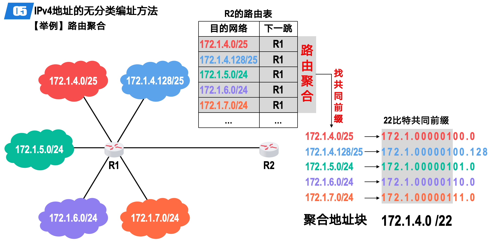
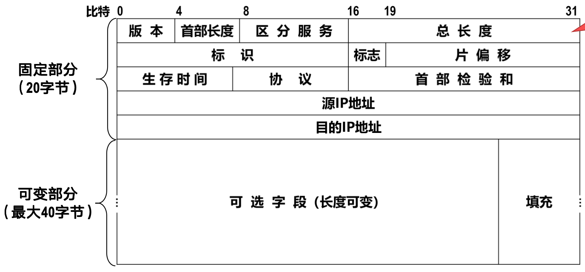
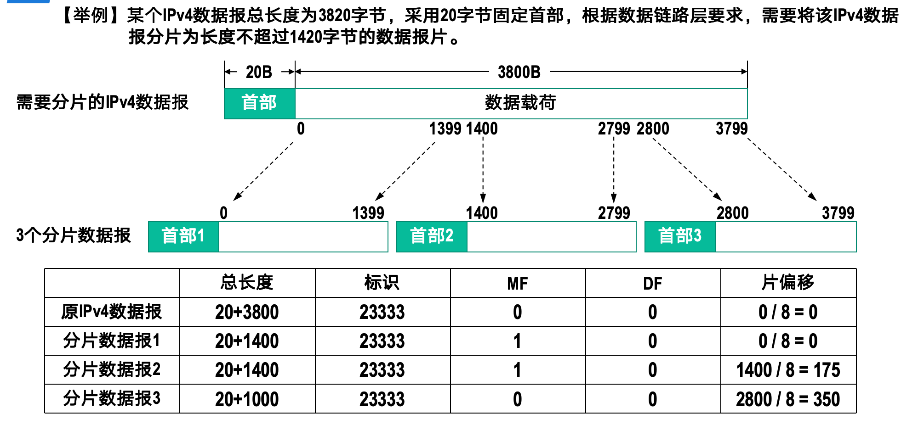
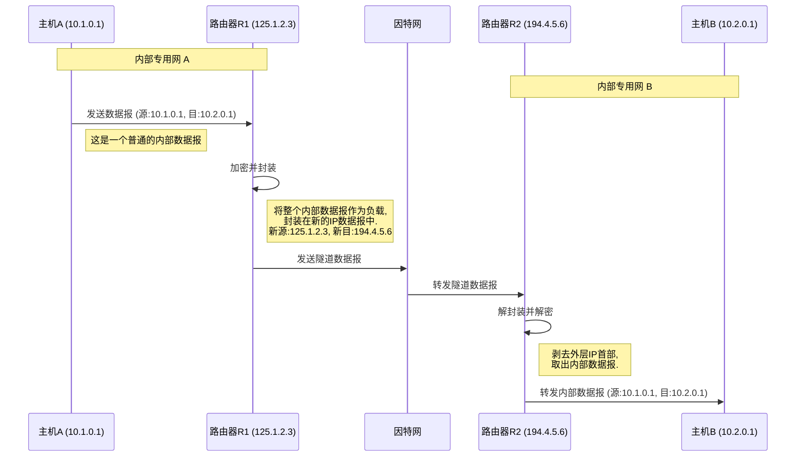
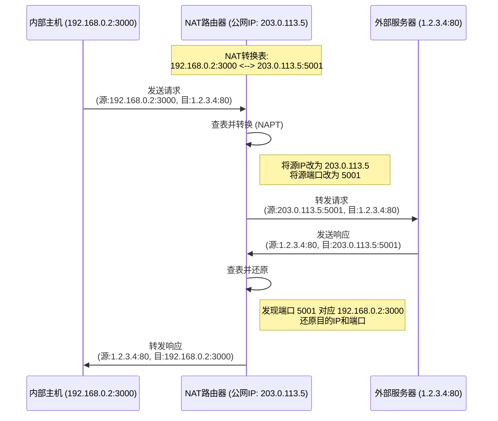
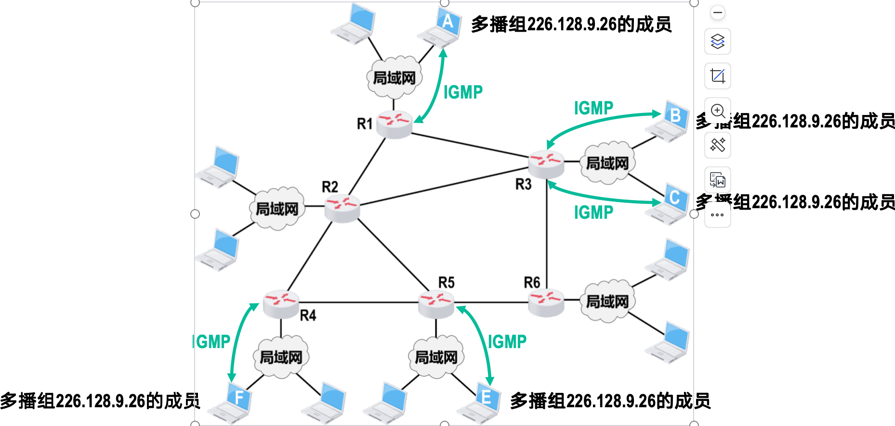

# 网络层
> 网络层的主要任务是将Packet从源地址经过多个网络传输到目的地址.该任务可以拆分为分组转发和路由选择两个子任务.
> 
> 路由表存储了目的ip地址与子网掩码,下一跳路由器地址,出接口等信息,路由选择算法根据路由表选择最佳路径将数据包发送到目的地址.

OSI模型主张在网络层建立面向连接的虚电路,依靠网络来确保可靠传输.而TCP/IP模型则主张在网络层建立无连接的分组交换网络,由用户主机来保证通信的可靠.

## 异构网络互联

网际协议(Internet Protocol,IP)是实现异构网络互联的基础协议.它定义了IP地址的格式,数据报的格式,以及路由选择等内容.IP协议是无连接的,每个数据报独立传输,不保证可靠性

异构网络互联的基本思想是将不同类型的网络通过路由器连接起来,形成一个统一的网络体系结构.路由器负责在不同网络之间转发数据报,并根据路由选择算法选择最佳路径.当IP网上的主机通信时,它们会感觉自己直接连接在一起,而不需要关心底层网络的差异.

---

## IPV4地址
> IPV4地址是每一个联网设备的唯一标识,由32位二进制数组成,通常表示为四个十进制数(0-255)用点分隔开.

IPV4地址分为网络地址和主机地址两部分,网络地址用于标识一个网络,主机地址用于标识网络中的一台主机.子网掩码用于区分网络地址和主机地址,通过与运算可以得到网络地址.

### 分类编址方法

IPV4地址根据网络规模分为A,B,C,D,E五类:

- A类地址: 网络号占8位,主机号占24位,适用于大型网络.范围: 1.0.0.0 - 126.255.255.254

- B类地址: 网络号占16位,主机号占16位,适用于中型网络.范围: 128.0.0.0 - 191.255.255.254

- C类地址: 网络号占24位,主机号占8位,适用于小型网络.范围: 192.0.0.0 - 223.255.255.254

- D类地址: 用于多播通信.范围: 224.0.0.0 - 239.255.255.255

- E类地址: 保留地址,用于实验和研究.范围: 240.0.0.0 - 255.255.255.255

注意:

- 主机号全0表示网络地址,主机号全1表示广播地址,不能分配给主机使用.

    
     
    <caption>特殊的IPV4地址</caption>

---

### 划分子网编址

分类编址的IPV4地址容易造成浪费,例如,一个子网中有100000台设备,此时采用A类地址,还剩下许多地址可以使用,但是别的子网就不不能用了.

因此我们希望从主机号中借用一些位作为网络号,这样就可以划分更多的子网,提高地址利用率.这种方法称为子网划分(Subnetting).

我们使用子网掩码来表示子网划分的情况.子网掩码也是一个32位的二进制数,与IPV4地址进行与运算,得到网络地址.

子网划分将原来的两级IP地址（网络号、主机号）转变为三级IP地址（网络号、子网号、主机号）。子网号是从原来的主机号部分借位而来的。

    
     
    <caption>IP地址结构</caption>

子网掩码由一连串的1和一连串的0组成，其中1对应IP地址中的网络号和子网号，0对应主机号。

!!! example "子网划分示例"
    假设有一个B类网络 `145.13.0.0`，其默认子网掩码为 `255.255.0.0`。现在需要将其划分为多个子网，每个子网最多容纳约500台主机。

    1.  **确定主机位数**：
        为了容纳500台主机，我们需要确定主机号所需的位数 `n`。
        $$ 2^n - 2 \ge 500 $$
        计算可知，$2^9 - 2 = 510$，满足条件。因此，主机号需要9位。

    2.  **确定子网位数**：
        B类地址的主机号部分有16位。借走一部分给子网号后，还剩9位给主机号。
        因此，子网号的位数为：$16 - 9 = 7$ 位。

    3.  **计算子网掩码**：
        新的子网掩码在默认B类掩码的基础上，将原主机号部分的前7位置为1。

        -   默认B类掩码：`11111111.11111111.00000000.00000000`

        -   新的子网掩码：`11111111.11111111.11111110.00000000`

        -   转换为十进制：`255.255.254.0`

    4.  **计算子网数量**：
        子网号有7位，因此可以划分出 $2^7 = 128$ 个子网。

    通过这种方式，原有的一个B类网络被成功地划分成了128个更小的子网，每个子网可以容纳510台主机，极大地提高了IP地址的利用率。

### 无分类编址CIDR(Classless Inter-Domain Routing)

随着互联网的发展，分类编址的局限性愈发明显，即使有子网划分，地址浪费和路由表庞大的问题依然存在。为此，IETF提出了**无分类域间路由（CIDR）**。

CIDR消除了传统的A、B、C类地址和子网划分的概念，将32位的IP地址划分为两部分：**网络前缀**和**主机号**.

$$ \text{IP地址} ::= \{<\text{网络前缀}>, <\text{主机号}>\} $$

CIDR采用**斜线记法**，在IP地址后面加上`/`和网络前缀的位数。例如，`128.14.32.8/20`表示该IP地址的前20位是网络前缀，后12位是主机号。

**CIDR地址块**：CIDR将网络前缀相同的连续IP地址组成一个“CIDR地址块”. 我们可以根据地址块的起始地址和网络前缀长度，计算出地址块的范围：

- **地址块中的地址数**：$2^{32 - \text{网络前缀长度}}$
- **最小地址**：网络前缀部分不变，主机号部分全为0。
- **最大地址**：网络前缀部分不变，主机号部分全为1。

!!! example "CIDR地址块计算"
    对于地址块 `128.14.32.0/20`：

    - **地址数**：$2^{32-20} = 2^{12} = 4096$ 个地址。
    - **子网掩码**：前20位为1，后12位为0，即 `255.255.240.0`。
    - **最小地址**：`128.14.32.0`
    - **最大地址**：`128.14.47.255`

    因此，该地址块的范围是 `128.14.32.0` 到 `128.14.47.255`。

无分类编址相比于之前,最大的进步就是更加灵活了,不需要固定8,16或者24位作为网络号,可以根据实际需求划分任意长度的网络前缀.形成自定义大小的子网.

### 路由聚合（构成超网）

CIDR的一个核心优势是**路由聚合**，它允许将多个连续的CIDR地址块合并成一个更大的地址块，从而在路由表中用一个条目来表示多个网络。这个过程也称为**构成超网（Supernetting）**。

例如，一个ISP拥有`206.0.68.0/22`到`206.0.71.0/22`这4个地址块。它可以向外界宣告它拥有一个更大的地址块`206.0.68.0/20`，这样外部路由器只需要一条路由记录就能找到这个ISP下的所有主机。

路由聚合极大地减少了路由表的规模，减轻了路由器的负担，提高了互联网的整体性能。

    
     
    <caption>路由聚合示例</caption>

要找到聚合后的共同前缀，只需对所有地址进行“按位与”运算。

### 最长前缀匹配

由于路由聚合的存在，路由表中可能会出现多个匹配目的IP地址的条目。例如，一个路由器中可能有：

- `206.0.68.0/20` -> 路由器R1
- `206.0.70.0/22` -> 路由器R2

当一个目的地址为`206.0.70.130`的数据包到达时，两个条目都能匹配。此时，路由器会采用**最长前缀匹配**原则，选择网络前缀最长的那个条目进行转发。在这个例子中，`/22`比`/20`更长，因此数据包会被转发给路由器R2。

---

---

## IPv4地址与MAC地址

数据链路层将IP数据报封装为帧进行传输,而帧的发送和接收是通过MAC地址来实现的.因此,在同一局域网内,需要将IP地址转换为对应的MAC地址.

在帧的传输过程中,源IP地址和目的IP地址保持不变,但源MAC地址和目的MAC地址会根据每一跳的链路进行更新.每个路由器在转发数据包时,会将目的MAC地址设置为下一跳路由器的MAC地址.

然而,在同一局域网内,主机需要知道目的IP地址对应的MAC地址,以便正确发送帧.为此,引入了地址解析协议(ARP).

### 地址解析协议 (ARP)

地址解析协议（ARP, Address Resolution Protocol）的作用是在局域网中，根据一个已知的IP地址，找出其对应的MAC地址。

每台主机或路由器都有一个**ARP缓存表（ARP Cache）**，用于存储本局域网内各主机和路由器的IP地址与MAC地址的对应关系。

**工作流程如下：**

1.  **检查ARP缓存**：
    当主机A想给本局域网内的主机B发送IP数据报时，它会首先在自己的ARP缓存表中查找是否有主机B的IP地址对应的条目。

    -   **如果找到**：就直接从缓存中读取主机B的MAC地址，并用该MAC地址作为目的地址来封装数据帧，然后发送。

    -   **如果未找到**：则进入下一步。

2.  **发送ARP请求**：
    主机A会在本局域网内以**广播**的形式发送一个**ARP请求分组**。该请求分组的主要内容是：“我的IP地址是`IP_A`，我的MAC地址是`MAC_A`。我想知道IP地址为`IP_B`的主机的MAC地址是什么？”

3.  **目标主机响应**：
    局域网内的所有主机都会收到这个广播的ARP请求。

    -   其他主机发现请求的IP地址不是自己，就会忽略该请求。当然,也可以在这时将A的IP和MAC地址存入自己的ARP缓存表中,以备后用.

    -   主机B发现请求的IP地址与自己的IP地址相匹配，它就会向主机A发送一个**ARP响应分组**。这个响应是**单播**的，直接发送给主机A。响应分组的内容是：“我的IP地址是`IP_B`，我的MAC地址是`MAC_B`。”

4.  **更新缓存并发送数据**：

    主机A收到主机B的ARP响应后，就知道了主机B的MAC地址。它会将这个IP到MAC的映射关系存入自己的ARP缓存表中（通常会设置一个生存时间，如20分钟），然后用这个MAC地址来封装数据帧并发送给主机B。

### IP数据报的发送和转发

如果一个主机A向另一个主机B发送数据报,首先需要判断主机B是否在同一局域网内.

- 查看子网掩码,将主机A的IP地址和主机B的IP地址分别与子网掩码进行与运算,如果结果相同,则说明两台主机在同一局域网内.

如果不在同一局域网内,主机A需要将数据报发送给默认网关(路由器).此时,主机A需要知道默认网关的MAC地址,通过ARP协议获取.

默认网关在收到数据报后,首先检查收到的IP报是否正确,然后根据路由表选择下一跳路由器,将数据报封装在新的帧中发送出去.在这个过程中,路由器会更新帧的源MAC地址和目的MAC地址,但IP报的源IP地址和目的IP地址保持不变.

###  IPv4数据报的首部格式

    
     
    <caption>IPv4数据报首部格式</caption>

- 固定部分(20字节):

    - 版本(Version): 4位,表示IP协议的版本号,IPv4为4.

    - 首部长度(IHL): 4位,表示IP数据报首部的长度,单位为32位(4字节).比如,如果首部长度为5,则表示首部长度为20字节(仅包含固定部分).

    - 服务类型(Type of Service): 8位,用于指示数据报的优先级和服务质量要求.

    - 总长度(Total Length): 16位,表示整个IP数据报的长度,单位为字节.

    - 标识(Identification): 16位,用于唯一标识一个IP数据报,在分片时使用.

    - 标志(Flags): 3位,用于控制和标识分片.

    - 片偏移(Fragment Offset): 13位,表示分片在原始数据报中的位置.
    - 生存时间(Time to Live, TTL): 8位,用于防止数据报在网络中无限循环.
    - 协议(Protocol): 8位,表示上层协议类型,如TCP为6,UDP为17.
    - 首部校验和(Header Checksum): 16位,用于检测IP数据报首部在传输过程中是否出错.
    - 源IP地址(Source IP Address): 32位,表示发送方的IP地址.
    - 目的IP地址(Destination IP Address): 32位,表示接收方的IP地址.

- 可选部分(0-40字节): 可选字段,用于扩展IP数据报的功能,如安全选项、时间戳等.

- 填充部分: 用0填充首部,使其长度为32位(四字节)的整数倍.

!!! definition "IPV4的分片"
    我们知道,帧的数据载荷长度是有限制的,不同类型的链路有不同的最大传输单元(MTU,Maximum Transmission Unit).当IP数据报的长度超过链路的MTU时,就需要进行分片(Fragmentation).这就用到了IP数据报首部中的标识、标志和片偏移字段.

    - 标识:属于同一个IPv4数据报的各分片数据报应该具有相同的标识。

    - 标志:三位的作用分别是
        - 第1位: 保留位,必须为0.

        - 第2位: 不分片位(DF, Don't Fragment),如果设置为1,表示该数据报不能被分片.

        - 第3位: 更多分片位(MF, More Fragments),如果设置为1,表示后面还有分片;如果为0,表示这是最后一个分片.

    - 片偏移:表示该分片在原始数据报中的位置,单位为8字节(64位).例如,如果一个分片的片偏移为100,则表示该分片在原始数据报中的位置是第800字节(100*8).

    

        
         
        <caption>IPV4分片示例</caption>
    

!!! definition "首部校验和"
    发送端端计算方法为:

    1. 将首部看作一系列16位的字(Word),如果首部长度不是16位的整数倍,则在末尾补0.

    2. 将原来的校验和字段设为0.

    3. 将所有16位字相加,如果在加法过程中产生了最高位（第 16 位）的进位（Carry）,则将该进位加到结果的最低位（第 1 位）上.

    4. 对结果取反,得到校验和.

    而接受方在接收到数据报后,也会按照相同的方法计算校验和,如果结果全为1,则表示数据报首部没有错误;否则,表示数据报首部在传输过程中发生了错误,需要丢弃该数据报.

    原理是$A + \bar{A} = -1$.

### 静态路由
> 静态路由是手动添加的路由条目,通常用于小型网络或特定的路由需求.管理员需要手动配置每个路由器的路由表,指定目的地址、子网掩码、下一跳地址和出接口等信息.

默认路由是一种特殊的静态路由,用于处理那些目的地址不在路由表中的数据报.默认路由通常指向一个网关(路由器),当路由器无法在路由表中找到匹配的条目时,就会将数据报发送到默认路由指定的网关.

为了在最长前缀匹配规则下,最后使用默认路由,默认路由的网络前缀长度为0,表示匹配所有目的地址,也即`0.0.0.0/0`

特定主机路由是另一种静态路由,用于指定某个特定主机的路由路径.这种路由条目的网络前缀长度为32,表示只匹配该主机的IP地址.

---

## RIP协议

路由信息协议(Routing Information Protocol,RIP)是一种基于距离矢量算法的动态路由协议.

该协议要求每一个路由器维护一个路由表,记录到达各个目的网络的距离(跳数)和下一跳路由器地址.路由器通过定期和相邻路由器交换路由信息来更新路由表.

路由器到直连网络的距离为1,到其他网络的距离为经过的路由器数量.超过15跳的网络被认为是不可达的.

RIP协议的一个重要特点是: **好消息传播得快,坏消息传播得慢**.

1. 好消息传播得快

    当网络中出现新的路由或路径变短时,这种更新信息会迅速传播到整个网络.

    !!! example "示例: 好消息传播得快"
        假设网络拓扑为 **N --- R1 --- R2**。初始状态下，R1 到 N 的距离为 4，R2 到 N 的距离为 5（经过 R1）。
        
        某时刻 R1 的某个端口检测到“到N更短的链路”(距离由4变为1).
        
        1.  R1 计算其到N的最新距离:
            $$ \text{dist} = \min{(1, 1 + \text{dist}(R2 \to N))} = \min{(1, 1+5)} = 1 $$
            R1 更新路由表并通知邻居.
            
        2.  R2 收到通知后, 更新其到N的距离为2, 并通知邻居.
        
        3.  R1 收到通知后, 发现距离未变, 不再发送通知.
        
        算法进入静止状态. 可见, R2到N的距离减少的好消息通过RIP得到了迅速传播.

2. 坏消息传播得慢(路由环路问题)

    当网络中出现故障(如链路断开)时, 这种"坏消息"往往需要很长时间才能传播开来,甚至导致**路由环路(Routing Loop)**.

    !!! example "示例: 坏消息传播得慢"
        同样假设初始状态下 R1 到 N 的距离为 4，R2 到 N 的距离为 5。
        
        某时刻 R1 的某个端口检测到“N不可达”(距离变为16).
        
        1.  R1 计算其到N的最新距离:
            $$ \text{dist} = \min{(16, 1 + \text{dist}(R2 \to N))} = \min{(16, 1+5)} = 6 $$
            **注意**: 从网络全局视角看, 经过R2的这个新距离显然是错误的(因为R2到N其实也要经过R1).
            R1 更新路由表并通知邻居.
            
        2.  R2 收到通知后, 更新其到N的距离为7, 并通知邻居.
        
        3.  R1 收到通知后, 重新计算距离:
            $$ \text{dist} = \min{(16, 1 + 7)} = 8 $$
            R1 继续通知邻居...
            
        如此循环, 直到R2最终算出它经由R1到达N的距离为16为止. 可见, RIP关于链路故障或距离增加的坏消息传播得很慢.

为了解决这个问题, RIP采取了一些措施:

1.  **水平分割(Split Horizon)**:

    -   **原理**: 路由器从某个接口学到的路由信息, 不会再通过该接口发回给邻居.

    -   **作用**: 避免了将过时的信息发回给信息的来源, 从而减少环路产生的可能性.

2.  **毒性逆转(Poison Reverse)**:

    -   **原理**: 路由器从某个接口学到的路由信息, 会将该路由的度量值设为16(不可达), 然后发回给邻居.

    -   **作用**: 明确告知邻居这条路径已经不可达(或者说通过我到达该网络是不可行的), 从而消除环路.

3.  **触发更新(Triggered Update)**:

    -   **原理**: 一旦检测到路由表发生变化, 立即发送更新报文, 而不是等待30秒的周期性更新.
    
    -   **作用**: 加快收敛速度, 减少坏消息传播慢带来的影响.

---

## OSPF协议
> OSPF(Open Shortest Path First)是一种基于链路状态算法的动态路由协议.

!!! definition "相关状态"
    1. 链路状态(Link State): 说明本路由器都和哪些路由器相邻,以及该链路的"度量"(metric). OSPF将链路的度量理解为费用,距离,时延,带宽等.

    2. 问候分组(Hello Packet): 路由器周期性发送问候分组,以便发现和维持邻居关系.问候分组封装在IP数据报中,IP数据报的协议号为89.

        - 问候分组发送的周期为10s

        - 若40s未收到邻居路由器的问候分组,则认为邻居路由器不可达

    3. 链路状态通告(Link State Advertisement):每个路由器会产生自己的链路状态通告(LSA),并通过洪泛(Flooding)的方式将其发送给所有其他路由器. LSA包含直连链路的信息,如邻居路由器的ID,链路的度量等与直连网络的信息.

    4. 链路状态更新(Link State Update): LSA被封装在链路状态更新分组(LSU)中, 采用**洪泛法(Flooding)**进行发送.

        - **洪泛法**: 路由器向自己所有的邻居路由器发送LSU, 收到该分组的各路由器又将该分组转发给自己所有的邻居路由器(但其上游路由器除外), 以此类推.

        - **可靠性**: 收到LSU后要发送确认. 收到重复的更新分组无需再次转发, 但要发送一次确认.

    5. 链路状态数据库(LSDB): 路由器将收到的链路状态信息存储在LSDB中,最终全网所有路由器的LSDB是一致的.

在完成LSDB的构建后, OSPF会根据Dijkstra算法计算出最优路径,并更新路由表.路径的度量是链路状态的度量之和.

### OSPF区域 (Areas)

为了使OSPF能用于规模很大的网络, 将一个自治系统(AS)再划分为若干更小的范围, 称为**区域(Area)**.

- **划分区域的好处**: 把利用洪泛法交换链路状态信息的范围局限在各个区域, 而不是整个AS, 从而减少了整个网络上的通信量.

#### 区域类型与路由器角色

    
     
    <caption>区域示例</caption>

1.  **主干区域 (Backbone Area)**:
    -   在AS内只有一个区域配置成主干区域.

    -   作用是连通其他区域.

    -   包含AS内的所有**区域边界路由器(ABR)**, 可能还包含一些非边界路由器.

2.  **区域边界路由器 (Area Border Router, ABR)**:

    -   负责为流向该区域以外的分组提供路由选择.

    -   连接主干区域和其他区域的路由器 (如图中的 R3, R4, R7).

    -   每个区域至少有一个区域边界路由器.

3.  **自治系统边界路由器 (AS Boundary Router, ASBR)**:

    -   主干区域中专门负责和本AS外的其他AS交换路由信息的路由器 (如图中的R6).

#### 跨区域路由过程

当分组在AS内的不同区域之间传送时:

1.  先找到本区域内的一个**区域边界路由器** (如 R3, R4, R7).

2.  再通过**主干区域**路由到位于目的区域的区域边界路由器.

3.  最后路由到目的地.

---

## BGP
> BGP(Border Gateway Protocol)是一种外部网关协议(EGP), 用于在自治系统(AS)之间交换路由信息.
>
> 上面介绍的RIP和OSPF都是内部网关协议(IGP), 用于在自治系统(AS)内部交换路由信息.

由于不同AS里度量路由的标准不同,使用统一的代价来作为度量寻找路径是不可行的.

因此,BGP协议的追求并不是找到最短的路径,而是在考虑相关策略(政治、经济、安全)后,找到一条比较好的路由.

### BGP的工作原理

1.  **BGP发言人 (BGP Speaker)**:

    -   每个自治系统至少选择一个路由器作为"BGP发言人".

    -   BGP发言人之间建立 **TCP连接** (端口号179) 交换路由信息.

2.  **路径矢量算法 (Path Vector)**:

    -   BGP不使用距离矢量, 而是使用 **AS路径 (AS-PATH)**.

    -   AS-PATH 记录了路由经过的所有自治系统序列.

    -   **防环机制**: 如果路由器在收到的路由信息的 AS-PATH 中发现了自己的 AS号, 则丢弃该路由, 从而有效避免了环路.

### BGP的四种报文

BGP通过TCP连接交换以下四种报文:

1.  **OPEN (打开) 报文**:

    -   用于与相邻的BGP发言人建立关系.

2.  **UPDATE (更新) 报文**:

    -   BGP的核心报文.
    -   用于通告新路由或撤销不可达路由.

3.  **KEEPALIVE (保活) 报文**:

    -   周期性发送, 用于维持邻居关系 (心跳机制).

    -   也用于对 OPEN 报文的确认.

4.  **NOTIFICATION (通知) 报文**:

    -   用于报告错误, 发送后会关闭连接.

---

## 路由器
> 路由器的任务是根据路由表选择最佳路径转发数据包.

### 路由器的结构

路由器主要由**路由选择部分(控制层面)**和**分组转发部分(数据层面)**组成.

1.  **路由选择部分 (控制层面)**:

    -   核心是**路由选择处理机**.
    -   负责运行路由选择协议(RIP, OSPF, BGP等), 计算路由, 维护**路由表**.
    -   定期与相邻路由器交换路由信息.

2.  **分组转发部分 (数据层面)**:

    -   负责将数据包从输入端口转发到合适的输出端口.
    -   主要包含三部分:
        -   **输入端口**: 物理层接收 -> 数据链路层解封装 -> **查找转发表**(根据目的IP地址).
        -   **交换结构 (Switching Fabric)**: 将分组从输入端口交换到输出端口. 常见的交换方式有: 通过存储器, 通过总线, 通过纵横交换阵列(Crossbar).
        -   **输出端口**: 缓存分组 -> 数据链路层封装 -> 物理层发送.

### 路由器的工作流程

当一个IP数据报到达路由器时:

1.  **接收与解封装**: 输入端口的物理层接收信号, 数据链路层剥去帧首部和尾部.

2.  **查找转发表**: 根据IP首部中的**目的IP地址**, 在**转发表**中进行**最长前缀匹配**, 确定下一跳路由器的IP地址和出接口.

3.  **首部更新**:

    -   **TTL减1**: 如果TTL变为0, 则丢弃该分组并向源主机发送ICMP超时报文.

    -   **重新计算校验和**: 因为TTL变了, 首部校验和也需要重新计算.

4.  **交换与排队**: 通过交换结构将分组传送到对应的输出端口. 如果输出端口繁忙, 分组需要在队列中等待(可能发生丢包).

5.  **封装与发送**: 输出端口将IP数据报封装成新的帧(源MAC是本端口, 目的MAC是下一跳), 发送到下一跳.

---

## ICMP
> ICMP(Internet Control Message Protocol)是IP协议的控制报文, 用于报告错误或提供信息.

ICMP报文是IP数据报的负载, 因此ICMP报文的IP首部中的协议号为1.

ICMP报文分为两类:

1. **差错报告报文**:

    - 用于报告错误, 发送后会关闭连接.

2. **询问报文**:

    - 用于提供信息, 发送后不会关闭连接.

### 差错报告报文

!!! info
    常见的差错报告报文有五种

    === "终点不可达"
        当路由器或主机不能交付数据报时就向源点发送终点不可达报文.具体可再根据ICMP的代码字段细分为目的网络不可达、目的主机不可达、目的协议不可达、目的端口不可达、目的网络未知、目的主机未知等13种

    === "源点抑制"
        当路由器或主机由于拥塞而丢弃数据报时,就向源点发送源点抑制报文,让源点把发送速率放慢.

    === "时间超过"
        当路由器收到一个目的IP地址不是自己的IP数据报,会将其生存时间TTL减1. 若结果为0,则丢弃该数据报,并向源点发送时间超过报文. 
        
        另外,当终点在预先规定的时间内不能收到一个数据报的全部数据报片时,就把已收到的数据报片都丢弃,并向源点发送时间超过报文.

    === "参数问题"
        当路由器或目的主机收到的IP数据报的首部中有的字段的值不正确时,就丢弃该数据报,并向源点发送参数问题报文.

    === "改变路由(重定向)"
        路由器把改变路由报文发送给主机,让主机知道下次应将数据报发送给另外的路由器(更好的路由).

### ICMP询问报文

ICMP询问报文主要用于探测网络状态或查询信息. 最著名的应用是 **Ping** 和 **Traceroute**.

1.  **回送请求和回答报文 (Echo Request / Echo Reply)**:

    -   **Ping** 命令就是使用这种报文来测试主机或路由器是否可达.

    -   主机A向主机B发送"回送请求"报文, 主机B收到后必须向主机A发送"回送回答"报文.

2.  **时间戳请求和回答报文**:
    -   用于进行时钟同步和测量时间.

!!! example "Traceroute (或 tracert) 的工作原理"
    Traceroute 用于跟踪数据包从源点到终点的路径. 它巧妙地利用了ICMP的**时间超过**和**终点不可达**报文.
    
    1.  源主机向目的主机发送一连串的 IP 数据报 (封装的是无法交付的 UDP 报文).

    2.  第一个数据报的 TTL 设置为 1. 到达第一个路由器时, TTL 减为 0, 路由器丢弃该包并回送 **ICMP 时间超过** 报文. 源主机因此得到了第一个路由器的 IP.

    3.  第二个数据报的 TTL 设置为 2. 到达第二个路由器时, TTL 减为 0, 回送 **ICMP 时间超过** 报文.

    4.  ...

    5.  当数据报最终到达目的主机时, TTL 即使不为 0, 但因为 UDP 端口不可达, 目的主机会回送 **ICMP 终点不可达** 报文.

    6.  源主机收到终点不可达报文后, 停止发送, 从而得到了完整的路径信息.

---

## VPN
> VPN(Virtual Private Network)虚拟专用网络, 是指在公共网络上建立的、具有安全性的专用网络.

专用网内,各主机的IP地址是私有的, 不能直接访问外网. 

这些IP地址被称为专用地址,包括

- A类地址: 10.0.0.0 - 10.255.255.255

- B类地址: 172.16.0.0 - 172.31.255.255

- C类地址: 192.168.0.0 - 192.168.255.255

因特网中所有的路由器,都不会转发专用地址的数据报.

### VPN的工作原理 (隧道技术)

VPN利用**隧道技术(Tunneling)**实现两个专用网之间的通信. 核心思想是将专用网的IP数据报封装在因特网的IP数据报中.

**过程详解**:

1.  **发送**: 机构A的主机A (10.1.0.1) 向机构B的主机B (10.2.0.1) 发送数据报.

2.  **封装**: 路由器R1收到后, 发现目的地址是另一个专用网的地址. R1将整个数据报进行加密, 然后作为负载封装在一个新的IP数据报中. 新数据报的源地址是R1的公网IP, 目的地址是R2的公网IP.

3.  **传输**: 这个封装后的数据报在因特网中传输, 就像普通数据报一样.

4.  **解封**: 路由器R2收到后, 剥去外层IP首部, 解密并还原出原始的内部数据报.

5.  **转发**: R2根据原始的目的地址 (10.2.0.1), 将数据报转发给主机B.

### NAT (网络地址转换)

**NAT (Network Address Translation)** 是一种在IP数据报通过路由器或防火墙时重写源IP地址或目的IP地址的技术. 它主要用于解决IPv4地址短缺的问题, 同时也提供了一定的安全性(隐藏内部网络结构).

1. 基本NAT

    基本NAT将内部网络的私有IP地址转换为公网IP地址. 这种转换通常是一对一的, 即一个内部主机占用一个公网IP.

2. NAPT (网络地址端口转换)

    **NAPT (Network Address Port Translation)**, 也常被称为 **PAT**, 是目前最常用的NAT类型. 它允许多个内部主机共享**同一个**公网IP地址, 通过不同的**端口号**来区分不同的连接.

    **NAPT的工作流程**:

    1.  **离开专用网**: 路由器将源IP地址(私有)和源端口号替换为路由器的公网IP地址和新的端口号.

    2.  **进入专用网**: 路由器根据目的IP(公网)和目的端口号, 在**NAT转换表**中查找对应的内部主机IP和端口号, 并进行替换.

---

## IP多播
> IP多播(Multicast)是IP网络中的一种数据传输方式, 允许数据报被发送给一组主机, 而不是单个主机.

IP多播使用特殊的IP地址范围, 从224.0.0.0到239.255.255.255. 

多播地址又可以分为预留的多播地址（永久多播地址）、全球范围可用的多播地址以及本地管理的多播地址[RFC 3330],范围是

- 224.0.0.0 - 224.0.0.255

- 224.0.1.0 - 238.255.255.255

- 239.0.0.0 - 239.255.255.255

---

IP多播又可以分为在局域网内的硬件多播和在因特网中的多播

### 硬件多播

由于MAC地址中有多播MAC地址这种类型,因此只要把IP的多播地址映射为MAC的多播地址即可.

IANA拥有的以太网多播地址块的范围是 `01-00-5E-00-00-00` 到 `01-00-5E-7F-FF-FF`.

**映射规则**:

1.  MAC地址的前25位是固定的: `01-00-5E` (前24位) + `0` (第25位).

2.  IP多播地址的后23位直接映射到MAC地址的后23位.

由于IP多播地址可变化的28比特的前5个比特无法映射到MAC多播地址，这会造成IP多播地址与多播MAC地址的映射关系并不是唯一的。因此, 存在 **32:1** 的映射关系. 也就是说, 32个不同的IP多播地址可能会映射到同一个MAC地址.

**过滤**:

当网卡收到一个多播帧时, 硬件会检查MAC地址是否匹配. 如果匹配, 再由IP层软件检查IP地址是否真的是自己想要接收的.

### 在因特网中的多播

在因特网上进行多播会复杂一点,因为需要考虑数据报在经过路由器转发的问题. 主要涉及两种协议:

1.  **IGMP (Internet Group Management Protocol)**:

    -   用于主机和与其直接相连的路由器之间.
    -   主机使用IGMP告诉路由器它想接收哪个多播组的信息.

2.  **多播路由选择协议**:

    -   用于路由器之间.
    -   路由器之间交换信息, 以便构建多播转发树, 将数据报转发给所有组成员.

#### IGMP协议
IGMP协议让连接在本地局域网上的多播路由器知道本局域网上是否有主机(严格来说是主机上的某个进程)参加或退出了某个多播组.

-   **工作阶段**:

    1.  **加入**: 当主机加入新的多播组时, 向多播组的多播地址发送IGMP报文, 声明自己要成为该组成员.

    2.  **探询**: 本地多播路由器周期性发送IGMP探询报文(Query).

    3.  **响应**: 主机收到探询后, 如果它属于某个组, 就发送IGMP报告报文(Report).

#### 多播路由选择协议
多播路由选择协议的主要任务是寻找一棵以源主机为根的**多播转发树**. 在多播转发树上, 每个分组在每条链路上只传送一次.

-   **反向路径转发 (RPF, Reverse Path Forwarding)**:

    -   为了防止环路和重复, 路由器在收到多播数据报时, 会检查: "如果我向源主机发送单播数据报, 下一跳是不是刚才发给我多播数据报的那个邻居?"

    -   如果是, 则接受并转发; 否则, 丢弃.

    

