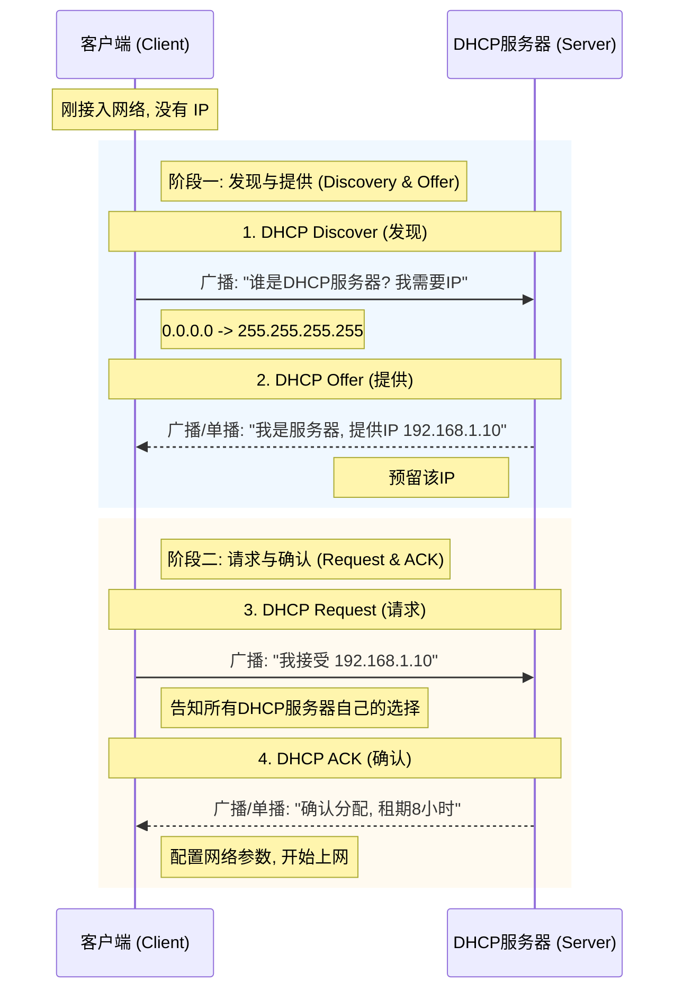
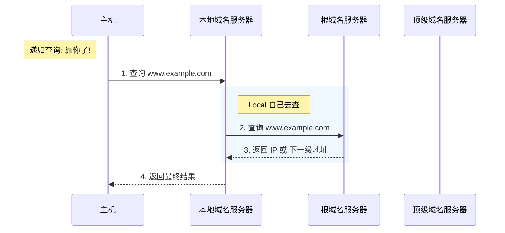
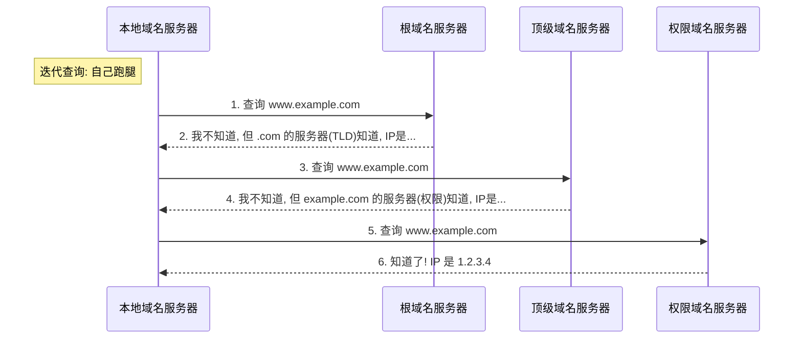

# 应用层

我们不妨重新回顾一下网络中各层的作用:

| 分层 | 数据单位 | 主要作用 | 典型设备/协议 |
| :--- | :--- | :--- | :--- |
| **应用层** (Application) | 报文 (Message) | 为应用程序提供服务, 处理业务逻辑 | HTTP, DNS, SMTP |
| **运输层** (Transport) | 报文段 (Segment) / 用户数据报 (Datagram) | **进程到进程 (Port-to-Port)** 的通信, 提供通用数据传输服务 | TCP, UDP |
| **网络层** (Network) | 分组 (Packet) | **主机到主机 (Host-to-Host)** 的通信, 路由选择, 分组转发 | IP, 路由器 |
| **数据链路层** (Data Link) | 帧 (Frame) | **点到点 (Node-to-Node)** 的通信, 链路管理, 差错检测 | 以太网, 交换机 |
| **物理层** (Physical) | 比特 (Bit) | 透明传输比特流 | 网线, 光纤, 集线器 |

## P2P 通信

在P2P通讯中,没有明确的服务器与客户端的划分,每个节点既可以作为服务器也可以作为客户端

其优点表现于:

1. 减轻了服务器的压力

2. 降低了网络的复杂度

3. 可拓展性强

## 动态主机配置协议

**动态主机配置协议 (DHCP, Dynamic Host Configuration Protocol)** 是目前广泛使用的协议，它提供了一种即插即用的连网机制，允许计算机自动获取 IP 地址等网络配置信息。

### 核心功能

*   **自动分配 IP 地址**: 避免手动配置的繁琐和冲突。

*   **分配其他网络参数**: 子网掩码、默认网关、DNS 服务器地址等。

*   **地址重用**: 使用租约机制，IP 地址可以被回收和重新分配。

### 工作流程 (4个步骤)

DHCP 的交互过程通常被称为 **DORA** (Discover, Offer, Request, Acknowledge)。

1.  **DHCP Discover (发现)**: 
    *   **客户端 -> 广播**: "谁有多余IP?"
    *   因为客户端还没 IP，所以使用 UDP 广播发送 (源IP 0.0.0.0, 目的IP 255.255.255.255, 目的端口 67)。

2.  **DHCP Offer (提供)**:
    *   **服务器 -> 广播/单播**: "我是 DHCP 服务器，我可以给你这个 IP (例如 192.168.1.100)。"

    *   服务器会预留这个 IP，不再分给别人。

3.  **DHCP Request (请求)**:
    *   **客户端 -> 广播**: "我收到了你的 Offer，我就要这个 IP 了 (192.168.1.100)！"

    *   **为什么还是广播?**: 为了告诉 **所有** DHCP 服务器 (如果有多个)，它选择了哪一个服务器的 Offer。其他未被选中的服务器就可以撤销预留的 IP 了。

4.  **DHCP ACK (确认)**:
    *   **服务器 -> 广播/单播**: "好的，IP 正式分配给你，租期是 8 小时。这是你的掩码、网关和 DNS。"

    *   客户端收到 ACK 后，才可以正式使用该 IP。

    
     
    <caption>DHCP 交互过程</caption>

## 域名系统
> 域名通过DNS服务器解析为IP地址

### 域名结构

因特网采用了 **层次树状结构** 的命名方法。任何一个连接在因特网上的主机或路由器，都有一个唯一的层次结构的名字，即域名(Domain Name)。

**语法规则**:

1.  **标号 (Label)**:
    *   域名由 **点 (dot)** 分隔开的多个标号组成。例如 `www.example.com`。
    *   标号只能包含 **字母**, **数字** 和 **连字符(-)**。
    *   **不区分大小写** (比如 `CNN.com` 和 `cnn.com` 是一样的)。
    *   每个标号不超过 **63** 个字符。

2.  **长度限制**:
    *   完整的域名不超过 **255** 个字符。

3.  **层级顺序**:
    *   级别最低的标号写在最左边，级别最高的写在最右边。

**域名的层级**:

*   **根域名 (Root Domain)**: 树的顶端，用 `.` 表示 (通常省略不写)。
*   **顶级域名 (TLD, Top-Level Domain)**:
    *   **国家顶级域名 (nTLD)**: `.cn`, `.us`, `.uk` 等。

    *   **通用顶级域名 (gTLD)**: `.com`, `.net`, `.org`, `.edu`, `.gov` 等。

*   **二级域名 (Second-Level Domain)**: 注册在顶级域名之下的域名，例如 `baidu.com` 中的 `baidu`。

*   **三级域名 (Third-Level Domain)**: 例如 `tieba.baidu.com` 中的 `tieba`。

### 域名服务器

域名服务器可分为**根域名服务器**、**顶级域名服务器**、**权限域名服务器**和**本地域名服务器**。

1. **根域名服务器 (Root DNS Server)**:

    *   路由器将用户的请求转发到最近的根域名服务器。

    *   根域名服务器返回顶级域名服务器的IP地址。

2. **顶级域名服务器 (Top-Level DNS Server)**:

    *  可能返回最后的IP地址,也可能返回权限域名服务器的IP地址。

    * 管理在该顶级域名下的二级域名。

3. **权限域名服务器 (Authoritative DNS Server)**:

    *  每一个主机的域名都必须在某个权限域名服务器处注册登记。

    *  返回最后的IP地址。

4. **本地域名服务器 (Local DNS Server)**:
> 和上面三者不属于一个结构

    *  本地域名服务器将域名解析为IP地址。

    *  如果本地域名服务器没有该域名的解析结果,则将请求转发到根域名服务器。

### 域名解析

#### 递归查询 (Recursive Query)

**核心思想**: 查询请求 **"托付"** 给下一级服务器。

*   主机向本地域名服务器的查询一般都是 **递归查询**。
*   如果本地域名服务器不知道被查询域名的 IP 地址，那么 **本地域名服务器** 就以 DNS 客户的身份，向其他根域名服务器发出查询请求，报文使用 UDP。
*   **特点**: 被查询的服务器必须给出最终的查询结果（IP 地址或报错），即 **"要么给结果，要么你自己去查然后给我结果"**。

    
     
    <caption>递归查询示意图</caption>

#### 迭代查询 (Iterative Query)

**核心思想**: **"自力更生"**。

*   本地域名服务器向根域名服务器查询。

*   根域名服务器告诉本地域名服务器: "我不知道具体的 IP，但你可以去问问顶级域名服务器 (比如 .com 那个)，这是它的 IP"。

*   本地域名服务器这就跑去问顶级域名服务器。

*   顶级域名服务器告诉本地域名服务器: "我不知道具体的 IP，但你可以去问问权限域名服务器 (比如 example.com 那个)，这是它的 IP"。

*   本地域名服务器这就跑去问权限域名服务器。

*   权限域名服务器告诉本地域名服务器: "我知道了! IP 是 1.2.3.4"。

*   本地域名服务器告诉主机: "我知道了! IP 是 1.2.3.4"。

*   **特点**: **指路不带路**。每次查询得到的都是 **"下一级是谁"**，而不是最终结果 (除非到了最后一步)。

    
     
    <caption>迭代查询示意图</caption>

