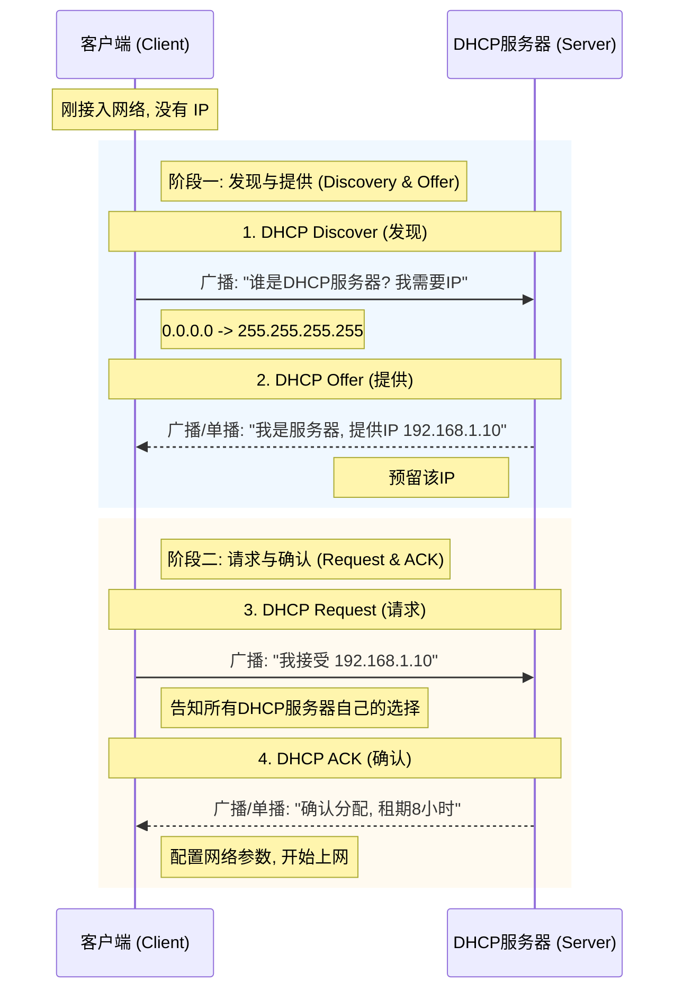
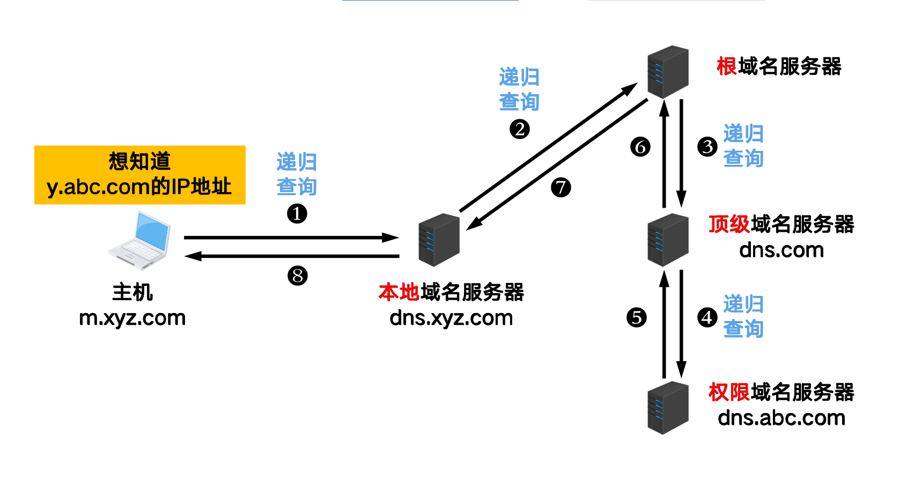
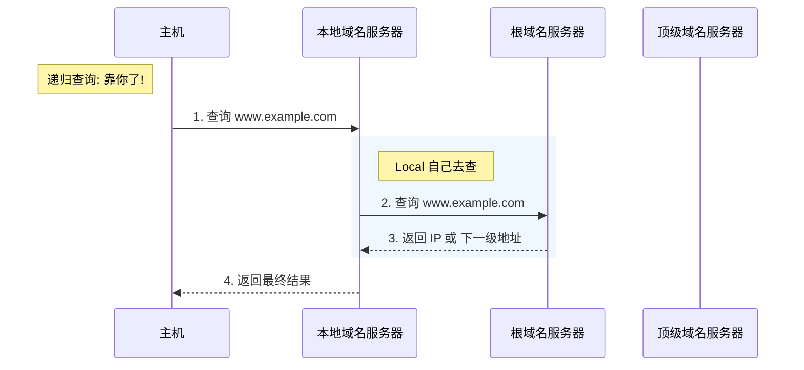
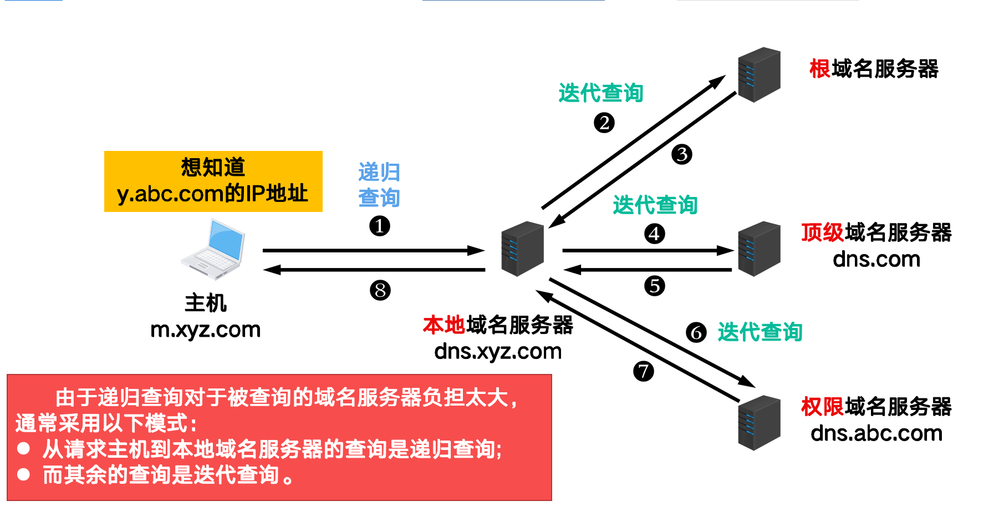
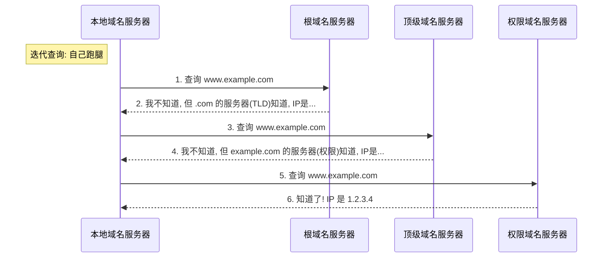
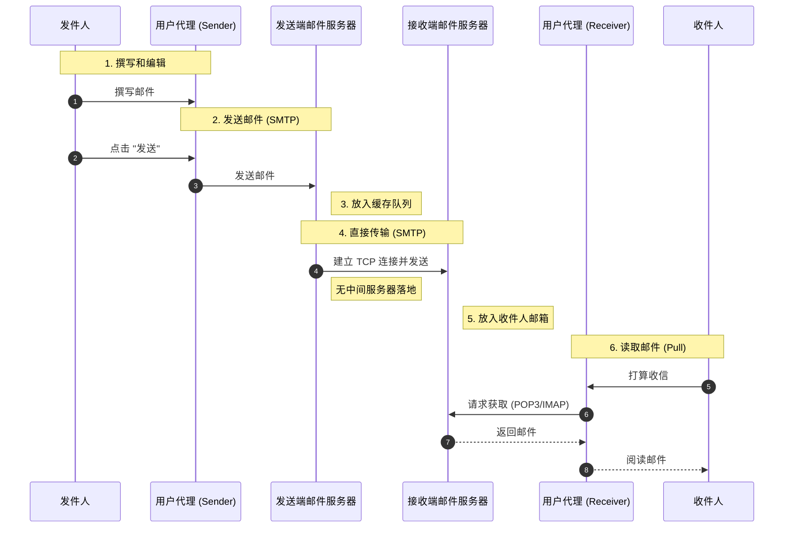

# 应用层

我们不妨重新回顾一下网络中各层的作用:

| 分层 | 数据单位 | 主要作用 | 典型设备/协议 |
| :--- | :--- | :--- | :--- |
| **应用层** (Application) | 报文 (Message) | 为应用程序提供服务, 处理业务逻辑 | HTTP, DNS, SMTP |
| **运输层** (Transport) | 报文段 (Segment) / 用户数据报 (Datagram) | **进程到进程 (Port-to-Port)** 的通信, 提供通用数据传输服务 | TCP, UDP |
| **网络层** (Network) | 分组 (Packet) | **主机到主机 (Host-to-Host)** 的通信, 路由选择, 分组转发 | IP, 路由器 |
| **数据链路层** (Data Link) | 帧 (Frame) | **点到点 (Node-to-Node)** 的通信, 链路管理, 差错检测 | 以太网, 交换机 |
| **物理层** (Physical) | 比特 (Bit) | 透明传输比特流 | 网线, 光纤, 集线器 |


## P2P 通信

在P2P通讯中,没有明确的服务器与客户端的划分,每个节点既可以作为服务器也可以作为客户端

其优点表现于:

1. 减轻了服务器的压力

2. 降低了网络的复杂度

3. 可拓展性强

## 动态主机配置协议

**动态主机配置协议 (DHCP, Dynamic Host Configuration Protocol)** 是目前广泛使用的协议，它提供了一种即插即用的连网机制，允许计算机自动获取 IP 地址等网络配置信息。

### 核心功能

*   **自动分配 IP 地址**: 避免手动配置的繁琐和冲突。

*   **分配其他网络参数**: 子网掩码、默认网关、DNS 服务器地址等。

*   **地址重用**: 使用租约机制，IP 地址可以被回收和重新分配。

### 工作流程 (4个步骤)

DHCP 的交互过程通常被称为 **DORA** (Discover, Offer, Request, Acknowledge)。

1.  **DHCP Discover (发现)**: 
    *   **客户端 -> 广播**: "谁有多余IP?"
    *   因为客户端还没 IP，所以使用 UDP 广播发送 (源IP 0.0.0.0, 目的IP 255.255.255.255, 目的端口 67)。

2.  **DHCP Offer (提供)**:
    *   **服务器 -> 广播/单播**: "我是 DHCP 服务器，我可以给你这个 IP (例如 192.168.1.100)。"

    *   服务器会预留这个 IP，不再分给别人。

3.  **DHCP Request (请求)**:
    *   **客户端 -> 广播**: "我收到了你的 Offer，我就要这个 IP 了 (192.168.1.100)！"

    *   **为什么还是广播?**: 为了告诉 **所有** DHCP 服务器 (如果有多个)，它选择了哪一个服务器的 Offer。其他未被选中的服务器就可以撤销预留的 IP 了。

4.  **DHCP ACK (确认)**:
    *   **服务器 -> 广播/单播**: "好的，IP 正式分配给你，租期是 8 小时。这是你的掩码、网关和 DNS。"

    *   客户端收到 ACK 后，才可以正式使用该 IP。

<div style="text-align: center;">
    
    <br>
    <caption>DHCP 交互过程</caption>
</div>



## 域名系统
> 域名通过DNS服务器解析为IP地址

### 域名结构

因特网采用了 **层次树状结构** 的命名方法。任何一个连接在因特网上的主机或路由器，都有一个唯一的层次结构的名字，即域名(Domain Name)。

**语法规则**:

1.  **标号 (Label)**:
    *   域名由 **点 (dot)** 分隔开的多个标号组成。例如 `www.example.com`。
    *   标号只能包含 **字母**, **数字** 和 **连字符(-)**。
    *   **不区分大小写** (比如 `CNN.com` 和 `cnn.com` 是一样的)。
    *   每个标号不超过 **63** 个字符。

2.  **长度限制**:
    *   完整的域名不超过 **255** 个字符。

3.  **层级顺序**:
    *   级别最低的标号写在最左边，级别最高的写在最右边。

**域名的层级**:

*   **根域名 (Root Domain)**: 树的顶端，用 `.` 表示 (通常省略不写)。
*   **顶级域名 (TLD, Top-Level Domain)**:
    *   **国家顶级域名 (nTLD)**: `.cn`, `.us`, `.uk` 等。

    *   **通用顶级域名 (gTLD)**: `.com`, `.net`, `.org`, `.edu`, `.gov` 等。

*   **二级域名 (Second-Level Domain)**: 注册在顶级域名之下的域名，例如 `baidu.com` 中的 `baidu`。

*   **三级域名 (Third-Level Domain)**: 例如 `tieba.baidu.com` 中的 `tieba`。


### 域名服务器

域名服务器可分为**根域名服务器**、**顶级域名服务器**、**权限域名服务器**和**本地域名服务器**。

1. **根域名服务器 (Root DNS Server)**:

    *   路由器将用户的请求转发到最近的根域名服务器。

    *   根域名服务器返回顶级域名服务器的IP地址。

2. **顶级域名服务器 (Top-Level DNS Server)**:

    *  可能返回最后的IP地址,也可能返回权限域名服务器的IP地址。

    * 管理在该顶级域名下的二级域名。

3. **权限域名服务器 (Authoritative DNS Server)**:

    *  每一个主机的域名都必须在某个权限域名服务器处注册登记。

    *  返回最后的IP地址。

4. **本地域名服务器 (Local DNS Server)**:
> 和上面三者不属于一个结构

    *  本地域名服务器将域名解析为IP地址。

    *  如果本地域名服务器没有该域名的解析结果,则将请求转发到根域名服务器。

### 域名解析

#### 递归查询 (Recursive Query)

**核心思想**: 查询请求 **"托付"** 给下一级服务器。

*   主机向本地域名服务器的查询一般都是 **递归查询**。
*   如果本地域名服务器不知道被查询域名的 IP 地址，那么 **本地域名服务器** 就以 DNS 客户的身份，向其他根域名服务器发出查询请求，报文使用 UDP。
*   **特点**: 被查询的服务器必须给出最终的查询结果（IP 地址或报错），即 **"要么给结果，要么你自己去查然后给我结果"**。

<div style="text-align: center;">
    
    <br>
    <caption>递归查询示意图</caption>
</div>



#### 迭代查询 (Iterative Query)

**核心思想**: **"自力更生"**。

*   本地域名服务器向根域名服务器查询。

*   根域名服务器告诉本地域名服务器: "我不知道具体的 IP，但你可以去问问顶级域名服务器 (比如 .com 那个)，这是它的 IP"。

*   本地域名服务器这就跑去问顶级域名服务器。

*   顶级域名服务器告诉本地域名服务器: "我不知道具体的 IP，但你可以去问问权限域名服务器 (比如 example.com 那个)，这是它的 IP"。

*   本地域名服务器这就跑去问权限域名服务器。

*   权限域名服务器告诉本地域名服务器: "我知道了! IP 是 1.2.3.4"。

*   本地域名服务器告诉主机: "我知道了! IP 是 1.2.3.4"。

*   **特点**: **指路不带路**。每次查询得到的都是 **"下一级是谁"**，而不是最终结果 (除非到了最后一步)。

<div style="text-align: center;">
    
    <br>
    <caption>迭代查询示意图</caption>
</div>



## 文件传输协议 (FTP)

**文件传输协议 (FTP)** 是互联网上使用最广泛的文件传输协议。它使用 **TCP** 服务, 是一种 **有状态** 的协议。

!!! note "核心特点: 双连接模式"
    FTP 的一个显著特点是它使用 **两个并发的 TCP 连接**:
    
    1.  **控制连接 (Control Connection)**:
        *   端口: **21**
        *   生命周期: 贯穿整个会话期间 (Persistent)。
        *   作用: 传输控制命令 (如登录用户名、密码、改变目录 `CWD`、获取列表 `LIST` 等)。
    
    2.  **数据连接 (Data Connection)**:
        *   端口: **20** (主动模式下)
        *   生命周期: **非持久** (Non-persistent)。每传输一个文件, 就建立一个新的数据连接, 传输完毕后关闭。
        *   作用: 实际传输文件内容。
        
    > 实际上,FTP协议等实现和我们实验6的内容十分相似,都是由主进程来监听客户的连接,一旦有连接,创建子进程来处理

### FTP 的两种传输模式

数据连接的建立有两种模式, 主要区别在于 **谁主动发起连接**。

!!! info "主动模式 (Active Mode / PORT)"
    > 服务器连接客户端的20端口
    
    *   **原理**: 客户端监听一个随机端口 $N$, 并命令服务器 "来连我的端口 $N$"。服务器收到后, 从端口 **20** 发起连接去连客户端。

    *   **弊端**: 容易被客户端的防火墙拦截 (因为是外部试图连入内部)。

!!! success "被动模式 (Passive Mode / PASV)"
    > 客户端连接服务器的随机端口

    *   **原理**: 客户端命令服务器 "进入被动模式"。服务器开启一个随机端口 $P$, 并通知客户端 "我的端口是 $P$"。客户端主动发起连接去连服务器的端口 $P$。
    
    *   **优势**: 对客户端防火墙友好 (因为是客户端发起的出站连接)。**现代 FTP 客户端默认为被动模式。**

!!! warning "有状态 (Stateful)"
    FTP 服务器必须维护用户的状态信息 (如当前工作目录、用户账户关联)。这限制了服务器同时支持的用户数量 (可拓展性较差)。

## 电子邮件 (Electronic Mail)

电子邮件系统主要由三个主要构件组成: **用户代理 (User Agent)**、**邮件服务器 (Mail Server)** 和 **邮件传输协议**。

**过程简述**: 发送方推给服务器 (SMTP), 服务器推给服务器 (SMTP), 接收方从服务器拉取 (POP3/IMAP)。



### 邮件协议概览

| 协议 | 全称 | 端口 | 作用 | 类型 |
| :--- | :--- | :--- | :--- | :--- |
| **SMTP** | Simple Mail Transfer Protocol | **25** | 发送邮件: <br>1. 用户 -> 发送方服务器 <br>2. 发送方服务器 -> 接收方服务器 | **推 (Push)** |
| **POP3** | Post Office Protocol v3 | **110** | 接收邮件: <br>接收方服务器 -> 用户 | **拉 (Pull)** |
| **IMAP** | Internet Mail Access Protocol | **143** | 接收邮件: <br>接收方服务器 -> 用户 | **拉 (Pull)** |

### 通用互联网邮件扩充 (MIME)

由于 SMTP 最初设计时只能传输 **7-bit ASCII** 文本, 无法直接传输非英语字符、二进制文件 (图片、视频) 等。**MIME (Multipurpose Internet Mail Extensions)** 协议解决了这个问题。

*   **作用**: MIME 在用户代理 (UA) 处将非 ASCII 数据 (如中文、图片) 转换为 ASCII 格式, 再交给 SMTP 传输。接收方收到后再还原。
*   **不取代 SMTP**: MIME 是 SMTP 的补充, 并不是取代 SMTP。

!!! abstract "MIME 头部字段"
    MIME 增加了一些新的邮件首部字段来描述数据内容:
    
    *   `MIME-Version`: MIME 版本。
    *   `Content-Type`: 数据类型 (如 `text/html`, `image/jpeg`).
    *   `Content-Transfer-Encoding`: 编码方式 (如 `Base64` 用于将二进制转为 ASCII).

### SMTP (简单邮件传输协议)

SMTP 用于将邮件从发送方的邮件服务器传输到接收方的邮件服务器。

!!! summary "SMTP 关键点"
    *   **推协议 (Push Protocol)**: 发送方主动发起连接。
    *   **ASCII 命令**: 所有命令和响应都是 7-bit ASCII 文本 (这也是为什么需要 MIME 来传输非文本数据)。
    *   **持久连接**: SMTP 一般使用持久连接。
    *   **交互过程**: 
        1.  握手 (Handshaking)
        2.  报文传输 (Transfer of messages)
        3.  关闭 (Closure)

### POP3 vs IMAP (邮件访问协议)

当邮件到达接收方的邮件服务器后, 用户代理 (UA) 需要使用拉协议 (Pull Protocol) 将邮件取回。

!!! failure "不能用 SMTP 取邮件"
    SMTP 是推协议, 也就是 "我要给你东西"。也就是用户不能命令服务器 "把我的邮件推给我", 而是需要自己去 "拉"。

#### POP3 (邮局协议)
*   **简单**: 功能有限。
*   **工作模式**:
    *   **下载并删除 (Download and Delete)**: 邮件一旦下载到本地, 服务器上就删除了。
    *   **下载并保留 (Download and Keep)**: 允许在服务器上保留副本。
*   **无状态 (Stateless)**: POP3 服务器在会话之间通常不保留状态信息 (除了邮件本身)。

#### IMAP (因特网邮件访问协议)
*   **复杂 & 强大**: 允许用户在服务器上组织邮件。
*   **在以服务器为中心的模式**: 邮件一直保存在服务器上, 用户可以在不同设备上看到一致的文件夹状态。
*   **主要功能**:
    *   创建/删除/重命名服务器上的文件夹。
    *   只下载邮件头 (Header),以此决定是否下载正文。
    *   **有状态 (Stateful)**: 服务器必须维护目录结构和邮件状态 (已读/未读/红旗等)。

!!! tip "比较 POP3 和 IMAP"
    如果你只在一个设备上看邮件, POP3 够用了。
    如果你既在手机看, 又在电脑看, 还需要同步 "已读" 状态和文件夹, 必须用 **IMAP**。


## 万维网
> 万维网中,所有资源通过**统一资源定位符(URL)**来定位,并通过**超文本传输协议(HTTP)**来传输。
>
> 直白的说,www=URL+HTTP+HTML

### 统一资源定位符 (URL)

URL 是用来标识互联网上资源位置的字符串。

**一般形式**: `<协议>://<主机>:<端口>/<路径>`
*   `协议`: 如 `http`, `ftp`.
*   `主机`: 域名或 IP 地址.
*   `端口`: 可省略 (HTTP 默认为 80).
*   `路径`: 资源在服务器上的具体位置.

### 超文本传输协议 (HTTP)

HTTP 是一个 **无状态 (Stateless)** 的协议。服务器不保留客户端的历史请求记录。

*   **Cookie**: 为了解决无状态带来的业务困难 (如购物车、登录状态), 引入了 Cookie 技术在客户端保存状态。

#### HTTP 连接方式

1.  **非持久连接 (Non-persistent)** (HTTP/1.0):
    *   每请求一个对象 (如一张图片), 都要新建一个 TCP 连接。
    *   开销大, 效率低。

2.  **持久连接 (Persistent)** (HTTP/1.1):
    *   **流水线方式 (Pipelined)**: 默认. 客户端可以以此发送多个请求, 不必等待响应。
    *   **非流水线方式**: 客户收到前一个响应才能发下一个请求。

#### HTTP 报文格式

HTTP 报文是面向文本的。

!!! note "请求报文 (Request)"
    由 **请求行 (Request Line)**、**首部行 (Headers)** 和 **实体主体 (Body)** 组成。
    
    ```http
    GET /index.html HTTP/1.1      <-- 请求行: 方法 URL 版本
    Host: www.example.com         <-- 首部行: 键值对
    User-Agent: Mozilla/5.0
    Connection: keep-alive        <-- `Connection: keep-alive` 表示持久连接,若为`close`则表示非持久连接
                                  <-- 空行 (CRLF)
    (Body: GET方法通常为空)        <-- 实体主体
    ```

!!! note "响应报文 (Response)"
    由 **状态行 (Status Line)**、**首部行 (Headers)** 和 **实体主体 (Body)** 组成。
    
    ```http
    HTTP/1.1 200 OK               <-- 状态行: 版本 状态码 短语
    Date: Tue, 01 Jan 2024...     <-- 首部行
    Content-Type: text/html
    Content-Length: 1234
                                  <-- 空行 (CRLF)
    <html>...</html>              <-- 实体主体: 请求的文件内容
    ```

#### 常用方法 (Methods)
*   `GET`: 请求读取由 URL 所标识的信息 (最常用)。
*   `POST`: 向服务器提交数据 (如表单提交)。
*   `HEAD`: 请求读取由 URL 所标识的信息的首部 (不返回主体, 用于测试文件是否存在/修改时间)。
*   `PUT`: 上传文件。
*   `DELETE`: 删除资源。

#### 状态码 (Status Codes)
*   **2xx (成功)**: `200 OK` (请求成功)。
*   **3xx (重定向)**: `301 Moved Permanently` (永久移动)。
*   **4xx (客户端错误)**: `400 Bad Request` (请求语法错误), `404 Not Found` (找不到资源)。
*   **5xx (服务器错误)**: `500 Internal Server Error` (服务器内部故障), `502 Bad Gateway` (网关错误)。

### 超文本标记语言 (HTML)
HTML 是一种标记语言 (Markup Language), 使用标签 (Tag) 来描述网页的结构和内容。

- HTML:描述网页上有什么

- CSS:描述网页上怎么显示

- JS:描述网页上怎么交互