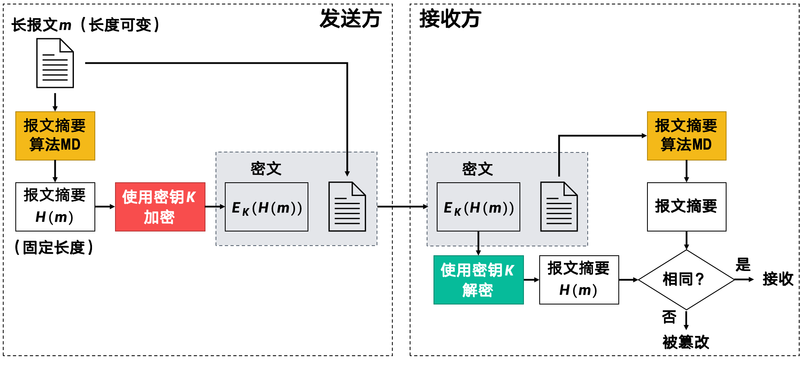
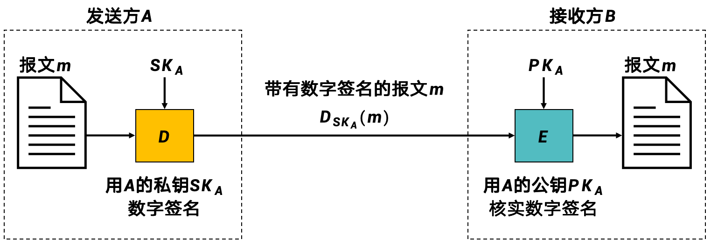
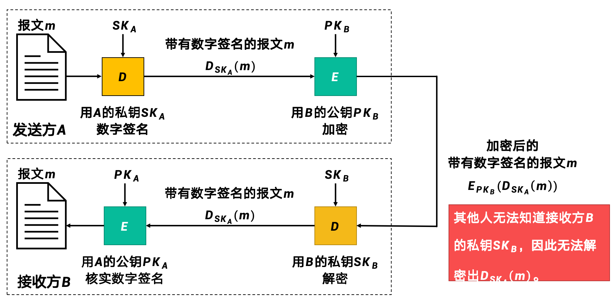
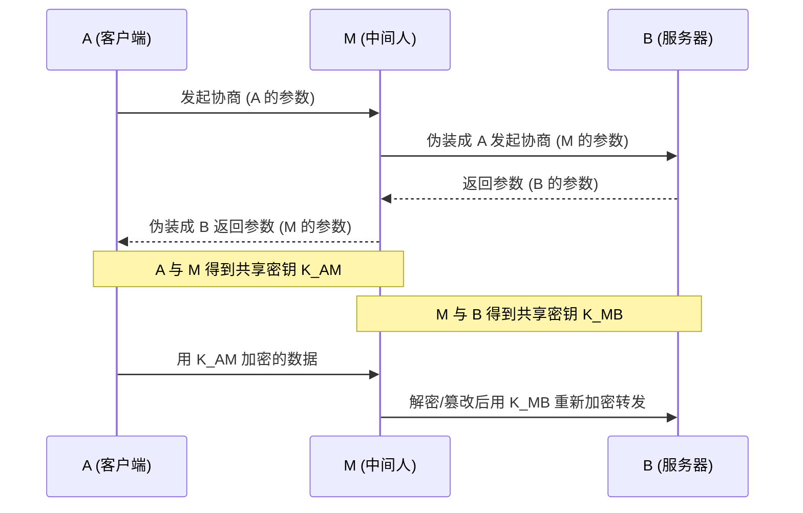
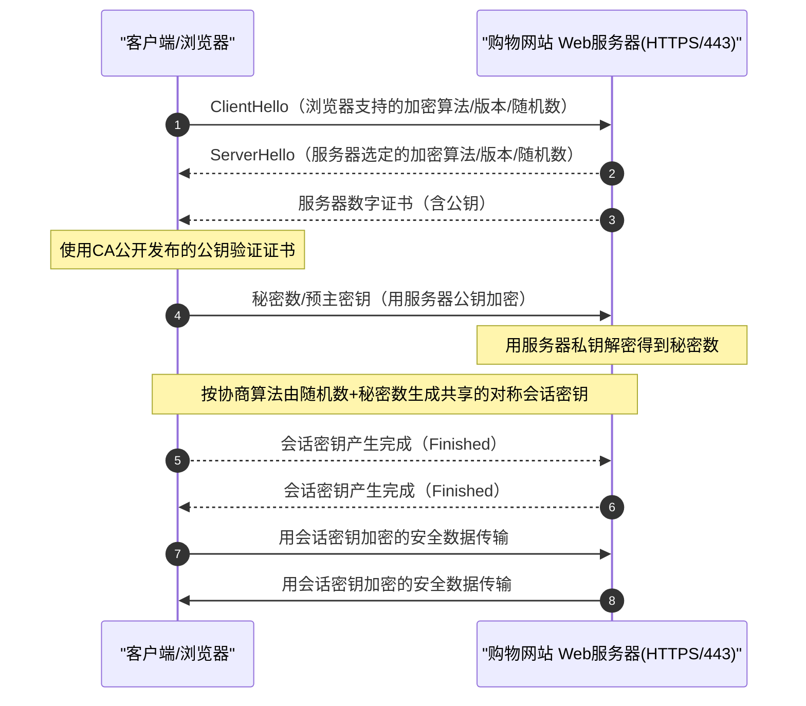

# 网络安全

- 被动攻击:攻击者仅窃听数据包,不篡改数据包

- 主动攻击:攻击者篡改数据包

> 被动攻击很难检测,只能通过数据加密的方法

## 密码学

!!! definition "相关概念"
    === "Plaintext"
        即明文,未加密的数据

    === "Ciphertext"
        即密文,加密后的数据

    === "Encryption/Decryption"
        加密/解密

    === "Key"
        密钥.密钥是用来进行加密与解密的.加密和解密的密钥可以相同,也可以不同,这区分了对称加密和非对称加密.

无条件安全的密码体制也被称为理论上不可破的,如果攻击者不管截取了多少数据,都无法破解密码体制.

然而,在实际中,无条件安全的密码体制是不存在的.因此,我们提出了计算上是安全的,如果密码不能在一定时间内被可使用的计算资源破解,那么这个密码体制就是计算上安全的.

### 对称密钥密码体制

#### 数据加密标准 (DES)

**DES (Data Encryption Standard)** 是一种传统的对称密钥加密算法。

*   **分组**: 将明文分为 **64位** 的分组进行加密。
*   **密钥**: 实际上只有 **56位** 有效 (64位中每8位有1位奇偶校验)。
*   **安全性**: 由于密钥过短, 现代计算机可以轻易暴力破解 DES。**不再安全**。
*   **3DES**: 为了延长 DES 的寿命, 使用三个密钥进行三次加密 (加密-解密-加密), 称为 3DES。但效率低下。

#### 高级加密标准 (AES)

**AES (Advanced Encryption Standard)** 是目前广泛使用的替代 DES 的标准。

*   **分组**: 固定为 **128位**。
*   **密钥长度**: 支持 **128位**、**192位** 和 **256位**。
*   **效率与安全**: 比 DES 快, 且目前没有已知的有效攻击方法 (除了暴力穷举, 但密钥空间巨大)。
*   **原理**: 不再使用 Feistel 结构, 而是基于代数结构的替换-置换网络 (SPN)。

!!! summary "DES vs AES"
    | 特性 | DES | AES |
    | :--- | :--- | :--- |
    | **年代** | 1977 (老旧) | 2001 (现代) |
    | **密钥长度** | 56 bit (太短) | 128/192/256 bit (安全) |
    | **安全性** | 不安全 (可暴力破解) | 非常安全 |
    | **效率** | 慢 (软硬件实现较难) | 快 (软硬件支持好) |

### 公钥密码体制

加密双方共享密钥的机制带来了一个很大的问题,如何保证加密双方持有同样有效的密钥情况下,保证密钥的有效性?这给密钥的管理和分发带来了很大不便

因此,公钥密码体制应运而生.加密密钥(即公钥,PK),加密算法和解密算法都是公开的,而解密密钥(即私钥,SK)则需要保密

#### RSA 算法

**RSA** 是目前最著名的公钥密码体制。

*   **核心原理**: 基于 **大整数因子分解** 的困难性。
    *   选取两个极大的素数 $p$ 和 $q$, 计算 $N = p \times q$。
    *   公开 $N$, 但要从 $N$ 分解出 $p$ 和 $q$ 是极难的。
*   **密钥对**:
    *   **公钥 ($PK$)**: $(N, e)$ -> 公开给所有人。
    *   **私钥 ($SK$)**: $(N, d)$ -> 自己保密。
*   **加密与解密**:
    *   加密: $C = M^e \pmod N$
    *   解密: $M = C^d \pmod N$

### 报文认证码

如果发送的内容被攻击者篡改,那么接收方可能收到错误的信息.

因此,我们希望对报文进行认证,以确保报文的完整性和真实性.

然而,有许多内容不需要保密,只需要验证是否与发送方一致,比如从网站上下载软件,我们只需要验证软件的来源是否可信,而不需要对软件进行加密.

在这种情况下,如果对整个软件的内容进行加密和解密,无疑会增加软件的复杂度,降低软件的性能,因此,我们提出了报文认证码.

总的来说,就是用某种算法从报文中提取出报文摘要,然后发送方加密报文摘要,接收方解密报文摘要,并用解密后的报文摘要和报文进行比较,如果一致,则说明报文未被篡改.

    
     
    <caption>报文认证码工作原理</caption>

加密后的报文鉴别码简写为MAC(MAC = Message Authentication Code)

#### 密码散列函数

密码散列函数(Password Hash Function)是单向函数,即无法从散列值反推出原始密码.

为了防止被破解,报文摘要算法必须满足以下特征

1.  **抗弱碰撞性 (Weak Collision Resistance)**:
    对于任意给定的某个报文摘要值 $H(x)$, 若想找到一个报文 $y$ ($y \neq x$) 使得 $H(y)=H(x)$, 在计算上是不可行的。

    > 也就是说, 你无法伪造另一个报文来替代现在的报文。

2.  **抗强碰撞性 (Strong Collision Resistance)**:
    若想找到任意两个报文 $x$ 和 $y$ ($x \neq y$), 使得 $H(y)=H(x)$, 在计算上是不可行的。

    > 也就是说, 你无法找到任意两个具有相同摘要的报文 (生日攻击防护)。

#### MD5 与 SHA-1

*   **MD5**: 128位摘要。已**被证明不安全** (容易通过碰撞攻击找到两个不同的报文产生相同的摘要)。
*   **SHA-1**: 160位摘要。已**不再推荐使用** (被Google/CWI破解)。
*   **SHA-2 / SHA-3**: 目前推荐使用的标准 (如 SHA-256)。

#### 散列报文鉴别码 (HMAC)

基于散列函数特殊的性质,有时候我们并不需要对报文摘要再作一次加密.

**HMAC (Keyed-Hash Message Authentication Code)** 引入了 **密钥**。

*   **原理**: $HMAC = H(K, M)$
    *   $H$: 散列函数 (如 MD5, SHA-256)。
    *   $K$: 通信双方共享的密钥。
    *   $M$: 原始报文。

*   **作用**: 同时验证 **完整性 (Integrity)** (没被改过) 和 **真实性 (Authenticity)** (是持有密钥的人发的)。

*   **安全性**: 即使攻击者截获了报文和 HMAC, 由于不知道密钥 $K$, 无法伪造合法的 HMAC。

    
     
    <caption>HMAC工作原理</caption>

### 数字签名
> 类似我们生活中的印章

数字签名需要具备如下性质:

1. 接受方能够核实发送方的数字签名

2. 任何人都无法伪造数字签名

3. 发送方不能抵赖数字签名

数字签名的原理如下:

$$
D_{SK}(E_{PK}(X)) = E_{PK}(D_{SK}(X)) = X
$$

> 这意味着, 无论是 **先加密后解密** (保密通信), 还是 **先解密后加密** (数字签名), 都能还原出原始报文。

    
     
    <caption>数字签名工作原理</caption>

上述过程存在一个问题,那就是任何人截获到加密后的报文,只要知道A的公钥,就能窃取出内容.

为了实现保密的数字签名,我们只需要在使用A的私钥加密完后,再使用B的公钥加密即可.这样,解密时就要先使用B的私钥解密,再使用A的公钥解密,才能还原出原始报文.

    
     
    <caption>保密的数字签名</caption>

### 实体鉴别

**实体鉴别 (Entity Authentication)** 和 **报文鉴别 (Message Authentication)** 是有区别的:

*   **报文鉴别**: 对每一个收到的报文进行验证 (内容没变? 是你发的?)。

*   **实体鉴别**: 在连接建立阶段, 验证**通信对方**的身份 (你是谁?)。

#### 重放攻击 (Replay Attack)

攻击者截获 A 发送给 B 的身份验证报文，虽无法解密，但可以直接把这个报文重新发给 B，试图以此冒充 A。

#### 不重数 (Nonce)

为了防止重放攻击, 实体鉴别通常采用 **挑战-响应 (Challenge-Response)** 机制，并引入 **不重数 (Nonce)**。

*   **不重数**: 一个只使用一次的大随机数。
*   **过程**:
    1.  A -> B: "我是 A"
    2.  B -> A: "好, 请加密这个随机数 $R_B$ (Nonce)"
    3.  A -> B: "这是用我私钥加密的 $R_B$"
    4.  B: 解密验证成功 -> "你确实是 A"

> 这样，即使攻击者截获了第三步的加密报文，下次 B 会生成一个新的随机数 $R'_B$，以前的加密报文就没用了。

#### 中间人攻击（MITM）

**中间人攻击（Man-in-the-Middle, MITM）** 指攻击者位于通信双方之间，分别与两端建立连接，使双方“以为”自己在和对方直接通信，但实际上所有数据都经过攻击者转发（并可能被**窃听/篡改/注入**）。

典型例子：未认证的密钥交换会被 MITM

仅“加密”并不能自动防 MITM，关键在于：**你加密的对象是不是你以为的那个人**。

结果是：A 和 B 都以为得到了“对方”的会话密钥，但实际上密钥分别和 M 共享，M 可以全程明文查看与修改数据。

### 密钥分发

对称密码体制中，通信双方需要共享同一把密钥；因此“**如何安全地让双方拿到同一把密钥**”是网络安全的基础问题之一。密钥分发做不好，就会给 MITM、重放、冒充等攻击留下入口。

1. 对称密钥的分发

    依赖于KDC(密钥分发中心)来为通信双方生成并分发会话密钥。

2. 非对称密钥的分发

    
    - 公钥的分发

        - 尽管公钥是可以公开的,但是如果不验证公钥背后的组织,那么就容易发生中间人攻击等.

        - 因此,需要 **CA (Certification Authority, 认证中心)** 来为公钥颁发一个证书, 标识公钥所属的组织。

**CA 签发证书的过程**:

1.  **核实身份**: CA 必须核实申请用户的真实身份。

2.  **生成密钥**: CA 为用户产生 **公钥-私钥对**, 并生成证书 (包含用户公钥、身份信息等)。

3.  **数字签名**: CA 用 **自己的私钥** 对证书进行数字签名 (防止证书被伪造)。

4.  **发布证书**: 证书可以通过网络发送, 也可以放在公共服务器供下载。

!!! danger
    1.  **私钥保护**: CA 为用户产生的 **私钥**, 必须由 **用户自己** 秘密保存。

    2.  **CA 公钥**: 任何人都可以从可信地方 (如系统预置、权威渠道) 获取 **CA 自身的公钥**。用这个公钥来验证证书的真伪 (验证 CA 的签名)。

> 所有用户信任顶级的根CA,但可以选择不信任中间CA.

## 访问控制

**访问控制 (Access Control)** 用于限制谁（主体）可以对什么（客体）进行什么样的操作（读/写/执行）。常见的策略有三种：

1.  **自主访问控制 (DAC - Discretionary Access Control)**
    *   **核心**: **资源的拥有者** 决定谁可以访问。

    *   **特点**: 灵活但安全性较低。如果拥有者把权限给了一个恶意用户，恶意用户可以把权限再转给别人。

    *   **例子**: Linux 文件系统 (`chmod 755 file`), 社交网络隐私设置。

2.  **强制访问控制 (MAC - Mandatory Access Control)**
    *   **核心**: **系统管理员** 制定统一的安全策略，用户不能改变。系统根据用户的**安全级别** (如绝密、机密) 和资源的**密级**标签来决定访问权限。

    *   **特点**: 安全性极高，但灵活性差，管理复杂。

    *   **规则示例**: “上读下写” (No Read Up, No Write Down) —— 低密级用户不能读高密级文件，高密级用户不能写低密级文件 (防止泄密)。

    *   **例子**: 多级安全数据库，军事系统 (SELinux)。

## 各层安全协议

网络安全不仅仅是某个单一层面的问题，而是贯穿于网络模型的各个层次。

### 1. 物理层 (Physical Layer)

*   **物理隔离**: 对于极高安全需求的网络 (如军网), 实行物理上的断网 (Air Gap)。

*   **扩展频谱 (Spread Spectrum)**: 如跳频技术 (FHSS) 和直接序列扩频 (DSSS), 用于防止通信被窃听和干扰 (抗干扰能力强)。

### 2. 数据链路层 (Data Link Layer)

*   **802.1X**: 基于端口的网络访问控制。在用户认证通过前，交换机端口只允许 EAPOL 认证流量通过。

*   **无线安全**:
    *   **WPA2/WPA3**: Wi-Fi 安全协议。WPA3 引入了 **SAE (对等实体同时验证)** 取代了 WPA2 的四次握手，防止离线字典攻击。

*   **VLAN**: 虚拟局域网，通过逻辑隔离广播域来提高安全性。

### 3. 网络层 (Network Layer) - IPSec

**IPSec (IP Security)** 是一组协议，用于在 IP 层提供安全性 (支持 IPv4 和 IPv6)。

*   **两大协议**:
    *   **AH (Authentication Header)**: 鉴别首部。只提供 **源点鉴别** 和 **数据完整性**，**不提供加密** (内容是明文的)。
    *   **ESP (Encapsulating Security Payload)**: 封装安全有效载荷。提供 **所有功能** (鉴别、完整性、**机密性/加密**)。*现在主要用 ESP*。

*   **两种模式**:
    *   **传输模式 (Transport Mode)**: 主机到主机 (End-to-End)。只加密 IP 载荷，IP 头部不加密。
    *   **隧道模式 (Tunnel Mode)**: 网关到网关 (Site-to-Site VPN)。加密整个原始 IP 数据包，并封装在一个新的 IP 头部中。

### 4. 传输层 (Transport Layer) - SSL/TLS

**SSL (Secure Sockets Layer)** 及其继任者 **TLS (Transport Layer Security)** 是目前应用最广泛的安全协议。

*   **位置**: 介于应用层 (HTTP) 和传输层 (TCP) 之间。`HTTP + SSL/TLS = HTTPS`。
*   **工作流程**:
    1.  **握手阶段 (Handshake)**: 协商加密算法, 交换随机数, **验证服务器证书**, 生成会话主密钥 (Master Secret)。
    
    2.  **记录阶段 (Record)**: 使用主密钥对应用层数据进行对称加密传输。

### 5. 应用层 (Application Layer) - PGP

*   **PGP (Pretty Good Privacy)**: 是一种用于电子邮件加密和签名的标准。

*   **信任模型**: PGP 不依赖单一的 CA 中心，而是使用 **Web of Trust (信任网)** 模型 (即 "我朋友信任他，那我也信任他")。

3.  **基于角色的访问控制 (RBAC - Role-Based Access Control)**

    *   **核心**: 权限分配给 **角色** (Role)，用户被分配到角色。

    *   **特点**: 简化了权限管理，适合大型企业。人员变动时，只需调整用户的角色，不需要逐个修改文件的权限列表。

    *   **例子**: 公司系统 (角色: 经理、员工、财务)。经理可以审批，员工只能提交。

