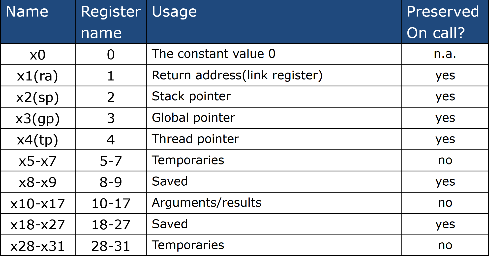

<script defer src="https://vercount.one/js"></script>

# Instructions: Language of the Machine

!!! info "参考"
    https://xuan-insr.github.io/computer_organization/2_instructions/

## 编译过程

### 机器码

使用`gcc -c xxx.c`命令获得

### 汇编语言

使用`gcc -S xxx.c`命令获得
```asm title="add.s"
.file   "add.c"
        .text
        .globl  add
        .type   add, @function
add:
.LFB0:
        .cfi_startproc
        endbr64
        pushq   %rbp
        .cfi_def_cfa_offset 16
        .cfi_offset 6, -16
        movq    %rsp, %rbp
        .cfi_def_cfa_register 6
        movl    %edi, -4(%rbp)
        movl    %esi, -8(%rbp)
        movl    -4(%rbp), %edx
        movl    -8(%rbp), %eax
        addl    %edx, %eax
        popq    %rbp
        .cfi_def_cfa 7, 8
        ret
        .cfi_endproc
.LFE0:
        .size   add, .-add
        .ident  "GCC: (Ubuntu 13.2.0-23ubuntu4) 13.2.0"
        .section        .note.GNU-stack,"",@progbits
        .section        .note.gnu.property,"a"
        .align 8
        .long   1f - 0f
```
### 高级编程语言

平时写的C语言之类。
``` c title="add.c"
int add(int a,int b){
    return a+b;
}
```

---

## 指令集操作

### 算术操作

在RISC-V中，每个指令只能有一个操作。
对于f=(g+h)-(i+j)

RISC-V Code:
```plaintext

add t0,g,h
add t1,i,j
sub f,t0,t1

```
!!! info "寄存器表"
    然而在指令集中，其实没有我们所写的变量名，而是通过一个个寄存器来存储数据集。也就是：
    
    + Load values from memory into registers  
    
    + Store result from register to memory
    

---

RISC-V是小端的，把低位数据放在低位地址里.
<span id="busuanzi_container_page_pv">本页总访问量<span id="busuanzi_value_page_pv"></span>次</span>
<span id="busuanzi_container_page_uv">本页总访客数 <span id="busuanzi_value_page_uv"></span> 人</span>