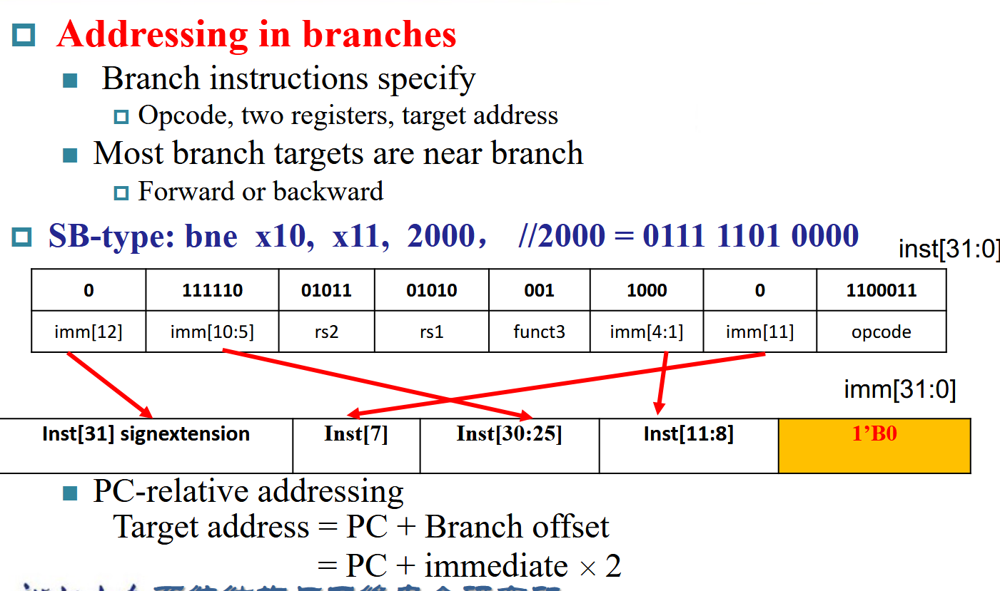

<script defer src="https://vercount.one/js"></script>

# Instructions: Language of the Machine

!!! info "参考"
    https://xuan-insr.github.io/computer_organization/2_instructions/

## 编译过程

### 机器码

使用`gcc -c xxx.c`命令获得

### 汇编语言

使用`gcc -S xxx.c`命令获得
```asm title="add.s"
.file   "add.c"
        .text
        .globl  add
        .type   add, @function
add:
.LFB0:
        .cfi_startproc
        endbr64
        pushq   %rbp
        .cfi_def_cfa_offset 16
        .cfi_offset 6, -16
        movq    %rsp, %rbp
        .cfi_def_cfa_register 6
        movl    %edi, -4(%rbp)
        movl    %esi, -8(%rbp)
        movl    -4(%rbp), %edx
        movl    -8(%rbp), %eax
        addl    %edx, %eax
        popq    %rbp
        .cfi_def_cfa 7, 8
        ret
        .cfi_endproc
.LFE0:
        .size   add, .-add
        .ident  "GCC: (Ubuntu 13.2.0-23ubuntu4) 13.2.0"
        .section        .note.GNU-stack,"",@progbits
        .section        .note.gnu.property,"a"
        .align 8
        .long   1f - 0f
```
### 高级编程语言

平时写的C语言之类。
``` c title="add.c"
int add(int a,int b){
    return a+b;
}
```

---

## 指令集操作

### 算术操作

在RISC-V中，每个指令只能有一个操作。
对于f=(g+h)-(i+j)

RISC-V Code:
```plaintext

add t0,g,h
add t1,i,j
sub f,t0,t1

```
!!! info "寄存器表"
    然而在指令集中，其实没有我们所写的变量名，而是通过一个个寄存器来存储数据集。也就是：
    
    + Load values from memory into registers  
    
    + Store result from register to memory
    

---

RISC-V是小端的，把低位数据放在低位地址里.

### R-Format 指令

!!! info "如图"
    
    ??? tip "解析"
        
        离opcode近的是rs1.图中指令的含义是add x9,x20.x21，即将x20,x21寄存器内的值相加赋予x9寄存器

### I-Format 指令
!!! info "如图"
    
    ??? tip "解析"
        
        !!! example "例子"
            ld x9,64(x22):

            + ld 表示加载双字（load doubleword），即从内存中加载一个64位的数据。
            + x9 是目标寄存器，表示加载的数据将被存储到寄存器 x9 中。
            + 64(x22) 表示从寄存器 x22 的值加上偏移量 64 所指向的内存地址中读取数据。

### S-Format 指令操作

!!! info "如图"
    
    ??? tip "解析"
        
        !!! example "例子"
            sd x9, 64(x22):
            
            + sd 表示存储双字（store doubleword），即将一个64位的数据从寄存器存储到内存中。
            + x9 是源寄存器，表示要存储的数据来自寄存器 x9。
            + 64(x22) 表示目标内存地址，由寄存器 x22 的值加上偏移量 64 计算得到。

### 汇总及练习

!!! note "汇总"
    === "初始版"
        
    === "详细版"
        
        
        提问：lh,lw,lb这些从内存中加载不足8字节的数据到64位寄存器中，空余的位数怎么办呢？
            ??? general "解"
                
    ??? example "例子"
        

---
**思考：这四条指令的RISC-V指令是什么？**

??? info "答案"
    === "ld"
        
    === "add"
        
    === "addi"
        
    === "sd"
        

### 其他指令


#### bne 和 beq 指令

在 RISC-V 指令集中，`bne` 和 `beq` 是两条常用的跳转指令，用于条件跳转。

- `bne` (Branch if Not Equal): 当两个寄存器的值不相等时跳转到指定的标签位置。
    ```plaintext
    bne x1, x2, label
    ```
    如果寄存器 `x1` 和 `x2` 的值不相等，则跳转到 `label` 位置继续执行。

- `beq` (Branch if Equal): 当两个寄存器的值相等时跳转到指定的标签位置。
    ```plaintext
    beq x1, x2, label
    ```
    如果寄存器 `x1` 和 `x2` 的值相等，则跳转到 `label` 位置继续执行。

这些指令在实现条件判断和循环控制时非常有用。

!!! info "循环实现"
    === "Loop"
        
        ??? tip "第一个指令的左移三位是什么意思呢？"
            图中注释有误，A应该是一个包含100个double words的数组，一个double words含八个字节，所以右移8位才能
            读出数组原来第i位的内容
    === "While"
        
#### 比较大小指令

 RISC-V提供了几种用于比较值的指令：


- `BEQ`（相等时跳转）：比较两个寄存器，如果它们相等则跳转。

- `BNE`（不相等时跳转）：比较两个寄存器，如果它们不相等则跳转。

- `BLT`（小于时跳转）：比较两个寄存器，如果第一个小于第二个则跳转。

- `BGE`（大于或等于时跳转）：比较两个寄存器，如果第一个大于或等于第二个则跳转。

- `BLTU`（无符号小于时跳转）：将两个寄存器作为无符号整数进行比较，如果第一个小于第二个则跳转。

- `BGEU`（无符号大于或等于时跳转）：将两个寄存器作为无符号整数进行比较，如果第一个大于或等于第二个则跳转。

这些指令用于根据寄存器值的比较来控制执行流程。

---

#### jalr指令
JALR（Jump And Link Register）是一种跳转指令，用于跳转到由寄存器指定的地址，并将返回地址存储在另一个寄存器中。具体来说，它的操作如下：

1.计算目标地址：目标地址是基地址寄存器的值加上一个立即数偏移量。

2.将返回地址（即下一条指令的地址）存储在目标寄存器中。

3.跳转到计算出的目标地址。

!!! example "例子"
    ```plaintext
    jalr x1, (4)x2
    ```

    这条指令将跳转到x2寄存器的值加上4的地址，并将返回地址存储在x1寄存器中。

---

##### 利用jalr指令实现switch函数

!!! note "解析"
    === "指令"
        
    === "图解"
        
    === "详解"
        

## 函数设计

一个函数设计应当有下面六步组成：

1. Place Parameters in a place where the procedure can access them  (where? function arguments (a0-a7))

2. Transfer control to the procedure:jump to  

3. Acquire the storage resources needed for the procedure  

4. Perform the desired task  

5. Place the result value in a place where the calling program can  access it (where?returned values (a0-a1) )  

6. Return control to the point of origin (how to find this? (ra))
### Step1,参数存储
在RISC-V中，参数存储主要涉及到八个用于传递参数和返回值的寄存器以及堆栈。

#### 八个参数寄存器

RISC-V架构中有八个专门用于传递函数参数和返回值的寄存器，分别是`a0`到`a7`。这些寄存器的使用规则如下：

- `a0`到`a7`：用于传递函数参数。如果参数超过八个，多余的参数需要通过堆栈传递。
- `a0`和`a1`：用于存储函数的返回值。

例如，假设有一个函数`foo`，它有三个参数并返回一个值：

```plaintext
int foo(int x, int y, int z);
```

在调用`foo`函数时，参数`x`、`y`和`z`会分别存储在寄存器`a0`、`a1`和`a2`中。函数返回时，返回值会存储在寄存器`a0`中。

#### 堆栈

当函数参数超过八个时，或者需要保存临时数据时，堆栈会被用来存储这些额外的信息。堆栈是一个后进先出（LIFO）的数据结构，通常由寄存器`sp`（堆栈指针）管理。

在函数调用过程中，堆栈的使用步骤如下：

1. **保存调用者的上下文**：在调用函数之前，调用者需要将一些寄存器的值保存到堆栈中，以便在函数返回后恢复这些值。
2. **传递额外的参数**：如果函数参数超过八个，多余的参数会被压入堆栈。
3. **保存被调用者的上下文**：被调用的函数可能需要使用一些寄存器，这些寄存器的原始值需要保存到堆栈中。
4. **函数返回**：函数执行完毕后，从堆栈中恢复寄存器的值，并返回到调用者。


!!! note "图解"
    
    ??? warning "sp到底指向哪里"
        经过课上激烈的讨论，sp应该指向栈顶数据的开头，所以图中sd ...,8(sp)应该为sd ...,0(sp)
例如，假设有一个函数`bar`，它有十个参数：

```plaintext
void bar(int a, int b, int c, int d, int e, int f, int g, int h, int i, int j);
```

在调用`bar`函数时，前八个参数`a`到`h`会存储在寄存器`a0`到`a7`中，而参数`i`和`j`会被压入堆栈。

#### 优化

在RISC-V中，寄存器的使用分为临时寄存器和保存寄存器两类：

- `t0` 到 `t6`：7个临时寄存器，由被调用者（callee）不需要保存。如果函数使用了这些寄存器，不需要在函数返回前恢复它们的值。
- `s0` 到 `s11`：12个保存寄存器，必须由被调用者保存。如果函数使用了这些寄存器，必须在函数返回前恢复它们的值。

!!! info "32个寄存器"
    

### Step2，调用函数
使用指令
```plaintext
jal x1, ProcedureAddress
```

### Step6,函数返回
使用指令
```plaintext
jalr x0, 0(x1)
```
!!! tips "x0"
    Use x0 as rd (x0 cannot be changed)

## 重点详解之递归指令

!!! example "阶乘为例"
    === "C语言"
        
    === "RISC-V码"
        
    接下来是对于这段RISC-V码的具体解析，由于递归理解起来比较难，我将以fact(3)的计算为例，进行解释。
    ??? general "解析"
        === "Step1"
            **调用fact(3)**
            
            参数 n = 3 存储在寄存器 `a0（x10）`。
        === "Step2"

            **调整栈空间：**

            ```riscv
            addi sp, sp, -16  # 分配16字节的栈空间

            sd ra, 8(sp)      # 保存返回地址 ra

            sd a0, 0(sp)      # 保存参数 n (即 a0 = 3)
            ```

            这一步是：

            + 将栈指针 `sp` 下移 16 字节（空出位置存放局部变量）。

            + 保存返回地址 `ra（x1）`到栈中（`sp+8`）。

            + 将参数 `n = 3 `保存到栈中的 `sp+0` 位置。
        === "Step3"

            **判断 n 是否大于等于 1**

            ```riscv
            addi t0, a0, -1   # t0 = n - 1 = 3 - 1 = 2

            bge t0, zero, L1  # 如果 n >= 1，跳到 L1 继续执行
            ```

            这一步是：

            + 将 `n - 1 `的结果（2）存入寄存器 `t0`。

            +  判断 `t0 >= 0`，因为 `2 >= 0`，所以跳转到标签` L1`。
        === "Step4"
            **递归调用 `fact(2)`**

            ```riscv
            L1: addi a0, a0, -1  # a0 = n - 1 = 3 - 1 = 2
                jal ra, fact     # 调用 fact(2)
            ```

            这一步是：

            + 将 `a0` 设为 `n - 1 = 2`，这相当于准备递归调用 `fact(2)`。

            + 使用 `jal` 指令，跳转到 `fact` 的开始，并将当前的返回地址（下一条指令的位置）存入 `ra`，这样递归调用结束后可以返回这里。
        
        === "Step5"
            **进行fact(2)**

            OK,我们现在又回到了`fact`,但此时`a0`中存的不再是3，而是2了。仿照3的格式进行`fact(2)`,直到进入`fact(0)`
        === "Step6"
            **进行fact(0)**

            常规的调整栈空间后，在bge指令处我们发现，$t_0$的结果小于0了，于是不会跳转到L1，而是继续进行下面的指令。

            ```riscv
            addi a0, zero, 1  # a0 = 1
            addi sp, sp, 16   # 恢复栈指针
            jalr zero, 0(ra)  # 返回，fact(0) = 1

            ```
            我们结束了递归，这时传回去的`a0`为1，因为$0!=1$
        === "Step7"
            **计算fact(1)**
            
            我们不妨思考，`ra`的地址存的是哪里的地址呢？就是刚刚在L1中使用的`jal ra,fact`命令

            于是我们回到这里，继续执行下面的指令。

            ```riscv
            add t1, a0, zero  # t1 = 1 (保存 fact(0) 的结果)
            ld a0, 0(sp)      # 恢复参数 n = 1
            ld ra, 8(sp)      # 恢复返回地址
            add sp, sp, 16    # 恢复栈指针
            mul a0, a0, t1    # a0 = 1 * 1 = 1 (计算 1 * fact(0))
            jalr zero, 0(ra)  # 返回，fact(1) = 1

            ```
        === "Step8"
            **递归计算**

            我们不难发现，除第一个外所有的`ra`（第一个`ra`就是函数的返回地址）都是在`jal ra,fact`指令后跳转到fact,再在`sd ra,8(sp)`指令中储存的。
            所以`jalr zero,0(ra)`跳转到的是比现在的n大1的L1处。比如说，我们接续刚刚返回`fact(1)=1`的指令

            ```riscv
            add t1, a0, zero  # t1 = 1 (保存 fact(1) 的结果)
            ld a0, 0(sp)      # 恢复参数 n = 2
            ld ra, 8(sp)      # 恢复返回地址
            add sp, sp, 16    # 恢复栈指针
            mul a0, a0, t1    # a0 = 2 * 1 = 2 (计算 2 * fact(1))
            jalr zero, 0(ra)  # 返回，fact(2) = 2
            ```
            这样就计算好了`fact(2)`

            以此类推，`fact(3)`也计算出来了:

            ```riscv
            add t1, a0, zero  # t1 = 2 (保存 fact(2) 的结果)
            ld a0, 0(sp)      # 恢复参数 n = 3
            ld ra, 8(sp)      # 恢复返回地址
            add sp, sp, 16    # 恢复栈指针
            mul a0, a0, t1    # a0 = 3 * 2 = 6 (计算 3 * fact(2))
            jalr zero, 0(ra)  # 返回，fact(3) = 6

            ```
            于是就返回了6.
            至此，相信能理解`fact(n)`是如何计算的了。

## 实例：字符串复制

!!! example "实例"
    === "C code"
        
    === "RISC-V"
        
        
    ??? general "优化"
        这里的i可以存放在临时寄存器中，这样就不用在栈中存储。


## RISC V Addressing for 32-Bit Immediate  and Addresses

### 32-bit constant

使用lui与addi指令实现加载32位立即数。

``` riscv
lui x5, 0x12346 //0x12345+1,加1是为了抵消由于低十二位数与高二十位数作加法引起的拓展位数带来的误差。
addi x5, x5, 0x678
```

### Branch Addressing



### Jump Addressing


<!--<span id="busuanzi_container_page_pv">本页总访问量<span id="busuanzi_value_page_pv"></span>次</span>
<span id="busuanzi_container_page_uv">本页总访客数 <span id="busuanzi_value_page_uv"></span> 人</span>-->