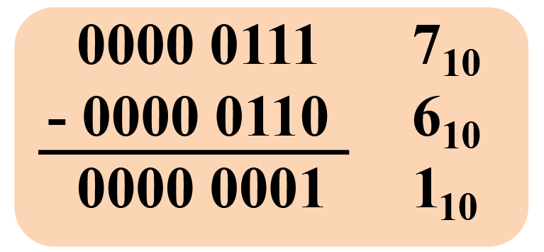

# Arithmetic for Computer

!!! info "参考"
    https://xuan-insr.github.io/computer_organization/3_arithmetic/

## Arithmetic

### 加法

不管什么表示，直接加就是对的（包括负数的补码表示）。

!!! info "加法"
    
### 减法

减去一个数等于加上这个数的补码。

!!! info "减法"
    === "减去一个数"
        
    === "等于加上它的补码"
        

### Overflow

定义次高位向最高位的进位为$c_i$,最高位的进位为$c_{i+1}$,则溢出检验可定义为$c_i \oplus c_{i+1}$,若结果为1则发生溢出。
!!! info "溢出情况"
    

### ALU

在数字逻辑中已经设计过

!!! note "ALU"
    === "单个ALU"
        
    === "组合成32位"
        
    === "功能图"
        
        ??? info "说明"

            + slt:比较大小
            + srl:移位
            + 目前还不支持非或

### 乘法

#### 朴素的思路

但是这样会很慢，因此有一种优化的思路，可以将ALU的位数降下来。

#### 改进V2

!!! info "V2"
    === "流程图"
        
    === "Example"
        

这时我们又想到，乘法运算的结果和乘数每次都要右移一位，结果是乘数丢弃一位，product要增加一位。那我们能不能让增加的这一位利用丢弃导致空出来的位置呢？

#### 改进V3

!!! info "V3"
    === "流程图"
        
    === "Example"
        

#### Booth

然后又有一个神人想出了一个神奇的方法，可以在乘数含大量1的情况下大大加快速度，思想类似于乘法分配律。

!!! info "Booth"
    === "idea"
        
    === "example"
        
    === "总结"
        
### 除法

#### 思路

和小学学除法一样，用一个竖式来计算。

!!! example "竖式运算"
    

#### V1

!!! info "解析"
    
    
    1. 把除数(divisor)放在左半部分，被除数(dividend)放在右半边，置于寄存器中。

    2. 把被除数减去除数，得到结果：

        + 若结果大于0，商(Quotient)左移一位，最低位置为1

        + 若结果小于0，把结果加上除数恢复原来的被除数，商左移一位，最低为置为0

    3. 除数右移一位

    ??? note "例子"
        

#### 修改版本

上面的ALU是128位的，太过于浪费空间，有没有优化呢？
我们考虑一个reminder，一开始被除数放在最右边，这样就分成了左边64位与右边64位。左边64位与除数作减法运算。每次被除数左移一位，计算减法结果，根据是否大于0在左移空出来的最低位置1或0.

!!! info "图例"
    === "硬件图"
        
        ??? tip "这里的shift right有什么用呢"
            考虑乘法的硬件图，加上右移功能可以使这个结构可以同时处理乘法与除法
    === "例子"
        
