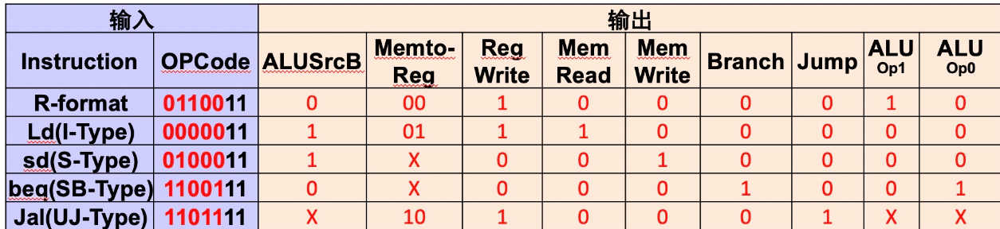
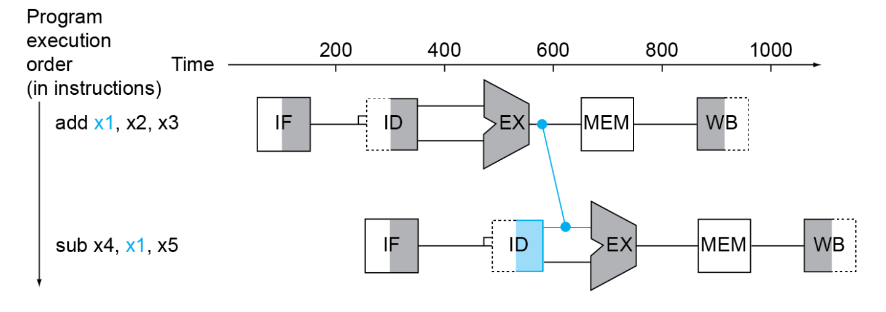
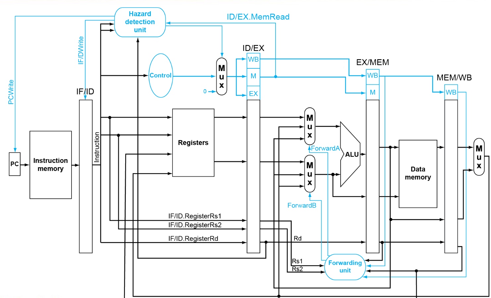
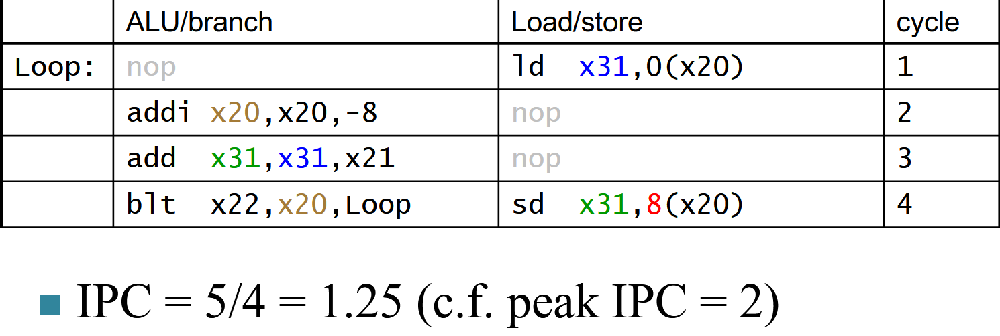

# 处理器

## 简介

影响CPU性能的因素：

+ Instruction count,Determined by ISA and compiler

+ CPI and Cycle time,Determined by CPU hardware

!!! tip "An overview of Implementation"
    === "总览"
        
        但在实际设计中，如此多的线不能交叉在一起，于是需要用到多路选择器。
    === "Datapath"
        


## 指令处理的步骤

1. **提取**：
    - 从指令存储器中获取指令。

        - 解释：从存储指令的内存中读取当前需要执行的指令。

    - 修改程序计数器（PC）以指向下一条指令。

2. **指令解码与读取操作数**：
    - 将指令转化为机器控制命令。
    - 读取寄存器中的操作数，无论是否使用。

3. **执行控制**：
    - 控制对应算术逻辑单元（ALU）操作的实现。

4. **内存访问**：
    - 从内存中读取或写入数据。
        - 解释：执行数据的加载（load）或存储（store）操作。
    - 仅限于加载/存储指令（ld/sd）。

5. **将结果写入寄存器**：
    - 如果是 R 型指令，ALU 的结果写入 rd。
        - 解释：对于 R 型指令，执行 ALU 操作后将结果存储到目标寄存器 rd 中。
    - 如果是 I 型指令，内存数据写入 rd。
        - 解释：对于 I 型指令，将从内存读取的数据存储到目标寄存器 rd 中。

6. **分支指令修改 PC**：
    - 解释：对于分支指令，根据条件判断结果修改程序计数器，以跳转到指定指令地址。


---

## 单周期CPU


### Datapath 与 Cpu_ctrl

不多说，直接上图：

<p style="text-align: center;">
  
</p>

下面对图中的一些部分作说明:

+ **PC**:基地址

+ **Instruction Memory**:存放了许多指令，根据PC的地址读取相应指令

+ **Registers**:寄存器处理的中心，负责读取寄存器与向寄存器写入内容的功能

+ **ImmGen**: 负责将立即数填充为64位

+ **ALU**:承担了所有的运算操作，例如地址加减，`beq`里面判断是否等于0，寄存器的值加减等。

+ **Data Memory**:内存，与`ld`,`sd`等指令密切相关。

---

另外，控制信号的说明如下：

1. **RegWrite**:控制是否向Write Register写入数据

2. **ALUSrc** :控制选择Read data2还是立即数

3. **ALU operation**: 控制ALU进行加法，减法还是set less than什么的

4. **Branch**：控制这个Mux的信号，检测到指令是跳转的时候控制选择器选择立即数+PC基址。

5. **jump**：jal指令的信号，效果同上

6. **MemRead**： 控制Data Memory是否要从Address地方读取出数据

7. **MemWrite**: 顾名思义，同上。

8. **MemtoReg**: 是一个两位的信号，解释在如下:

<p style="text-align: center;">
  
</p>
---

下面展开具体分析

#### Datapath

##### R型指令

!!! example "🌰"
    
    ??? general "解析"
        先看Registers。从$ins_{15-19}$读取rs1寄存器的值，从$ins_{20-24}$读取rs2的值
        ，目标寄存器为rd.控制mux选择Read data2,ALU作相应运算（比如add）后直接绕过内存，Mux选择来自ALU的数据，写入rd中。
##### I型指令

!!! example "🌰"
    
    ??? general "解析"
        图中以ld为例。ld需要从内存读取一个值，存到目标寄存器中。
        重复的话不多说，我们拿了一个rs1，一个rd，一个imm，效果就是ld rd,imm(rs1).为了实现这一效果，我们控制第一个Mux
        选择扩展后的立即数，与Read data1作加法后作为内存读取的address,读出来的Read data通过多路选择器存回rd。
##### S型指令

!!! example "🌰"
    
    ??? general "解析"
        图中以sd为例。从$ins_{15-19}$读取rs1内容，从$ins_{20-24}$读取rs2的值，再来一个立即数imm，
        最终的效果就是sd rs2,imm(rs1). 其他部分都和ld差不多，除了现在从内存读数据变成向内存存数据了，也不需要再写回寄存器了。

##### SB型指令

!!! example "🌰"
    
    ??? general "解析"
        beq我们也很熟悉，就是branch if equal🐎，那么跳转到哪里呢？在RISC-V中是一个立即数，实际上去的是PC基址加上立即数的地方。知道了这个
        ，我们再来看图。先取两个寄存器作比较，如果满足条件，那么ALU的zero传给上面的MUX一个信号：**这MUX能取PC基址加拓展立即数吗我请问了**。
        如果不行那就选择PC+4，也就是下一条指令的地址。不管怎样，PC来到了一个新的地址。
##### J-Jal


!!! example "🌰"
    
    ??? general "解析"
        Jal其实值得关注的也就是一条从PC，到ADD(PC,4)，再经过MUX到Registers的地方。这是什么呢？😲！这不就是jal x1,100里面把下一条指令的地址
        放到x1地方吗？至于其他,基本上和SB型指令一样了。


---


#### Cpu_ctrl

<p style="text-align: center;">
  
</p>

这便是各种情况下每个控制信号的情况。可以发现，除了ALU，其他所有信号在指令类型（可以通过opcode判断）确定时就确定了。ALU由于在R型指令时可能
执行多种操作，所以不确定。这个时候前人设计出了二级译码器。

<p style="text-align: center;">
  
</p>

##### Main Decoder

Main Decoder其实很简单，根据opcode把能赋值的先赋值了。

##### ALU Decoder

<p style="text-align: center;">
  
</p>

根据标红的那几位就可以判断出ALU运算的种类。

##### Code

```verilog title="cpu_ctrl"
等实验做完再放
```

## 流水线CPU

采用流水线的思想，尽可能并行进行任务。

### 阶段

1. IF:Instruction fetch from memory

2. ID:Instruction decode and register read

3. EX:Execute operation or calculate address

4. MEM:Access memory operand

5. WB:Write result back to register

<div style="text-align: center;">
    
</div>

### 流水线中的问题与解决方案

https://zhuanlan.zhihu.com/p/447682231


#### 数据冒险（Data Hazards）
在RISC-V架构的流水线CPU中，数据冒险通常由指令间的数据依赖引起。例如，当一条指令需要使用前一条指令的计算结果作为操作数时，就会发生数据冒险。为了解决数据冒险，RISC-V流水线常采用以下方法：

- **转发（Forwarding）**：将执行阶段或内存访问阶段的结果直接传递给需要该数据的指令，减少流水线暂停。

    **示例：**
    ```assembly
    ADD x1, x2, x3    # 第1条指令
    SUB x4, x1, x5    # 第2条指令依赖于x1的值
    ```
    在没有转发的情况下，第2条指令必须等待第1条指令完成写回后才能执行。而通过转发，第1条指令的结果可以直接从执行阶段传递给第2条指令，避免了暂停。

    <div style="text-align: center;">
    
    </div>


- **流水线暂停（Pipeline Stalls）**：当数据依赖无法通过转发解决时，通过插入气泡（NOP指令）来暂时停止流水线，以等待数据准备就绪。
    **示例：**
    ```assembly
    LOAD x1, 0(x2)    # 第1条指令
    ADD x3, x1, x4     # 第2条指令依赖于x1的值，需要插入NOP
    NOP                # 插入的气泡
    SUB x5, x3, x6     # 第3条指令
    ```
- **指令调度**：重新安排指令的执行顺序，尽量减少数据依赖带来的影响。
    **示例：**
    ```assembly
    LOAD x1, 0(x2)    # 第1条指令
    NOP                # 为数据准备时间插入
    ADD x3, x1, x4     # 第2条指令
    SUB x5, x3, x6     # 第3条指令
    ```
    <div style="text-align: center;">
    
    </div>

#### 控制冒险（Control Hazards）
控制冒险主要发生在分支指令执行时，预测下一条指令的地址成为问题。RISC-V流水线通常采用以下策略来应对控制冒险：

- **分支预测（Branch Prediction）**：通过预测分支的走向（如静态预测或动态预测）来提前加载指令，减少因分支指令带来的流水线停顿。
    **示例**
    ```assembly
    BEQ x1, x2, label  # 分支指令
    ADD x3, x4, x5      # 预测执行的指令
    label:
    SUB x6, x7, x8      # 分支跳转目标
    ```
- **分支延迟槽（Branch Delay Slot）**：在分支指令之后安排一条与分支结果无关的指令执行，以利用这一个周期，减少性能损失。
- **延迟分支（Delayed Branch）**：类似于分支延迟槽，通过调整指令调度来优化分支指令的执行。

#### 结构冒险（Structural Hazards）
结构冒险是由于流水线中硬件资源的竞争引起的冲突。例如，当多个指令同时需要访问同一个内存资源时，可能会导致结构冒险。

```assembly title="例子"

load x1, 0(x2)    # 第1条指令访问内存
store x3, 4(x4)    # 第2条指令同时访问内存，若只有一个内存端口，将产生结构冒险
```


RISC-V流水线通过以下方法缓解结构冒险：

- **资源多路复用**：增加硬件资源的实例，比如多个寄存器文件端口或独立的缓存访问路径，以支持同时的资源访问需求。
- **流水线分段**：将硬件资源划分为多个独立的子单元，每个子单元负责不同的流水线阶段，减少资源竞争。
- **动态调度**：根据指令的资源需求动态分配硬件资源，优化资源利用率，降低结构冒险发生的概率。

### 结构：数据通路与控制

!!! info "汇总图"
    

    _中间的长条状是寄存器，存了上一个指令的各种信息_
    
#### 冒险

##### 冒险的检测

###### Data Hazards与Structural Hazards


数据冒险发生在两个指令的寄存器出现相同，也就是上一条指令的rd是下一条指令的rs1或rs2，同时还要关注Regwrite信号

!!! tip "检测"
    === "情况判断"
        
    === "特殊情况1"
        

        只有我们需要向rd写入数据的时候可能发生冒险
    === "特殊情况2"
        

        x0不需要考虑，因为不能写

具体用逻辑来写，就是这样

!!! tip
    === "逻辑写法"
        
    
    === "forward信号说明"
        

        ??? warning "这样就好了吗?"

            思考这样一种情况：

            

            那我x1不是应该从最近的一条指令把数据旁路过来吗？

            所以MEM Hazard应该是这样

            

---

再思考，这样好了吗🤔？

我们来看load指令:

```riscv
load x2,10(x1)

and x4,x2,x5
```
这样的冲突是符合EX Hazard的所有条件的，但load指令不能在这个地方旁路过来，因为在EX/MEM这个阶段load指令还没有加载到数据，所以需要等到MEM/WB阶段。

<div style="text-align: center;">
    
    </div>


---


总结:

<div style="text-align: center;">
    
    </div>

---

###### Control Hazards


为解决控制冒险，我们可以提前计算来判断是否要跳转。

<div style="text-align: center;">
    
    </div>

但是即便这样，我们也会浪费一个时钟。因为加入跳转成立，那本来取的下一条指令就不对了。因此，可以考虑采用Branch Prediction的方法。

### RISC-V with Static Dual Issue(并行处理两条指令)

通过增加寄存器，ALU与ImmGen，我们可以实现并行处理两条指令：load/store和ALU/branch指令。

!!! info "CPU改造"
    

---

然而，并行处理这两条指令并不总是可行的。
例如
    
```riscv
load x2,10(x1)
add x4,x2,x5
```
在这样两条指令中，第二条指令需要等待第一条指令的load指令执行完毕才能执行，因此无法并行处理。

---

#### Loop Unrolling

正是因为有上面哪些问题，我们可以使用循环展开的思想，将一条指令拆分成多条指令，这样就可以并行处理了。

```riscv
Loop: ld x31,0(x20) // x31=array element  
add x31,x31,x21 // add scalar in x21  
sd x31,0(x20) // store result  
addi x20,x20,-8 // decrement pointer  
blt x22,x20,Loop // branch if x22 < x20
```

上面这段代码如果要并行处理的话，为了避免冒险，结果是这样的:

<div style="text-align: center;">
    
    </div>

但是我们可以将循环展开，这样就可以并行处理了。

<div style="text-align: center;">
    
    </div>

思想相当于这样:

<div style="text-align: center;">
    
    </div>

---

#### Dynamic Scheduling

动态调度是指在运行时根据指令的资源需求动态分配硬件资源，以优化资源利用率，降低结构冒险发生的概率。

+ **CPU可以乱序执行指令**

+ **乱序执行的指令需要按照原有的顺序写入寄存器**

#### Register Renaming

寄存器重命名是指将指令中的逻辑寄存器重命名为物理寄存器，以避免数据冒险。


---

#### Speculation

在乱序执行的过程中，我们可以猜测一些指令的执行结果，如果猜测正确，那么就可以继续执行，否则就回滚。

1. Branch Prediction: 预测分支指令的走向，提前加载指令，减少分支带来的性能损失。

2. load Speculation: 预测load指令的加载地址与加载数据，提前加载数据，减少load指令带来的性能损失。

---

## 指令中断

在CPU执行时，有两个原因会导致CPU work flow的改变

1. **Control Flow Change**: 分支指令，跳转指令等

2. **Exception and Interrupts**:不可预测的事件，比如除零，内存访问错误等

---

### Exception

处理器内部的异常，比如overflow，undefined instruction等。

上述说法是狭义的异常，广义的异常还包括中断。

中断是指处理器外部的异常，比如时钟中断，IO中断等。

### 处理Exception

首先，CPU要知道:

1. **异常发生的原因**

2. **哪条指令导致了异常**

因此，在发生异常时，CPU会将异常原因和导致异常的指令的地址存储在一些特殊的寄存器(比如`cause`和`epc`)中。其中，`cause`寄存器存储异常原因，`epc`寄存器存储导致异常的指令的地址。

接着，CPU会跳转到异常处理程序的地址，开始处理异常。

---

那么怎么根据异常原因跳转到对应的异常处理程序呢？

#### 固定地址

CPU先跳到一个固定地址，这个地址存储了所有异常处理程序的入口地址，然后根据异常原因选择对应的异常处理程序。

#### 中断向量表

根据`cause`寄存器的值，选择对应的异常处理程序的地址。但是地址中存放的是`Jal`指令，两级跳转。

---

### 进入异常

当检测到异常时:

1. 停止执行当前的程序流,转而从CSR寄存器mtvec定义的PC地址开始执行;

2. 更新机器模式异常原因寄存器:mcause;

3. 更新机器模式中断使能寄存器:mie

3. 更新机器模式异常PC寄存器:mepc;

3. 更新机器模式状态寄存器: mstatus;

3. 更新机器模式异常值寄存器: mtval;

当然，也可能发生多个异常同时发生的情况，这时候需要根据优先级来处理。一般来说，异常的优先级是固定的，比如中断的优先级高于异常。

---

### 退出异常

当异常处理程序执行完毕时,在机器模式下使用mret指令返回到之前的程序流程。


### 流水线下的异常

流水线下出现异常可以看作是控制冒险的一种特殊情况，它的处理与分支预测错误的处理类似。

1. 把在这条指令之前的指令执行完毕

1. 把这条指令及之后的指令清空

1. 跳转到异常处理程序


<div style="text-align: center;">
    
    </div>

如图所示，增加了'SCAUSE'和'SEPC'寄存器，并在流水线内的寄存器增加了flush信号。

---

在流水线中，也可能出现多个异常同时发生的情况。

从简单的方法来说，优先处理最早的异常，因为在异常之后的指令可以看作是分支预测错误的，本不应执行。

但是，实际情况远比此复杂。例如，流水线执行指令可能是乱序的，定位到精确的异常原因是很困难的。
