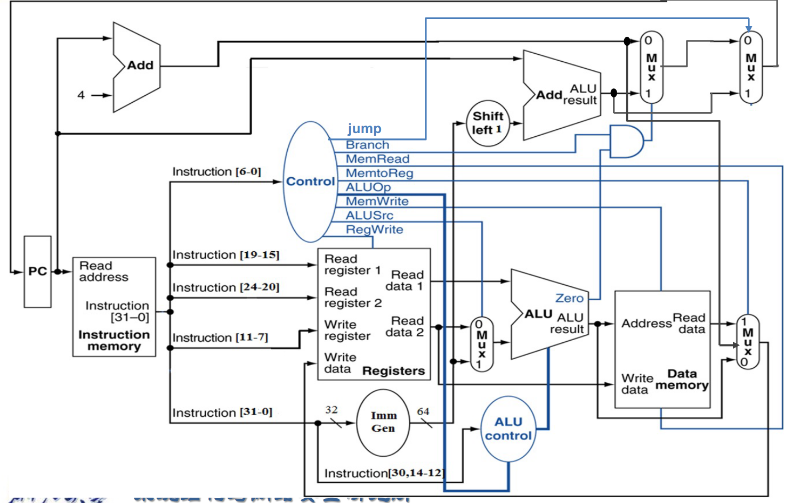
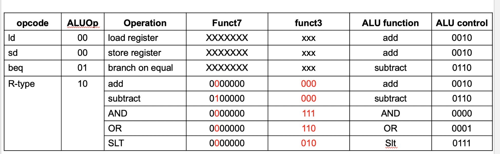

# 处理器

## 简介

影响CPU性能的因素：

+ Instruction count,Determined by ISA and compiler

+ CPI and Cycle time,Determined by CPU hardware

!!! tip "An overview of Implementation"
    === "总览"
        
        但在实际设计中，如此多的线不能交叉在一起，于是需要用到多路选择器。
    === "Datapath"
        

## Logic Design Convention

### 指令处理的步骤

1. **提取**：
    - 从指令存储器中获取指令。

        - 解释：从存储指令的内存中读取当前需要执行的指令。

    - 修改程序计数器（PC）以指向下一条指令。

2. **指令解码与读取操作数**：
    - 将指令转化为机器控制命令。
    - 读取寄存器中的操作数，无论是否使用。

3. **执行控制**：
    - 控制对应算术逻辑单元（ALU）操作的实现。

4. **内存访问**：
    - 从内存中读取或写入数据。
        - 解释：执行数据的加载（load）或存储（store）操作。
    - 仅限于加载/存储指令（ld/sd）。

5. **将结果写入寄存器**：
    - 如果是 R 型指令，ALU 的结果写入 rd。
        - 解释：对于 R 型指令，执行 ALU 操作后将结果存储到目标寄存器 rd 中。
    - 如果是 I 型指令，内存数据写入 rd。
        - 解释：对于 I 型指令，将从内存读取的数据存储到目标寄存器 rd 中。

6. **分支指令修改 PC**：
    - 解释：对于分支指令，根据条件判断结果修改程序计数器，以跳转到指定指令地址。


---

### Datapath 与 Cpu_ctrl

不多说，直接上图：

<p style="text-align: center;">
  
</p>

下面对图中的一些部分作说明:

+ **PC**:基地址

+ **Instruction Memory**:存放了许多指令，根据PC的地址读取相应指令

+ **Registers**:寄存器处理的中心，负责读取寄存器与向寄存器写入内容的功能

+ **ImmGen**: 负责将立即数填充为64位

+ **ALU**:承担了所有的运算操作，例如地址加减，`beq`里面判断是否等于0，寄存器的值加减等。

+ **Data Memory**:内存，与`ld`,`sd`等指令密切相关。

---

另外，控制信号的说明如下：

1. **RegWrite**:控制是否向Write Register写入数据

2. **ALUSrc** :控制选择Read data2还是立即数

3. **ALU operation**: 控制ALU进行加法，减法还是set less than什么的

4. **Branch**：控制这个Mux的信号，检测到指令是跳转的时候控制选择器选择立即数+PC基址。

5. **jump**：jal指令的信号，效果同上

6. **MemRead**： 控制Data Memory是否要从Address地方读取出数据

7. **MemWrite**: 顾名思义，同上。

8. **MemtoReg**: 是一个两位的信号，解释在如下:

<p style="text-align: center;">
  
</p>
---

下面展开具体分析

#### Datapath

##### R型指令

!!! example "🌰"
    
    ??? general "解析"
        先看Registers。从$ins_{15-19}$读取rs1寄存器的值，从$ins_{20-24}$读取rs2的值
        ，目标寄存器为rd.控制mux选择Read data2,ALU作相应运算（比如add）后直接绕过内存，Mux选择来自ALU的数据，写入rd中。
##### I型指令

!!! example "🌰"
    
    ??? general "解析"
        图中以ld为例。ld需要从内存读取一个值，存到目标寄存器中。
        重复的话不多说，我们拿了一个rs1，一个rd，一个imm，效果就是ld rd,imm(rs1).为了实现这一效果，我们控制第一个Mux
        选择扩展后的立即数，与Read data1作加法后作为内存读取的address,读出来的Read data通过多路选择器存回rd。
##### S型指令

!!! example "🌰"
    
    ??? general "解析"
        图中以sd为例。从$ins_{15-19}$读取rs1内容，从$ins_{20-24}$读取rs2的值，再来一个立即数imm，
        最终的效果就是sd rs2,imm(rs1). 其他部分都和ld差不多，除了现在从内存读数据变成向内存存数据了，也不需要再写回寄存器了。

##### SB型指令

!!! example "🌰"
    
    ??? general "解析"
        beq我们也很熟悉，就是branch if equal🐎，那么跳转到哪里呢？在RISC-V中是一个立即数，实际上去的是PC基址加上立即数的地方。知道了这个
        ，我们再来看图。先取两个寄存器作比较，如果满足条件，那么ALU的zero传给上面的MUX一个信号：**这MUX能取PC基址加拓展立即数吗我请问了**。
        如果不行那就选择PC+4，也就是下一条指令的地址。不管怎样，PC来到了一个新的地址。
##### J-Jal


!!! example "🌰"
    
    ??? general "解析"
        Jal其实值得关注的也就是一条从PC，到ADD(PC,4)，再经过MUX到Registers的地方。这是什么呢？😲！这不就是jal x1,100里面把下一条指令的地址
        放到x1地方吗？至于其他,基本上和SB型指令一样了。


---


#### Cpu_ctrl

<p style="text-align: center;">
  
</p>

这便是各种情况下每个控制信号的情况。可以发现，除了ALU，其他所有信号在指令类型（可以通过opcode判断）确定时就确定了。ALU由于在R型指令时可能
执行多种操作，所以不确定。这个时候前人设计出了二级译码器。

<p style="text-align: center;">
  
</p>

##### Main Decoder

Main Decoder其实很简单，根据opcode把能赋值的先赋值了。

##### ALU Decoder

<p style="text-align: center;">
  
</p>

根据标红的那几位就可以判断出ALU运算的种类。

##### Code

```verilog title="cpu_ctrl"
等实验做完再放
```