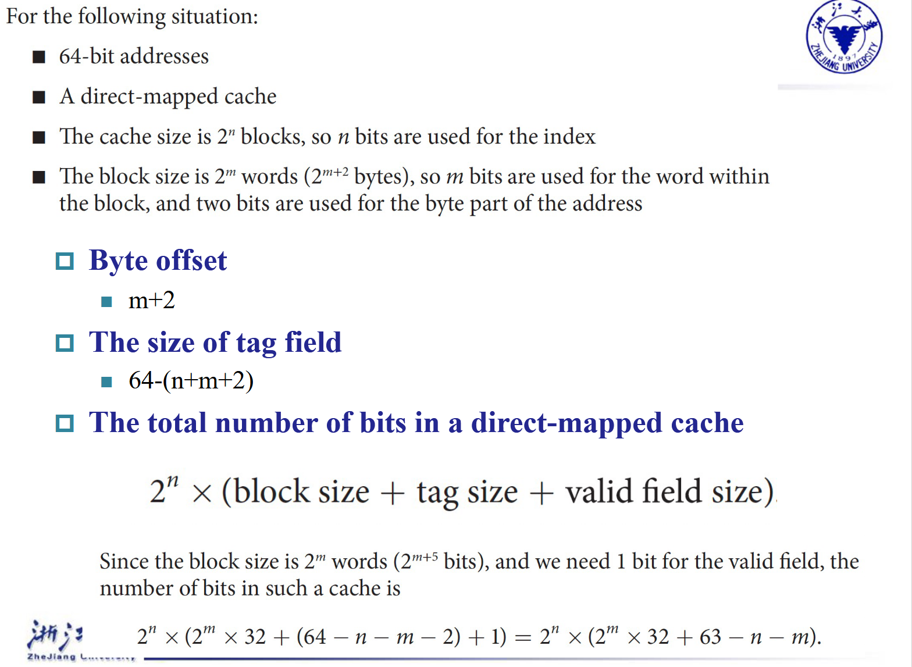

# Cache

## Memory Hierarchy Introduction

内存访问有如下两个特点：

+ 时间局部性（Temporal Locality）：如果一个数据被访问，那么在不久的将来它可能再次被访问。例如，循环结构中的数据。

+ 空间局部性（Spatial Locality）：如果一个数据被访问，那么在不久的将来与它相邻的数据可能也会被访问。例如，数组中的数据。

根据这样的特点，可以作如下设计:

+ Copy recently accessed (and nearby) items  from disk to smaller DRAM memory

+ Copy more recently accessed (and nearby) items from DRAM to even smaller SRAM memory

+ Copy most recently accessed (and nearby) items from SRAM to even smaller CPU registers

一图以蔽之：

    

在访问数据时，我们访问的实际上是内存单元，称作块（block aka line）。块的大小是固定的，通常是字的2的若干次方倍。

!!! definition

    1. **Hit**:当CPU访问数据时，它首先读取Cache中的内容，如果Cache中有这个数据，那么就直接读出来，这个过程称为Hit。

    2. **Hit Ratio**:Hit Ratio是指Cache中有数据的概率，它等于Hit次数除以总的访问次数(Hit Ratio = Hits / Accesses)。

    2. **Miss**:如果Cache中没有这个数据，那么就需要从内存中读取，这个过程称为Miss。在实际操作中，我们需要先将数据的块从下级的存储器复制到Cache中，然后再从Cache中读取数据。这个过程花费的时间称为Miss Penalty。

    3. **Miss Ratio**:Miss Rate是指Cache中没有数据的概率，它等于Miss次数除以总的访问次数(Miss Ratio = Misses / Accesses)。

---

## The basics of cache

我们要如何确认一个block在不在Cache中呢?如果在，我们如何找到它呢?

### Direct Mapped Cache

Memory中有32个block，Cache中有8个block，那么我们可以将Memory中的block映射到Cache中的block。由于Cache中的块的数目是$2^n$，所以我们可以取memory block address的低n位作为Cache block address。

    

如上图所示，内存有 32 个 block，其编号 (block address) 分别为 00000 到 11111；cache 有 8 个 block。我们直接按 block address 的后 3 位确定它应该放在 cache 的哪个 block 里。

即，图上灰色的 block 的编号末 3 位都是 001，所以就应该放在 cache 中编号为 001 的灰色 block 里；橙色同理。

但是，由于内存中的block块数是多于Cache中的block块数的，所以会出现多个内存块映射到同一个Cache块的情况，例如上图中的block 00001和block 01001都映射到了Cache块001中。

为了解决这个问题，我们引入了tag的概念。tag是用来标识一个block的，它是block address的高位。在上图中，block 00001和block 01001都映射到了Cache块001中，但是它们的tag是不同的，所以我们可以通过tag来区分它们。例如，block 00000的tag是00，block 01000的tag是01。

此外，我们还需要一个valid位来表示这个Cache块是否有效。其实不管写入与否，Cache中的每一个block都是有值的，但不一定是合法的。当一个Cache块被初始化时，valid位被置为0，当这个Cache块被替换时，valid位被置为1。

在地址中，还有一个Byte Offset的概念。如果说前面的block address是用来确定我们想要的是Cache中的哪个block，那么Byte Offset是用来确定我们想要的是这个block中的哪个字节。

    

!!! info "Cache的大小"
    

---

!!! example "例题"
    How many total bits are required for a direct-mapped cache 16KB of data and 4-word blocks, assuming a 32-bit address?
    ??? general 
        首先，条件是一个Cache有16KB,也就是4K个字节。每个block有4个字，所以有1K(这里的K是1024!)个block。所以我们需要10位来表示index。然后，一个Block有4*4=16个字节，所以我们需要4位来表示offset.因此,tag的位数是32-10-4=18位。

        因此，Cache的大小是
        
        $2^{10}$(一共这么多个Block) $* (128 + 18 + 1)$(每个Block有128个bit存数据，18位tag，1位valid位) 
        
        $= 2^{10} * 147 = 147Kbits$

### Handling Cache Writes hit and Misses

#### Read

+ **Read Hit**: 从Cache中读取数据，直接返回。

+ **Read Miss**: 有两种情况:instruction cache miss 与data cache miss
    + **Instruction Cache Miss**: 暂停 CPU 运行，从 memory 里把对应的 block 拿到 cache，从第一个 step 开始重新运行当前这条指令。

    + **Data Cache Miss**: 从 memory 里把对应的 block 拿到 cache，然后读取对应的内容。

#### Write

+ **Write Hit**: 有两种情况:write through 与 write back

    + **Write Through**: 写入 cache 同时写入 memory.好处是 cache 和 main memory 总是一致的，但是这样很慢,因为要等待比较慢的 memory写入，无法发挥 cache 的速度优势。

    + **Write Back**: 写入 cache，等到这个 block 被替换时，再写入 memory.这种情况需要一个额外的 **dirty bit** 来记录这个 cache block 是否被更改过，从而直到被覆盖前是否需要被写回内存。如果dirty bit为1，说明这个block被修改过，需要写回内存。

+ **Write Miss**: 有两种情况:write allocate 与 no-write allocate

    + **Write Allocate**: 从 memory 里把对应的 block 拿到 cache，然后写入 cache，再写入 memory.

    + **No-Write Allocate**: 直接写入 memory.