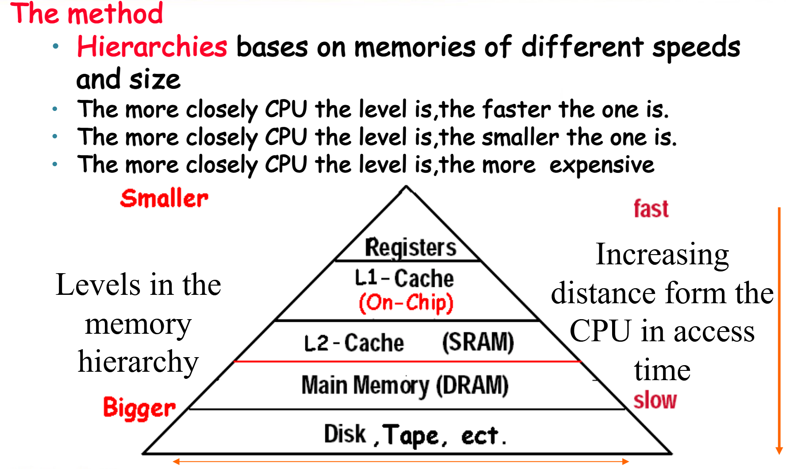

# Cache

## Memory Hierarchy Introduction

内存访问有如下两个特点：

+ 时间局部性（Temporal Locality）：如果一个数据被访问，那么在不久的将来它可能再次被访问。例如，循环结构中的数据。

+ 空间局部性（Spatial Locality）：如果一个数据被访问，那么在不久的将来与它相邻的数据可能也会被访问。例如，数组中的数据。

根据这样的特点，可以作如下设计:

+ Copy recently accessed (and nearby) items  from disk to smaller DRAM memory

+ Copy more recently accessed (and nearby) items from DRAM to even smaller SRAM memory

+ Copy most recently accessed (and nearby) items from SRAM to even smaller CPU registers

一图以蔽之：

    

在访问数据时，我们访问的实际上是内存单元，称作块（block aka line）。块的大小是固定的，通常是字的2的若干次方倍。

!!! definition

    1. **Hit**:当CPU访问数据时，它首先读取Cache中的内容，如果Cache中有这个数据，那么就直接读出来，这个过程称为Hit。

    2. **Hit Ratio**:Hit Ratio是指Cache中有数据的概率，它等于Hit次数除以总的访问次数(Hit Ratio = Hits / Accesses)。

    2. **Miss**:如果Cache中没有这个数据，那么就需要从内存中读取，这个过程称为Miss。在实际操作中，我们需要先将数据的块从下级的存储器复制到Cache中，然后再从Cache中读取数据。这个过程花费的时间称为Miss Penalty。

    3. **Miss Ratio**:Miss Rate是指Cache中没有数据的概率，它等于Miss次数除以总的访问次数(Miss Ratio = Misses / Accesses)。

---

## The Basics of Cache

我们要如何确认一个block在不在Cache中呢?如果在，我们如何找到它呢?

### Direct Mapped Cache

Memory中有32个block，Cache中有8个block，那么我们可以将Memory中的block映射到Cache中的block。由于Cache中的块的数目是$2^n$，所以我们可以取memory block address的低n位作为Cache block address。

    

如上图所示，内存有 32 个 block，其编号 (block address) 分别为 00000 到 11111；cache 有 8 个 block。我们直接按 block address 的后 3 位确定它应该放在 cache 的哪个 block 里。

即，图上灰色的 block 的编号末 3 位都是 001，所以就应该放在 cache 中编号为 001 的灰色 block 里；橙色同理。

但是，由于内存中的block块数是多于Cache中的block块数的，所以会出现多个内存块映射到同一个Cache块的情况，例如上图中的block 00001和block 01001都映射到了Cache块001中。

为了解决这个问题，我们引入了tag的概念。tag是用来标识一个block的，它是block address的高位。在上图中，block 00001和block 01001都映射到了Cache块001中，但是它们的tag是不同的，所以我们可以通过tag来区分它们。例如，block 00000的tag是00，block 01000的tag是01。

此外，我们还需要一个valid位来表示这个Cache块是否有效。其实不管写入与否，Cache中的每一个block都是有值的，但不一定是合法的。当一个Cache块被初始化时，valid位被置为0，当这个Cache块被替换时，valid位被置为1。

在地址中，还有一个Byte Offset的概念。如果说前面的block address是用来确定我们想要的是Cache中的哪个block，那么Byte Offset是用来确定我们想要的是这个block中的哪个字节。

    

!!! info "Cache的大小"
    

---

!!! example "例题1"
    How many total bits are required for a direct-mapped cache 16KB of data and 4-word blocks, assuming a 32-bit address?
    ??? general 
        首先，条件是一个Cache有16KB,也就是4K个字节。每个block有4个字，所以有1K(这里的K是1024!)个block。所以我们需要10位来表示index。然后，一个Block有4*4=16个字节，所以我们需要4位来表示offset.因此,tag的位数是32-10-4=18位。

        因此，Cache的大小是
        
        $2^{10}$(一共这么多个Block) $* (128 + 18 + 1)$(每个Block有128个bit存数据，18位tag，1位valid位) 
        
        $= 2^{10} * 147 = 147Kbits$

!!! example "例题2"
    Consider a cache with 64 blocks and a block size of 16 bytes.What block number does byte address 1200 map to?
    ??? general
        
        由于block size是16字节，所以我们可以知道，block 0的地址是0-15，block 1的地址是16-31，以此类推。所以，byte address 1200属于block 75。(其实就是1200/16向下取整)

        然而，最多只有64个block，所以我们需要取模。所以，byte address 1200映射到了block 75 mod 64 = 11。

### Handling Cache Writes hit and Misses

#### Read

+ **Read Hit**: 从Cache中读取数据，直接返回。

+ **Read Miss**: 有两种情况:instruction cache miss 与data cache miss
    + **Instruction Cache Miss**: 暂停 CPU 运行，从 memory 里把对应的 block 拿到 cache，从第一个 step 开始重新运行当前这条指令。

    + **Data Cache Miss**: 从 memory 里把对应的 block 拿到 cache，然后读取对应的内容。

#### Write

+ **Write Hit**: 有两种情况:write through 与 write back

    + **Write Through**: 写入 cache 同时写入 memory.好处是 cache 和 main memory 总是一致的，但是这样很慢,因为要等待比较慢的 memory写入，无法发挥 cache 的速度优势。

    + **Write Back**: 写入 cache，等到这个 block 被替换时，再写入 memory.这种情况需要一个额外的 **dirty bit** 来记录这个 cache block 是否被更改过，从而直到被覆盖前是否需要被写回内存。如果dirty bit为1，说明这个block被修改过，需要写回内存。

+ **Write Miss**: 有两种情况:write allocate 与 no-write allocate

    + **Write Allocate**: 从 memory 里把对应的 block 拿到 cache，然后写入 cache，再写入 memory.

    + **No-Write Allocate**: 直接写入 memory.

## Deep concepts

### Block Placement

!!! question
    Block可以被放到Cache中的哪些位置?

#### Direct Mapped Cache

上面已经介绍过，一个block只能放在Cache中的一个位置，这个位置是由block address的低n位决定的。

#### Fully Associative Cache

一个block可以放在Cache中的任何位。

#### Set Associative Cache

一个block可以放在Cache中的一组位置。例如，假设cache中有8个block，我们可以将这8个block分成4组，每组有2个block。那么内存中的block 12可以放在set0中的任何一个位置(12 mod 4 = 0)，内存中的block 13可以放在set1中的任何一个位置(13 mod 4 = 1)。

一组(set)是cache中的一些block的集合。如果一个set中有n个block，那么这个cache就是n-way set associative cache。

下图就是四路组相联(4-way set associative)的Cache:

    

Direct Mapped Cache可以看成1-way set associative cache的特例。

### Block Identification

!!! question
    如何确定一个block是否在Cache中?

正如上面已经介绍过，使用tag与vaild来确定一个block是否在Cache中。

在set associative cache中，我们需要使用index来确定一个block在哪个set中。这时，index的位数是$\log_2\text{(set的个数)}$。而在Fully Associative Cache中，index的位数是0。因为这时的set的个数是1，所以一个block可以放在任何位置。

### Block Replacement

!!! question
    当Cache满了，我们需要替换一个block。那么我们如何选择要替换的block呢?

+ 对于Direct Mapped Cache，只有一个block可以被替换，所以只有一个选择。

+ 对于Fully Associative Cache与set-associative，有多个block可以选择。常见的替换策略有：

    1. Random Replacement: 随机选择一个block替换。

    1. Least Recently Used (LRU): 选择最近最少使用的block替换。

    1. First-In-First-Out (FIFO): 选择最先进入的block替换。

    1. Not Recently Used (NRU): 选择最近没有被使用的block替换。

    1. Least Frequently Used (LFU): 选择最少被使用的block替换。

### Write Strategy

!!! question
    当数据被写入cache时，我们要不要把数据也写入memory呢?

根据是否写入memory，我们可以分为两种策略：

+ Write Through: 写入cache的同时写入memory。这样cache和memory总是一致的，但是写入速度慢。

+ Write Back: 写入cache，等到这个block被替换时，再写入memory。这样写入速度快，但是cache和memory可能不一致。另外，这种策略需要一个Dirty Bit来记录这个block是否被修改过,若dirty bit为1，说明这个block被修改过，当这个block被**替换**(不是写!!!)时，需要写回内存。

----

在Write Through中，由于内存的写入速度比cache慢，所以会出现Write Stall的情况。Write Stall是指当CPU写入数据时，由于cache和memory不一致，所以CPU需要等待memory写入完成后才能继续执行。这样会导致CPU的效率降低。

为了解决这个问题，我们引入了Write Buffer。Write Buffer是一个缓冲区，当CPU写入数据时，数据首先被写入Write Buffer，然后CPU继续执行。由Write Buffer向内存中写入数据。需要注意的是,Write Buffer并不能消除Write Stall，因为Buffer的大小也是有限的。

---

!!! question
    发生了Write Miss怎么办?

+ Write Allocate: 从memory中读取block到cache，然后写入cache。

+ No-Write Allocate(Write Around): 直接写入memory。

Write Back一般使用Write Allocate，Write Through一般使用No-Write Allocate。

!!! tip "Miss 汇总"
    

## Measuring and improving cache performance

### Cache Performance Metrics

我们使用Chapter 1中学的CPU Time来衡量Cache的性能。但要略作修改

!!! definition
    CPU time=  (CPU execution clock cycles + Memory-stall clock cycles) ×Clock cycle time

    Memory Stall指的是CPU等待memory的时间，它等于Read Stall + Write Stall。

    + Read Stall: 读取数据时，由于数据不在cache中，所以需要等待memory读取数据。
    
        Read Stall Cycles = $\frac{Read}{Program} \times  Read Miss Rate \times Read Miss Penalty$

    + Write Stall(对于Write Through With Buffer): 写入数据时，由于cache与memory不一致，所以需要等待memory写入数据。
    
        Write Stall Cycles = $\frac{Write}{Program} \times  Write Miss Rate \times Write Miss Penalty + Write Buffer Stalls$

在大部分情况下，Read Miss Penalty = Write Miss Penalty。如果忽略Buffer Stall,那么Memory Stall Cycles = $\frac{Memory}{Program} \times Miss Rate \times Miss Penalty$

!!! example "练习"
    
    ??? general "Answer"
        

### Improving Cache Performance

首先，要减少Direct Mapped Cache的使用。因为它的Miss Rate很高，而且Miss Penalty也很高。

## Virtual Memory

### 介绍

在PPT中，虚拟内存被定义为：把那些内存中放不下且不经常使用的数据放到磁盘上，从而释放内存空间。

虚拟内存让每个进程都产生幻觉:它有一个连续的内存空间，而不是一个分散的内存空间。

    

正如上图所示，进程实际使用的内存地址，我们称之为**物理地址(Physical Address)**。而进程认为自己使用的内存地址，我们称之为**虚拟地址(Virtual Address)**。虚拟地址是连续的，而物理地址是分散的。而虚拟地址空间被分为多个**页(Page)**，物理地址空间被分为多个**帧(Frame)**。在实际操作中，我们需要将虚拟地址映射到物理地址。

!!! warning
    在PPT中，将物理地址空间分为了**Physical Page**.但是在这里，我们将物理地址空间分为了**Frame**。这两者是等价的。

### Page Tables（页表）

在上面提到，虚拟地址到物理地址的转换是一个映射的过程。这个映射关系被存储在**页表(Page Table)**中。页表是一个数组，存储在内存中，数组的每一个元素是一个**页表项(Page Table Entry)**。页表项包含了虚拟地址到物理地址的映射关系。

虚拟内存与物理内存的地址与cache的地址类似，由于虚拟内存是类似于Fully Associative Cache的，所以其index的位数是0。而tag的位数是$\log_2\text{(Page的个数)}$，offset的位数是$\log_2\text{(Page Size)}$。

PPT的解释图如下：

    

!!! tip "How large is the page table?"
    

### Page Faults

在[介绍](#介绍)中的图片可以看出，实际的全部Virtual Page可能大于内存的容量，因此有部分页会放在硬盘中。当一个进程访问一个不在内存中的页时，会发生**Page Fault**。Page Fault是一个异常，会暂停进程的执行。当发生Page Fault时，操作系统会将这个页从磁盘中读取到内存中，然后重新执行这个指令。

### TLB(Translation Lookaside Buffer)

让我们来思考一个问题：当我们要访问一个内存地址时，我们需要现根据虚拟地址找到页表中entry的位置，然后再根据entry中的物理地址找到物理地址。由于页表是存放在内存中的，所以在找entry时，我们已经访问了一次内存，然后在访问真正的物理地址时，我们又访问了一次内存。这样的话，我们进行一次映射需要访问两次内存，这样的效率是很低的。

为了解决这个问题，我们引入了TLB。TLB是一个**cache**，存放了页表中的一部分entry。当我们要访问一个内存地址时，我们首先在TLB中查找，如果找到了，那么我们就可以直接访问物理地址。如果没有找到，那么我们再去访问内存。

需要注意的时，TLB的Block Replacement策略是是自定义的，并且它有一个**valid bit**来表示这个entry是否有效，还有一个**dirty bit**来表示这个entry是否被修改过，使用Write Back策略。

!!! tip "Miss 总结"
    