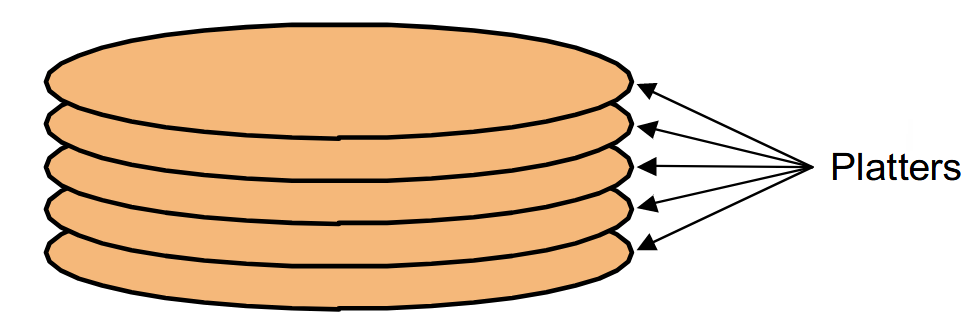
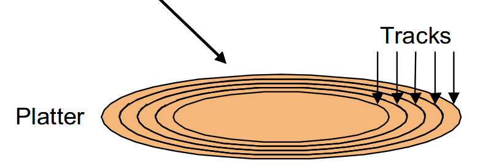
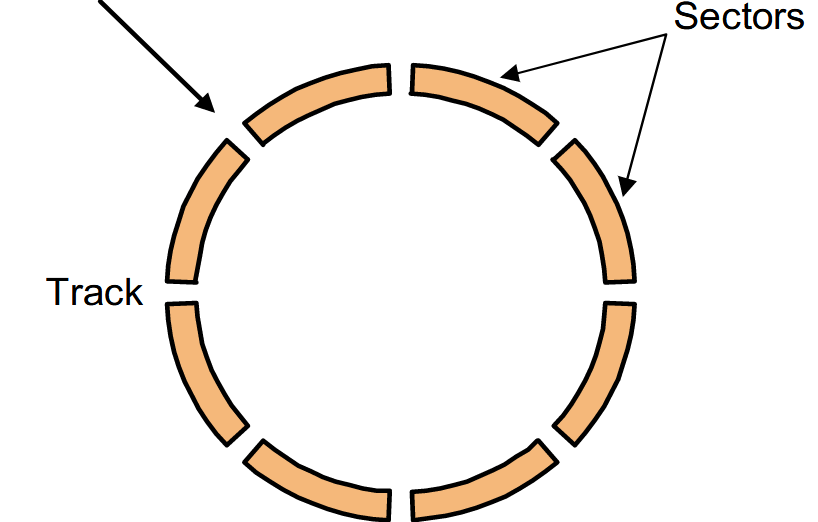
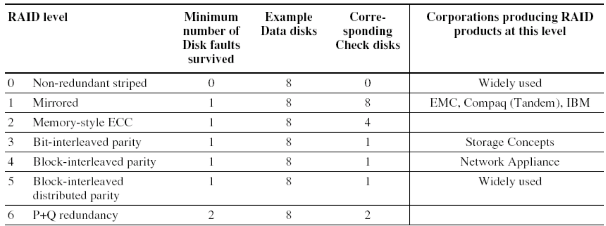
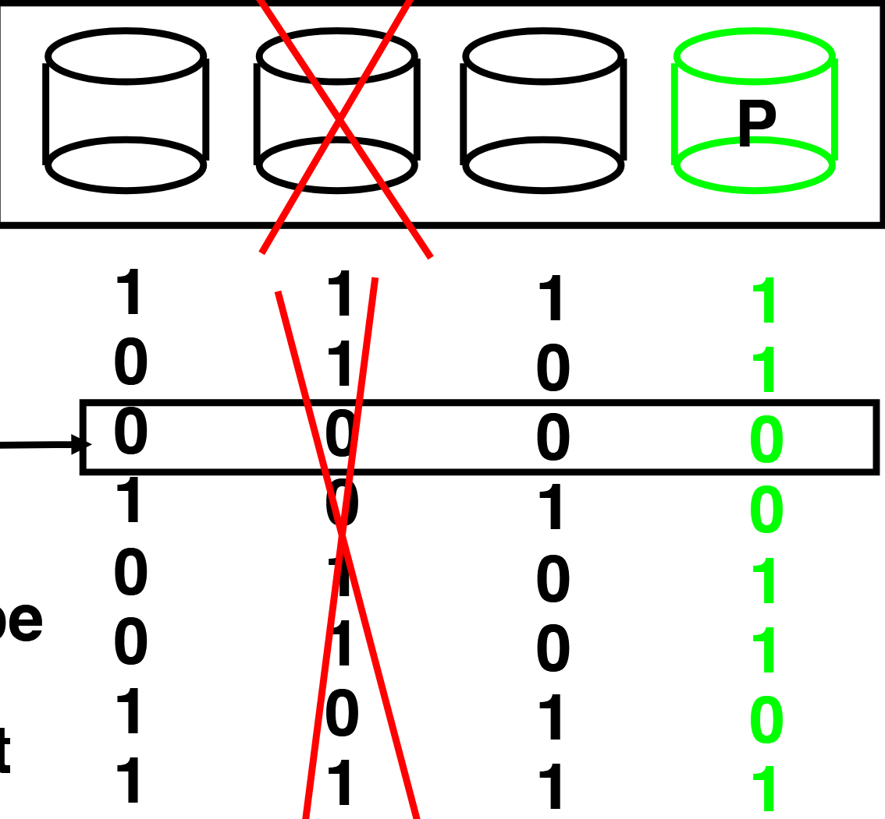
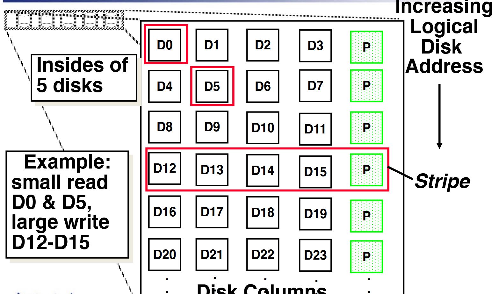
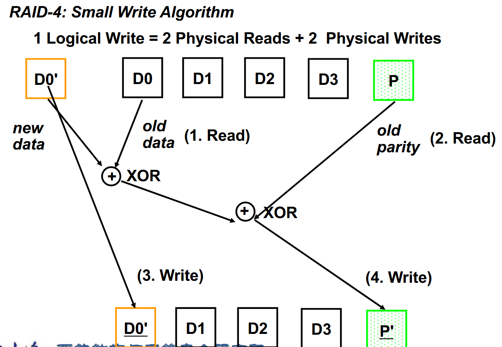
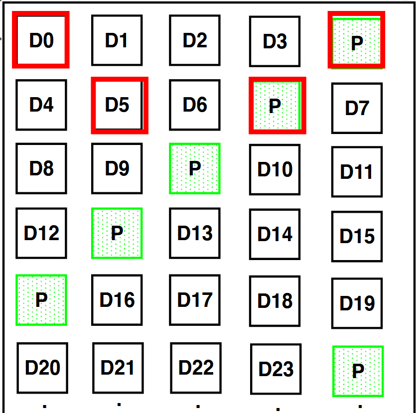
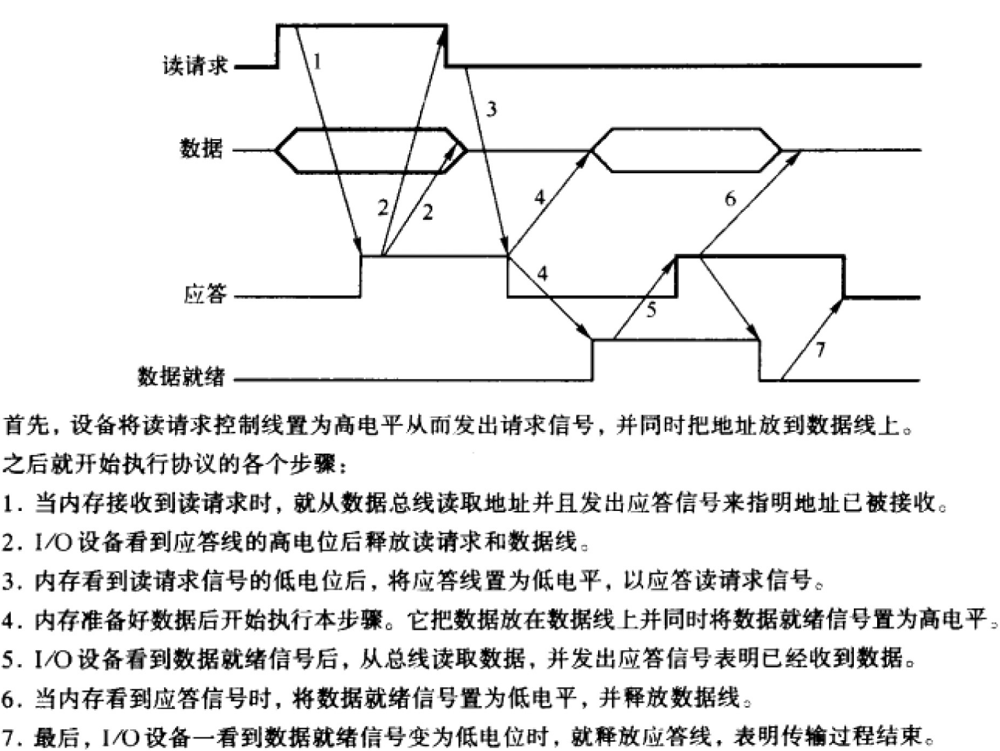

# Storage, Networks and Other Peripherals

上面的设备统称为I/O设备，包括存储设备、网络设备和其他外设。

Three characters of I/O:

+ **Behavior**:Input (read once), output (write only, cannot  read) ,or storage (can be reread and usually rewritten)

+ **Partner**:Either a human or a machine is at the other end of the I/O  device, either feeding data on input or reading data on  output.

+ **Data Rate**:The peak rate at which data can be transferred between  the I/O device and the main memory or processor.

## Disk

Disk由platters(盘片), tracks(磁道), sectors(扇区)组成。每个扇区的大小通常为512字节。

!!! info
    === "platters"
        
    === "tracks"
        
    === "sectors"
        

Disk访问的时包括:

+ **Seek Time**:磁头移动到指定磁道的时间

+ **Rotational Latency**:等待所需扇区旋转到磁头下的时间

+ **Transfer Time**:读取或写入数据的时间

+ **Controller Time**:控制器处理数据的时间

## Measure

+ **MTTF**:Mean Time To Failure,平均无故障时间

+ **MTTR**:Mean Time To Repair,平均修复时间

+ **MTBF**:Mean Time Between Failure = MTTF + MTTR,平均故障间隔时间

根据以上量，我们定义**Availability**为:

$$
Availability = \frac{MTTF}{MTTF + MTTR}
$$

有三种方式提高MTTF:

1. **Fault Avoidance**:避免故障

2. **Fault Tolerance**:容错,增加冗余。Using redundancy to allow the service to comply with the service specification despite faults occurring, which applies primarily to hardware faults。

3. **Fault Forecasting**:预测故障，适用于硬件与软件故障

## RAID

RAID(Redundant Array of Independent Disks)是一种磁盘阵列技术，通过将数据分布在多个磁盘上，提高数据的可靠性和性能。

其可概括如下:

    

### RAID 0

RAID 0是条带化技术，将数据块分布在多个磁盘上，提高读写性能。

但是它没有Redundancy，一旦一个磁盘损坏，所有数据都丢失。

### RAID 1

RAID 1是镜像技术，每一个磁盘都有它的镜像，提高了数据的可靠性。

但是存储空间浪费比较严重，并且写入性能较差，因为需要同时写入两个磁盘。

### RAID 3

RAID 3是通过奇偶校验位来实现冗余.它需要一个额外的盘来存储奇偶校验的结果。当一个硬盘损坏时，可以通过奇偶校验位来恢复数据。

    

图中的P(Parity)是奇偶校验盘。

!!! warning
    上课时有一个疑惑，就是这样通过奇偶校验的硬盘怎么知道哪个盘坏了呢?因为奇偶校验对不上可能是任何一个盘出现了问题。

### RAID 4

RAID 3在Small Read(只读一个盘)上性能较差，因为每次读取都需要读取奇偶校验盘。而在RAID 4中，每个Sector都有自己的Error Detection,这样就可以同时读多个硬盘。

    

RAID写入的过程如下:

    

但是，RAID 4还存在一个问题，例如在同时写入上面的D0和D5时，由于它们都同时要写入P盘，这样就会造成P盘的写入冲突。

### RAID 5

RAID的改进在于它将奇偶校验盘交错放置，这样就避免了RAID 4的写入冲突。

    

### RAID 6

When a single failure correction is not  sufficient, Parity can be generalized to  have a second calculation over data and  anther check disk of information.

## Bus

一个总线通常由两部分组成:

+ Control Lines:signal requests and acknowledgments,  and to indicate what types of information is on the data  lines

+ Data Lines:carry information (e.g., data, addresses, and  complex commands) between the source and the destination.

总线的传输有两部分:传输地址，送/收数据

!!! definition
    **input** :inputting data from the device to memory

    **output** :outputting data to a device from memory

异步时钟的总线通过握手协议来进行数据传输。

    

### Bus Arbitration

总线仲裁是指多个设备同时请求总线时，如何决定哪个设备可以使用总线。

+ **Centralized Arbitration**:由一个中心设备来决定哪个设备可以使用总线

+ **Self Selection**:设备自己决定是否可以使用总线

+ **Daisy Chain**:设备按照顺序来决定是否可以使用总线

+ **Collision Detection**:设备检测到冲突后，等待一段时间再次请求总线

仲裁需要考虑优先级与公平性。