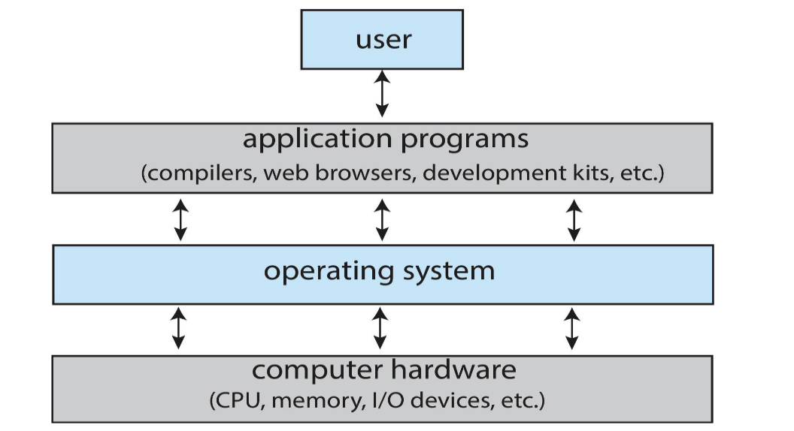
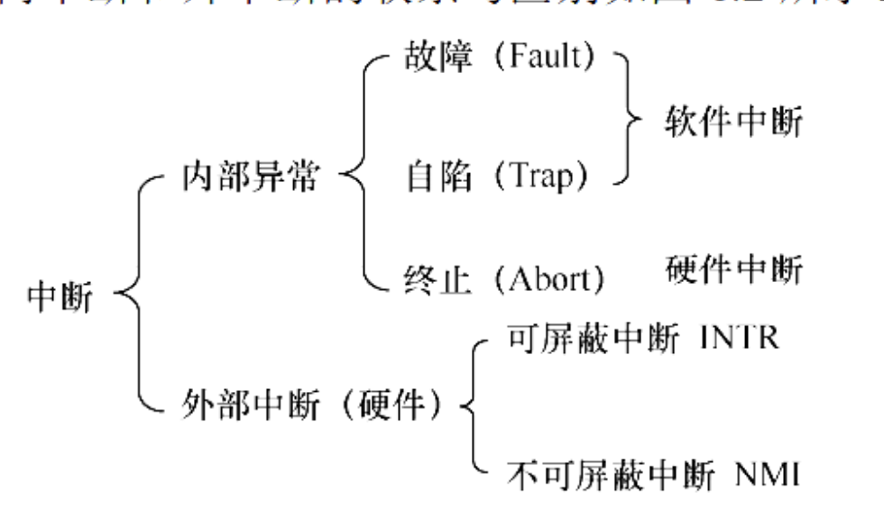

# 概述

## 什么是操作系统
> 计算机系统由硬件和应用程序组成。硬件（如CPU、内存、输入/输出设备等）为系统提供了基础的计算能力。应用程序（如文字处理、电子表格、编译器、浏览器等）则利用这些硬件资源来完成各种任 务，满足用户的需求。
>
> 操作系统的作用，就是在硬件和应用程序之间起桥梁作用。它负责管理和分配硬件资源，协调各个应用程序的运行，确保系统高效、稳定地工作。
>
> 简单来说，**操作系统**（Operating System, OS）是一组管理计算机硬件和软件资源的程序。它为用户和应用程序提供了一个方便的操作界面和运行环境，是计算机系统中最核心、最基础的软件。

正如下图所示,电脑系统可以分为以下四部分:

<div align="center">
    
    <br>
    <caption>电脑架构示意图</caption>
</div>

!!! tip "三个角度看操作系统"
    === "计算机系统组成"
        操作系统是一个系统软件,它位于硬件和应用程序之间,负责管理和协调计算机系统的各个部分。它有以下作用:

        + **资源管理者：**统一管理和分配硬件资源，避免冲突和浪费。

        + **运行环境提供者：**为应用程序提供一个标准的、方便的运行环境。

        + **用户接口：**为用户提供操作计算机的界面（如命令行、图形界面）。

        + **系统协调者：**协调多个应用程序的运行，保证系统的稳定和高效。
    === "用户"
        操作系统让用户能够方便地使用计算机。通过操作系统提供的界面，用户可以执行各种任务，如文件管理、程序运行、网络连接等，而不需要了解底层的硬件细节。

        操作系统提供的接口有:

        - **命令级接口：**:键盘、鼠标,触摸屏等

        - **程序级接口：**:API,系统调用等

    === "系统"
        操作系统是计算机资源的管理者,它负责协调和分配计算机的硬件资源（如CPU、内存、存储设备等）给不同的应用程序使用。操作系统通过调度算法和内存管理技术，确保各个程序能够高效地运行，同时避免资源冲突和浪费。

## 操作系统的发展历程

!!! info "Timeline"
    === "手工操作阶段"
        在这个阶段下,计算机的所有操作都需要人工干预,包括程序的输入、输出和存储等。不存在现在意义下的操作系统

    === "批处理阶段"
        计算机开始支持批处理作业.

        === "单道批处理"
            **核心思想**：为了实现作业的连续处理，系统将一批作业预先以脱机方式输入到磁带中，并配置监督程序（Monitor）来控制作业的自动执行。

            **工作流程**：
            ```
            磁带作业队列 → 监督程序调度 → 内存中单个作业执行 → 完成后调入下一个作业
            ```

            **主要特征**：
            
            1. **自动性**：在正常情况下，磁带上的作业能够自动逐个运行，无需人工干预
            2. **顺序性**：作业按照在磁带上的顺序依次进入内存执行，先调入的作业先完成
            3. **单道性**：内存中同时只能驻留一道程序，监督程序每次只调入一个程序运行

            **存在的问题**：
            
            !!! warning "CPU资源浪费严重"
                当程序运行过程中发出I/O请求时，高速的CPU必须等待低速的I/O操作完成，导致CPU长时间空闲。这种"CPU等待I/O"的现象严重降低了系统资源利用率。

            为了解决这一问题，后来引入了多道程序技术，允许多个程序同时驻留在内存中，CPU可以在等待某个程序I/O操作时切换到其他程序继续执行。

        === "多道批处理"
            用户的所有任务在硬盘上排列在一起,控制程序每次将一些任务调入内存中.当一个任务因I/O操作而等待时,CPU可以调度另一个任务运行,从而提高了CPU的利用率.

            因此,我们可以发现,多道批处理的特点是:

            + **宏观上并行**:多个任务在内存中同时存在,它们都没有完成,可以被调度运行.

            + **微观上串行**:在某一时刻,CPU只能运行一个任务,其他任务都处于等待状态.

        !!! example "例题：单道与多道批处理系统的CPU利用率对比"
            **题目描述**：
            
            有两个程序需要执行，它们的资源使用顺序如下：
            
            - **程序A**：CPU 10s → 设备甲 5s → CPU 5s → 设备乙 10s → CPU 10s

            - **程序B**：设备甲 10s → CPU 10s → 设备乙 5s → CPU 5s → 设备乙 10s
            
            那么

            1. 在单道程序环境下（先执行程序A，再执行程序B），CPU的利用率是多少？

            2. 在多道程序环境下，CPU利用率是多少？
            
            ??? tip "解"
                **单道程序环境分析**：
                
                程序必须串行执行，总执行时间为两个程序时间之和：
                - 程序A总时间：10 + 5 + 5 + 10 + 10 = 40s
                - 程序B总时间：10 + 10 + 5 + 5 + 10 = 40s
                - 系统总时间：40 + 40 = 80s
                - CPU总使用时间：(10 + 5 + 10) + (10 + 5) = 40s
                - **CPU利用率 = 40s / 80s = 50%**
                
                **多道程序环境分析**：
                
                两个程序可以并发执行，当一个程序等待I/O时，CPU可以调度另一个程序：
                
                
                
                CPU运行时间40s,两个程序运行总时间45s,因此:
                
                - **CPU利用率 = 40s / 45s ≈ 88.9%**

                - **多道程序环境下CPU利用率明显高于单道程序环境的50%**
    === "分时阶段"
        **分时技术**指的是将处理器的运行时间分成很短的时间片,分配给各任务.若某个任务在给它分配的时间片内不能完成任务,则暂停该任务,将处理器分配给下一个任务.这样,每个任务都能在很短的时间内得到响应,从而实现了多个用户对计算机的交互式使用.

        **分时操作系统**允许多个用户使用终端共同使用一台电脑,其关键特点是使用户能与自己的作业进行交互,即当用户在自己的终端上键入命令时,系统能及时接收并及时处理该命令.其主要特征如下:

        1. 同时性。也称多路性,指允许多个终端用户同时使用一台计算机。  
        
        2. 交互性。用户通过终端采用人机对话的方式直接控制程序运行,与同程序进行交互。

        3. 独立性。系统中多个用户可以彼此独立地进行操作,互不干扰,单个用户感觉不到别人也在使用这台计算机,好像只有自己单独使用这台计算机一样。  
        
        4. 及时性。用户请求能在很短时间内获得响应。


## 操作系统的运行


### 处理器的运行环境

CPU会运行两种不同性质的程序:

1. **用户程序**: 由用户编写和运行的程序,如应用软件、游戏等.这些程序通常运行在用户态,权限受限,不能直接访问硬件资源.

2. **系统程序**: 由操作系统提供的程序,如文件管理、内存管理、设备驱动等.这些程序通常运行在内核态,权限较高,可以直接访问硬件资源.

它们之间最明显的区别就是,能否使用特权指令(Privileged Instruction)如访问硬件设备、管理内存等.

操作系统的内核(Kernel)实际上是一个程序,负责了以下四种功能:

1. 时钟管理,负责维护系统的时钟信息,提供时间片轮转等调度策略.

2. 中断机制的维护,负责处理各种中断请求,如I/O中断、定时器中断等.

3. 硬件原语的封装,提供对硬件设备的统一接口,如文件系统、网络协议等.

4. 进程、设备的管理,负责创建、销毁、调度进程,管理设备的使用等.


### 中断(Interrupt)

正如在计组和体系中学过的, 中断是一种机制，它允许外部设备或内部事件向CPU发送信号，以便引起CPU的注意并请求服务。当CPU正在执行某个程序时，如果发生中断，CPU会暂停当前程序的执行，保存其状态，并转而执行中断处理程序。相关的概念有:

+ **mepc寄存器**: 用于保存发生中断时的程序计数器(PC)的值,以便中断处理完成后能够返回到正确的位置继续执行.

+ **中断向量表**: 是一个存储中断处理程序入口地址的数据结构。每个中断类型都有一个对应的入口地址，当中断发生时，CPU可以通过查找中断向量表来找到相应的处理程序。

+ **mcause寄存器**: 用于保存引起中断的原因代码,以便中断处理程序能够根据不同的中断类型采取相应的措施.

+ **mtval寄存器**: 用于保存与中断相关的附加信息,如发生地址等.

在这里,我们可以理解到中断更深层的含义.正如上面所说,程序的运行有内核态和用户态之分.用户态下的程序无法使用内核态的指令,当它们有时候又必须使用这些功能,比如读写文件,访问网络等,这时候就需要通过中断来实现从用户态切换到内核态,以便使用这些特权指令.

也就是说,发生中断时,CPU会从用户态切换到内核态,执行相应的中断处理程序,完成所需的操作后,再切换回用户态,继续执行用户程序.

<div align="center">
    
    <br>
    <caption>中断的分类</caption>
    </div>


!!! info "Exception and Interrupt"
    === "trap/fault"
        + **Trap**: 是一种同步事件,它是在程序执行过程中由程序本身引发的,如系统调用、调试断点等.当trap发生时,CPU会暂停当前程序的执行,保存其状态,并转而执行相应的trap处理程序.

        + **Fault**: 也是一种同步事件,它是在程序执行过程中由程序本身引发的,如非法内存访问、除零错误等.当fault发生时,CPU会暂停当前程序的执行,保存其状态,并转而执行相应的fault处理程序.

        + **Abort**: 是一种严重的同步事件,它通常是由硬件故障引起的,如内存错误、总线错误等.当abort发生时,CPU会立即停止当前程序的执行,并转而执行相应的abort处理程序.

        Trap和fault都是由程序本身引发的,因此它们是同步事件,而abort通常是由硬件故障引起的,因此它是一种异步事件.

    === "interrupt"
        中断是一种异步事件,它可以在任何时候发生,与当前正在执行的程序无关.中断通常由外部设备(如键盘、鼠标、网络接口等)或内部事件(如定时器中断)引起.当中断发生时,CPU会暂停当前程序的执行,保存其状态,并转而执行相应的中断处理程序.

        对于interrupt,还有可屏蔽中断与不可屏蔽中断的区分,这是为了区分中断的优先级.
        
        
        不可屏蔽中断(interrupt)通常是由严重的硬件故障引起的,如电源故障、内存错误等,通过NMI(Non-Maskable Interrupt)线发出信号.当不可屏蔽中断发生时,CPU必须立即响应,无法通过软件手段屏蔽或延迟处理.

        可屏蔽中断(interrupt)通常是由外部设备或内部事件引起的,如键盘输入、鼠标点击、网络数据到达等,通过INTR(Interrupt Request)线发出信号.当可屏蔽中断发生时,CPU可以根据当前的优先级设置决定是否响应,可以通过软件手段屏蔽或延迟处理.

        interrupt多由硬件引起

### 系统调用(System Call)

系统调用是用户程序与操作系统内核之间进行交互的接口。它允许用户程序请求操作系统提供特权服务，如文件操作、进程管理、内存分配等。也就是说,凡是这种特权服务,都需要让用户先向操作系统发出请求,然后让操作系统完成这些服务,然后操作系统把结果返回给用户.

1. 用户程序发起系统调用

    + 用户程序将系统调用号和参数压入堆栈。
    + 执行系统调用指令（如 syscall 或 int 指令）。
    + CPU执行陷入（trap）指令，状态从用户态切换到内核态。

2. 内核接管控制权

    + 硬件和操作系统内核保存当前进程的现场（如程序计数器PC、程序状态字PSW、通用寄存器等）。
    
    + 根据系统调用号，查找系统调用入口表，跳转到对应的系统调用处理子程序。

3. 系统调用处理

    + 内核执行相应的系统调用处理逻辑（如文件操作、进程管理等）。

4. 返回用户程序

    + 系统调用处理完成后，恢复被中断进程（或新进程）的CPU现场。
    + CPU状态从内核态切换回用户态，继续执行用户程序。
