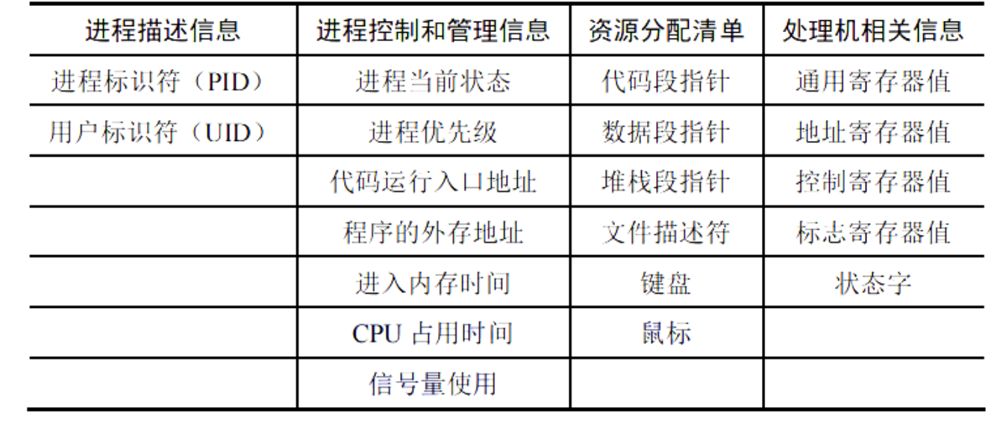
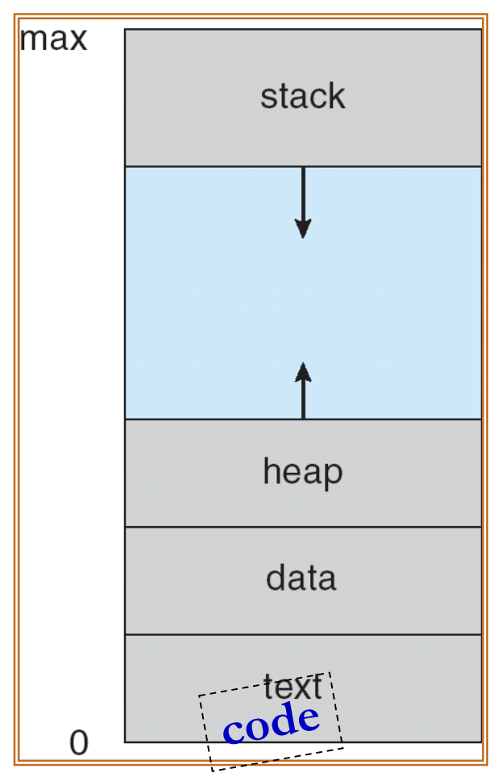
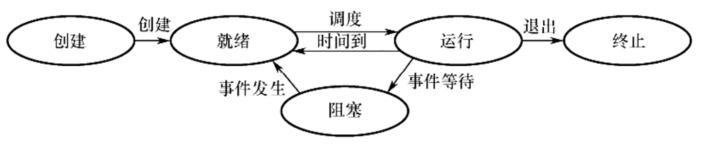
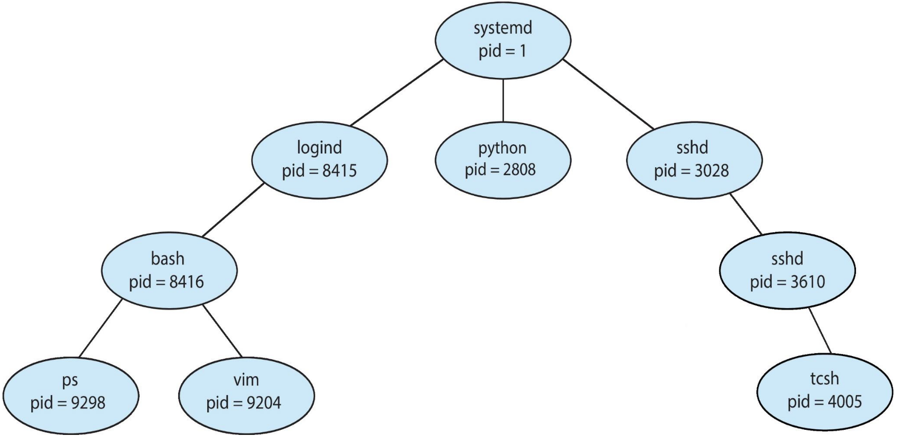

# 进程与线程

## 什么是进程

### 进程的概念与特征

!!! definition "进程"
    进程可以说是计算机中某个程序在运行时的一个实例.举个例子,程序就是一道菜的菜谱,而进程就是你实际做菜的过程.每次你根据菜谱做菜,你都在创建一个新的进程.

    官方话的定义是:__进程是进程实体的运行过程,是系统进行资源分配和调度的一个独立单位。__

    系统资源实际上是CPU,内存等为这个进程分配的时间

进程在内存中运行,它需要硬盘上的一段代码之类的存在,来执行其任务;执行任务中可能会产生各种数据要保存;另外,操作系统也希望了解进程的状态,以便进行调度和管理.

基于以上需求,进程一般由如下三部分组成:

+ 进程控制块(PCB):PCB是进程的一部分,存在于内存中,是进程中最重要的部分.

    <div align="center">
    
    <br>
    <caption>PCB的内容</caption>
</div>

    - PCB不断存储着进程的状态,当前处理器各寄存器的值等,以便于操作系统对进程进行调度和管理.

+ 程序段(text segment):程序段是进程的一部分，包含进程运行所需的机器指令。运行时，程序段会被加载到内存中供 CPU 执行。

    - 多个进程可以共享同一份程序段,也即,多个进程可以运行同一份代码.

+ 数据段(data segment):数据段是进程的一部分,存在于内存中,用于存储进程运行时所需的各种数据.

    - 数据段包含了进程运行所需的全局变量,静态变量等数据.

+ Stack(栈):栈是进程的一部分,存在于内存中,存储函数调用时的临时数据,如函数参数,返回地址,局部变量等.

+ Heap(堆):堆是进程的一部分,存在于内存中,用于动态分配内存.进程运行时,可以通过系统调用向操作系统申请分配一定大小的内存,这部分内存就来自堆.


<div style="text-align: center;">
    
    <br>
    <caption>Process in Memory</caption>
</div>


### 进程的状态与转换

电脑的CPU和内存等资源是有限的,所以,操作系统需要对进程进行调度和管理.进程在其生命周期中会经历不同的状态,这些状态包括:

1. **运行态**(Running):进程正在使用CPU执行其任务.如果是单核CPU,同一时间只能有一个进程处于运行态.

2. **就绪态**(Ready):进程获得了除CPU以外所有需要的资源,只要获得了CPU就可以运行.所有的就绪态进程组成一个**就绪队列**,等待CPU的调度.

3. **阻塞态**(Blocked):也称等待态.进程因为缺少某项资源(不包括CPU)而无法继续执行,只能等待.例如,进程需要等待I/O操作完成,或者等待某个信号量等. 阻塞的进程也会排成一个阻塞队列,有时也会根据不同的阻塞原因分成多个阻塞队列.

4. **创建态**(New):进程刚被创建,还没有进入就绪队列.一个进程的创建,需要先申请一个PCB,在PCB中初始化进程的各种信息,然后还需要等待分配所需的各种系统资源,最后才能进入就绪队列.

5. **终止态**(Terminated):进程完成了其任务,或者因为某种原因被强制终止,进入终止态.进程进入终止态后,操作系统会回收其所占用的资源,并将其PCB等信息从内存中删除.


??? tip "为什么我们需要区分就绪态与阻塞态"
    在系统资源中,CPU资源和其他资源都不一样.CPU是不断轮转的,一个进程可能每次只能分到几毫秒的CPU时间片,然后就要把CPU让给其他进程使用.进程会经常在就绪态和运行态之间切换.

    而阻塞态等待的资源,可能需要等待很长时间,例如等待用户输入,等待网络数据传输等.进程一旦进入阻塞态,就不会再自动变成就绪态,而是要等到所等待的资源变得可用时,操作系统才会把它从阻塞态变成就绪态.

<div style="text-align: center;">
    
    <br>
    <caption>进程状态转换图</caption>
</div>

> 需要注意的是,一个进程从运行态变成阻塞态,是因为它主动请求某项资源,而不是因为操作系统强制它放弃CPU.如果操作系统强制一个运行态进程放弃CPU,那么这个进程会变成就绪态,而不是阻塞态.
>
> 而一个进程从阻塞态变成运行态,往往是一个被动的过程,因为它等待的资源变得可用,操作系统才会把它变成就绪态,然后再调度它进入运行态.

## 进程管理

### 进程的创建

一个进程可以创建另一个进程,这个新创建的进程称为子进程,创建它的进程称为父进程.一个进程可以有多个子进程,但每个子进程只有一个父进程.

<div style="text-align: center;">
    
    <br>
    <caption>进程树</caption>
</div>

这棵树的根是`systemd`进程,它是所有进程的祖先进程.它的`pid`一般是1.在Linux系统中,`systemd`进程负责初始化系统,启动各种服务和守护进程,并管理系统的运行状态.

!!! info "使用fork()创建进程"
    在Unix/Linux系统中,创建进程通常使用`fork()`系统调用.这个调用会创建一个与当前进程几乎完全相同的子进程,子进程会继承父进程的代码段,数据段,堆栈等.

    调用`fork()`时，操作系统内核会执行以下操作：

    1. 分配新的内存和内核数据结构:为子进程分配一个新的、唯一的进程标识符（PID）。

    2. 复制父进程的数据:将父进程的整个地址空间（包括代码段、数据段、堆、栈等）的内容复制到为子进程分配的内存中。

    3. 继承文件描述符:子进程会继承父进程所有打开的文件描述符。这意味着如果父进程打开了一个文件，子进程也会拥有指向同一个文件的文件描述符，并且它们共享相同的文件偏移量。

    4. 将子进程放入就绪队列:创建完成后，子进程被置于进程就绪队列中，等待 CPU 调度执行。

    fork的神奇之处就在于,它会返回两次.就像我们上面说的,进程是"动起来"的程序,所以,当`fork()`被调用时,操作系统会创建一个新的子进程,这个子进程会从`fork()`调用点开始执行,就像父进程一样.

    但不同的在于,这两个进程中`fork`的返回值不同,父进程中返回的是子进程的PID,而子进程中返回的是0.这样,父进程和子进程就可以通过检查`fork()`的返回值来区分自己是哪个进程.

    ```c
    #include <stdio.h>
    #include <stdlib.h>
    #include <unistd.h>
    #include <sys/wait.h>

    int main(int argc, char *argv[]) {
        pid_t pid;
        pid = fork(); // 创建子进程

        if (pid < 0) {
            // 创建失败
            fprintf(stderr, "Fork Failed\n");
            exit(-1);
        } else if (pid == 0) {
            // 子进程
            printf("This is the child process. Running 'ls':\n");
            execlp("/bin/ls", "ls", NULL);
            // execlp 失败才会执行下面这行
            fprintf(stderr, "execlp Failed\n");
            exit(-1);
        } else {
            // 父进程
            wait(NULL); // 等待子进程结束
            sleep(1);
            printf("Child Complete\n");
            exit(0);
        }
    }
    ```

    在这个例子中,当`fork()`被调用时,操作系统会创建一个新的子进程.父进程和子进程都会继续执行`main()`函数中的代码,但它们会根据`fork()`的返回值执行不同的分支.

    这里,`wait(NULL)`是父进程调用的,它会阻塞父进程,直到子进程结束.这样,父进程就可以等待子进程完成它的任务,然后再继续执行.不然的话,父进程和子进程可能会并发执行.

    ??? tip "Copy on Write"
        在上面我们提到,`fork()`会复制父进程的整个地址空间到子进程中.但实际上,如果真的这样做,那么每次`fork`的开销都会很大.因此,现代操作系统通常使用一种叫做"写时复制"(Copy on Write, COW)的技术来优化这个过程.

        写时复制的基本思想是,在`fork()`之后,父进程和子进程会共享同一份内存页面(只读),直到其中一个进程尝试修改这部分内存.当一个进程尝试写入共享的内存页面时,操作系统会为该进程创建该页面的一个私有副本,并将修改操作应用到这个副本上.这样,只有在实际需要修改内存时,才会进行内存复制,从而大大减少了`fork()`的开销.

### 进程的终止

当进程:

1. 正常完成任务

2. 被其他进程强制终止(如使用`kill`命令)

3. 出现严重错误(如非法内存访问等)

就会进入终止态.该进程会调用`exit()`系统调用,通知操作系统它已经结束.操作系统会回收该进程占用的资源,或直接释放,或被父进程通过调用`wait()`系统调用来回收.

但如果父进程没有调用`wait()`来回收子进程,那么子进程就会变成**僵尸进程(Zombie)**.僵尸进程仍然占用系统资源,但它已经不再执行任何任务.如果一个父进程创建了很多子进程,但没有及时回收它们,那么这些僵尸进程会占用大量系统资源,可能导致系统性能下降.

在现代的linux系统中,当这个僵尸进程的父进程终止时,僵尸进程会被`init`进程收养,然后`init`进程会定期调用`wait()`来回收这些僵尸进程,从而防止僵尸进程无限制地积累.