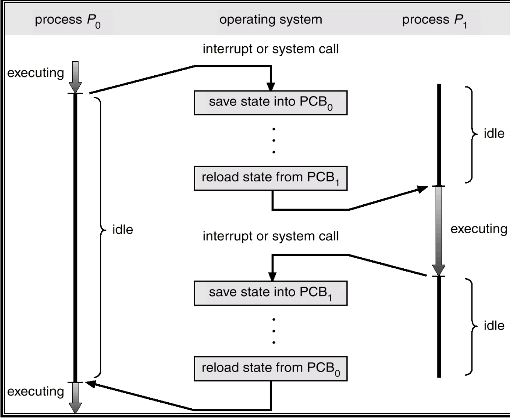

# 进程与线程

## 什么是进程

### 进程的概念与特征

!!! definition "进程"
    进程可以说是计算机中某个程序在运行时的一个实例.举个例子,程序就是一道菜的菜谱,而进程就是你实际做菜的过程.每次你根据菜谱做菜,你都在创建一个新的进程.

    官方话的定义是:__进程是进程实体的运行过程,是系统进行资源分配和调度的一个独立单位。__

    系统资源实际上是CPU,内存等为这个进程分配的时间

进程在内存中运行,它需要硬盘上的一段代码之类的存在,来执行其任务;执行任务中可能会产生各种数据要保存;另外,操作系统也希望了解进程的状态,以便进行调度和管理.

基于以上需求,进程一般由如下三部分组成:

+ 进程控制块(PCB):PCB是进程的一部分,存在于内存中,是进程中最重要的部分.

    <div align="center">
    
    <br>
    <caption>PCB的内容</caption>
</div>

    - PCB不断存储着进程的状态,当前处理器各寄存器的值等,以便于操作系统对进程进行调度和管理.

+ 程序段(text segment):程序段是进程的一部分，包含进程运行所需的机器指令。运行时，程序段会被加载到内存中供 CPU 执行。

    - 多个进程可以共享同一份程序段,也即,多个进程可以运行同一份代码.

+ 数据段(data segment):数据段是进程的一部分,存在于内存中,用于存储进程运行时所需的各种数据.

    - 数据段包含了进程运行所需的全局变量,静态变量等数据.

+ Stack(栈):栈是进程的一部分,存在于内存中,存储函数调用时的临时数据,如函数参数,返回地址,局部变量等.

+ Heap(堆):堆是进程的一部分,存在于内存中,用于动态分配内存.进程运行时,可以通过系统调用向操作系统申请分配一定大小的内存,这部分内存就来自堆.


<div style="text-align: center;">
    
    <br>
    <caption>Process in Memory</caption>
</div>


### 进程的状态与转换

电脑的CPU和内存等资源是有限的,所以,操作系统需要对进程进行调度和管理.进程在其生命周期中会经历不同的状态,这些状态包括:

1. **运行态**(Running):进程正在使用CPU执行其任务.如果是单核CPU,同一时间只能有一个进程处于运行态.

2. **就绪态**(Ready):进程获得了除CPU以外所有需要的资源,只要获得了CPU就可以运行.所有的就绪态进程组成一个**就绪队列**,等待CPU的调度.

3. **阻塞态**(Blocked):也称等待态(Waiting).进程因为缺少某项资源(不包括CPU)而无法继续执行,只能等待.例如,进程需要等待I/O操作完成,或者等待某个信号量等. 阻塞的进程也会排成一个阻塞队列,有时也会根据不同的阻塞原因分成多个阻塞队列.

4. **创建态**(New):进程刚被创建,还没有进入就绪队列.一个进程的创建,需要先申请一个PCB,在PCB中初始化进程的各种信息,然后还需要等待分配所需的各种系统资源,最后才能进入就绪队列.

5. **终止态**(Terminated):进程完成了其任务,或者因为某种原因被强制终止,进入终止态.进程进入终止态后,操作系统会回收其所占用的资源,并将其PCB等信息从内存中删除.


??? tip "为什么我们需要区分就绪态与阻塞态"
    在系统资源中,CPU资源和其他资源都不一样.CPU是不断轮转的,一个进程可能每次只能分到几毫秒的CPU时间片,然后就要把CPU让给其他进程使用.进程会经常在就绪态和运行态之间切换.

    而阻塞态等待的资源,可能需要等待很长时间,例如等待用户输入,等待网络数据传输等.进程一旦进入阻塞态,就不会再自动变成就绪态,而是要等到所等待的资源变得可用时,操作系统才会把它从阻塞态变成就绪态.

<div style="text-align: center;">
    
    <br>
    <caption>进程状态转换图</caption>
</div>

> 需要注意的是,一个进程从运行态变成阻塞态,是因为它主动请求某项资源,而不是因为操作系统强制它放弃CPU.如果操作系统强制一个运行态进程放弃CPU,那么这个进程会变成就绪态,而不是阻塞态.
>
> 而一个进程从阻塞态变成运行态,往往是一个被动的过程,因为它等待的资源变得可用,操作系统才会把它变成就绪态,然后再调度它进入运行态.

## 进程管理

### 进程的创建

一个进程可以创建另一个进程,这个新创建的进程称为子进程,创建它的进程称为父进程.一个进程可以有多个子进程,但每个子进程只有一个父进程.

<div style="text-align: center;">
    
    <br>
    <caption>进程树</caption>
</div>

这棵树的根是`systemd`进程,它是所有进程的祖先进程.它的`pid`一般是1.在Linux系统中,`systemd`进程负责初始化系统,启动各种服务和守护进程,并管理系统的运行状态.

!!! info "使用fork()创建进程"
    在Unix/Linux系统中,创建进程通常使用`fork()`系统调用.这个调用会创建一个与当前进程几乎完全相同的子进程,子进程会继承父进程的代码段,数据段,堆栈等.

    调用`fork()`时，操作系统内核会执行以下操作：

    1. 分配新的内存和内核数据结构:为子进程分配一个新的、唯一的进程标识符（PID）。

    2. 复制父进程的数据:将父进程的整个地址空间（包括代码段、数据段、堆、栈等）的内容复制到为子进程分配的内存中。

    3. 继承文件描述符:子进程会继承父进程所有打开的文件描述符。这意味着如果父进程打开了一个文件，子进程也会拥有指向同一个文件的文件描述符，并且它们共享相同的文件偏移量。

    4. 将子进程放入就绪队列:创建完成后，子进程被置于进程就绪队列中，等待 CPU 调度执行。

    fork的神奇之处就在于,它会返回两次.就像我们上面说的,进程是"动起来"的程序,所以,当`fork()`被调用时,操作系统会创建一个新的子进程,这个子进程会从`fork()`调用点开始执行,就像父进程一样.

    但不同的在于,这两个进程中`fork`的返回值不同,父进程中返回的是子进程的PID,而子进程中返回的是0.这样,父进程和子进程就可以通过检查`fork()`的返回值来区分自己是哪个进程.

    ```c
    #include <stdio.h>
    #include <stdlib.h>
    #include <unistd.h>
    #include <sys/wait.h>

    int main(int argc, char *argv[]) {
        pid_t pid;
        pid = fork(); // 创建子进程

        if (pid < 0) {
            // 创建失败
            fprintf(stderr, "Fork Failed\n");
            exit(-1);
        } else if (pid == 0) {
            // 子进程
            printf("This is the child process. Running 'ls':\n");
            execlp("/bin/ls", "ls", NULL);
            // execlp 失败才会执行下面这行
            fprintf(stderr, "execlp Failed\n");
            exit(-1);
        } else {
            // 父进程
            wait(NULL); // 等待子进程结束
            sleep(1);
            printf("Child Complete\n");
            exit(0);
        }
    }
    ```

    在这个例子中,当`fork()`被调用时,操作系统会创建一个新的子进程.父进程和子进程都会继续执行`main()`函数中的代码,但它们会根据`fork()`的返回值执行不同的分支.

    这里,`wait(NULL)`是父进程调用的,它会阻塞父进程,直到子进程结束.这样,父进程就可以等待子进程完成它的任务,然后再继续执行.不然的话,父进程和子进程可能会并发执行.

    ??? tip "Copy on Write"
        在上面我们提到,`fork()`会复制父进程的整个地址空间到子进程中.但实际上,如果真的这样做,那么每次`fork`的开销都会很大.因此,现代操作系统通常使用一种叫做"写时复制"(Copy on Write, COW)的技术来优化这个过程.

        写时复制的基本思想是,在`fork()`之后,父进程和子进程会共享同一份内存页面(只读),直到其中一个进程尝试修改这部分内存.当一个进程尝试写入共享的内存页面时,操作系统会为该进程创建该页面的一个私有副本,并将修改操作应用到这个副本上.这样,只有在实际需要修改内存时,才会进行内存复制,从而大大减少了`fork()`的开销.

### 进程的终止

当进程:

1. 正常完成任务

2. 被其他进程强制终止(如使用`kill`命令)

3. 出现严重错误(如非法内存访问等)

就会进入终止态.该进程会调用`exit()`系统调用,通知操作系统它已经结束.操作系统会回收该进程占用的资源,或直接释放,或被父进程通过调用`wait()`系统调用来回收.

但如果父进程没有调用`wait()`来回收子进程,那么子进程就会变成**僵尸进程(Zombie)**.僵尸进程仍然占用系统资源,但它已经不再执行任何任务.如果一个父进程创建了很多子进程,但没有及时回收它们,那么这些僵尸进程会占用大量系统资源,可能导致系统性能下降.

在现代的linux系统中,当这个僵尸进程的父进程终止时,僵尸进程会被`init`进程收养,然后`init`进程会定期调用`wait()`来回收这些僵尸进程,从而防止僵尸进程无限制地积累.

僵尸进程和孤儿进程是两种不同的概念:

- **僵尸进程**:是指已经终止但其父进程尚未调用`wait()`来回收其资源的进程.僵尸进程仍然占用系统资源,但它已经不再执行任何任务.

- **孤儿进程**:是指其父进程已经终止,但它本身仍在运行的进程.孤儿进程会被`init`进程收养,并由`init`进程负责回收其资源.


### 进程通信(Interprocess Communication)

在实际操作中,不同进程之间往往需要交换数据或协同工作.为此,操作系统提供了多种进程间通信(IPC)机制,包括:

1. 共享内存(Shared Memory):多个进程可以访问同一块内存区域,从而实现高速数据交换.这种方式效率较高,但需要进程自行管理同步和互斥.

2. 消息传递(Message Passing):进程可以通过消息队列发送和接收消息.消息队列由操作系统管理,可以实现进程间的异步通信.

    - **直接通信**:发送方直接把消息发送给接收方,接收方直接从发送方接收消息.这种方式要求发送方和接收方必须知道对方的标识符(如PID等).

    - **间接通信**:发送方把消息发送到一个中间的消息队列(称为信箱),接收方从消息队列中接收消息.这种方式不要求发送方和接收方知道对方的标识符,只需要知道消息队列的标识符即可.

3. 管道(Pipes):管道是一种半双工的通信方式,允许一个进程将数据写入管道,另一个进程从管道读取数据.匿名管道通常用于有亲缘关系的进程之间的通信.

    - 管道满之前,读取进程会被阻塞;管道空之前,写入进程会被阻塞.

4. 信号(Signals):信号是一种异步通知机制,允许进程向另一个进程发送信号,以通知某个事件的发生.信号通常用于处理异步事件,如中断等.


## 进程调度
> 在进程调度中,通常有三个队列
>
> 1. 就绪队列(Ready queue):包含所有处于就绪态的进程,等待CPU调度,位于内存中.
>
> 2. 阻塞队列(Device queues):包含所有处于阻塞态的进程,等待某个事件发生.
>
> 3. 总队列(Job queue):包含所有创建但尚未进入就绪队列的进程.

一个进程从创建到完成,往往要经历三种调度:

1. **长程调度(Long-term scheduling)**:从总队列中选择进程进入就绪队列,为它们分配内存,I/O等资源,让它们能够参与竞争CPU.长程调度的频率较低,通常在几秒到几分钟之间.

2. **短程调度(Short-term scheduling)**:从就绪队列中选择一个进程进入运行态,分配CPU时间片.短程调度的频率较高,通常在几毫秒到几百毫秒之间.

3. **中程调度(Medium-term scheduling)**:将某些处于阻塞状态的进程从内存中换出到磁盘上,以释放内存资源,或者将某些进程从磁盘上换入到内存中,以便它们能够参与竞争CPU.对于那些被挂起到外存到进程,我们也可以叫它们挂起态.中程调度的频率介于长程调度和短程调度之间,通常在几秒到几十秒之间.

!!! info "上下文切换"
    当操作系统从一个进程切换到另一个进程时,需要保存当前进程的状态(寄存器值,程序计数器等)到它的PCB中,然后加载下一个进程的状态到CPU寄存器中.这个过程称为**上下文切换(Context Switch)**.

    上下文切换是一个开销较大的操作,因为它涉及到保存和加载寄存器状态,更新内存映射等.

    <div style="text-align: center;">
        
        <br>
        <caption>上下文切换</caption>
    </div>

## 线程
> 线程简单理解就是轻量化的进程.一个进程可以包含多个线程,这些线程共享进程的资源(如内存空间,文件描述符等),但每个线程有自己的寄存器状态和栈空间.

- 进程是资源分配与调度的基本单位

- 线程是CPU调度与执行的基本单位

相比于进程,线程的优点包括:

1. 创建和销毁开销较小:创建和销毁线程的开销远小于进程,因为线程共享进程的资源,不需要为每个线程分配独立的内存空间等.

2. 上下文切换开销较小:线程共享进程的内存空间等资源,不需要切换内存映射等.

3. 资源共享更方便:线程共享进程的内存空间等资源,线程之间可以直接访问共享数据,不需要使用复杂的进程间通信机制.

<div style="text-align: center;">
    
    <br>
    <caption>多线程系统</caption>
</div>

### 线程的状态与转换

线程有以下几种状态:

1. 执行态(Running):线程正在使用CPU执行其任务.

2. 就绪态(Ready):线程获得了除CPU以外所有需要的资源,只要获得了CPU就可以运行.

3. 阻塞态(Blocked):线程因为缺少某项资源(不包括CPU)而无法继续执行,只能等待.

这几种状态的转换逻辑和进程是类似的

### 线程的控制

正如进程有进程控制块(PCB)一样,线程也有线程控制块(TCB).TCB包含了线程的各种信息,包括:

1. 线程标识符(TID)

2. 寄存器状态

3. 线程状态

4. 优先级

5. 栈指针

要注意的是,统一进程中不同线程所共享的只有进程的资源(如内存空间,文件描述符等),而每个线程有自己的寄存器状态和栈空间.

为了创建一个线程,一般会使用`pthread_create()`函数.这个函数会创建一个新的线程,并指定该线程要执行的函数.

```c
#include <stdio.h>
#include <stdlib.h>
#include <pthread.h>
void* thread_function(void* arg) {
    printf("Hello from the new thread!\n");
    return NULL;
}
int main() {
    pthread_t thread;
    // 创建一个新线程
    if (pthread_create(&thread, NULL, thread_function, NULL) != 0) {
        fprintf(stderr, "Error creating thread\n");
        return 1;
    }
    // 等待线程结束
    pthread_join(thread, NULL);
    printf("Thread has finished execution.\n");
    return 0;
}
```

线程在终止时,一般不会立刻释放其资源,而是进入一个类似僵尸进程的状态,直到另一个线程调用`pthread_join()`来回收其资源,或者有线程重新调用了这个被终止的线程.

## 线程的实现方式
> 线程的实现方式主要有两种:用户级线程(User-level threads)和内核级线程(Kernel-level threads).

### 用户级线程与内核级线程

用户级线程是在用户空间中实现的线程管理.用户级线程库负责创建,调度和管理线程,而操作系统内核并不知道这些线程的存在.

而内核级线程则是由操作系统内核直接管理的线程.内核级线程由内核负责创建,调度和管理,时间片直接以线程为单位分配.

进程是由内核创建,管理,并调度的,然而,进程中的线程却可以分为用户级和内核级两种.

这种区别,就形成了用户级多线程和内核级多线程两种模式

1. 用户级多线程(User-level multithreading):多个用户级线程由一个内核级进程来管理.内核只知道这个进程的存在,而不知道进程中的线程.用户级线程库负责线程的创建,调度和管理.

    - 优点:创建和销毁线程的开销较小,上下文切换开销较小,资源共享更方便.

    - 缺点:如果一个线程阻塞了,那么整个进程都会被阻塞,因为内核只知道进程的存在;用户级线程库需要自己实现调度算法

2. 内核级多线程(Kernel-level multithreading):内核直接管理多个线程,每个线程都有自己的线程控制块(TCB).内核负责线程的创建,调度和管理,时间片直接以线程为单位分配.

    - 优点:如果一个线程阻塞了,其他线程仍然可以继续执行;内核可以更好地利用多核CPU,实现真正的并行执行.

    - 缺点:创建和销毁线程的开销较大,上下文切换开销较大


3. 混合多线程(Hybrid multithreading):结合了用户级多线程和内核级多线程的优点.多个用户级线程映射到多个内核级线程上,内核负责调度内核级线程,而用户级线程库负责调度用户级线程.

    - 优点:结合了用户级和内核级多线程的优点,提高了系统的并发性能和资源利用率.

    - 缺点:实现复杂度较高,需要协调用户级线程库和内核之间的调度.

<div style="text-align: center;">
    
    <br>
    <caption>线程的实现方式</caption>
</div>

!!! info "总结"
    用户级多线程（多对一模型）与内核级多线程（一对一模型）的核心区别在于操作系统内核的“可见性”，这直接决定了程序能否实现并行。

    在**用户级多线程**中，多个用户线程被映射到**一个**内核线程上。内核只认识这一个内核线程，因此在多核CPU环境下，它最多也只会将这一个内核线程分配到**一个**CPU核心上。这意味着，所有用户线程只能在**这一个核心上并发（Concurrency）**执行（即宏观上同时，微观上交替），**无法实现并行（Parallelism）**（即真正的多核同时执行）。

    而在**内核级多线程**中，**每一个**用户线程都对应一个独立的内核线程。内核“看见”并管理所有这些内核线程，因此它可以将它们**调度到多个不同的CPU核心上**。这使得该模型能够实现真正的**并行**。当线程数多于核心数时，内核会在每个核心上再进行**并发**调度。

## CPU调度

正如[上文](#进程调度)中讲过,进程会在经由高级调度,中程调度,短程调度等过程,最终被分配到CPU上执行.在多道程序设计环境下,多个进程会竞争CPU资源,操作系统需要一个调度算法来决定哪个进程获得CPU使用权.

总体来说,调度分为**抢占式调度(Preemptive)**和**非抢占式调度(Nonpreemptive)**:

- **抢占式调度(Preemptive Scheduling)**: 当一个进程正在运行时,系统剥夺它的CPU使用权,将CPU分配给另一个进程.这种方式允许更高优先级的进程及时获得CPU资源,提高系统响应速度.

- **非抢占式调度(Nonpreemptive Scheduling)**: 一旦一个进程获得了CPU使用权,它将一直运行直到它完成任务或进入阻塞状态.这种方式简单易实现,但可能导致低优先级进程长时间得不到CPU资源.

---

CPU调度的原则,就是选出一个最合适的进程来运行."合适"的评判标准有很多,容易想到的就有优先级.不同的调度算法,会有不同的评判标准.常见的指标有:

1. 周转时间(Turnaround Time):从进程提交到进程完成所需的总时间.

    - 平均周转时间 = (所有进程的周转时间之和) / (进程总数)

    - 带权周转时间(Weighted Turnaround Time):周转时间与服务时间(进程实际的运行时间)的比值.

2. 等待时间(Waiting Time):进程在就绪队列中等待CPU分配的总时间.

3. 响应时间(Response Time):从进程提交到进程开始执行所需的时间.

4. 吞吐量(Throughput):单位时间内完成的进程数量.

    - 平均周转时间不是吞吐量的倒数,因为并发执行的进程在时间上可以重叠。如:在2小时内完成4个进程,而每个周转时间是1小时,则吞吐量是2个进程/小时

5. CPU利用率(CPU Utilization):CPU被有效使用的时间占总时间的比例.

CPU调度的总体目标就是,最大化CPU利用率和吞吐量,最小化周转时间,等待时间和响应时间.

---

### FCFS调度算法
> First-Come, First-Served Scheduling

- 采用非抢占式调度,当前进程占用CPU直到完成或阻塞

- 按照进程到达就绪队列的顺序分配CPU资源

FCFS算法很容易受到进程顺序的影响,如果一个长进程先到达,那么后续的短进程就会被迫等待很长时间,导致平均等待时间和周转时间变长.

??? example "FCFS调度算法示例"
    假设有三个进程P1, P2, P3, 它们的到达顺序为 P1, P2, P3，且几乎同时到达。它们的CPU执行时间（Burst Time）如下:

    | 进程 | 执行时间 |
    |------|----------|----------|
    | P1   | 24       |
    | P2   | 3        |
    | P3   | 3        |

    按照FCFS调度算法, 进程的执行顺序为 P1 -> P2 -> P3。

    甘特图如下:
    ```
    | P1 (0-24) | P2 (24-27) | P3 (27-30) |
    ```

    - **等待时间**:

        - P1的等待时间 = 0

        - P2的等待时间 = 24

        - P3的等待时间 = 27

        - 平均等待时间 = (0 + 24 + 27) / 3 = 17

    - **周转时间**:

        - P1的周转时间 = 24

        - P2的周转时间 = 27

        - P3的周转时间 = 30

        - 平均周转时间 = (24 + 27 + 30) / 3 = 27

    这个例子展示了FCFS算法的护航效应（Convoy Effect）：一个长进程（P1）先到达，导致后续的短进程（P2, P3）需要等待很长时间。

### SJF调度算法
> Shortest Job First Scheduling

也就是优先执行预期执行时间最短的进程.

有两种实现方式:

1. 非抢占式SJF:一旦一个进程获得了CPU使用权,它将一直运行直到它完成任务或进入阻塞状态.

2. 抢占式SJF(也称为最短剩余时间优先,Shortest Remaining Time First, SRTF):如果一个新到达的进程的预期执行时间比当前运行的进程的剩余时间还短,那么系统会剥夺当前进程的CPU使用权,将CPU分配给新到达的进程.


??? example
    === "非抢占式"
        假设有四个进程P1, P2, P3, P4，它们的到达时间和执行时间如下:

        | 进程 | 到达时间 | 执行时间 |
        |------|----------|----------|
        | P1   | 0        | 7        |
        | P2   | 2        | 4        |
        | P3   | 4        | 1        |
        | P4   | 5        | 4        |

        按照非抢占式SJF调度算法，进程的执行顺序如下:

        1.  **时刻 0**: 只有P1到达，P1开始执行。
        2.  **时刻 7**: P1执行完毕。此时P2, P3, P4均已到达。就绪队列中的进程为 {P2(4), P3(1), P4(4)}。选择执行时间最短的P3。
        3.  **时刻 8**: P3执行完毕。就绪队列中的进程为 {P2(4), P4(4)}。P2和P4执行时间相同，按FCFS原则选择先到达的P2。
        4.  **时刻 12**: P2执行完毕。执行P4。
        5.  **时刻 16**: P4执行完毕。

        甘特图如下:
        ```
        | P1 (0-7) | P3 (7-8) | P2 (8-12) | P4 (12-16) |
        ```

        - **周转时间 (完成时间 - 到达时间)**:
            - P1: 7 - 0 = 7
            - P2: 12 - 2 = 10
            - P3: 8 - 4 = 4
            - P4: 16 - 5 = 11
            - 平均周转时间 = (7 + 10 + 4 + 11) / 4 = 8

        - **等待时间 (周转时间 - 执行时间)**:
            - P1: 7 - 7 = 0
            - P2: 10 - 4 = 6
            - P3: 4 - 1 = 3
            - P4: 11 - 4 = 7
            - 平均等待时间 = (0 + 6 + 3 + 7) / 4 = 4

    === "抢占式"
        同样使用这四个进程的数据:

        | 进程 | 到达时间 | 执行时间 |
        |------|----------|----------|
        | P1   | 0        | 7        |
        | P2   | 2        | 4        |
        | P3   | 4        | 1        |
        | P4   | 5        | 4        |

        按照抢占式SJF（SRTF）调度算法，进程的执行顺序如下:

        1.  **时刻 0**: P1到达，开始执行。剩余时间为7。
        2.  **时刻 2**: P2到达，执行时间为4。此时P1剩余时间为5。因为 4 < 5，P1被抢占，P2开始执行。
        3.  **时刻 4**: P3到达，执行时间为1。此时P2剩余时间为2。因为 1 < 2，P2被抢占，P3开始执行。
        4.  **时刻 5**: P3执行完毕。P4到达，执行时间为4。就绪队列中有P1(剩余5)和P2(剩余2)。选择剩余时间最短的P2继续执行。
        5.  **时刻 7**: P2执行完毕。就绪队列中有P1(剩余5)和P4(剩余4)。选择剩余时间最短的P4执行。
        6.  **时刻 11**: P4执行完毕。执行P1。
        7.  **时刻 16**: P1执行完毕。

        甘特图如下:
        ```
        | P1(0-2) | P2(2-4) | P3(4-5) | P2(5-7) | P4(7-11) | P1(11-16) |
        ```

        - **周转时间 (完成时间 - 到达时间)**:
            - P1: 16 - 0 = 16
            - P2: 7 - 2 = 5
            - P3: 5 - 4 = 1
            - P4: 11 - 5 = 6
            - 平均周转时间 = (16 + 5 + 1 + 6) / 4 = 7

        - **等待时间 (周转时间 - 执行时间)**:
            - P1: 16 - 7 = 9
            - P2: 5 - 4 = 1
            - P3: 1 - 1 = 0
            - P4: 6 - 4 = 2
            - 平均等待时间 = (9 + 1 + 0 + 2) / 4 = 3

!!! info "最高响应比优先(Highest Response Ratio Next)调度算法"
    HRRN是一种改进的SJF算法,它综合考虑了进程的等待时间和预期执行时间.具体来说,HRRN计算每个进程的响应比:

    \[
    响应比 = \frac{等待时间 + 预期执行时间}{预期执行时间}
    \]

    然后选择响应比最高的进程来运行.这种方式可以避免SJF中长进程被饿死的问题,因为随着等待时间的增加,长进程的响应比也会增加.

然而,实际应用中,我们一般不使用SJF算法,一方面是因为很难准确预测进程的执行时间,另一方面是SJF算法可能导致长进程被饿死,因为短进程不断到达,长进程可能永远得不到CPU资源.


### 优先级调度算法
> Priority Scheduling

总是使优先级高的进程从就绪队列中获得CPU资源.

优先级的划分有两种方式:

1. 静态优先级(Static Priority):进程的优先级在创建时就确定,在进程的生命周期内不变.

2. 动态优先级(Dynamic Priority):进程的优先级可以根据某些因素(如等待时间,资源使用情况等)动态调整.

??? example "优先级调度示例（数值越小，优先级越高）"
    === "非抢占式"
        假设有五个进程P1, P2, P3, P4, P5，它们几乎同时到达，执行时间和优先级如下:

        | 进程 | 执行时间 | 优先级 |
        |------|----------|----------|
        | P1   | 10       | 3        |
        | P2   | 1        | 1        |
        | P3   | 2        | 4        |
        | P4   | 1        | 5        |
        | P5   | 5        | 2        |

        按照非抢占式优先级调度算法，进程的执行顺序如下:

        1.  **时刻 0**: 所有进程到达。P2优先级最高(1)，P2开始执行。
        2.  **时刻 1**: P2执行完毕。就绪队列中P5优先级最高(2)，P5开始执行。
        3.  **时刻 6**: P5执行完毕。就绪队列中P1优先级最高(3)，P1开始执行。
        4.  **时刻 16**: P1执行完毕。就绪队列中P3优先级最高(4)，P3开始执行。
        5.  **时刻 18**: P3执行完毕。执行P4。
        6.  **时刻 19**: P4执行完毕。

        甘特图如下:
        ```
        | P2(0-1) | P5(1-6) | P1(6-16) | P3(16-18) | P4(18-19) |
        ```

        - **周转时间 (完成时间 - 到达时间)**:
            - P1: 16 - 0 = 16
            - P2: 1 - 0 = 1
            - P3: 18 - 0 = 18
            - P4: 19 - 0 = 19
            - P5: 6 - 0 = 6
            - 平均周转时间 = (16 + 1 + 18 + 19 + 6) / 5 = 12

        - **等待时间 (周转时间 - 执行时间)**:
            - P1: 16 - 10 = 6
            - P2: 1 - 1 = 0
            - P3: 18 - 2 = 16
            - P4: 19 - 1 = 18
            - P5: 6 - 5 = 1
            - 平均等待时间 = (6 + 0 + 16 + 18 + 1) / 5 = 8.2

    === "抢占式"
        假设有五个进程，它们的到达时间、执行时间和优先级如下:

        | 进程 | 到达时间 | 执行时间 | 优先级 |
        |------|----------|----------|----------|
        | P1   | 0        | 10       | 3        |
        | P2   | 1        | 1        | 1        |
        | P3   | 4        | 2        | 4        |
        | P4   | 5        | 1        | 2        |
        | P5   | 8        | 5        | 2        |

        按照抢占式优先级调度算法，进程的执行顺序如下:

        1.  **时刻 0**: P1到达(Prio=3)，开始执行。
        2.  **时刻 1**: P2到达(Prio=1)，优先级高于P1，P1被抢占。P1剩余时间9。P2开始执行。
        3.  **时刻 2**: P2执行完毕。就绪队列中只有P1，P1继续执行。
        4.  **时刻 5**: P4到达(Prio=2)，优先级高于P1，P1被抢占。P1剩余时间6。P4开始执行。
        5.  **时刻 6**: P4执行完毕。就绪队列中只有P1，P1继续执行。
        6.  **时刻 8**: P5到达(Prio=2)，优先级高于P1，P1被抢占。P1剩余时间4。P5开始执行。
        7.  **时刻 13**: P5执行完毕。就绪队列中只有P1，P1继续执行。
        8.  **时刻 17**: P1执行完毕。就绪队列中只有P3，P3开始执行。
        9.  **时刻 19**: P3执行完毕。

        甘特图如下:
        ```
        | P1(0-1) | P2(1-2) | P1(2-5) | P4(5-6) | P1(6-8) | P5(8-13) | P1(13-17) | P3(17-19) |
        ```

        - **周转时间 (完成时间 - 到达时间)**:
            - P1: 17 - 0 = 17
            - P2: 2 - 1 = 1
            - P3: 19 - 4 = 15
            - P4: 6 - 5 = 1
            - P5: 13 - 8 = 5
            - 平均周转时间 = (17 + 1 + 15 + 1 + 5) / 5 = 7.8

        - **等待时间 (周转时间 - 执行时间)**:
            - P1: 17 - 10 = 7
            - P2: 1 - 1 = 0
            - P3: 15 - 2 = 13
            - P4: 1 - 1 = 0
            - P5: 5 - 5 = 0
            - 平均等待时间 = (7 + 0 + 13 + 0 + 0) / 5 = 4

### 时间片轮转调度算法
> Round Robin Scheduling

时间片轮转调度是基于FCFS与抢占式调度的一种结合.系统中所有就绪的进程按照先来先服务的顺序排成一个循环队列,队首的进程获得CPU使用权,运行一个时间片(通常为几十毫秒).如果进程在时间片内完成任务,则释放CPU;否则,进程被剥夺CPU使用权,放到队列**尾部**,下一个进程获得CPU使用权.

用代码来写,大致就是:

```c title="RoundRobin"
while (!readyQueue.isEmpty()) {
    // 从队首取出进程
    process = readyQueue.dequeue();
    
    if (process.remainingTime > timeSlice) {
        // 运行一个时间片
        run(process, timeSlice);
        process.remainingTime -= timeSlice;
        // 将进程放回队尾
        readyQueue.enqueue(process);
    } else {
        // 运行剩余时间,进程完成
        run(process, process.remainingTime);
        process.remainingTime = 0;
        // 进程完成,不再放回队列
    }
}
```

??? example "时间片轮转调度示例"
    假设有四个进程P1, P2, P3, P4，它们几乎同时到达，时间片（Time Quantum）为20ms。它们的CPU执行时间（Burst Time）如下：

    | 进程 | 执行时间 |
    |:----:|:----------:|
    | P1   | 53         |
    | P2   | 17         |
    | P3   | 68         |
    | P4   | 24         |

    调度过程的甘特图如下：

    ```
    | P1 | P2 | P3 | P4 | P1 | P3 | P4 | P1 | P3 | P3 |
    0    20   37   57   77   97   117  121  134  154  162
    ```

    **调度过程分析 (时间片 = 20ms):**

    1.  **0-20**: P1运行20ms。P1剩余33ms。队列: `[P2, P3, P4, P1]`

    2.  **20-37**: P2运行17ms后完成。队列: `[P3, P4, P1]`

    3.  **37-57**: P3运行20ms。P3剩余48ms。队列: `[P4, P1, P3]`

    4.  **57-77**: P4运行20ms。P4剩余4ms。队列: `[P1, P3, P4]`

    5.  **77-97**: P1运行20ms。P1剩余13ms。队列: `[P3, P4, P1]`

    6.  **97-117**: P3运行20ms。P3剩余28ms。队列: `[P4, P1, P3]`

    7.  **117-121**: P4运行4ms后完成。队列: `[P1, P3]`

    8.  **121-134**: P1运行13ms后完成。队列: `[P3]`

    9.  **134-154**: P3运行20ms。P3剩余8ms。队列: `[P3]`

    10. **154-162**: P3运行8ms后完成。

    **性能指标计算:**

    - **周转时间 (完成时间 - 到达时间)**:
        - P1: 134 - 0 = 134
        - P2: 37 - 0 = 37
        - P3: 162 - 0 = 162
        - P4: 121 - 0 = 121
        - **平均周转时间** = (134 + 37 + 162 + 121) / 4 = **113.5ms**

    - **等待时间 (周转时间 - 执行时间)**:
        - P1: 134 - 53 = 81
        - P2: 37 - 17 = 20
        - P3: 162 - 68 = 94
        - P4: 121 - 24 = 97
        - **平均等待时间** = (81 + 20 + 94 + 97) / 4 = **73ms**

    > 时间片轮转调度算法的平均周转时间通常比SJF算法要高，但它的响应时间更短，对交互式系统更友好。

RR算法中,比较重要的就是确定时间片的大小:

- 如果时间片过大,则接近于FCFS调度,响应时间变长.

- 如果时间片过小,则上下文切换开销增加,降低CPU利用率.

一般来说,我们希望时间片的长度大于80%进程的CPU执行时间,但又不能太大,通常在20-100ms之间.

### 多级队列调度算法

根据进程的特性(如优先级,交互性等),将进程划分到不同的队列中,每个队列有自己的调度算法和优先级.常见的划分方式有:

- 前台队列(交互式进程)和后台队列(批处理进程)

- 高优先级队列和低优先级队列

- 系统进程队列和用户进程队列‘

以前台队列/后台队列的划分为例,我们对于前台队列使用RR调度算法,而对于后台队列使用FCFS调度算法.

而对于这两个队列之间的调度,同样有两种方式:

1. 固定优先级调度:始终优先调度前台队列,只有当前台队列为空时,才调度后台队列.

2. 给定时间片调度:为每个队列分配特定的CPU时间,例如二八开

### 多级反馈队列调度算法

1. 设置多个就绪队列,每个队列有不同的优先级

2. 新进程创建后,进入最高优先级队列的末尾,使用RR调度算法

3. 如果新进程在一个时间片内未完成,则被剥夺CPU使用权,放入下一个较低优先级的队列末尾,继续使用RR调度算法

4. 直到最后的队列,使用FCFS调度算法

5. 仅当较高优先级的队列为空时,才调度较低优先级的队列.如果进程执行时,有更高优先级的进程到达,则当前进程被剥夺CPU使用权,放回其所在队列的末尾

优先级越**高**的队列,时间片越**短**,响应时间越**快**.这种方式可以兼顾交互性进程和CPU密集型进程的需求,提高系统的整体性能.

<div style="text-align: center;">
    
    <br>
    <caption>多级反馈队列调度算法</caption>
</div>

## Windows API

Windows操作系统提供了一套丰富的API来管理进程和线程.以下是一些常用的Windows API函数:

- 创建进程: `CreateProcess()`

- 终止进程: `TerminateProcess()`

- 创建线程: `CreateThread()`

### 线程优先级

Windows中,调度的单位是线程,每个线程都有一个优先级.线程的优先级决定了它在调度中的相对重要性,优先级高的线程更有可能获得CPU资源. 

评判一个windows线程的优先级时,有两个部分:

+ 基础优先级(Base Priority):线程的初始优先级,由线程所属的进程优先级类(Process Priority Class)和线程优先级(Thread Priority Level)共同决定.

+ 动态优先级(Dynamic Priority):操作系统根据线程的行为(如I/O操作,等待时间等)动态调整线程的优先级.

基础的优先级类有六种:


- `REALTIME_PRIORITY_CLASS`: 实时优先级类,最高优先级,适用于对时间要求极高的任务.基本优先权为24

- `HIGH_PRIORITY_CLASS`: 高优先级类,适用于需要快速响应的任务.基本优先权为13

- `ABOVE_NORMAL_PRIORITY_CLASS`: 高于正常优先级类,适用于需要较高响应速度的任务.基本优先权为10

- `NORMAL_PRIORITY_CLASS`: 正常

- `BELOW_NORMAL_PRIORITY_CLASS`: 低于正常优先级类,适用于对响应速度要求不高的任务.基本优先权为6

- `IDLE_PRIORITY_CLASS`: 空闲优先级类,最低优先级,适用于后台任务.基本优先权为4

在确定了进程的优先级类后,线程的优先级可以在进程基本优先权的 ±2范围之内。作为结果的7个线程优先权的符号名称如下：

- `THREAD_PRIORITY_TIME_CRITICAL`: 实时线程，优先级为15（对于`REALTIME_PRIORITY_CLASS`，则为31）

- `THREAD_PRIORITY_HIGHEST`: 比普通高2

- `THREAD_PRIORITY_ABOVE_NORMAL`: 比普通高1

- `THREAD_PRIORITY_NORMAL`: 普通优先级

- `THREAD_PRIORITY_BELOW_NORMAL`: 比普通低1

- `THREAD_PRIORITY_LOWEST`: 比普通低2

- `THREAD_PRIORITY_IDLE`: 空闲线程，优先级为1（对于`REALTIME_PRIORITY_CLASS`，则为16）


<div style="text-align: center;">
    
    <br>
    <caption>Windows线程优先级</caption>
</div>

这里可以注意到,`time-critical`在其他进程优先级中,都是`15`而不是原来的进程优先级加上15,这是因为Windows中,实时优先级类的线程优先级范围是16-31,而其他优先级类的线程优先级范围是1-15.

??? example "计算示例"
    一个线程的最终优先级由其所属进程的**基本优先级**和线程自身的**相对优先级**共同决定。

    例如，如果一个进程的优先级类是 `NORMAL_PRIORITY_CLASS`，其基本优先级为8。那么：

    - 如果该进程中的一个线程优先级设置为 `THREAD_PRIORITY_ABOVE_NORMAL` (相对+1)，那么该线程的最终优先级就是 `8 + 1 = 9`。

    - 如果另一个线程的优先级设置为 `THREAD_PRIORITY_LOWEST` (相对-2)，那么该线程的最终优先级就是 `8 - 2 = 6`。

### 中断优先级

在Windows操作系统中,中断优先级(Interrupt Priority)是指硬件中断请求(IRQs)的优先级.中断优先级决定了当多个中断同时发生时,哪个中断请求会被处理器优先响应.

所有的应用程序,不管其线程优先级如何,都运行在低优先级的中断优先级上.这意味着,可被其他任意级别程序打断.

<style="text-align: center;">
    
    <br>
    <caption>Windows中断优先级</caption>
</style>