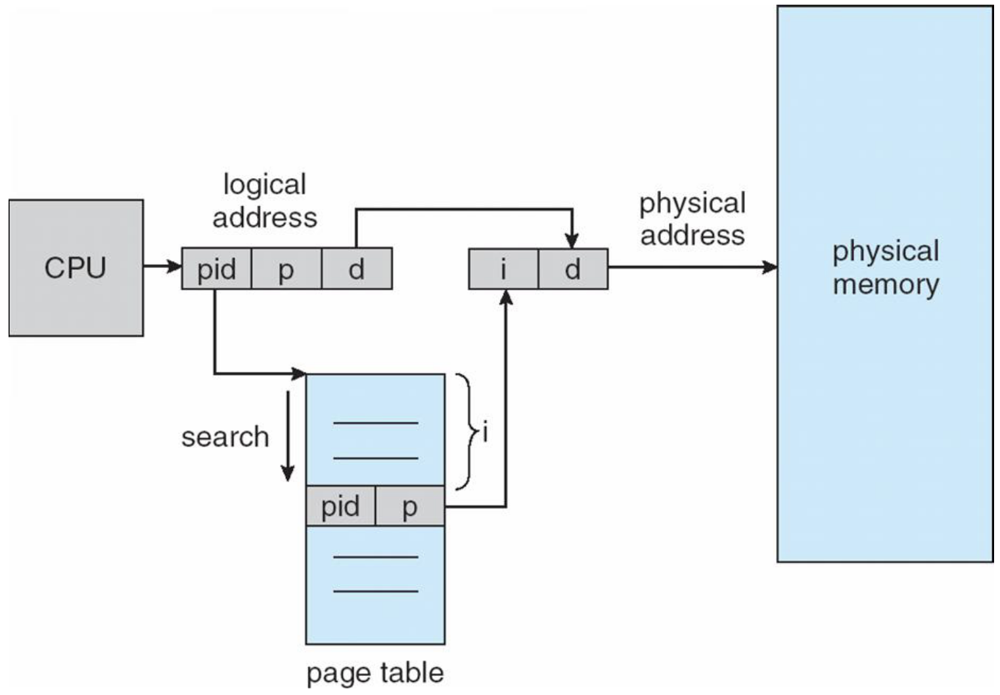
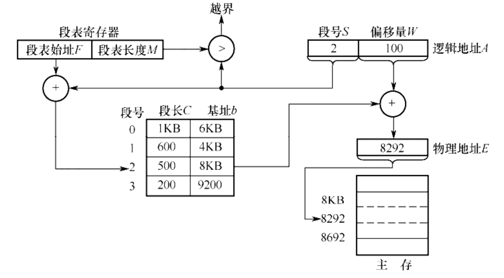
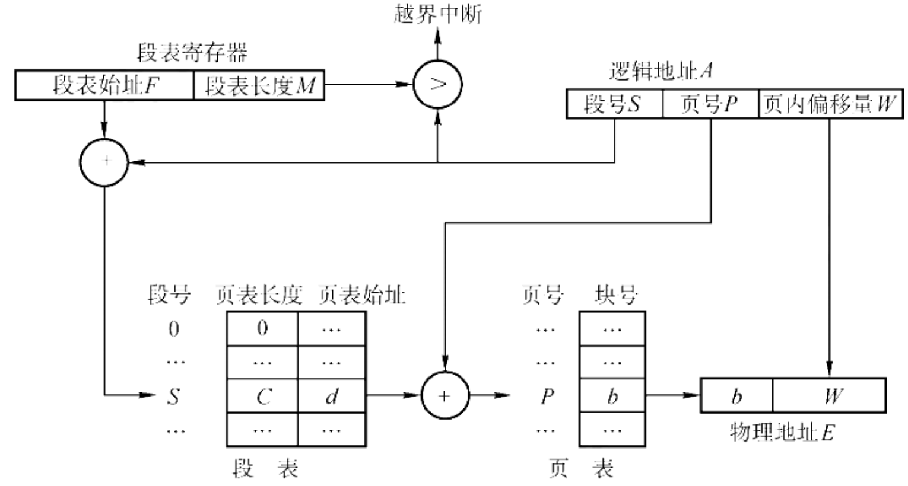

# 内存管理
> MMU负责把虚拟地址转换成物理地址

## 程序的装入与链接
用户程序要在系统中运行，必须先将程序和数据装入内存。主要经过以下三个步骤：

1. **编译 (Compile)**：将源代码编译成目标模块。

2. **链接 (Link)**：将目标模块和库函数链接成装入模块。
3. **装入 (Load)**：将装入模块装入内存。

### 装入方式

* **绝对装入 (Absolute Loading)**

    * **特点**：编译时就确定了绝对地址。

    * **适用**：单道程序环境。

* **可重定位装入 (Static Relocation)**

    * **特点**：在**装入时**一次性完成地址转换。

    * **缺点**：作业装入后不能移动，也不能动态申请内存。

* **动态运行时装入 (Dynamic Relocation)**

    * **特点**：在**程序执行时**才进行地址转换。

    * **硬件支持**：需要**重定位寄存器**。

    * **优点**：允许程序移动（便于紧凑），支持动态申请内存，便于共享。

### 链接方式

* **静态链接 (Static Linking)**

    * 运行前链接成完整程序。

* **装入时动态链接 (Load-time Dynamic Linking)**

    * 边装入边链接。便于更新和共享。

* **运行时动态链接 (Run-time Dynamic Linking)**

    * **执行到该模块时**才进行链接。

    * **优点**：加快装入，节省内存（未用到的模块不装入）。

## Swapping (交换技术)
交换技术的原理非常简单：进程可以暂时从内存中被调出 (Swap Out) 到磁盘的交换区，在之后需要运行的时候再加载回内存 (Swap In)。

!!! info 
    1. **交换区 (Backing Store)**
    
        * 通常是磁盘上的一个独立分区（如 Linux Swap）。
        * 为了追求速度，通常直接管理磁盘块，不经过普通文件系统。

    2. **性能开销**
    
        * 主要瓶颈是**磁盘 I/O 传输时间**。
        
        * 传输时间与**被交换出的内存大小**成正比。
        
        * **优化**：只在内存吃紧时启动；只交换阻塞/睡眠状态的进程。

    3. **挂起的 I/O (Pending I/O) 问题**

        * **场景**：进程 A 正在等待 I/O（如读磁盘数据到缓冲区），此时若将 A 换出，内存分给进程 B。I/O 设备回来写数据时，会错误地写入 B 的空间。

        * **解决方案**：

            * **禁止交换**：有挂起 I/O 的进程不准换出。
            * **双重缓冲 (Double Buffering)**：I/O 操作使用**内核缓冲区**。数据先到内核，再拷贝到用户进程。这样用户进程随时可换出。

    4. **现代 OS 的交换**
        
        * **标准交换**（移动整个进程）已很少使用。
        
        * 现代系统多结合**分页**，只交换页面 (Pages)。
        
        * **移动端 (iOS/Android)**：通常**不支持**交换（闪存寿命 & 空间限制），内存不足时直接杀后台进程。

## 连续内存分配
> 连续内存分配指的是为用户进程分配一个连续的内存空间来运行

### 单一连续分配

在本方法中,内存被分为两部分,低地址的系统区与高地址的用户区.

其中:

- 基址寄存器保存了最低的物理地址

- 限长寄存器保存了地址范围

在一个用户程序访问内存时,MMU会根据基址寄存器和限长寄存器来判断访问是否合法,并将访问的地址转换为物理地址.

这种方法的缺点是只适用于单道程序环境,无法实现进程的隔离.

### 固定分区分配

这种方法的思想是,把内存空间划分为一个个固定的块,每个块可以容纳一个进程.

    
     
    <caption>固定分区分配</caption>

划分分区时有两种不同的方法。 

- 分区大小相等。程序太小会造成浪费,程序太大又无法装入。 

- 分区大小不等。划分为多个较小的分区、适量的中等分区和少量大分区。

显然,这个方法会带来内部碎片的问题.当程序小于固定的分区大小时,会浪费掉剩余的空间.

### 动态分区分配

动态分区分配不预先划分内存，而是在进程装入内存时，根据进程的实际大小，动态地建立分区。

*   **特点**：分区的大小和数目是可变的。

*   **缺点**：会产生**外部碎片**（内存中存在许多细小的空闲块，但无法利用）。
> 虽然外部碎片可以通过紧凑技术（Compaction）来解决，但紧凑技术会带来额外的开销。

!!! definition
    - 内部碎片(Internal Fragmentation)：在进程内存空间中的未利用的碎片.例如，一个进程需要 100KB 的内存，但分配到的分区大小是 128KB，那么 28KB 就是内部碎片。
    
    - 外部碎片(External Fragmentation)：在进程分配到的内存之间的碎片.
      
        **例子**：系统总空闲内存 70MB，但被分为不连续的 40MB 和 30MB 两块。此时若有进程需要 50MB，虽然总空闲够，但无法满足，这 40MB 和 30MB 就是外部碎片。

#### 数据结构
操作系统需要记录哪些内存是空闲的，常用的数据结构有：

*   **空闲分区表 (Free Partition Table)**：每个表项记录一个空闲分区的起始地址和长度。
*   **空闲分区链 (Free Partition List)**：将空闲分区通过指针连成链表。

#### 分配算法 (Allocation Algorithms)

分配算法负责选择一个空闲分区来分配给作业。

| 算法 | 策略 | 优点 | 缺点 |
| :--- | :--- | :--- | :--- |
| **首次适应 (First Fit)** | 从低地址开始查找，找到**第一个**能满足大小的空闲分区。 | **最快**（通常性能最好）；保留了高地址的大块空闲区。 | 低地址部分容易产生细小碎片；每次查找都从头开始，增加查找开销。 |
| **最佳适应 (Best Fit)** | 查找**满足要求且最小**的空闲分区。 | 每次分配后剩余的碎片最小。 | 产生大量无法利用的**微小碎片**（外部碎片）；需要对空闲区排序（按大小递增）。 |
| **最坏适应 (Worst Fit)** | 查找**满足要求且最大**的空闲分区。 | 每次分配后剩余的空闲区仍较大，可能还能用。 | **大块空闲区被迅速拆散**，后续大作业来了没地放；需要排序（按大小递减）。 |
| **邻近适应 (Next Fit)** | 从**上次查找结束的位置**开始继续查找（循环扫描）。 | 减少查找开销；空闲分区分布更均匀。 | 高地址的大块空闲区也被拆散了。 |

#### 紧凑 (Compaction)

为了解决**外部碎片**问题，可以将内存中所有作业移动到一端，使原本分散的空闲小分区拼接成一个大分区。

*   **前提**：系统必须支持**动态重定位**（运行时动态装入）。

*   **代价**：需要移动大量数据，CPU 开销大。

## 分页分配

固定分区分配会产生内部碎片,而动态分区分配又会产生外部碎片。

**分页技术 (Paging)** 的主要目标是解决**外部碎片**问题。

*   **无外部碎片**：因为物理内存被划分为固定大小的页框，任何空闲的页框都可以分配给任何需要页面的进程，不需要连续的物理空间。

*   **存在内部碎片**：一页可能装不满

*   **页框 (Frames)**：

    *   将**物理内存**划分为固定大小的块，称为**页框**（或帧、物理块）。
    *   大小通常是 2 的幂，介于 512 字节到 8192 字节之间。

    *   **实例**：Linux 和 Windows (x86) 通常使用 **4KB**。

*   **页 (Pages)**：

    *   将**逻辑内存**划分为与页框大小相同的块，称为**页**。

地址转换的逻辑在很多课里都学过,流程为:

1.  **分解逻辑地址**：CPU 生成的逻辑地址被自动划分为两部分：

    *   **页号 (Page Number, p)**：用于索引页表。

    *   **页内偏移量 (Page Offset, d)**：表示该地址在页内的位置（不改变）。

2.  **查页表 (Lookup Page Table)**：以页号 $p$ 为索引，去查找**页表**。

3.  **获取页框号**：从对应的页表项中取出该页所在的**物理页框号 (Frame Number, f)**。

4.  **合成物理地址**：将物理页框号 $f$ 与页内偏移量 $d$ 拼接（或者说：物理地址 = $f \times \text{页大小} + d$）。

TLB的内容就不多讲了,在[这里](../Comcompose/Ch5.md#tlbtranslation-lookaside-buffer)

### TLB 有效访问时间 (EAT) 计算

*   **Associative Lookup** = $\epsilon$ time unit (快表访问时间)

*   **Memory cycle time** = $t$ (内存访问时间)

*   **Hit ratio (命中率)** = $\alpha$

    *   Percentage of times that a page number is found in the associative registers.

    *   Ratio related to number of associative registers.

**Effective Access Time (EAT)**:

$$
EAT = (t + \epsilon)\alpha + (t + t + \epsilon)(1 - \alpha)
$$

*   **Hit**: $(t + \epsilon)$

*   **Miss**: $(t + t + \epsilon)$ (查快表 + 查页表 + 访问数据)

### 共享页 (Shared Pages)

*   **共享代码 (Shared Code)**：

    *   一份只读 (read-only) 的代码副本（即**重入代码/Reentrant Code**或**纯代码/Pure Code**）在多个进程间共享。

    *   典型的例子包括文本编辑器、编译器、窗口系统等。

    *   共享代码必须出现在所有进程逻辑地址空间的**相同位置**。

*   **私有代码和数据 (Private Code and Data)**：

    *   每个进程保存一份独立的代码和数据副本。

    *   私有代码和数据的页面可以出现在逻辑地址空间的**任意位置**。

### Structure of Page Table

#### Hierarchical Paging (分级页表)

!!! question "为什么需要分级页表？"

    考虑一个典型的 32 位系统：

    *   **逻辑地址空间**: $2^{32}$ Bytes (4GB).

    *   **页面大小**: 4KB ($2^{12}$ Bytes).

    *   **页表项大小**: 4 Bytes.

    **计算单级页表的大小**:

    1.  **页表项数量**: $\frac{2^{32}}{2^{12}} = 2^{20}$ (1 Million entries).

    2.  **页表总大小**: $2^{20} \times 4 \text{ Bytes} = 4 \text{ MB}$.

    **问题**:
    这就要求系统为每个进程分配 **4MB 的连续内存空间** 来存放页表。

    *   在内存紧张或碎片化严重时，找到 4MB 的连续空间是困难的。

    *   大多数程序只使用了一小部分地址空间，分配完整的 4MB 页表是巨大的浪费。

    **解决方案**:
    将页表再分页，形成**多级页表 (Multilevel Page Table)**。这样页表就可以分散在内存中，不需要连续存放，且可以按需分配。

!!! info "RISC-V 分页机制实例 (Sv32 & Sv39)"
    === "Sv32 (32-bit)"

        Sv32 用于 32 位 RISC-V 系统，采用 **二级页表** 结构。

        *   **虚拟地址结构 (32位)**：
            *   **VPN[1] (10 bits)**：一级页号 (Page Directory Index)。
            *   **VPN[0] (10 bits)**：二级页号 (Page Table Index)。
            *   **Offset (12 bits)**：页内偏移 (对应 4KB 页面)。

        *   **物理地址 (34位)**：支持 16GB 物理内存。
        *   **页表项 (PTE)**：4 Bytes。

        *   **寻址步骤**:

            1.  **satp 寄存器**: 获取一级页表（页目录）的物理基地址。

            2.  **一级查找**: 使用 **VPN[1]** 索引一级页表，找到二级页表的物理基地址 (PPN)。

            3.  **二级查找**: 使用 **VPN[0]** 索引二级页表，找到最终物理页框号 (PPN)。

            4.  **物理地址合成**: 将最终 PPN 与 Offset 拼接，得到物理地址。

    === "Sv39 (64-bit)"

        Sv39 用于 64 位 RISC-V 系统，采用 **三级页表** 结构。

        *   **虚拟地址结构 (39位)**：
            *   虽然寄存器是 64 位的，但 Sv39 只使用低 39 位作为有效虚拟地址。
            *   **VPN[2] (9 bits)**：一级页号。
            *   **VPN[1] (9 bits)**：二级页号。
            *   **VPN[0] (9 bits)**：三级页号。
            *   **Offset (12 bits)**：页内偏移。

        *   **寻址步骤**:
            1.  **satp 寄存器**: 获取一级页表（根页表）的物理基地址。

            2.  **一级查找**: 使用 **VPN[2]** 索引一级页表，找到二级页表的物理基地址。

            3.  **二级查找**: 使用 **VPN[1]** 索引二级页表，找到三级页表的物理基地址。

            4.  **三级查找**: 使用 **VPN[0]** 索引三级页表，找到最终物理页框号 (PPN)。

            5.  **物理地址合成**: 将最终 PPN 与 Offset 拼接，得到物理地址。

        !!! tip "小tips"
            *   每级页表索引为 **9 位**，对应 $2^9 = 512$ 个页表项。
            *   在 64 位系统中，每个页表项 (PTE) 大小为 **8 Bytes**。
            *   因此，一个页表的大小 = $512 \times 8 \text{ Bytes} = 4096 \text{ Bytes} = 4\text{KB}$。
            *   **结论**：**一个页表的大小正好等于一个物理页面的大小**，这使得内存管理非常方便。

#### Hashed Page Table (哈希页表)

**适用场景**:

哈希页表主要用于**地址空间非常大**（例如 > 32位）的系统。在这些系统中，如果使用传统的分级页表，页表的级数会非常多，导致访问开销过大。

**工作原理**:

1.  **哈希函数**: 使用虚拟页号 (Virtual Page Number, VPN) 作为哈希值，通过哈希函数映射到哈希表的一个条目。

2.  **链表结构**: 哈希表的每个条目包含一个链表（因为可能存在哈希冲突）。

3.  **链表元素**: 每个链表元素包含三个字段：
    *   (1) 虚拟页号 (VPN)。
    *   (2) 映射的物理页框号 (Frame Number)。
    *   (3) 指向链表中下一个元素的指针。

4.  **查找过程**:
    *   根据虚拟地址中的 VPN 计算哈希值。
    *   在哈希表中找到对应的链表。
    *   遍历链表，比较链表元素的 VPN 与目标 VPN。
    *   如果匹配，取出对应的物理页框号，结合页内偏移量形成物理地址。

    
     
    <caption>哈希页表</caption>

#### Inverted Page Table (反向页表)

**传统页表的问题**:
每个进程都有自己的页表。如果进程数很多，或者虚拟地址空间很大，页表本身会占用大量物理内存。

**反向页表的设计**:

*   **全局唯一**: 整个系统**只有一个**页表 (Inverted Page Table)。

*   **面向物理内存**: 表中的每一个条目对应**物理内存**中的一个页框 (Frame)。
    *   如果有 1GB 内存，4KB 一页，则表中有 256K 个条目。
*   **条目内容**: 每个条目包含：
    *   拥有该页面的**进程 ID (pid)**。
    *   该页面的**虚拟页号 (p)**。

**地址转换过程**:

1.  CPU 生成虚拟地址 `(pid, p, d)`。
2.  系统在反向页表中搜索，寻找匹配 `(pid, p)` 的条目。
3.  如果找到，该条目的索引 `i` 就是**物理页框号**。
4.  物理地址 = $i \times \text{页大小} + d$。

**优缺点**:

*   **优点**:

    *   **大幅节省内存**：页表大小只与物理内存大小有关，与进程数量和虚拟地址空间大小无关。

*   **缺点**:

    *   **查找慢**：因为表是按物理地址排序的，而我们是按虚拟地址查找，最坏情况可能需要遍历整个表。

    *   **共享困难**：因为一个物理页框在表中只有一个条目，很难实现多个虚拟地址（不同进程）映射到同一个物理地址（共享内存）。

    *   **解决查找慢的方法**：通常使用**哈希表**来加速查找。

    
     
    <caption>反向页表</caption>

## 分段 (Segmentation)

分段管理方式提供了一个用户视图的内存管理方案。逻辑地址空间是由一组段（Segments）构成的。

*   **逻辑地址 (Logical Address)**:
    *   由两部分组成：`<segment-number, offset>` (段号, 段内偏移)。

*   **段表 (Segment Table)**:

    *   用于将二维的逻辑地址映射为物理地址。

    *   每个段表项包含：

        *   **Base (基址)**: 该段在物理内存中的起始地址。

        *   **Limit (限长)**: 该段的长度。

*   **硬件支持**:
    *   **Segment-table base register (STBR, 段表基址寄存器)**: 指向段表在内存中的位置。
    *   **Segment-table length register (STLR, 段表限长寄存器)**: 指示程序所使用的段的数量。

    *   **合法性检查**: 对于段号 `s`，如果 `s < STLR`，则该段号是合法的；否则产生越界中断。

    
     
    <caption>分段</caption>

### 段页式存储管理
> 分页存储管理能有效地提高内存利用率,而分段存储管理能反映程序的逻辑结构并有利于段 的共享和保护。
> 
> 将这两种存储管理方法结合起来,便形成了段页式存储管理方式。

**基本原理**:

1.  **分段**: 先将用户程序分成若干个段（反映逻辑结构）。

2.  **分页**: 再把每个段分成若干个页（便于内存管理）。

3.  **内存分配**: 以**页**为单位进行离散分配。

**逻辑地址结构**:

由三部分组成：`<段号 S, 页号 P, 页内偏移 W>`

**数据结构**:

*   **段表**: 每个段表项记录该段的**页表始址**和**页表长度**。

*   **页表**: 每个页表项记录该页对应的**物理块号**。

**地址变换过程**:

1.  根据段号 $S$ 查**段表**，得到该段对应的**页表始址**。

2.  根据页号 $P$ 查**页表**，得到该页对应的**物理块号** $f$。

3.  将物理块号 $f$ 与页内偏移 $W$ 拼接，形成物理地址。

    
     
    <caption>段页式存储管理</caption>

## 虚拟内存

为了实现对虚拟内存的管理,有三种方法:

- 请求分页存储管理

- 请求分段存储管理

- 请求段页式存储管理

### 请求分页存储管理

请求分页也即是我们在Lab5中实现的,和懒加载类似,在没有用到的时候,进程仅拥有页表,而没有实际的内存空间,当需要访问的时候,才会将页面调入内存。

在运行过程中，如果程序访问的页面不在内存中，系统会触发**缺页中断**，由操作系统负责将缺失的页面从外存调入内存。如果内存已满，还需要利用**页面置换算法**将暂时不用的页面换出。

为了实现这一机制，系统需要在硬件层面提供更复杂的支持，主要包括扩展的**页表机制**、**缺页中断机构**和**地址变换机构**。

#### 页表机制

在请求分页系统中，页表不仅要完成逻辑地址到物理地址的映射，还需要记录页面的状态（是否在内存、是否被修改等），以支持调页和置换。因此，页表项（PTE）在基本分页的基础上增加了若干字段：

| 页号 | 物理块号 | **状态位 P** | **访问字段 A** | **修改位 M** | **外存地址** |
| :---: | :---: | :---: | :---: | :---: | :---: |

各字段含义如下：

- **状态位 (Present/Valid Bit, P)**：
    - 用于标记该页是否已调入内存。
    - $P=1$：表示页面在内存中，可直接访问。
    - $P=0$：表示页面在外存中，访问时会触发缺页中断。

- **访问字段 (Accessed/Reference Bit, A)**：
    - 记录页面最近是否被访问过，或者记录访问次数。
    - **作用**：供页面置换算法（如 LRU）参考，决定哪些页面是"最近未被使用"的，从而优先淘汰。

- **修改位 (Modified/Dirty Bit, M)**：
    - 标记页面调入内存后是否被修改过。
    - **作用**：置换页面时，如果 $M=1$，说明页面数据已变，必须将其写回外存以更新副本；如果 $M=0$，说明页面未变，直接覆盖即可，无需写回，从而减少 I/O 开销。

- **外存地址**：
    - 指出该页在外存（通常是磁盘交换区）中的物理位置，以便在缺页时能找到并调入该页。

#### 缺页中断机构 (Page Fault Mechanism)

当进程试图访问一个状态位 $P=0$ 的页面时，硬件会产生**缺页中断**（Page Fault）。这是一种**内部异常**（Exception），其处理过程如下：

1.  **保护现场**：CPU 暂停当前指令的执行，保存上下文。 
2.  **分析原因**：操作系统分析中断原因，确认是缺页。

3.  **查找空闲物理块**：

    - 若内存有空闲块，直接分配。

    - 若内存已满，依据**置换算法**选择一个受害者页面（Victim Page）换出。如果该页被修改过（$M=1$），需先写回外存。

4.  **调入页面**：启动磁盘 I/O，将所需页面读入选定的物理块。

5.  **更新页表**：修改页表项，将状态位 $P$ 置为 1，填入物理块号。

6.  **恢复执行**：更新快表（TLB），恢复上下文，**重新执行**刚才那条产生缺页中断的指令。

!!! info
    缺页中断与普通中断的一个重要区别是，缺页中断是在指令执行**期间**产生的，处理完成后需要**重新执行**该指令；而普通中断通常在指令执行**结束**后响应。

