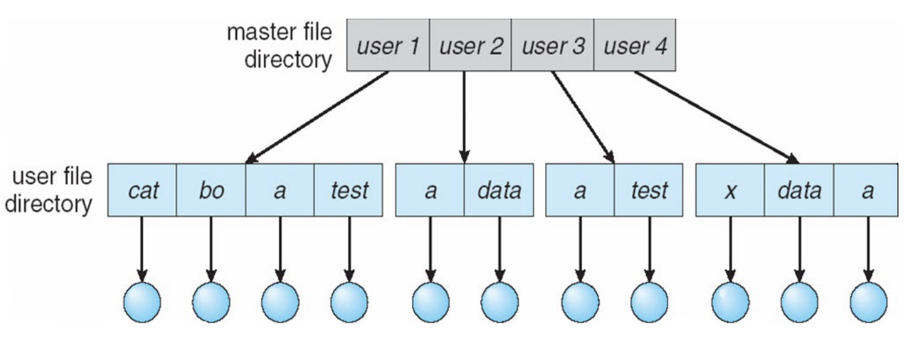
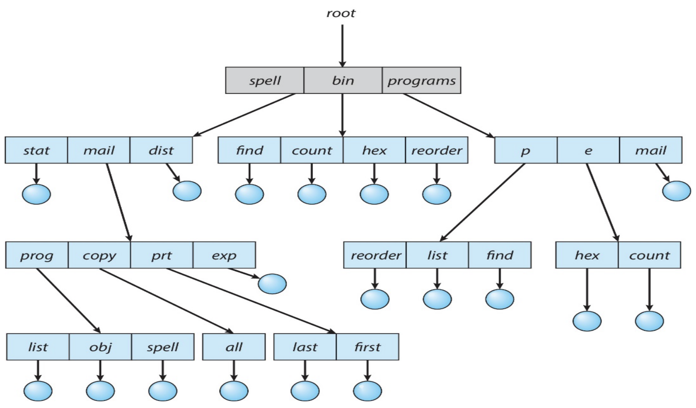
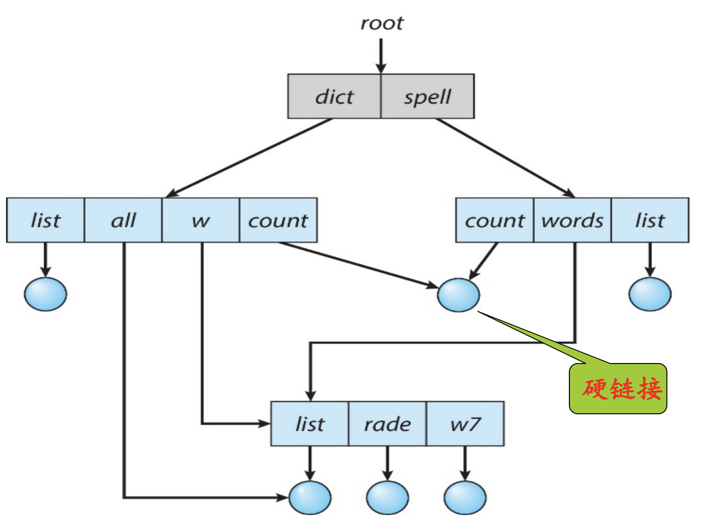

# 文件系统

!!! definition "文件"
    文件（file）是操作系统在文件系统中管理的一种“持久化对象抽象”：它由**数据内容（字节序列）**和**元数据（权限、大小、时间戳、位置映射等）**组成，并通过**open/read/write/close 等统一接口**对进程提供访问。

    文件系统负责把文件映射到底层存储的块上，从而屏蔽物理位置与设备细节；进程先用路径名定位，再用返回的 fd/handle 进行实际读写。

文件的属性包括:

1. **Name**: 唯一以人类可读的形式表示

2. **Identifier**: 唯一标识文件的标签（数字）
3. **Type**: 文件类型
4. **Location**: 指向文件在设备上的位置
5. **Size**: 文件当前的大小
6. **Protection**: 控制谁能读、写、执行

7. **Time, date, and user identification**:·数据用于保护、安全和使用监控

## File Operations (文件操作)

*   **Create**

*   **Write**

*   **Read**

*   **Reposition within file**

*   **Delete**

*   **Truncate**

*   **Open($F_i$)**: 在磁盘上的目录结构中搜索条目 $F_i$，并将条目内容移至内存。
*   **Close($F_i$)**: 将内存中的条目 $F_i$ 内容移至磁盘上的目录结构中。

### Open Files

管理打开文件需要几块数据：

*   **File pointer**: 指向最后读取/写入位置的指针，每一个打开该文件的进程都有一个。
*   **File-open count**: 文件打开次数计数器 —— 允许在最后一个进程关闭文件时从打开文件表中移除数据。
*   **Disk location of the file**: 数据访问信息的缓存。
*   **Access rights**: 每个进程的访问模式信息。

## File Types (文件类型)

1. **从操作系统角度**:
    *   操作系统支持多种文件类型
    *   **Unix (Linux, Mac OS) 和 Windows**: 普通文件、目录文件
    *   **Unix (Linux, Mac OS)**: 字符设备文件、块设备文件、符号链接文件等
    *   **普通文件**: 可执行文件、文本文件

2. **从用户角度**:
    *   文件拓展名有其含义

    * Windows中,文件拓展名和文件类型有关

    * Linux中,文件拓展名是一种约定,和文件类型无关

## 文件内部结构

### 无结构文件(Non-structured files)

无文件结构就是由字节组成的文件,没有文件头和文件尾,也没有文件的元数据。进程通过读写指针来找到下一个要访问的字节。

### 有结构文件(Structured files)
> 也称记录文件(record file)

记录相当于是文件的条目,分为定长记录和变长记录。在读取文件时,以记录为单位,而不是字节为单位。

## 文件访问方法

1. **顺序访问 (Sequential Access)**:
    *   从文件开头开始,按顺序读取或写入记录。
    *   适合已知访问模式的文件，如日志文件。

2. **随机访问 (Random Access)**:
    *   可以跳转到文件的任意记录进行读取或写入。
    *   适合需要频繁跳转访问的文件，如数据库文件。

3. **直接访问 (Direct Access)**:
    *   每个记录都有自己的地址，可以直接访问。
    *   适合需要快速访问特定记录的文件，如索引文件。

4. **索引访问 (Indexed Access)**:
    *   通过索引表快速定位记录。
    *   适合需要快速访问特定记录的文件，如数据库文件。

## 目录结构
> 目录(directory)也是一种文件,它内部存储的是文件名 $\leftrightarrow$ 索引节点号（Inode Number）的映射。

### Single-Level Directory

单级目录让所有用户共用一个目录,不便于管理。

    
     
    <caption>单级目录</caption>

### Two-Level Directory

两级目录让每个用户都有自己的目录,每个用户可以拥有相同文件名的文件。

    
     
    <caption>两级目录</caption>

### Tree Directory

树形目录的概念就像是文件夹里套文件夹

    
     
    <caption>树形目录</caption>

树形目录也带来了绝对路径和相对路径的区分:

- **Absolute path (绝对路径)**: 也就是从根目录开始的路径。
- **Relative path (相对路径)**: 从当前目录开始的路径。

### Acyclic Graph Directories (有向无环图目录)
> 允许目录共享子目录和文件

    
     
    <caption>有向无环图目录</caption>

在树形目录中，文件不能共享。如果两个用户想一起开发一个项目，需要共享文件，树形结构就变得极其复杂且低效。**有向无环图**（Acyclic Graph Directory）允许不同目录下的条目指向同一个文件或子目录，从而实现共享。

这就引入了**链接**（Link）的概念，主要分为两种：

1.  **硬链接 (Hard Link)**:
    *   两个不同的目录项指向同一个**索引节点 (Inode)**。
    *   删除时，采用**引用计数 (Reference Counting)**。每当建立一个硬链接，引用计数加 1；删除一个链接时，计数减 1。只有当计数变为 0 时，才真正释放文件空间。
    *   **限制**: 不能跨文件系统创建硬链接，且通常不允许对目录创建硬链接（防止环路）。

2.  **软链接 (Soft Link / Symbolic Link)**:
    *   创建一个新的文件（类型为 Link），其内容是目标文件的**路径名**。
    *   当访问软链接时，操作系统读取其内容（路径），然后跳转到目标文件。
    *   **悬空指针 (Dangling Pointer)**: 如果目标文件被移动或删除，软链接依然存在，但指向无效路径。
    *   **优点**: 可以跨文件系统，也可以链接目录。

## File System Mounting

Mounting (挂载) 是将文件系统连接到目录树的过程。

*   **Mount Point (挂载点)**: 目录树中的一个位置（通常是一个空目录），新的文件系统将连接到该位置。

*   在挂载之前，操作系统必须验证设备包含有效的文件系统。

*   操作系统维护一个 **Mount Table**，记录包含挂载点和对应设备/文件系统的信息。

*   **形象理解**: 挂载就像是把一棵新的“子树”嫁接到主“目录树”的某个树枝（挂载点）上，使得这棵新树的所有内容成为主树的一部分，可以通过主树的路径访问。

## 文件系统结构
> 文件系统是一种机制，用于组织和管理文件，提供文件的创建、读取、写入、删除等操作。
>

### 分层架构 (Layered Architecture)

文件系统的设计通常采用**分层**结构，一层一层的完成文件系统的功能,从用户操作到实际的磁盘读写。

每层仅利用较低层提供的功能，为更高层创建新的功能：

1.  **Logical File System (逻辑文件系统)**
    *   **职责**: 管理**元数据**（Metadata），即管理文件系统结构而非实际数据。
    *   **功能**:
        *   管理目录结构，将符号文件名（Symbolic Name）映射到内部标识符（如 Inode）。
        *   维护 **文件控制块 (FCB)**。
        *   负责文件的保护和通过权限检查。

2.  **File Organization Module (文件组织模块)**
    *   **职责**: 负责文件逻辑块与物理块之间的映射。
    *   **功能**:
        *   **地址转换**: 将文件的逻辑地址（Logical Block Address）转换为磁盘的物理地址（Physical Block Address）。
        *   **空闲空间管理**: 跟踪未分配的磁盘块。

3.  **Basic File System (基本文件系统)**
    *   **职责**: 向设备驱动程序发送通用命令。
    *   **功能**:
        *   处理物理块（Physical Block）的读写。
        *   管理内存缓冲区和缓存（Buffer/Cache），以保存文件系统、目录和数据块。

4.  **I/O Control (I/O 控制)**
    *   **职责**: 直接与硬件交互。
    *   **组成**:
        *   **设备驱动程序 (Device Drivers)**: 将通用命令翻译成特定设备的底层指令。
        *   **中断处理程序 (Interrupt Handlers)**: 处理I/O完成后的信号，并在内存和磁盘系统之间传输信息。

!!! definition "FCB"
    **File Control Block (文件控制块)**，在 Unix 中常被称为 **Inode** (Index Node)。
    它是文件系统用来维护文件所有元数据的数据结构。文件系统中的每个文件都有唯一的 FCB。
    
    FCB 通常包含以下信息：

    *   **File permissions (文件权限)**: 读、写、执行权限。
    *   **File dates (文件时间)**: 创建、最后访问、最后修改时间。
    *   **File owner, group, ACL (文件所有者、组、访问控制列表)**.
    *   **File size (文件大小)**.
    *   **File data blocks or pointers to file data (文件数据块或指向数据的指针)**.

    FCB存储在硬盘的**Inode**中。