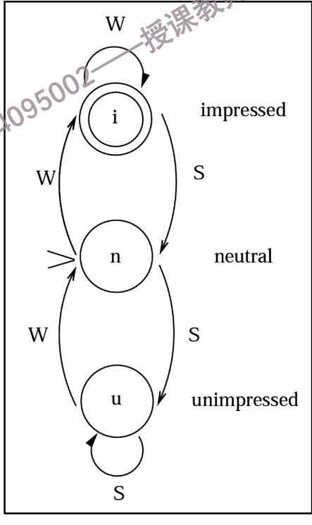
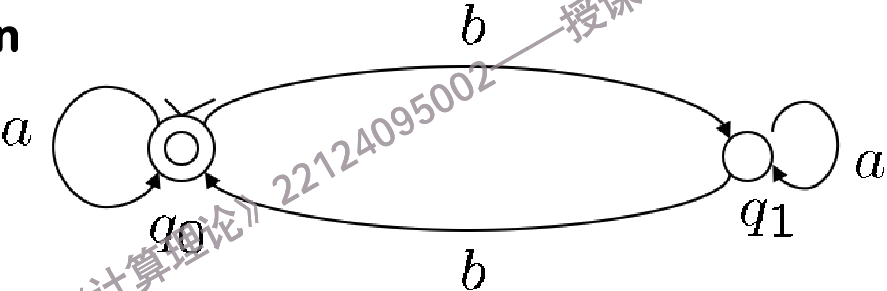
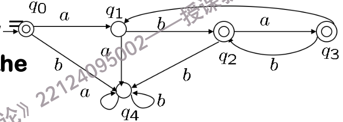
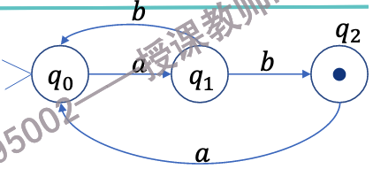
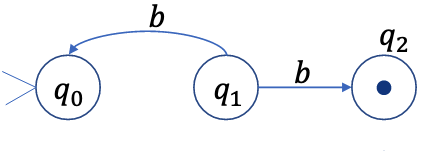
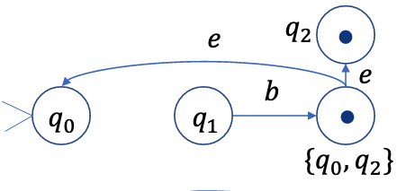
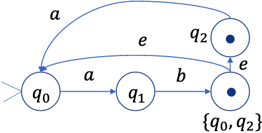
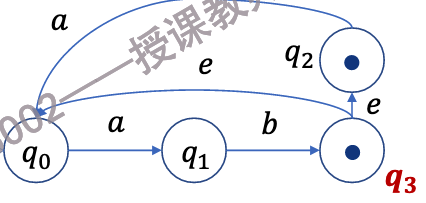
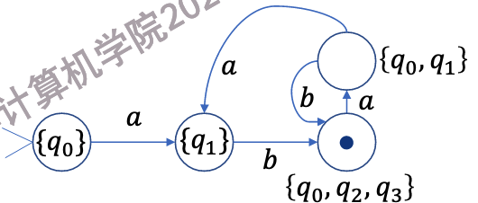

# 自动机(Automata)
> 自动机和数逻里面学过的有限状态机很相似,都有状态,输入,转换等概念.自动机是计算理论的基础,是形式语言的识别器.

!!! example "面试"
    面试官有三种状态：印象深刻(impressed)、中立(neutral)和印象不佳(disappointed)。  

    - 初始时，面试官处于中立状态。  

    - 如果学生说了机智(witty)的话，面试官的印象会变好。  

    - 如果学生说了愚蠢(stupid)的话，面试官的印象会变差。

    

        
         
        <caption>面试</caption>
    

## DFA(Deterministic Finite Automata)

在决定有限自动机的图中,不同的状态有不同的符号:

- Initial state(初始状态):有一个箭头指向它,表示自动机的开始状态.

- State(状态):$ q_0, q_1, q_2 $ ,状态用圆圈表示.

- Final state(终止状态):,双圈表示终止状态.到达终止状态即被接受.

而状态转移函数可以表达为:

$$
\delta:(q,a) = p
$$

意思是:在状态q下,输入a,自动机转换到状态p.

    
     
    <caption>图中q0既是初始状态也是终止状态</caption>

!!! definition "自动机(DFA)的定义"
    自动机是一个五元组$(Q, \Sigma, \delta, q_0, F)$,其中:

    - $Q$ 是有限状态集.

    - $\Sigma$ 是有限输入符号集(字母表).

    - $\delta$ 是状态转移函数,形式为 $\delta: Q \times \Sigma \rightarrow Q$.

    - $q_0 \in Q$ 是初始状态.

    - $F \subseteq Q$ 是终止状态集,包含一个或多个终止状态.
> 之所以是确定性的,是因为对于每个状态和输入符号,状态转移函数都唯一地确定了下一个状态.

!!! tip "自动机的作用"
    有限自动机是一种识别装置，它有有限个内部状态。自动机接收输入（通常是一串符号），并根据目前已经读到的输入序列，判断这个序列是否属于某种语言。如果属于该语言，自动机就“接受”输入（回答“yes”）；如果不属于，则“拒绝”输入（回答“no”）。

    换句话说，自动机就是用来判断一个字符串是否符合某种规则（语言）的工具。

    如果一个输入字符串被自动机接受,那么这个字符串就属于该自动机所识别的语言.

!!! definition "Configuration(配置)"
    自动机在某一时刻的配置可以用二元组 $(q, x)$ 表示，其中：

    - $q \in Q$：当前状态

    - $x \in \Sigma^*$：剩余的输入字符串（后缀）

    对于自动机 $M = (Q, \Sigma, \delta, q_0, F)$，如果当前配置为 $(q, x)$，表示自动机处于状态 $q$，还剩下输入 $x$。

    ??? tip "M的两个配置之间的二元关系$\vdash_M$"
        如果 $\delta(q, a) = p$，那么我们说配置 $(q, ax)$ 直接产生（yields）配置 $(p, x)$，记作：

        $$
        (q, ax) \vdash_M (p, x)
        $$

        这表示在状态 $q$ 下读取输入符号 $a$ 后，自动机转移到状态 $p$，并且剩余输入变为 $x$。

        如果存在一系列配置 $(q_1, x_1), (q_2, x_2), \ldots, (q_n, x_n)$，使得：

        $$
        (q_1, x_1) \vdash_M (q_2, x_2) \vdash_M \ldots \vdash_M (q_n, x_n)
        $$

        那么我们说配置 $(q_1, x_1)$ 产生（yields）配置 $(q_n, x_n)$，记作：

        $$
        (q_1, x_1) \vdash^*_M (q_n, x_n)
        $$

        这表示从初始配置 $(q_1, x_1)$ 出发，通过一系列状态转移，最终达到配置 $(q_n, x_n)$。
        > 注意: 这里的 $\vdash^*_M$ 是 $\vdash_M$ 的反复应用，可以是**零次**或多次。

因此,我们现在可以定义一个字符串被自动机接受的条件:

对于自动机 $M = (Q, \Sigma, \delta, q_0, F)$，如果存在一个终止状态 $q_f \in F$，使得：

$$
(q_0, w) \vdash^*_M (q_f, \epsilon)
$$

那么我们说字符串 $w$ 被自动机 $M$ 接受。

这里，$(q_0, w)$ 是初始配置，表示自动机从初始状态 $q_0$ 开始，输入字符串为 $w$；$(q_f, \epsilon)$ 是终止配置，表示自动机最终到达终止状态 $q_f$，且没有剩余输入（$\epsilon$ 表示空字符串）。

换句话说，如果自动机从初始状态出发，经过一系列状态转移后，能够在读取完整个输入字符串后停在某个终止状态，那么这个输入字符串就被该自动机接受。

对于$\epsilon$是否被接受,需要看初始状态是否是终止状态.

## NFA(Nondeterministic Finite Automata)
> 非确定性有限自动机和确定性有限自动机的区别在于,对于某个状态和输入符号,可能有多个下一个状态.

现在,我们希望实现一个自动机,判别一个字符串是否满足$(ab \cup aba)^*$,即字符串由"ab"和"aba"重复组成.

如果是决定性自动机,需要这样设计:

    
     
    <caption>DFA for (ab ∪ aba)*</caption>

现在,我们希望通过非决定性自动机来实现,即允许一个状态和输入符号对应多个下一个状态.

---

### 定义

NFA和DFA的定义类似,五元组$(Q, \Sigma, \delta, q_0, F)$,其中:

- $Q$ 是有限状态集.

- $\Sigma$ 是有限输入符号集(字母表).

- $\delta$ 是状态转移关系,是$Q \times (\Sigma \cup \{\epsilon\}) \times Q$的子集

    - 这里的$\epsilon$表示空输入,即不需要输入符号也可以转换状态.

    - 由于$\delta$的输出是一个状态集,所以,对于某个状态和输入符号,可能有多个下一个状态.

- $q_0 \in Q$ 是初始状态.

- $F \subseteq Q$ 是终止状态集,包含一个或多个终止状态.

除此之外,Configuration(配置)和接受条件与DFA一致.

NFA的图在绘制时,有几点不同于DFA:

1. 状态转换箭头上可以标注$\epsilon$,表示不需要输入符号也可以转换状态.

2. 对于某个状态和输入符号,可以有多个箭头指向不同的下一个状态.

3. 不需要为一个状态的所有可能输入都定义转移,即可以不完整.如果在某个状态下，收到的输入符号没有对应的转移路径，那么这条计算“分支”就会“死亡”并被丢弃。

---

!!! info "每一个NFA,都能被转换成一个等价的DFA"
    首先,我们必须了解什么是等价的NFA和DFA:如果一个NFA和一个DFA识别同一个语言,那么它们就是等价的.

    其次,NFA与DFA的区别在于两点:

    1. NFA的状态转换可以是非确定性的,即对于某个状态和输入符号,可能有多个下一个状态.

    2. NFA允许$\epsilon$转换,即不需要输入符号也可以转换状态.

    我们要做的就是抹平这两点差别.

    === "消除第一点"

        $M = (Q, \Sigma, \Delta, s, F)$

        - $Q = \{q_0, q_1, q_2\}$

        - $\Sigma = \{a, b\}$

        - $s = q_0$

        - $F = \{q_2\}$

        - $\Delta = \{ (q_0, a, q_1),\ (q_1, b, q_0),\ (q_1, b, q_2),\ (q_2, a, q_0) \}$

        NFA的状态转换图如下:

        

            
             
            <caption>NFA</caption>
        

        其中,非确定性的部分在于:

        

            
             
            <caption>非确定性</caption>
        

        这里的非确定性来源于状态$q_1$在输入$b$时,可以转换到状态$q_0$或$q_2$.因此,我们把$q_0$和$q_2$合并成一个新状态$q_{0,2}$,表示可能处于状态$q_0$或$q_2$.这样,我们就消除了非确定性.

        

            
             
            <caption>消除非确定性</caption>
        

        最后是这样:

        

            
             
            <caption>最终结果</caption>
        

    === "消除第二点"
    
        输入一个普通字符,可以看作是输入一个普通字符后面跟了许多空字符

        基于这种思路,我们可以消除$\epsilon$转换.

        定义$E(q)$为从状态$q$出发,通过若干个$\epsilon$转换可以到达的所有状态的集合,包括$q$本身. 

        

            
             
            <caption>消除第一步的结果</caption>
        

        实际上,对于$\epsilon$转换,我们应当把转换的两边状态看作是"等势"的,也就是说,它们的面对后面输入的反应是一样的.

        现在我们有

        - $E(q_0) = \{q_0\}$

        - $E(q_1) = \{q_1\}$

        - $E(q_2) = \{q_2\}$

        - $E(q_3) = \{q_0, q_2, q_3\}$

        我们可以认为,$q_1$在输入$b$后,可以变为$E(q_3)$,即$\{q_0, q_2, q_3\}$

        而$E(q_3)$在输入$a$后,可以变为$q_0,q_1$,因为它可以走$q_3 \rightarrow_{\epsilon} q_0 \rightarrow_a q_1$或$q_3 \rightarrow_{\epsilon} q_2 \rightarrow_a q_0$

        因此,我们要做的就是把这些点合起来

        

            
             
            <caption>消除第二步的结果</caption>
        
