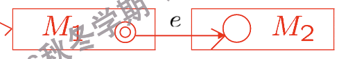

# 自动机(Automata)
> 自动机和数逻里面学过的有限状态机很相似,都有状态,输入,转换等概念.自动机是计算理论的基础,是形式语言的识别器.

!!! example "面试"
    面试官有三种状态：印象深刻(impressed)、中立(neutral)和印象不佳(disappointed)。  

    - 初始时，面试官处于中立状态。  

    - 如果学生说了机智(witty)的话，面试官的印象会变好。  

    - 如果学生说了愚蠢(stupid)的话，面试官的印象会变差。

    

        
         
        <caption>面试</caption>
    

## DFA(Deterministic Finite Automata)

在决定有限自动机的图中,不同的状态有不同的符号:

- Initial state(初始状态):有一个箭头指向它,表示自动机的开始状态.

- State(状态):$ q_0, q_1, q_2 $ ,状态用圆圈表示.

- Final state(终止状态):,双圈表示终止状态.到达终止状态即被接受.

而状态转移函数可以表达为:

$$
\delta:(q,a) = p
$$

意思是:在状态q下,输入a,自动机转换到状态p.

    
     
    <caption>图中q0既是初始状态也是终止状态</caption>

!!! definition "自动机(DFA)的定义"
    自动机是一个五元组$(Q, \Sigma, \delta, q_0, F)$,其中:

    - $Q$ 是有限状态集.

    - $\Sigma$ 是有限输入符号集(字母表).

    - $\delta$ 是状态转移函数,形式为 $\delta: Q \times \Sigma \rightarrow Q$.

    - $q_0 \in Q$ 是初始状态.

    - $F \subseteq Q$ 是终止状态集,包含一个或多个终止状态.
> 之所以是确定性的,是因为对于每个状态和输入符号,状态转移函数都唯一地确定了下一个状态.

!!! tip "自动机的作用"
    有限自动机是一种识别装置，它有有限个内部状态。自动机接收输入（通常是一串符号），并根据目前已经读到的输入序列，判断这个序列是否属于某种语言。如果属于该语言，自动机就“接受”输入（回答“yes”）；如果不属于，则“拒绝”输入（回答“no”）。

    换句话说，自动机就是用来判断一个字符串是否符合某种规则（语言）的工具。

    如果一个输入字符串被自动机接受,那么这个字符串就属于该自动机所识别的语言.

!!! definition "Configuration(配置)"
    自动机在某一时刻的配置可以用二元组 $(q, x)$ 表示，其中：

    - $q \in Q$：当前状态

    - $x \in \Sigma^*$：剩余的输入字符串（后缀）

    对于自动机 $M = (Q, \Sigma, \delta, q_0, F)$，如果当前配置为 $(q, x)$，表示自动机处于状态 $q$，还剩下输入 $x$。

    ??? tip "M的两个配置之间的二元关系$\vdash_M$"
        如果 $\delta(q, a) = p$，那么我们说配置 $(q, ax)$ 直接产生（yields）配置 $(p, x)$，记作：

        $$
        (q, ax) \vdash_M (p, x)
        $$

        这表示在状态 $q$ 下读取输入符号 $a$ 后，自动机转移到状态 $p$，并且剩余输入变为 $x$。

        如果存在一系列配置 $(q_1, x_1), (q_2, x_2), \ldots, (q_n, x_n)$，使得：

        $$
        (q_1, x_1) \vdash_M (q_2, x_2) \vdash_M \ldots \vdash_M (q_n, x_n)
        $$

        那么我们说配置 $(q_1, x_1)$ 产生（yields）配置 $(q_n, x_n)$，记作：

        $$
        (q_1, x_1) \vdash^*_M (q_n, x_n)
        $$

        这表示从初始配置 $(q_1, x_1)$ 出发，通过一系列状态转移，最终达到配置 $(q_n, x_n)$。
        > 注意: 这里的 $\vdash^*_M$ 是 $\vdash_M$ 的反复应用，可以是**零次**或多次。

因此,我们现在可以定义一个字符串被自动机接受的条件:

对于自动机 $M = (Q, \Sigma, \delta, q_0, F)$，如果存在一个终止状态 $q_f \in F$，使得：

$$
(q_0, w) \vdash^*_M (q_f, \epsilon)
$$

那么我们说字符串 $w$ 被自动机 $M$ 接受。

这里，$(q_0, w)$ 是初始配置，表示自动机从初始状态 $q_0$ 开始，输入字符串为 $w$；$(q_f, \epsilon)$ 是终止配置，表示自动机最终到达终止状态 $q_f$，且没有剩余输入（$\epsilon$ 表示空字符串）。

换句话说，如果自动机从初始状态出发，经过一系列状态转移后，能够在读取完整个输入字符串后停在某个终止状态，那么这个输入字符串就被该自动机接受。

对于$\epsilon$是否被接受,需要看初始状态是否是终止状态.

## NFA(Nondeterministic Finite Automata)
> 非确定性有限自动机和确定性有限自动机的区别在于,对于某个状态和输入符号,可能有多个下一个状态.

现在,我们希望实现一个自动机,判别一个字符串是否满足$(ab \cup aba)^*$,即字符串由"ab"和"aba"重复组成.

如果是决定性自动机,需要这样设计:

    
     
    <caption>DFA for (ab ∪ aba)*</caption>

现在,我们希望通过非决定性自动机来实现,即允许一个状态和输入符号对应多个下一个状态.

---

### 定义

NFA和DFA的定义类似,五元组$(Q, \Sigma, \delta, q_0, F)$,其中:

- $Q$ 是有限状态集.

- $\Sigma$ 是有限输入符号集(字母表).

- $\delta$ 是状态转移关系,是$Q \times (\Sigma \cup \{\epsilon\}) \times Q$的子集

    - 这里的$\epsilon$表示空输入,即不需要输入符号也可以转换状态.

    - 由于$\delta$的输出是一个状态集,所以,对于某个状态和输入符号,可能有多个下一个状态.

- $q_0 \in Q$ 是初始状态.

- $F \subseteq Q$ 是终止状态集,包含一个或多个终止状态.

除此之外,Configuration(配置)和接受条件与DFA一致.

NFA的图在绘制时,有几点不同于DFA:

1. 状态转换箭头上可以标注$\epsilon$,表示不需要输入符号也可以转换状态.

2. 对于某个状态和输入符号,可以有多个箭头指向不同的下一个状态.

3. 不需要为一个状态的所有可能输入都定义转移,即可以不完整.如果在某个状态下，收到的输入符号没有对应的转移路径，那么这条计算“分支”就会“死亡”并被丢弃。

---

!!! info "每一个NFA,都能被转换成一个等价的DFA"
    首先,我们必须了解什么是等价的NFA和DFA:如果一个NFA和一个DFA识别同一个语言,那么它们就是等价的.

    其次,NFA与DFA的区别在于两点:

    1. NFA的状态转换可以是非确定性的,即对于某个状态和输入符号,可能有多个下一个状态.

    2. NFA允许$\epsilon$转换,即不需要输入符号也可以转换状态.

    我们要做的就是抹平这两点差别.

    === "消除第一点"

        $M = (Q, \Sigma, \Delta, s, F)$

        - $Q = \{q_0, q_1, q_2\}$

        - $\Sigma = \{a, b\}$

        - $s = q_0$

        - $F = \{q_2\}$

        - $\Delta = \{ (q_0, a, q_1),\ (q_1, b, q_0),\ (q_1, b, q_2),\ (q_2, a, q_0) \}$

        NFA的状态转换图如下:

        

            
             
            <caption>NFA</caption>
        

        其中,非确定性的部分在于:

        

            
             
            <caption>非确定性</caption>
        

        这里的非确定性来源于状态$q_1$在输入$b$时,可以转换到状态$q_0$或$q_2$.因此,我们把$q_0$和$q_2$合并成一个新状态$q_{0,2}$,表示可能处于状态$q_0$或$q_2$.这样,我们就消除了非确定性.

        

            
             
            <caption>消除非确定性</caption>
        

        最后是这样:

        

            
             
            <caption>最终结果</caption>
        

    === "消除第二点"
    
        输入一个普通字符,可以看作是输入一个普通字符后面跟了许多空字符

        基于这种思路,我们可以消除$\epsilon$转换.

        定义$E(q)$为从状态$q$出发,通过若干个$\epsilon$转换可以到达的所有状态的集合,包括$q$本身. 

        

            
             
            <caption>消除第一步的结果</caption>
        

        实际上,对于$\epsilon$转换,我们应当把转换的两边状态看作是"等势"的,也就是说,它们面对后面输入的反应是一样的.

        现在我们有

        - $E(q_0) = \{q_0\}$

        - $E(q_1) = \{q_1\}$

        - $E(q_2) = \{q_2\}$

        - $E(q_3) = \{q_0, q_2, q_3\}$

        我们可以认为,$q_1$在输入$b$后,可以变为$E(q_3)$,即$\{q_0, q_2, q_3\}$

        而$E(q_3)$在输入$a$后,可以变为$q_0,q_1$,因为它可以走$q_3 \rightarrow_{\epsilon} q_0 \rightarrow_a q_1$或$q_3 \rightarrow_{\epsilon} q_2 \rightarrow_a q_0$

        因此,我们要做的就是把这些点合起来

        

            
             
            <caption>消除第二步的结果</caption>
        

---

!!! tip "Make a DFA from an NFA"
    对于一个NFA $M = (Q, \Sigma, \Delta, s, F)$，我们可以构造一个等价的DFA $M' = (Q', \Sigma, \delta, s', F')$，其中：

    - $Q' = \mathcal{P}(Q)$：$Q$ 的幂集，表示所有可能的状态子集。

        - 比如,在上面的例子中,$Q'$的状态出现了$\{q_0\}, \{q_1\}, \{q_2\}, \{q_0, q_2\}, \{q_0, q_3\}, \{q_2, q_3\}, \{q_0, q_2, q_3\}$等.

    - $\delta: Q' \times \Sigma \rightarrow Q'$：状态转移函数，定义为：
        对于$K \subseteq Q$和$a \in \Sigma$，有：

        $$
        \delta(K, a) = \bigcup_{q \in K} E(\{p \mid (q, a, p) \in \Delta\})
        $$

        - 也就是说,对于$K$中的每个状态$q$,找到所有$(q, a, p) \in \Delta$的$p$,然后计算这些$p$的$\epsilon$闭包,最后把这些闭包合并.

    - $s' = E(\{s\})$：初始状态是NFA初始状态的$\epsilon$闭包。

    - $F' = \{K \subseteq Q \mid K \cap F \neq \emptyset\}$：终止状态集包含所有与NFA终止状态有交集的状态子集。

## Claim

对于任意字符串 $w \in \Sigma^*$ 和任意状态 $p, q \in Q$，有：

$$
(q, w) \vdash^*_M (p, \epsilon) \iff \exists P \ni p,\ (E(q), w) \vdash^*_{M'} (P, \epsilon)
$$

其中，$E(q)$ 表示从状态 $q$ 出发通过若干 $\epsilon$ 转换可以到达的所有状态的集合（$\epsilon$-闭包），$M$ 是原NFA，$M'$ 是其等价DFA。

换句话说：

> 对于NFA $M$ 和其等价DFA $M'$，如果NFA能从状态 $q$ 经过输入 $w$ 到达状态 $p$ 并且输入耗尽，则DFA能从 $E(q)$ 经过 $w$ 到达某个包含 $p$ 的状态集合 $P$，且输入耗尽。

若上面这个Claim成立,那么我们就证明了NFA和DFA是等价的:

$ \forall w \in \Sigma^*,$

\begin{align*}
w \in L(M) &\iff (s, w) \vdash^*_M (f, \epsilon) \text{ for some } f \in F \\
&\iff (E(s), w) \vdash^*_{M'} (Q, \epsilon) \text{ for some } f \in Q \\
&\iff (s', w) \vdash^*_{M'} (Q, \epsilon) \text{ with } Q \in F' \\
&\iff w \in L(M')
\end{align*}

因此,w如果被NFA接受,那么它也被DFA接受,反之亦然.

---

下面我们来证明这个Claim,采用数学归纳法的方法

1. 若$|w| = 0$,即$w = \epsilon$,那么

    - 如果$(q, \epsilon) \vdash^*_M (p, \epsilon)$,那么$q = p$,我们想证明

        $$
        (E(q), \epsilon) \vdash^*_{M'} (P, \epsilon)
        $$

        因为$M'$是决定性的,也就是说,对于给定的状态与给定的输入,只有一个可能的下一个状态.

        显然$(E(q), \epsilon) \vdash^*_{M'} (E(q), \epsilon)$,因此,取$P = E(q)$即可.

2. 假设对于任意字符串$w$且$|w| = k$,Claim成立,即

    $$
    (q, w) \vdash^*_M (p, \epsilon) \iff \exists P \ni p,\ (E(q), w) \vdash^*_{M'} (P, \epsilon)
    $$

3. 令$|w| = k+1$,$w = xa$,其中$a \in \Sigma$且$x \in \Sigma^*$且$|x| = k$.

    - "=>":假设$(q, w) \vdash^*_M (p, \epsilon)$

        - 那么必然存在两个中间状态$r_1, r_2 \in Q$,使得

            $$
            (q, xa) \vdash^*_M (r_1, a) \vdash^*_M (r_2, \epsilon) \vdash^*_M (p, \epsilon)
            $$

        - 由$(q, xa) \vdash^*_M (r_1, a)$可以得到$(q, x) \vdash^*_M (r_1, \epsilon)$,那么根据之前的归纳假设,我们有

            $$
            \exists R_1 \ni r_1,\ (E(q), x) \vdash^*_{M'} (R_1, \epsilon)
            $$

        - 由$(r_1, a) \vdash^*_M (r_2, \epsilon)$可以得到$(r_1,a,r_2) \in \Delta$,那么根据上面等价DFA的定义,我们可以说$E(r_2) \subseteq \delta(R_1, a)$,因此,我们有

            $$
            (E(q), xa) \vdash^*_{M'} (\delta(R_1, a), \epsilon)
            $$

        - 最后,$(r_2, \epsilon) \vdash^*_M (p, \epsilon)$,那么$p \in E(r_2)$

        \begin{align*}
        &\text{因此，} (E(q), xa) \vdash^*_{M'} (P, \epsilon) \\
        &\text{其中 } P = \delta(R_1, a) \text{ 且 } p \in E(r_2) \subseteq P.
        \end{align*}

    - "<=":假设$\exists P \ni p,\ (E(q), xa) \vdash^*_{M'} (P, \epsilon)$

        - 一样的,我们可以找到一个中间状态$R_1 \in Q'$,使得

            $$
            (E(q), xa) \vdash^*_{M'} (R_1, a) \vdash^*_{M'} (P, \epsilon)
            $$

        - 显然我们有$P = \delta(R_1, a)$,取$p \in P$,那么根据上面的等价DFA的定义,我们有

            $$
            \exists r_2 \in Q,\ p \in E(r_2) \text{ 且 } (r_1, a, r_2) \in \Delta \text{ for some } r_1 \in R_1
            $$

        - 所以,就可以一连串地推出

            $$
            (E(q), x) \vdash^*_{M'} (R_1, \epsilon) \Rightarrow (q, x) \vdash^*_M (r_1, \epsilon) , (r_1, a) \vdash^*_M (r_2, \epsilon) , (r_2, \epsilon) \vdash^*_M (p, \epsilon)
            $$

        - 因此,得到

            $$
            (q, xa) \vdash^*_M (p, \epsilon)
            $$

## FA & Regular Expression

**一个语言是正则的,当且仅当它被某个有限自动机识别.**

我们分成两个方向来进行证明

### 正则表达式 => FA
> 给定一个正则表达式,我们可以构造一个NFA来识别它.

我们知道,一个正则语言实际上是由空集$\emptyset$和单个字符$a \in \Sigma$通过正则运算(连接、并、闭包)构造出来的.

因此,证明的思路就是说明,对于能被一个FA接受的正则语言,在经过正则运算(连接、并、闭包)后,它仍然能被一个FA接受.由于空集和单个字符$a \in \Sigma$显然能被FA接受,因此我们只要证明Union,Concatenation, Kleene Star, complementation, intersection这五种运算在FA下封闭即可.

#### Union

假设有两个NFA,分别为$M_1 = (Q_1, \Sigma, \Delta_1, s_1, F_1)$和$M_2 = (Q_2, \Sigma, \Delta_2, s_2, F_2)$,它们分别识别语言$L(M_1)$和$L(M_2)$.

那么,我们可以构造一个新的NFA,使得它识别语言$L(M_1) \cup L(M_2)$.

这个新的NFA为$M = (Q, \Sigma, \Delta, s, F)$,其中:

- $Q = Q_1 \cup Q_2 \cup \{s\}$,其中$s$是一个新的初始状态.

- $\Delta = \Delta_1 \cup \Delta_2 \cup \{(s, \epsilon, s_1), (s, \epsilon, s_2)\}$.

- $F = F_1 \cup F_2$.

    
     
    <caption>Union</caption>

#### Concatenation

假设有两个NFA,分别为$M_1 = (Q_1, \Sigma, \Delta_1, s_1, F_1)$和$M_2 = (Q_2, \Sigma, \Delta_2, s_2, F_2)$,它们分别识别语言$L(M_1)$和$L(M_2)$.

那么,我们可以构造一个新的NFA,使得它识别语言$L(M_1) \cdot L(M_2)$.

这个新的NFA为$M = (Q, \Sigma, \Delta, s, F)$,其中:

- $Q = Q_1 \cup Q_2$.

- $\Delta = \Delta_1 \cup \Delta_2 \cup \{(f, \epsilon, s_2) \mid f \in F_1\}$.

- $s = s_1$.

- $F = F_2$.

    
     
    <caption>Concatenation</caption>

#### Kleene Star

假设有一个NFA,为$M_1 = (Q_1, \Sigma, \Delta_1, s_1, F_1)$,它识别语言$L(M_1)$.

那么,我们可以构造一个新的NFA,使得它识别语言$L(M_1)^*$.

这个新的NFA为$M = (Q, \Sigma, \Delta, s, F)$,其中:

- $Q = Q_1 \cup \{s\}$,其中$s$是一个新的初始状态.

- $\Delta = \Delta_1 \cup \{(s, \epsilon, s_1)\} \cup \{(f, \epsilon, s_1) \mid f \in F_1\}$.

- $s = s$.

- $F = F_1 \cup \{s\}$.

??? problem "为什么需要一个新的初始状态?"
    在常规的想法下,我们把原来的初始状态也允许当终止状态,并让每个终止状态无条件地跳回初始状态,似乎就可以了.

    但是,有**反例**:

    令$L(M)=a(ab)^*$,那么$L(M)^*= (a(ab)^*)^*$.如果不引入新的初始状态,那么原来的初始状态是终止状态,因此,字符串$ab$就会被接受,但是$ab \notin (a(ab)^*)^*$.

#### Complementation

假设有一个DFA,为$M_1 = (Q_1, \Sigma, \delta_1, s_1, F_1)$,它识别语言$L(M_1)$.

我们可以构造一个新的DFA,为$M_2 = (Q_1, \Sigma, \delta_1, s_1, F_2)$,只要$F_2 = Q_1 - F_1$,这样,它识别语言$L(M_1)^c$.

#### Intersection
> 交集的思想类似于让两台自动机并行接受输入,只有当两个机器最后都到达终止状态时,输入才被接受.

我们使用**笛卡尔积**.

假设有两个DFA,分别为$M_1 = (Q_1, \Sigma, \delta_1, s_1, F_1)$和$M_2 = (Q_2, \Sigma, \delta_2, s_2, F_2)$,它们分别识别语言$L(M_1)$和$L(M_2)$.

那么,我们可以构造一个新的DFA,使得它识别语言$L(M_1) \cap L(M_2)$.

这个新的DFA为$M = (Q, \Sigma, \delta, s, F)$,其中:

- $Q = Q_1 \times Q_2$.

- $\delta((q_1, q_2), a) = (\delta_1(q_1, a), \delta_2(q_2, a))$.

- $s = (s_1, s_2)$.

- $F = F_1 \times F_2$.

### FA => 正则表达式

首先,我们需要定义广义NFA(Generalized NFA, GNFA):

一个**广义有限自动机 (Generalized Finite Automaton)** `MG = (KG, ΣG, ΔG, sG, FG)` 是对一个 NFA `M = (K, Σ, Δ, s, F)` 的如下泛化：

* `MG` 拥有**单一的接受状态**。

* 其字母表 `ΣG = Σ ∪ R0`，其中 `R0` 是基于 `Σ` 的正则表达式集合 `R` 的一个有限子集。

* `MG` 的**转移**可以由**符号**或**正则表达式**来标记。

    * 转移函数 `ΔG ⊆ K × (Σ ∪ {ε} ∪ R) × K`

* **初始状态**没有任何**入边**（指向它的转移），**接受状态**没有任何**出边**（从它出发的转移）。

那么,把一个FA转换成一个等价的正则表达式,可以分为以下几个步骤:

1. 重命名FA M的状态为$q_1, q_2, \ldots, q_{n-2}$

2. 拓展M到MG:
    - 增加两个状态$q_{n-1}, q_n$,其中$q_{n-1}$是新的初始状态,$q_n$是新的终止状态.

    - $\Delta_G = \Delta \cup \{(q_{n-1}, \epsilon, q_1)\} \cup \{(f, \epsilon, q_n) \mid f \in F\}$

    

        
         
        <caption>拓展FA到GNFA</caption>
    

3. 然后,不断消解中间状态,直到只剩下初始状态和终止状态.

    - 假设我们要消解$q_k$,那么,对于每一对状态$(q_i, q_j)$,我们需要找到所有从$q_i$到$q_j$的路径,这些路径可以分为三类:

        1. 直接从$q_i$到$q_j$的路径

        2. 从$q_i$到$q_k$,然后从$q_k$到$q_j$的路径

        3. 从$q_i$到$q_k$,然后在$q_k$上循环若干次,最后从$q_k$到$q_j$的路径

    - 假设这些路径分别由正则表达式$r_1, r_2, r_3$表示,那么,我们可以把这些路径合并成一个新的正则表达式$r = r_1 \cup r_2 \cup r_3$,然后把$\Delta_G$中所有与$q_k$相关的转移删除,并增加一个新的转移$(q_i, r, q_j)$.

    - 重复这个过程,直到只剩下初始状态和终止状态.

    

        
         
        <caption>消解中间状态</caption>
    

4. 最后,我们得到一个只有两个状态的GNFA,其中唯一的转移标记着一个正则表达式,这个正则表达式就是我们要找的等价正则表达式.

??? example
    令M为FA,识别语言$L = \{\, w \in \{a, b\}^* \mid w \text{ 中的 } b \text{ 的个数为 } 3k+1,\, k \in \mathbb{N} \,\}$

    === "初始FA"
        

            
             
            <caption>初始FA</caption>
        

    === "拓展FA到GNFA"  
        

            
             
            <caption>拓展FA到GNFA</caption>
        

    === "消解中间状态q1"
        

            
             
            <caption>消解中间状态q1</caption>
        

    === "消解中间状态q2"
        

            
             
            <caption>消解中间状态q2</caption>
        

    === "消解中间状态q3,得到答案"

        

            
             
            <caption>消解中间状态q3</caption>
        
