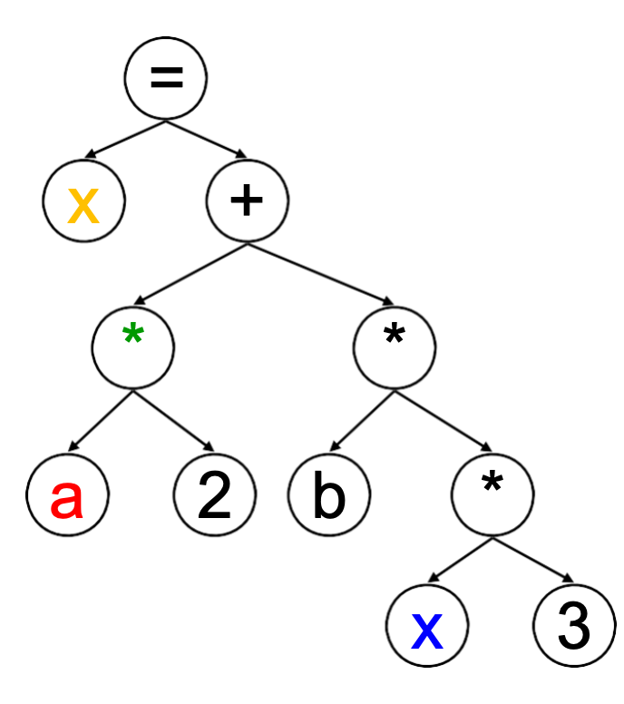

# Introduction

!!! note "What is a compiler"
    编译器是一种把一个语言转换为另一个语言的工具,不仅限于将人类可读的代码变成机器码

一个编译器的工作流通常可以表示为:

`源代码 -> 前端 -> 中端 -> 后端 -> 目标代码`

## 编译器工作流: 前端 / 中端 / 后端

### 前端 (Frontend)

!!! info "任务: 理解源程序"
    输入: 源代码  
    输出: 语法树 (AST) + 符号表 + 初步中间表示 (IR)

- **词法分析**: 把字符流切分为 Token

    - $x= a*2+b*(x*3)$

    - 可划分为:
      `id<x> assign id<a> times int<2> plus id<b> times lparen id<x> times int<3> rparen`


- **语法分析**: 按文法构建 AST

    <div style="text-align: center;">
    
    <br>
    <caption>AST</caption> </div>

- **语义分析**: 做类型检查、作用域检查、声明检查等,比如检查`x`是否可读写等

### 中端 (Middle-end)

!!! info "任务: 优化程序表示"
    输入: IR  
    输出: 优化后的 IR

- 进行与目标机器无关的优化

- 常见优化: 常量折叠、公共子表达式消除、死代码删除、循环优化

!!! example "三地址中间代码 (Three-Address Code)"
    对于表达式 `x = a*2 + b*(x*3)`，一种常见的三地址码表示为:

    ```text
    t1 = a * 2
    t2 = x * 3
    t3 = b * t2
    t4 = t1 + t3
    x  = t4
    ```

    三地址码的特点是: 每条指令最多只有三个地址(两个操作数 + 一个结果),便于后续优化与目标代码生成。

    对于这样的中间表示,我们可以进行优化:

    ```text
    t1 = a << 1
    t2 = x * 3
    t3 = b * t2
    x= t1 + t3
    ```

### 后端 (Backend)

!!! info "任务: 生成目标代码"
    输入: 优化后的 IR  
    输出: 汇编/机器码/目标文件

- 指令选择: 把 IR 映射为目标架构指令

- 寄存器分配: 减少内存访问,提高执行效率

- 指令调度与代码生成: 结合平台特性输出最终代码

!!! example "从中间代码到汇编 (示意)"
    以前面的优化结果为例:

    ```text
    t1 = a << 1
    t2 = x * 3
    t3 = b * t2
    x = t1 + t3
    ```

    可生成类似的汇编代码(以 RISC-V 风格为例):

    ```asm
    t1 = a << 1 -> slli a1,a1,1
    t2 = x * 3 -> muli a0,a0,3
    t3 = b * t2 -> mul a0,a0,a2
    x = t1 + t3 -> add a0,a0,a1
    ```
