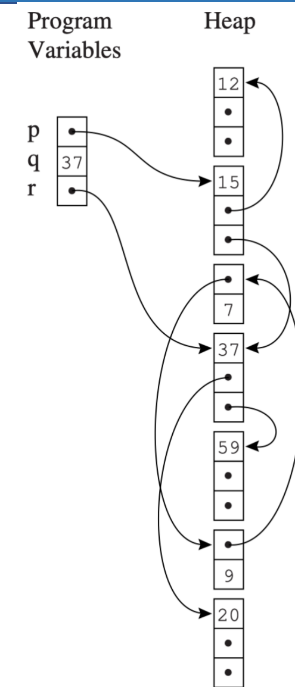
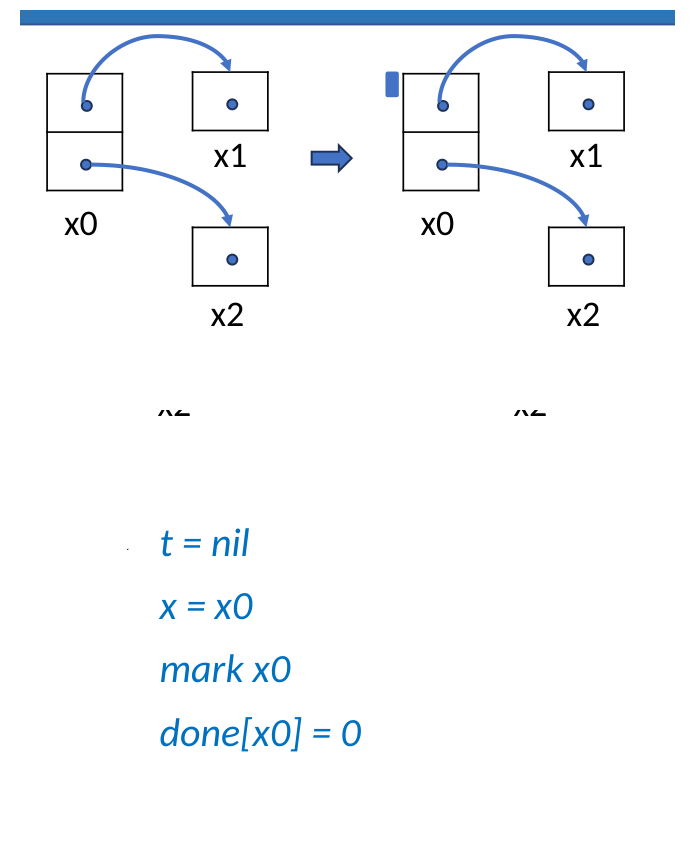
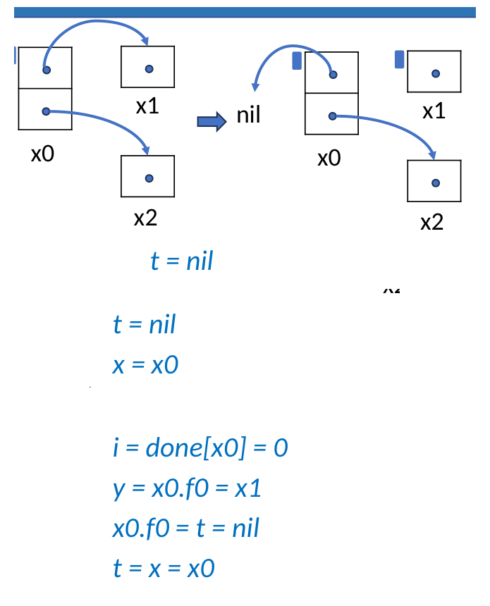
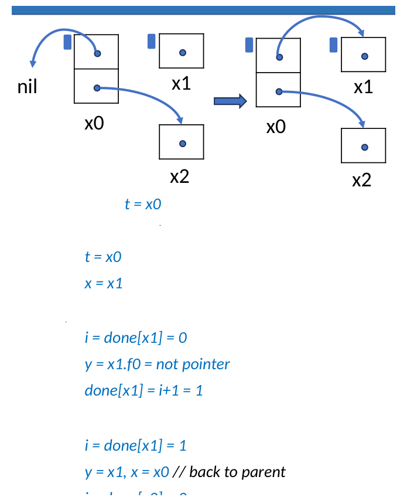
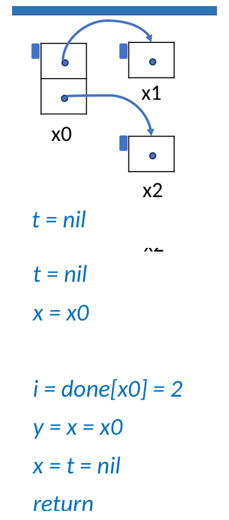
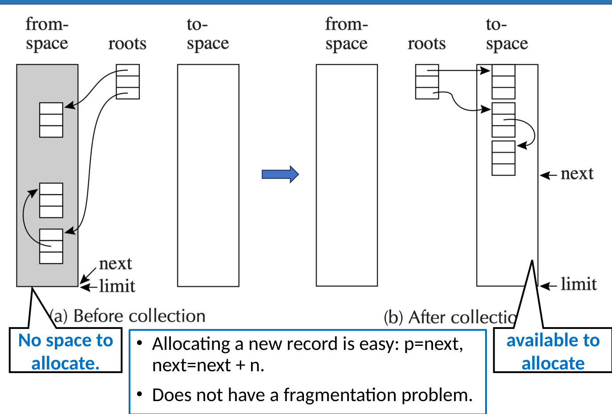
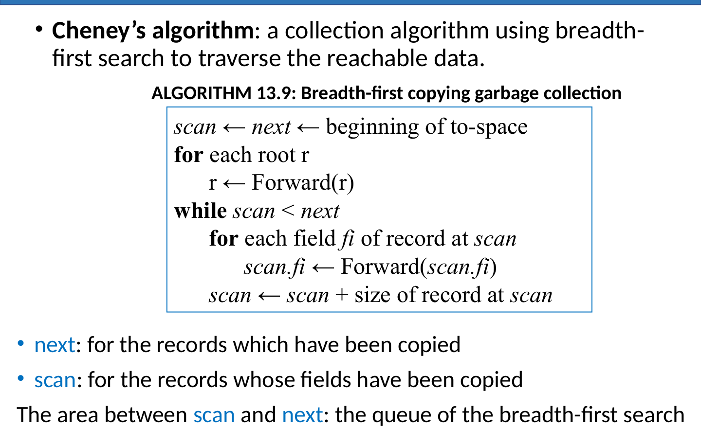
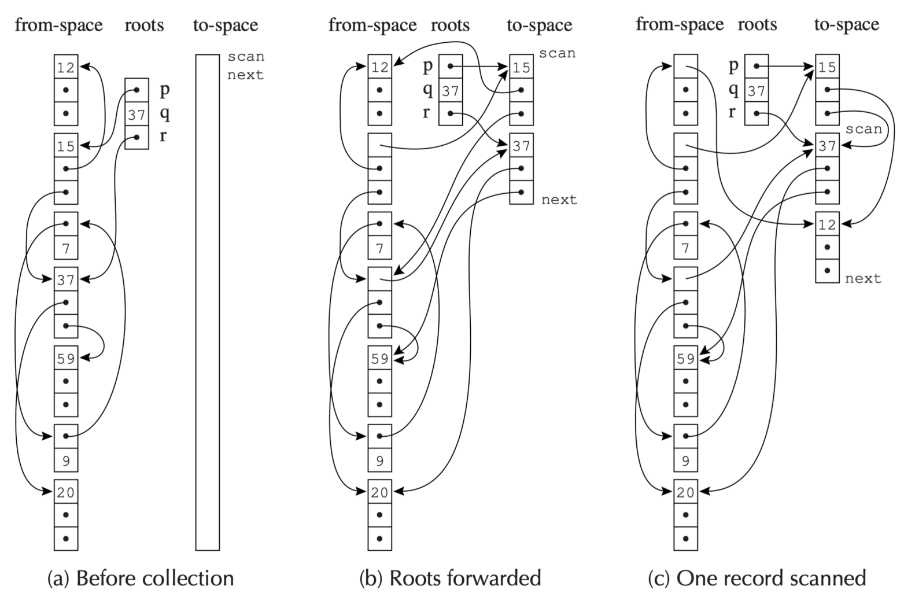

# 垃圾回收

在`c`和`cpp`中,我们使用`malloc`或者`new`来申请内存,但是我们需要自己来释放内存,如果忘记了释放内存,就会造成内存泄漏,如果释放了已经释放的内存,就会造成悬空指针,这些都是非常麻烦的事情.

为了解决这个问题,许多现代编程语言都引入了垃圾回收机制,垃圾回收机制会自动管理内存,当一个对象不再被使用时,垃圾回收器会自动释放它占用的内存.

!!! definition "Garbage"

    - **垃圾 (Garbage)**: 已分配但不再使用的存储空间

    - 理想状况下，任何非动态活跃 (即在未来的计算中不会被使用) 的记录都是垃圾。但判断一个对象是否为垃圾是**不可判定的** 。

    - 因此我们需要依赖**保守近似** ：堆中分配的记录如果不能通过任何程序变量的指针链到达，即为垃圾。
        - **不可达 $\rightarrow$ 垃圾**
        - **垃圾$\rightarrow$ 可能可达**

    - 一个对象 $x$ 是**可达的** 当且仅当：
        - 一个寄存器包含指向 $x$ 的指针，或者
        - 另一个可达对象 $y$ 包含指向 $x$ 的指针。

下面我们介绍几种垃圾回收的算法

---

## Mark-and-Sweep Collection
> Mark-and-Sweep Collection是一种基于DFS的算法

对于每个元素用list指向其他元素的结构,我们实际上可以将其视为一个有向图.

<center>
<div text-align="center">
    
</div>
</center>

而后,我们从`Progarm Variables`出发,对这个有向图进行DFS,将访问过的节点标记为`reachable`,最后将没有被标记为`reachable`的节点删除掉.

```c
function DFS(x)
if x is a pointer into the heap
   if record x is not marked 
      mark x 
      for each field fi of record x
             DFS(x.fi)
```

标记阶段结束后，任何**没有被标记**的节点都一定不可达，因此是垃圾，需要被回收。

回收通过 **sweep phase** 完成：垃圾回收器从堆的第一个地址扫描到最后一个地址，检查堆中的每一个节点：

- 如果节点没有被标记，说明它是垃圾，可以被回收。
- 这些被回收的垃圾节点可以重新链接成一个链表，即 **freelist**，供后续内存分配使用。
- 如果节点已经被标记，说明它仍然可达，不能回收；但 sweep 阶段需要清除它的标记位，为下一次垃圾回收做准备。

因此，Mark-and-Sweep 的整体过程可以概括为：

1. **Mark**：从根集合出发，标记所有可达节点。

2. **Sweep**：线性扫描整个堆，回收未标记节点，并取消已标记节点的标记。

---

### Pointer Reversal

我们都知道,传统的DFS需要用到递归或者栈,这会占据大量的额外空间,为此,我们有一个思路:

__如果我们通过`cur.fi`访问到了`child`,那么根据DFS的原则,这一条路径不可能再走第二遍,因此,我们可以把`cur.fi`的值临时重置为`cur`的父节点,这样,在DFS需要回溯的时候,就不需要用栈来保存访问的路径了.__

!!! note "核心思想"

    **Pointer Reversal** 的目标是在 Mark 阶段用 $O(1)$ 的额外空间完成 DFS。

    普通 DFS 需要一个显式栈或递归调用栈来保存“从哪里来、接下来访问哪个字段”。Pointer Reversal 直接借用对象内部的指针字段，把正在遍历的边临时反转，用堆对象自身记录回溯路径。回溯时再把被修改的指针恢复成原值。

=== "变量含义"

    - `cur`: 当前正在访问的节点，对应课件中的 `x`。
    - `child`: 从 `cur` 的第 `fieldIndex` 个字段读出的子节点，对应课件中向下访问时的 `y`。
    - `finishedChild`: 刚刚处理完成、需要恢复到父节点字段中的子节点，对应课件中回溯时的 `y`。
    - `parent`: 当前 DFS 路径上的父节点，也可以理解为模拟栈顶，对应课件中的 `t`。
    - `done[cur]`: 记录节点 `cur` 已经处理到第几个字段。
    - `cur.f[fieldIndex]`: 节点 `cur` 的第 `fieldIndex` 个字段。

    !!! info "为什么需要 `done[cur]`"

        一个对象可能有多个指针字段。回溯到 `cur` 后，算法必须知道哪些字段已经扫描过，下一次应该从哪个字段继续。因此需要为每个对象保存 `done[cur]`。

=== "算法"

    ```text
    function DFS(cur)
    if cur is a pointer and record cur is not marked
        parent <- nil
        mark cur; done[cur] <- 0
        while true
            fieldIndex <- done[cur]
            if fieldIndex < # of fields in record cur
                child <- cur.f[fieldIndex]
                if child is a pointer and record child is not marked
                    cur.f[fieldIndex] <- parent
                    parent <- cur
                    cur <- child
                    mark cur; done[cur] <- 0
                else
                    done[cur] <- fieldIndex + 1
            else
                finishedChild <- cur
                cur <- parent
                if cur = nil then return
                fieldIndex <- done[cur]
                parent <- cur.f[fieldIndex]
                cur.f[fieldIndex] <- finishedChild
                done[cur] <- fieldIndex + 1
    ```

    !!! warning "临时破坏堆结构"

        Pointer Reversal 在遍历过程中会临时改写对象字段，所以必须保证回溯时正确恢复。否则，标记阶段结束后堆中的对象关系会被破坏。

=== "执行过程"

    假设初始时从 `x0` 出发，`x0.f0 = x1`，`x0.f1 = x2`。

    !!! example "Step 1: 初始化 `x0`"

        ```text
        parent = nil
        cur = x0
        mark x0
        done[x0] = 0
        ```

        <center>
        
        </center>

    !!! example "Step 2: 沿 `x0.f0` 访问 `x1`"

        ```text
        child = x0.f0 = x1
        x0.f0 = parent = nil
        parent = x0
        cur = x1
        mark x1
        done[x1] = 0
        ```

        此时 `x0.f0` 不再指向 `x1`，而是保存原来的父路径 `nil`；`parent` 指向 `x0`，表示当前路径可以从 `x1` 回溯到 `x0`。

        <center>
        
        </center>

    !!! example "Step 3: 从 `x1` 回溯并恢复 `x0.f0`"

        ```text
        finishedChild = x1
        cur = parent = x0
        fieldIndex = done[x0] = 0
        parent = x0.f0 = nil
        x0.f0 = finishedChild = x1
        done[x0] = 1
        ```

        回溯后，`x0.f0` 被恢复为 `x1`，并且 `done[x0] = 1`，表示 `x0.f0` 已经处理完，下一步继续检查 `x0.f1`。

        <center>
        
        </center>

    !!! example "Step 4: 继续访问 `x2` 并结束"

        接下来算法用同样方式访问 `x0.f1 = x2`。当 `done[x0] = 2` 时，说明 `x0` 的所有字段都已经扫描完；此时 `cur = parent = nil`，DFS 返回。

        <center>
        
        </center>

=== "性质"

    - **空间复杂度**：额外空间为 $O(1)$，不需要递归栈或显式栈。
    - **时间复杂度**：仍然是线性扫描可达对象和字段，和普通 DFS 标记阶段同阶。
    - **代价**：算法实现更复杂，并且会在遍历过程中临时修改堆对象的指针字段。

    !!! summary "总结"

        Pointer Reversal 本质上是把 DFS 栈编码进堆中的指针字段里：向下走时反转指针，向上回溯时恢复指针，并用 `done[cur]` 记录每个节点的字段扫描进度。

---

## Reference Counts

我们希望记录每个对象被多少个指针指向,当一个对象的引用计数为0时,说明没有任何指针指向它了,因此它就是垃圾了,我们就可以回收它了.

实际上,对于 `x.fi <- p` 这样的操作, 执行了如下更新引用计数的逻辑：

$$
\begin{aligned}
& z \leftarrow x.f_i \\
& c \leftarrow z.\text{count} \\
& c \leftarrow c - 1 \\
& z.\text{count} \leftarrow c \\
& \textbf{if } c = 0 \hspace{0.5em} \textbf{call} \hspace{0.5em} \textit{putOnFreelist} \\
& x.f_i \leftarrow p \\
& c \leftarrow p.\text{count} \\
& c \leftarrow c + 1 \\
& p.\text{count} \leftarrow c
\end{aligned}
$$

!!! tip "延迟递归递减"

    当对象 `r` 的引用计数变为 0 并被放入 `freelist` 时，理论上需要继续递减 `r.fi` 指向的对象的引用计数；如果这些对象的计数也变为 0，又会继续递归回收。

    但更好的做法是：**不要在 `r` 被放入 `freelist` 时立刻递归递减 `r.fi` 的计数，而是在 `r` 从 `freelist` 中被取出、准备重新分配时再做这件事。**

    这样做有两个好处：

    - 可以把一次很长的 recursive decrementing 拆成多个较短的片段，使程序运行更平滑。对于交互式程序或实时程序，这一点尤其重要。
    - 递归递减只需要在 allocator 中集中处理，逻辑只出现在一个地方。

    例如存在引用链：

    ```text
    r.fi -> p
    p.fi -> q
    ```

    如果释放 `r` 时立刻递减 `p` 的引用计数，并且 `p.count` 也变为 0，就可能继续递减 `q` 的引用计数，形成一串递归回收。延迟到 allocator 取出 `r` 时再处理，可以把这段工作分摊到后续分配过程中。

!!! problem
    引用计数的方法看起来很美好,但是它有一个非常大的问题.如果两个unreachable的对象互相引用,它们的引用计数都不为0,因此它们就永远无法被回收了.

    另外,如果对象数量非常多,频繁地更新引用计数也会带来性能问题.

---

## Copying Collection

!!! note

    **Copying Collection** 的核心思想是：把堆内存分成两个区域，通过“复制可达对象”来完成垃圾回收。

    - **from-space**：当前正在使用的半区，对象原本存放在这里。
    - **to-space**：空闲的新半区，GC 时把所有可达对象复制到这里。

    GC 完成后，程序变量中的根指针会被改成指向 `to-space` 中的新副本。此时整个 `from-space` 都变成不可达区域，可以整体丢弃。

!!! info "可达堆对象的图模型"

    堆中可达部分可以看成一个有向图：

    - **nodes**：records，也就是堆中分配的对象。
    - **edges**：pointers，也就是对象字段中的指针。
    - **roots**：program variables，也就是寄存器、栈变量、全局变量等根集合。

    Copying GC 会遍历 `from-space` 中从 roots 可达的图，并在 `to-space` 中构造一个**同构副本**：对象之间的指针关系保持一致，但对象地址全部变成 `to-space` 中的新地址。

<center>

</center>

!!! example "复制前后"

    复制前：

    - 可达对象散布在 `from-space` 中。
    - `next` 已经接近 `limit`，可能没有足够连续空间继续分配。
    - 即使存在碎片，也不一定能满足一个较大的分配请求。

    复制后：

    - 所有可达对象被连续复制到 `to-space`。
    - roots 被更新为指向 `to-space` 中的新副本。
    - `from-space` 整体变成不可达，可以直接作为新的空闲区。
    - `to-space` 中的对象是 compact 的，即连续存放、没有外部碎片。

!!! success "优点"

    Copying Collection 的一个重要优点是分配非常快。因为 `to-space` 中的可用空间是连续的，只需要维护一个 `next` 指针：

    ```text
    p = next
    next = next + n
    ```

    其中 `n` 是新对象大小。只要 `next + n <= limit`，分配就能直接完成，不需要在 freelist 中查找合适大小的块。

    同时，由于活对象被压缩到连续区域中，Copying Collection 不会产生外部碎片问题。

---

### Forwarding Pointer

Copying Collection 的关键问题是：同一个 `from-space` 对象可能被多个指针引用，GC 遍历时不能把它复制多次。

因此，当对象第一次被复制到 `to-space` 后，GC 会在原对象中留下一个 **forwarding pointer**，记录这个对象的新地址。之后再遇到指向原对象的指针时，只需要返回 forwarding pointer 指向的新副本。

!!! note "Forward(p)"

    `Forward(p)` 的作用是：给定一个可能指向 `from-space` 的指针 `p`，返回它在 `to-space` 中的对应地址。

    ```c title="Forward"
    function Forward(p)
        if p points to from-space
            then if p. f1 points to to-space //如果p.f1已经指向to-space了,说明p已经被复制过了,此时p.f1存放的是p在to-space中的地址,因此直接返回p.f1就好了
                then return p. f1
            else for each field fi of p//不然,我们把p的每个字段都复制到to-space中,并且把p.f1指向p在to-space中的地址,这样下次再访问p的时候就知道p已经被复制过了,直接返回p.f1
                next. fi ← p. fi
                p. f1 ← next
                next ← next + size of record p
                return p. f1//此时p.f1存放的是p在to-space中的地址,因此返回p.f1
        else return p 
    ```

    这里借用 `p.f1` 存放 forwarding pointer：

    - 如果 `p.f1` 已经指向 `to-space`，说明 `p` 已经复制过，直接返回 `p.f1`。
    - 否则，把 `p` 的字段复制到 `next` 指向的位置，再令 `p.f1 <- next`，记录新副本地址。
    - 如果 `p` 不是指向 `from-space` 的指针，就原样返回。

!!! warning "为什么可以覆盖 `p.f1`"

    一旦对象 `p` 已经被复制到 `to-space`，之后程序会使用 `to-space` 中的新副本；`from-space` 中的旧对象只用于保存 forwarding pointer。GC 结束后，整个 `from-space` 会被丢弃。

### Cheney's Algorithm

Cheney's Algorithm 是 copying collection 的经典实现。它用 **BFS** 遍历可达对象，并且不需要额外队列：`to-space` 中位于 `scan` 和 `next` 之间的区域本身就是 BFS 队列。

<center>

</center>

!!! note "算法"

    ```text
    scan <- next <- beginning of to-space

    for each root r
        r <- Forward(r)

    while scan < next
        for each field fi of record at scan
            scan.fi <- Forward(scan.fi)
        scan <- scan + size of record at scan
    ```

!!! info "`scan` 与 `next`"

    - `next`：指向 `to-space` 中下一块可写位置；`Forward` 每复制一个新对象，`next` 就向后移动。
    - `scan`：指向下一个需要扫描字段的已复制对象。
    - `[scan, next)`：已经复制到 `to-space`、但字段还没有完全处理的对象区间，也就是 BFS 队列。

!!! example

    <center>
    
    </center>

    - **Root Forward**后,`p`,`q`,`r`以及它们的字段都被直接复制到了`to-space`中,并且`p.f1`,`q.f1`,`r.f1`都指向了它们在`to-space`中的地址.

    - 然后,`scan`开始处理`p.fi`.首先是把`12`这个记录移了过来,然后对于`p.f2`,由于它指向的是我们已经移动好的`37`,所以直接改就行

!!! warning "BFS Copying 的局部性问题"

    Cheney's Algorithm 使用 BFS 顺序复制对象，这会导致 pointer data structures 的 **locality of reference** 较差。

    如果地址 `a` 处的记录指向地址 `b` 处的记录，经过 BFS copying 后，`a` 和 `b` 很可能在 `to-space` 中相距很远。

    原因是 BFS 会按“层次”复制对象：先复制 roots 直接指向的对象，再复制这些对象的字段指向的对象。对于链式或树状结构中逻辑上相邻的父子对象，它们不一定会被连续复制。

!!! info "为什么 locality 很重要"

    在有虚拟内存或 CPU cache 的系统中，良好的 locality of reference 非常重要。

    当程序读取地址 `a` 时，内存系统通常会预期 `a` 附近的地址很快也会被访问，因此会把同一页或同一 cache line 附近的数据一起加载。

    如果对象 `a` 和它指向的对象 `b` 在内存中距离很远，那么程序沿指针访问 `b` 时更容易产生 cache miss 或 page fault。

!!! tip "Depth-first Copying"

    **Depth-first copying** 通常能得到更好的局部性：如果一个对象指向另一个对象，DFS 复制会倾向于马上复制它的子对象，因此父子对象更可能在 `to-space` 中相邻。

## Interface to the Compiler

对于支持垃圾回收的语言，编译器不能只生成普通机器码；它还必须向运行时的 garbage collector 提供足够的信息，使 GC 能正确找到 roots、理解堆对象布局，并在必要时维护增量回收的不变量。

!!! note "编译器与 GC 的接口"

    编译器和垃圾回收器主要通过以下几类信息交互：

    - 生成用于分配 records 的代码。
    - 为每一次 garbage-collection cycle 描述 roots 的位置。
    - 描述堆中 data records 的布局。
    - 对某些 incremental collection，生成 read barrier 或 write barrier 指令。

!!! info "生成分配代码"

    当源程序创建对象时，编译器需要生成调用 allocator 的代码，或者直接内联快速分配路径。

    对于 copying collection，分配空间是一个连续的 free region，其中：

    - `next` 指向下一块可分配位置。
    - `limit` 指向当前分配区间的末尾。

    因此快速路径可以写成：

    ```text
    if next + N < limit
        result = next
        next = next + N
    else
        call GC
    ```

    !!! tip "Fast Allocation 的优化"

        直接调用 `allocate` 函数会有额外开销，例如函数调用、返回、移动返回值、清零对象字段等。课件中的优化思路是：

        - 通过 inline expansion 消除 allocator 的函数调用和返回。
        - 把“返回分配结果”和后续有用的计算位置合并，减少一次 move。
        - 如果后面马上会给对象字段写入实际值，就可以不单独执行清零。
        - 在一个 basic block 中有多次分配时，可以合并 `next + N < limit` 的检查和 `next <- next + N` 的更新。
        - 把 `next` 和 `limit` 保存在寄存器中，使测试和更新只需要很少指令。

        这样，创建一个 record 并最终由 GC 回收的摊销成本可以降到很低。

!!! info "描述 roots 的位置"

    GC 必须从 roots 出发遍历对象图，因此编译器要告诉 GC：在某个安全点，哪些寄存器、栈槽或全局位置中保存的是指针。

    这些信息通常以 **stack map** 或 **root map** 的形式保存。GC 发生时，运行时根据当前程序位置查表，找到所有 roots。

    !!! note "Pointer Map"

        课件中把这类信息称为 **pointer map**。它需要描述：

        - 每个包含指针的 temporary。
        - 每个包含指针的 local variable。
        - 这些指针当前是在寄存器中，还是在 activation record 的某个栈槽中。

        理论上，live temporaries 的集合可能在每条指令后都变化，因此 pointer map 也可能在每个程序点都不同。实际实现中通常只在可能触发 GC 的点描述 pointer map。

    !!! info "哪些位置可能触发 GC"

        新的 garbage collection cycle 通常可能从这些位置开始：

        - 调用 `alloc` 函数时。
        - 任意 function call 处。

        原因是任意函数调用都可能进一步调用 `alloc`，从而触发 GC。

!!! info "描述堆对象布局"

    GC 扫描一个 heap record 时，需要知道哪些字段是指针，哪些字段只是整数、浮点数或其他非指针数据。

    因此编译器需要为每种对象布局生成描述信息，例如：

    - 对象大小。
    - 字段数量。
    - 哪些字段是 pointer fields。
    - 哪些字段不需要 GC 扫描。

    没有这些布局信息，GC 就无法安全地遍历堆对象。

    !!! note "Type/Class Descriptor"

        对于静态类型语言，例如 Tiger、Pascal，或者面向对象语言，例如 Java，常见做法是让每个对象的第一个 word 指向一个特殊的 **type descriptor** 或 **class descriptor**。

        descriptor 中记录：

        - 对象总大小。
        - 每个 pointer field 的位置。

        这些 descriptor 可以由编译器根据 semantic analysis 得到的静态类型信息生成。

    !!! info "Descriptor 的开销"

        - 对于普通静态类型语言，这通常意味着每个 record 有一个 word 的额外开销。
        - 对于面向对象语言，这通常不算 GC 的额外开销，因为对象本来就需要 class descriptor pointer 来支持 dynamic method lookup。


!!! warning "Derived Pointers"

    编译器优化还可能产生 **derived pointer**：它不是指向 heap record 开头，而是指向对象中间、对象之前或对象之后的位置。

    例如数组访问：

    ```text
    a[i - 2000]
    ```

    编译器可能把它内部表示为：

    ```text
    M[a - 2000 + i]
    ```

    如果这个表达式位于循环中，编译器可能为了避免每次迭代都重新计算 `a - 2000`，把它提升到循环外：

    ```text
    t1 <- a - 2000
    t2 <- t1 + i
    t3 <- M[t2]
    ```

    如果循环中还包含 `alloc`，并且 GC 发生时 `t1` 仍然 live，那么 `t1` 并不指向对象开头，甚至可能看起来像指向另一个无关对象。这会让 collector 无法正确识别 root。

    因此编译器要么避免让这种 derived pointer 跨越可能触发 GC 的点，要么在 pointer map 中额外描述它和原始 base pointer 的关系。

    当`a`被移动到`a^'`时,我们需要把`t1`更新为`t1+(a^'-a)`,这样`t1`就仍然指向对象的正确位置了.