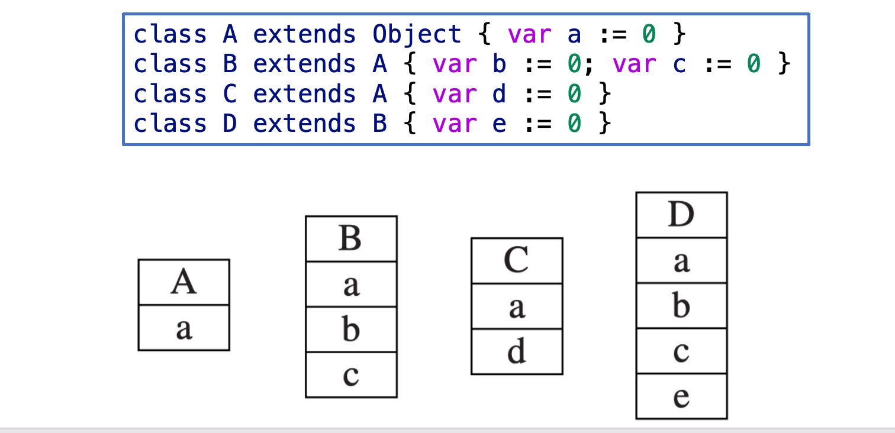
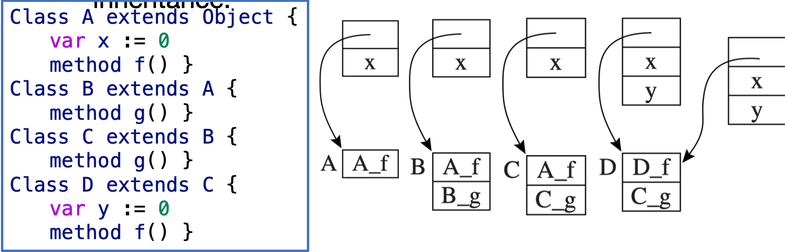
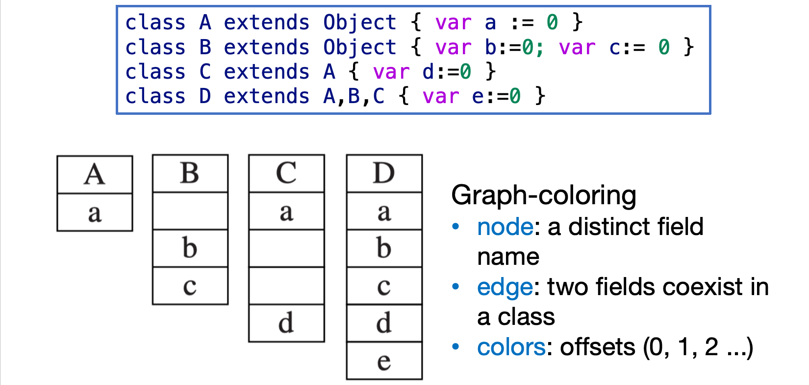
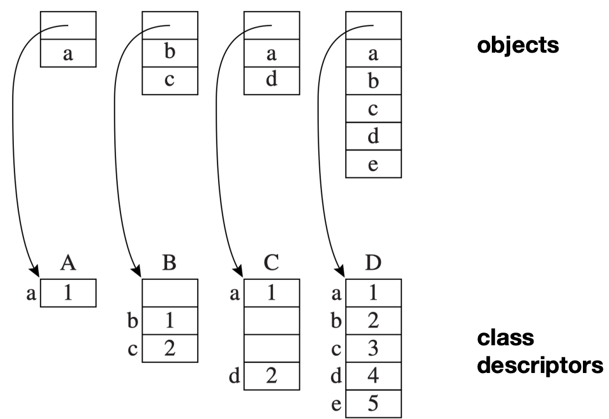

# 面向对象
> 这一章中,我们关注的是如果目标语言是面向对象的,我们应该如何设计编译器.

## 面向对象语言的一些特征

### Information Hiding / Encapsulation

**信息隐藏 (information hiding)** 或 **封装 (encapsulation)** 的意思是：一个模块可以对外提供某种类型的值，但这个类型的内部表示只由模块自己知道。

也就是说，客户端代码不应该直接依赖这个值在内存中怎么存、有哪些字段、字段顺序是什么，而只能通过模块提供的操作来使用它。

```text
values      -> objects
operations  -> methods
```

在面向对象语言里，模块提供的值通常就是 **对象 (objects)**，模块提供的操作则对应 **方法 (methods)**。

例如，一个集合对象可以提供 `insert`、`remove`、`contains` 这些方法，但客户端不需要知道它内部到底是数组、链表还是哈希表。只要方法接口不变，内部表示就可以被替换。

对编译器来说，这意味着它需要支持：

- 把对象的内部字段和外部可见接口区分开。
- 检查访问控制，例如 `private`、`protected`、`public`。
- 为方法调用生成隐含的对象参数，也就是通常说的 `this`。

### Extension / Inheritance

**扩展 (extension)** 或 **继承 (inheritance)** 允许一个对象在已有能力的基础上增加新的能力。

如果某个程序上下文需要一个支持 `m1`、`m2`、`m3` 的对象，那么一个同时支持 `m1`、`m2`、`m3`、`m4` 的对象也应该能被接受。

例如：

```java
int foo(A a1) {
    a1.m1();
    a1.m2();
    a1.m3();
}
```

只要传入的对象至少能响应 `m1`、`m2`、`m3`，`foo` 的函数体就可以正常执行。这个对象额外支持 `m4` 并不会破坏 `foo` 的需求。

换句话说,如果一个地方支持父类 `A` 的对象,那么它也应该支持子类 `B` 的对象,因为 `B` 至少保留了 `A` 所要求的方法集合.

对编译器来说，继承带来的问题主要是：

- 判断子类对象是否可以被当作父类对象使用。
- 确定继承后字段和方法在对象布局中的位置。
- 处理方法重写，以及运行时到底应该调用父类版本还是子类版本。
- 在多态调用中生成动态分派代码，例如通过 class descriptor 或 virtual method table 查找真正的方法入口。

## Class

为了支持类的定义,我们加入如下的语法规则

```
dec → classdec
classdec → class class-id extends class-id { {classfield} }
classfield → vardec
classfield → method
method → method id(tyfields) = exp
method → method id(tyfields) : type-id = exp
```

其中 `class B extends A { ... }` 声明一个新类 `B`，它继承自类 `A`：

- `B` 的声明必须出现在声明 `A` 的 let 表达式的**作用域内**。

- `A` 的所有**字段 (fields)** 和**方法 (methods)** 都**隐式地 (implicitly)** 归属于 `B`。

- `B` 可以**重写 (override)** `A` 的某些方法——即在 `B` 中给出新的方法体，但参数类型和返回类型必须与原方法**完全相同**。

- **字段不能被重写**。`B` 只能添加新字段，不能重新定义或隐藏从 `A` 继承来的字段。

此外，语言预定义了一个特殊的类标识符 `Object`，它没有任何字段或方法，是所有类的最终祖先。

在 `B` 的每个方法内部，都有一个隐式的形式参数 `self`，其类型为 `B`。`self` 是方法体内自动绑定的标识符，指向当前对象自身（类似 Python 的 `self`，在编译阶段由编译器自动插入）。

为支持对象的创建及方法的调用，表达式语法也需相应扩展：

```
exp → new class-id
    → lvalue . id()
    → lvalue . id(exp{, exp})
```

- `new B`：创建一个类型为 `B` 的新对象。
- `b.x`：访问对象 `b` 的字段 `x`。
- `b.f(x, y)`：调用对象 `b` 的方法 `f`，其中 `x` 和 `y` 是显式传入的实际参数，而 `b` 自身会作为隐式参数 `self` 的值传入。

!!! example "一个完整的例子"

    其中 `Vehicle` 定义了一个字段 `position` 和一个方法 `move`；`Truck` 和 `Car` 分别以不同方式重写了 `move`，`Car` 还额外定义了自己的字段 `passengers` 和方法 `await`：
    
    ```
    let start := 10
        class Vehicle extends Object {
            var position := start
            method move(int x) = (position := position + x)
        }
        class Truck extends Vehicle {
            method move(int x) =
                if x <= 55
                then position := position + x
        }
        class Car extends Vehicle {
            var passengers := 0
            method await(v: Vehicle) =
                if (v.position < position)
                then v.move(position - v.position)
                else self.move(10)
        }
        var t := new Truck
        var c := new Car
        var v : Vehicle := c
    in
        c.passengers := 2;
        c.move(60);
        v.move(70);
        c.await(t)
    end
    ```
    
    可以看到,在`c`的`await`中,我们会调用`t`的`move`方法,但是`t`实际上有两个版本的`move`方法,一个是从`Vehicle`继承来的,另一个是`Truck`自己重写的.我们都知道运行时确定的特点,因此实际上调用的是`t`的`Truck`版本的`move`方法.

---


考虑表达式 `v.position`。`v` 的声明类型是 `Vehicle`，编译器需要生成代码从 `v` 指向的对象（本质上是一个 record）中取出字段 `position`。

一个朴素的想法是：

1. 从变量 `v` 的环境信息中获取 `Vehicle` 的 class descriptor。
2. 从该 descriptor 中查出 `position` 的偏移量。
3. 按偏移量读取字段值。

但问题在于：**运行时 `v` 可能指向 `Car` 或 `Truck` 的实例**。这两个子类除了从 `Vehicle` 继承的字段之外，还有自己的额外字段（如 `Car.passengers`）。

`position` 在这些不同类的对象中，偏移量还一样吗？

!!! question "关键问题"
    
    如果子类对象的内存布局只是简单地在父类字段后面**追加**自己的字段，那么继承来的 `position` 字段就会在所有子类中都位于**相同的偏移量**——这正是编译器正确生成字段访问代码的关键前提。

## Single Inheritance of Data Fields
> 我们先考虑单继承的情况,即每个类只能有一个直接父类.

### Fields

单继承的情况非常简单,我们只需要规定子类的`field`在父类的`field`后面追加就行了,这样,我们就能以固定的偏移量访问继承来的字段了.

<center>

<div text-align="center">
    
</div>

</center>

### Methods

每个方法实例 (method instance) 的编译方式与普通函数类似——它会被翻译成一段机器码，并驻留在指令空间的某个地址上。例如，`Truck_move` 的入口点就对应机器码标签 `Truck_move`。

每个 class descriptor 中保存了指向父类的指针，以及一组方法实例的列表。

=== "静态方法 (static method)"

    某些面向对象语言允许将方法声明为 `static`。
    
    对于形如 `c.f()` 的方法调用，如果 `f` 是静态方法，编译器的查找过程如下：
    
    1. 确定 `c` 的类，假设为 `C`。
    2. 在 `C` 中搜索方法 `f`，若未找到，则沿着继承链向上搜索其父类 `B`，以此类推。
    3. 假设在某个祖先类 `A` 中找到了 `static method f`，则直接编译出一条对标签 `A_f` 的函数调用指令。
    
    ```
    class A extends Object {
        var x := 0
        static method f() { ... }
    }
    class B extends A {
        method g() { ... }
    }
    class C extends B {
        method g() { ... }   // 重写 B 的 g
    }
    ```

=== "动态方法 (dynamic method)"

    对于非 `static`（即可被重写）的方法，编译期无法确定实际调用的到底是哪个版本。我们需要在**运行时**根据对象的**实际类型**来决定调用哪一份方法实例——这就是**动态分派 (dynamic dispatch)**。
    
    为了实现动态分派，class descriptor 中必须包含一个**方法表 (method table)**，为每个非静态方法名存储对应的方法实例指针。
    
    当 `B` 继承自 `A` 时，方法表的布局与字段布局的思路完全一致：前半部分依次存放 `A` 已知的所有方法名对应的表项，后半部分则追加 `B` 新声明的方法——这样继承来的方法在表中始终位于**固定的偏移量**。
    
    对于动态方法调用 `c.f()`，编译后的代码按以下三步执行：
    
    1. 从对象 `c` 的偏移量 0 处取出 class descriptor 指针 `d`。
    2. 从 `d` 中偏移量为 `f`（编译期常量）的位置取出方法实例指针 `p`。
    3. 跳转到地址 `p`（即 `call p`），同时保存返回地址。

    <center>
    <div text-align="center">
        
    </div>
    </center>

    这里最重要的是,对于覆写的函数,会在固定偏移的地方覆盖父类的方法实例指针,因此无论运行时对象的实际类型是什么,我们都能通过同样的偏移量找到正确的方法实例指针.

## Multiple Inheritance

在单继承中，我们简单粗暴地把父类和子类的 `field` 和 `method` 在内存中**串行**地排列，但是多继承显然没有这么容易——当一个类继承自多个父类时，简单串行会导致不同继承路径上同名字段的偏移量不一致。

### Fields

我们介绍一些解决方法

!!! info
    === "图染色算法"

        在编译期**静态地分析全部类**，使用**图染色算法 (graph-coloring algorithm)** 为每个字段名计算出一个固定的偏移量，使得该偏移量在所有包含此字段的 record 中都可用。


        <center>
        <div text-align="center">
            
        </div>
        </center>


        这种方法的问题在于：对象内部可能留下**空洞 (empty slots)**——为了保证每个字段名在所有类中都位于同一偏移，编译器不得不在某些对象中预留空位。
        
        **改进方案**：放弃全局固定偏移的思路，改为**紧凑打包 (pack)** 每个对象的字段，让 class descriptor 来记录每个字段的实际偏移量。这样虽然避免了空洞，但字段访问需要先查 descriptor 才能获得偏移量，增加了一次间接访问的开销。

        <center>
        <div text-align="center">
            
        </div>  
        </center>

### Methods

在多继承中定位方法实例，同样可以使用图染色算法。只需将**方法名**与**字段名**混在一起，共同构成一张更大的干涉图 (interference graph) 的节点即可。

在 class descriptor 中：

- 字段的表项给出该字段在对象内部的**位置（偏移量）**。

- 方法的表项给出该方法实例的**机器码地址**。

## Testing Class Membership
> 我们想要知道,在运行时,一个对象是否属于某个类,或者说它的实际类型是什么.

如果先不考虑多继承,`instanceof`的实现可以概括如下:

```text
	  t1 ← x.descriptor
L1:	  if t1 = C goto true
	  t1 ←t1.super
	  if t1 = nil goto false
	  goto L1  
```

但是这个过程非常慢。我们选择用空间换时间。

!!! tip "用 display 加速 instanceof"

    在 class descriptor 中预留一个 display 块，记录从 `Object` 到当前类沿继承链的所有祖先。假设类的嵌套深度上限为某个常数（如 20），则在每个 class descriptor 中预留 20 个 slot。
    
    设类 `D` 的嵌套深度为 $j$（编译期可知），在 `D` 的 descriptor 中：
    
    - `display[j] = D`
    - `display[j-1] = D.super`
    - `display[j-2] = D.super.super`
    - ... 
    - `display[0] = Object`
    - `display[k] = nil`，其中 $k > j$
    
    现在，若 `x` 是 `D` 的实例（或 `D` 的任意子类的实例），则在 `x` 的 class descriptor 中，`display[j]` **一定等于** `D`；否则不等。
    
    因此 `x instanceof D` 只需三步：
    
    1. 从对象 `x` 的偏移量 0 处取出 class descriptor `d`。
    2. 从 `d` 中取出第 $j$ 个 class-pointer slot。
    3. 与 class descriptor `D` 做比较。

---

下面我们考虑类型转换的合法性。

给定一个类型为 `C` 的变量 `c`：

- **向上转型 (upcast)**：将 `c` 视为 `C` 的任意父类型，是**合法且安全**的。例如 `var b: B := c`，其中 `C extends B`——因为 `C` 的对象一定拥有 `B` 所要求的全部字段和方法，这不需要任何运行时检查。

- **向下转型 (downcast)**：反过来，将父类型变量赋值给子类型变量是**不安全**的。`b := c` 仅在运行时 `c` 确实是 `C` 的实例时才安全，而编译期无法保证这一点。

某些面向对象语言（如 Modula-3 和 Java）会对从父类到子类的转型**插入运行时类型检查**：如果运行时值不是目标子类的实例（即 `!(c instanceof C)`），则抛出异常。

```java
// 向上转型 — 总是安全
Vehicle v = new Car();

// 向下转型 — 需要运行时检查，可能抛出 ClassCastException
Car c = (Car) v;
```

## Private Fields and Methods

真正的面向对象语言可以保护对象的字段不被其他对象的方法直接操作。

- **private 字段**：不能在声明该对象的类之外的任何函数或方法中被读取或修改。

- **private 方法**：不能在声明该对象的类之外被调用。

这种访问控制由编译器的**类型检查阶段静态实施**——不需要任何运行时开销。具体做法是：在类的符号表中，每个字段偏移量和方法偏移量旁边都附带一个 **Boolean 标志**，标明该项是否为 `private`。类型检查时，编译器只需检查访问是否发生在该类的作用域内即可。

